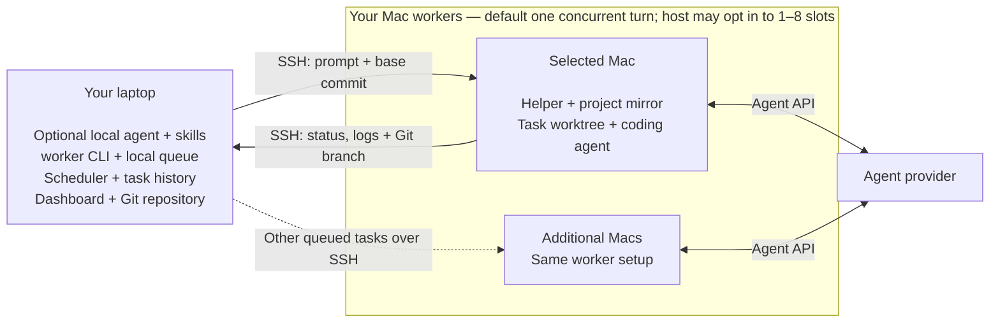

<p align="center">
  
</p>

# mac-worker

**Send a coding task to another Mac. Get a Git branch back.**

`mac-worker` runs coding agents on your spare Macs while you keep working on your laptop. Ask a local coding agent to prepare and dispatch the work, or submit a prompt yourself from a Git repository. A worker runs Codex, Cursor, OpenCode or Claude Code in a separate worktree and returns a branch you can review and merge. Start with one Mac and add more when you need them.

## Contents

- [What you need](#what-you-need)
- [Quick start](#quick-start)
- [How it works](#how-it-works)
- [Add another Mac](#add-another-mac)
- [Update or remove](#update-or-remove)
- [Build from source](#build-from-source)
- [More documentation](#more-documentation)
- [License](#license)

<p align="center">
  
</p>

## What you need

- **Your laptop:** an Apple Silicon Mac, Git and SSH. For the primary path, a local coding agent (Claude Code, Codex, Cursor, or OpenCode) that can run `worker` from the project. CLI-only use does not need one.
- **One worker:** another Apple Silicon Mac with Remote Login enabled and Git installed. It needs network access to the agent provider and must stay awake while working.
- **One coding agent on the worker**, signed in as the account you connect to. Codex is the default; the setup guide covers its installation and login.

You own SDKs, language tools, agent logins, and secrets on each Mac. mac-worker does not install toolchains or copy credential profiles. Optional `[setup]` in `.worker.toml` can warm a project workspace; it never infers packages.

The first supported installation path is Apple Silicon Mac → Apple Silicon Mac. Daily use has been validated on macOS 26. Intel Macs and Linux controllers are not supported by the first-run installer yet.

Only run trusted tasks on machines you control: a task worktree isolates repository changes, but jobs can access the worker account's files and credentials. Agent providers receive task content according to the selected agent's settings.

## Quick start

### 1. Install the CLI on your laptop

The release installer downloads a prebuilt binary and verifies its SHA-256 checksum. Rust and Node.js are not required; the dashboard is included.

**For a published release:** download `install.sh` from that release's source tag, then run it:

```bash
curl -fsSLo /tmp/mac-worker-install.sh \
  https://raw.githubusercontent.com/kirchik95/mac-worker/v0.1.0/install.sh
sh /tmp/mac-worker-install.sh --version v0.1.0
export PATH="$HOME/.local/bin:$PATH"
worker --version
```

Add `export PATH="$HOME/.local/bin:$PATH"` to `~/.zprofile` to make it available in new macOS terminal sessions. To choose a different location, pass `--bin-dir /your/bin` to the installer. The installer copies the `worker` binary only; laptop skills are a separate local install in [Get your first branch](#3-get-your-first-branch).

**Before the first release is published**, use [Build from source](#build-from-source) below. The repository includes release automation and a Homebrew formula generator; a public release and tap must be published before their download/install commands are available. Check [Releases](https://github.com/kirchik95/mac-worker/releases) for downloadable versions.

### 2. Connect one Mac

On the worker, enable **System Settings → General → Sharing → Remote Login** for your account. Then, on the laptop:

```bash
worker init yourname@mini.local
```

Use the worker's hostname or IP address; an existing SSH alias also works. If SSH keys are not set up, follow [SSH preparation](docs/setup-macos-worker.md#2-connect-over-ssh).

`init` checks the connection, architecture and Git; creates your worker configuration; installs the helper; and checks Codex's login over SSH. It gives instructions for missing steps. Complete the reported step and rerun the command — existing workers and configuration comments are preserved.

For another agent or a custom name:

```bash
worker init yourname@mini.local --name build-mini --agent opencode
```

No manual TOML or extra SSH alias is required. The [worker setup guide](docs/setup-macos-worker.md) covers agent installation, login and keeping the Mac awake. If a Cursor status check cannot fetch user details, `worker workers` reports `unknown (login unverified: user details unavailable)`; run `cursor-agent login` on the worker or use `CURSOR_API_KEY` in an env profile.

### 3. Get your first branch

Ask the coding agent on this MacBook to send work to the pool. Direct CLI remains available below.

#### Ask your laptop agent

The laptop agent prepares briefs and dispatches them; a configured agent on the worker executes. They need not be the same agent or provider. Keep tasks independent unless a later brief must start from an earlier accepted result (`depends_on` / `base = "from:<id>"`). Install the skills on the laptop, not on every worker. The local agent must be able to run `worker` from the project.

Use [pool-task-authoring](.claude/skills/pool-task-authoring/SKILL.md) to prepare briefs and [pool-dispatch](.claude/skills/pool-dispatch/SKILL.md) to submit, wait, follow up, and fetch the result. Copy them into the personal directory for the agent you use across projects on this MacBook. `worker skills get pool-dispatch` prints the version-matched guide plus the live CLI grammar from this binary.

| Local coding agent | Personal skills directory | Docs |
| --- | --- | --- |
| Claude Code | `~/.claude/skills` | [Skills](https://code.claude.com/docs/en/skills) |
| Codex | `~/.agents/skills` | [Build skills](https://learn.chatgpt.com/docs/build-skills) |
| Cursor | `~/.cursor/skills` | [Skills](https://cursor.com/docs/skills) |
| OpenCode | `~/.config/opencode/skills` | [Skills](https://opencode.ai/docs/skills) |

These are personal directories for local agent sessions, not web or cloud chats. Cursor's `agents` profile and deferred Claude worker routing in the templates should be adapted for your configured pool; model and effort defaults come from `worker skills get`, not from the copied files.

Ask your local agent to install the skills:

```text
Obtain .claude/skills/pool-task-authoring and .claude/skills/pool-dispatch
from https://github.com/kirchik95/mac-worker. Install those two skill
directories into the correct personal skills directory for this agent
across projects on this MacBook. Preserve existing customizations. Adapt
the template agent, model, and profile routing to my configured pool
without reading or copying credential profile contents. Then verify both
skills are available and that you can invoke the worker CLI before
submitting any work.
```

In a Git repository with at least one commit:

```text
Send this task to the pool: create SETUP_CHECK.md containing mac-worker works. Wait for the result and show me the branch.
```

Expect a task ID, the outcome and summary, `worker task diff` / the card’s file list, and a result ref from `worker task fetch` when a branch was published. Agent-reported checks in the result are what the worker agent claimed, not independent verification — review the diff and ref yourself before you merge. Your current working tree stays unchanged. You can ask the same agent to follow up if the task needs input (`worker task say`). Confirm both skills are loaded before you dispatch.

#### Manual CLI

In a Git repository with at least one commit, submit a small task:

```bash
worker task submit --agent codex --wait \
  --prompt "Create SETUP_CHECK.md containing: mac-worker works."
```

The command prints a task ID. Substitute it for `<task-id>` below:

```bash
worker task result <task-id>
worker task fetch <task-id>
```

`result` shows the outcome, summary, and any agent-reported checks. `worker task diff <task-id> --stat` lists the published change. `fetch` prints the remote-tracking ref (`refs/remotes/mac-worker/…/task/<id>`) to inspect with `git show` or `git diff` — that ref is the current-turn import proof on the laptop. Your current working tree stays unchanged; you choose whether to merge. Use the same `--agent` you checked with `init`.

Submit starts from HEAD by default. Pass `--base <ref>` to use another commit. Uncommitted edits stay on your laptop. To send tracked worktree changes as a temporary base:

```bash
worker task submit --agent codex --wip --wait \
  --prompt "Use the uncommitted edits and add a one-line note to SETUP_CHECK.md."
```

`--wip` is opt-in and needs a local source with fetch-only publication; origin source and push need a committed base. Name new files with `--include` or `snapshot.include_untracked`; unmatched non-ignored untracked files cause `UNTRACKED_INPUT`. `--include` can select ignored files, but sensitive paths still need an exact `snapshot.allow_sensitive` entry.

For real coding tasks, install your project's language tools and dependencies on the worker yourself. Optional `[setup]` in `.worker.toml` can run an operator-written recipe in the task workspace; `check` only proves **this** workspace. `worker task batch FILE --preview` validates a batch without opening client state or dispatching. Preview also supports a controller-only laptop configuration: it preserves worker pins for the controller to validate at submit time. Named `depends_on` / `base = "from:<id>"` edges execute when each parent is Closed and Done; batches without those fields stay independent. Start with this small file task to check the connection and agent before running a build.

### 4. Follow the work

```bash
worker dashboard
worker task list
worker workers --refresh
```

The dashboard opens locally in your browser (`http://127.0.0.1:<port>`, deep link `#/tasks/<id>`). It does not start or cancel tasks. From a task card you can reply or accept using the same `say` / `close` paths as the CLI; a stale card is rejected. `--no-facts-refresh` only skips stale agent-facts refresh; it does not disable replies. Details: [usage](docs/usage.md#dashboard).

To submit and return after admission, omit `--wait`. This still allows the task to wait for a free slot. `--no-wait` controls capacity instead: if eligible workers are at capacity, the submit fails with `CAPACITY_BUSY` and exit code **75**. In controller mode that rejection is final: the rejected task will not start when a slot becomes free. Submit a new request when you want to try again.

`worker task wait --task-id <task-id>` blocks until the task is quiescent and the previous runner has released ownership, so `worker task close`, `worker task say`, and `worker task fetch` can run immediately afterward. Capacity errors such as `CAPACITY_BUSY` and `CAPABILITY_MISSING` retain their public reason and exit code 75 through the controller. Then run `worker task result <task-id>` for the outcome (finished, needs input, or failed).

Default `--close-on done` closes the task after an agent `done` turn. That is not human acceptance. For a review loop, submit with `--close-on never`, inspect summary/diff/ref, then `worker task close <id>` to accept or `worker task say` to follow up. `close --discard` drops the session.

If a turn fails, run `worker task logs <task-id>` to see agent diagnostics and the recorded failure reason. Use `--turn N` to inspect an earlier turn, or `--raw` for the original log bytes.

`worker task logs <task-id> --follow` follows the selected turn until both native streams and result publication are complete. It exits even when the task remains Open or a later turn is active. Runners journal committed stdout/stderr offsets and resume interrupted drains without replaying their committed bytes; readers expose only committed log bytes. A new `say` returns `TASK_BUSY` until the previous runner’s remaining cleanup finishes.

Historical logs without a checkpoint remain readable without `--follow`. A nonempty legacy log cannot be resumed safely: writer recovery returns `LOG_CHECKPOINT_MISSING`, and follow without provable completion returns `LOG_COMPLETION_UNKNOWN`. Existing bytes are preserved; automatic replay or migration is not supported.

## How it works

By default your laptop coordinates the work (local queue, scheduler, dashboard). The selected Mac runs the agent and keeps its task workspace. This diagram shows that default flow, using a local repository as the source. Leave `[controller]` unset, or set `enabled = false`, for this mode. An always-on remote controller is opt-in and off until you enable it; see [Remote controller](docs/usage.md#remote-controller).



1. **Submit.** Ask your laptop agent or run the CLI. The CLI records your prompt and the repository's base commit in a local task queue. The scheduler selects an available Mac with a free execution slot, the required agent, and capabilities. Each worker defaults to **one** slot (`1..=8` on that Mac). Combined detached runner capacity is the **sum** of those per-worker ceilings. A batch `--max-parallel` is a requested run cap (any positive value; default is that sum) and is not rejected for exceeding host capacity — extra tasks wait. The same `task_id` stays serialized; distinct tasks from one checkout may overlap when a host has opted into more than one slot. A batch with `id` and `depends_on` (or `base = "from:<id>"`) holds later tasks until each parent is Closed and Done; `from:` binds that parent's current accepted imported OID on the laptop, not origin delivery. Independent batches (no those edges) still submit together.
2. **Run.** Over SSH, mac-worker transfers the base commit into the worker's project mirror, prepares a separate task worktree and launches the agent under a supervisor. The agent uses the worker's own login and project tools.
3. **Follow or reply.** The CLI and dashboard read task status and logs. If the agent needs input, `worker task say <id> --message "…"` (or a dashboard reply on that card’s current revision) starts another turn in the same task workspace and agent session.
4. **Review.** The worker publishes `task/<id>`, and the laptop fetches it as a remote-tracking ref. `worker task fetch <id>` prints the ref to inspect. Your current working tree stays unchanged; you decide what to merge. With `publish = push`, origin delivery is a durable per-turn outbox: the execution slot is released independently of a slow remote, and a `done` turn may still show origin `pending`.

`--wip` preparation now uses fewer Git operations and compares two fresh captures so concurrent edits can be detected. Dashboard detail and logs read one task directly; listing the collection still scans history.

The dashboard is embedded in the CLI and listens only on loopback. It does not start or cancel tasks; it can reply and accept through the same task APIs as the CLI. In the default mode the queue and task records live on the laptop; project mirrors, task worktrees and agent sessions live on the workers. When `[controller] enabled = true`, the same `worker dashboard` command is a managed SSH local-forward to the controller host and does not open laptop task state. Use `worker gc` to preview retained worker data that can be reclaimed.

Workers contact agent providers directly. No mac-worker cloud service or database server is required. If you prefer to get code from a Git remote or push result branches there, see the [origin and publication settings](docs/usage.md#task-lifecycle). Host slot layout: [multiple execution slots](docs/superpowers/specs/2026-09-10-slots-design.md).

## Add another Mac

```bash
worker init yourname@second-mini.local --name mini-2
```

The scheduler uses an available compatible worker. Each Mac defaults to **one** concurrent turn (`slots = 1` per worker); that host may opt in to `1..=8`. Combined capacity is the sum of per-worker ceilings. Laptop `slots` is a client ceiling, not host authority. Use `--worker <name>` on `task submit` only as a diagnostic pin.

## Update or remove

Before updating, let active tasks finish and keep a copy of the current binaries for rollback. If you use a remote controller, stop its `worker controller run` process for the update and keep the laptop CLI, controller CLI, and worker helpers on the same build.

Install a newer published CLI with `install.sh --version <release-tag>` on the laptop and, if used, the controller host. Then update the helpers and check their health using a configuration containing the worker inventory:

```bash
worker setup
worker workers --refresh
```

`worker setup` with no names updates every configured worker. It does not install or update the agents themselves. It warms each helper before verification and refreshes facts under a separate 120 s deadline. After successful verification, a warm-up failure is a `WARMUP_FAILED` warning and a slow facts refresh is a `FACTS_REFRESH_FAILED` warning; verification failure still rolls back the helper. See [installation recovery](docs/setup-recovery.md) if an older installation needs attention.

A controller-only laptop configuration has no local worker list; run these commands from the controller host or use an explicit inventory configuration. After updating, restart `worker controller run` on the controller host with its existing configuration.

**Restart any running dashboard after replacing the CLI.** Stop a foreground dashboard with Ctrl+C in its terminal, then start it again with the same configuration and port, for example:

```bash
worker dashboard --port 9173
```

Replacing the binary on disk or reloading the browser tab does not update an already-running dashboard process. An older process can show every worker as `OFFLINE / INVALID_RESPONSE` because it cannot decode a newer helper's response. After restarting, check that the dashboard shows current workers and that `worker workers` reports them ready. Configuration and task history are retained.

To remove the CLI installed by the script, delete `~/.local/bin/worker` (or the file in your chosen `--bin-dir`). This keeps configuration and task history. See [removal and stored data](docs/setup-macos-worker.md#removal-and-stored-data) before retiring a worker.

## Build from source

For development or before the first binary release, install a current stable Rust toolchain and Git on the laptop, then:

```bash
git clone https://github.com/kirchik95/mac-worker.git
cd mac-worker
cargo build --locked --release
mkdir -p "$HOME/.local/bin"
install -m 755 target/release/worker "$HOME/.local/bin/worker"
export PATH="$HOME/.local/bin:$PATH"
worker init yourname@mini.local
```

Node.js is needed only when changing the dashboard source in `ui/`; its built assets are checked in and included by Cargo. See [UI development](ui/README.md).

## More documentation

- [Prepare a Mac worker](docs/setup-macos-worker.md): SSH, agents, profiles, power settings and removal.
- [Usage reference](docs/usage.md): tasks, follow-ups, batches, defaults, dashboard, remote controller and remote commands.
- [Remote controller](docs/usage.md#remote-controller): opt-in always-on queue; default remains the laptop.
- [Batch DAG](docs/dag-design.md): named `depends_on` / `from:` lifecycle, Closed+Done parent gate, freeze, wait, and reconcile.
- [Multiple execution slots](docs/superpowers/specs/2026-09-10-slots-design.md): host `slot_count`, occupancy, migrate, and execution scope.
- [Durable origin outbox](docs/superpowers/specs/2026-09-10-origin-outbox.md): per-turn origin delivery, slot release, and host `--watch` / `--enable` / `--once`.
- [Installation recovery](docs/setup-recovery.md): retained installer state and older host layouts.
- [Build and publish a release](docs/releasing.md): archives, checksums and Homebrew distribution.
- [Acceptance runbook](docs/phase-five-acceptance-runbook.md) and [validation record](docs/phase-five-validation.md).
- [Herdr reporter validation](docs/herdr-reporter-validation.md): turns in the herdr sidebar, notifications, and the herdr facts, proven on the pool.
- [Snapshot batching](docs/2026-09-09-snapshot-batch-performance.md): bounded Git work for `--wip` capture.
- [Snapshot and dashboard lookup](docs/2026-09-09-performance-improvements.md): faster snapshot prep and per-task detail/log reads.
- [Pool reliability roadmap](docs/superpowers/plans/2026-09-08-pool-reliability-roadmap.md): completed and upcoming reliability and performance work.
- [Design notes](docs/superpowers/specs/) and [implementation plans](docs/superpowers/plans/).

## License

[MIT](LICENSE)
