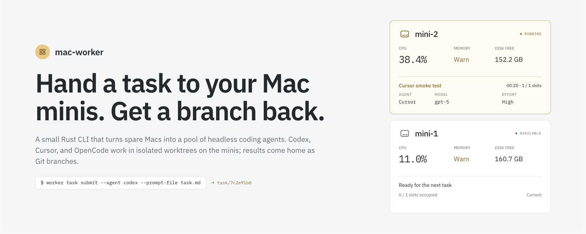
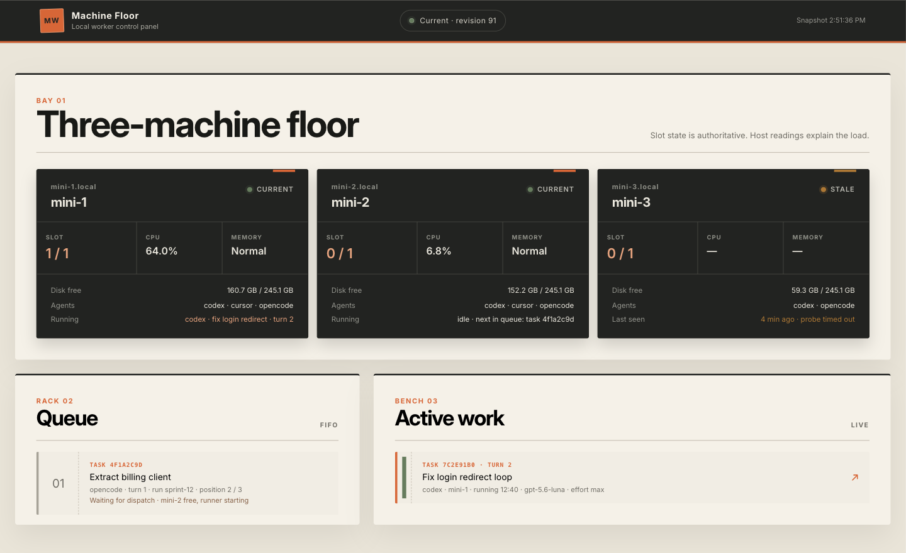
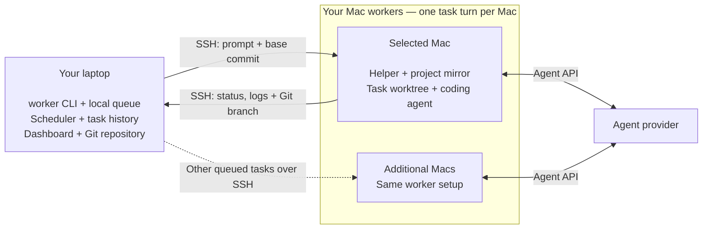

<p align="center">
  
</p>

# mac-worker

**Send a coding task to another Mac. Get a Git branch back.**

`mac-worker` runs coding agents on your spare Macs while you keep working on your laptop. Submit a prompt from a Git repository; a worker runs Codex, Cursor, OpenCode or Claude Code in a separate worktree and returns a branch you can review and merge. Start with one Mac and add more when you need them.

## Contents

- [What you need](#what-you-need)
- [Quick start](#quick-start)
- [How it works](#how-it-works)
- [Add another Mac](#add-another-mac)
- [Update or remove](#update-or-remove)
- [Build from source](#build-from-source)
- [More documentation](#more-documentation)
- [License](#license)

<p align="center">
  
</p>

## What you need

- **Your laptop:** an Apple Silicon Mac, Git and SSH.
- **One worker:** another Apple Silicon Mac with Remote Login enabled and Git installed. It needs network access to the agent provider and must stay awake while working.
- **One coding agent on the worker**, signed in as the account you connect to. Codex is the default; the setup guide covers its installation and login.

The first supported installation path is Apple Silicon Mac → Apple Silicon Mac. Daily use has been validated on macOS 26. Intel Macs and Linux controllers are not supported by the first-run installer yet.

Only run trusted tasks on machines you control: a task worktree isolates repository changes, but jobs can access the worker account's files and credentials. Agent providers receive task content according to the selected agent's settings.

## Quick start

### 1. Install the CLI on your laptop

The release installer downloads a prebuilt binary and verifies its SHA-256 checksum. Rust and Node.js are not required; the dashboard is included.

**For a published release:** download `install.sh` from that release's source tag, then run it:

```bash
curl -fsSLo /tmp/mac-worker-install.sh \
  https://raw.githubusercontent.com/kirchik95/mac-worker/v0.1.0/install.sh
sh /tmp/mac-worker-install.sh --version v0.1.0
export PATH="$HOME/.local/bin:$PATH"
worker --version
```

Add `export PATH="$HOME/.local/bin:$PATH"` to `~/.zprofile` to make it available in new macOS terminal sessions. To choose a different location, pass `--bin-dir /your/bin` to the installer.

**Before the first release is published**, use [Build from source](#build-from-source) below. The repository includes release automation and a Homebrew formula generator; a public release and tap must be published before their download/install commands are available. Check [Releases](https://github.com/kirchik95/mac-worker/releases) for downloadable versions.

### 2. Connect one Mac

On the worker, enable **System Settings → General → Sharing → Remote Login** for your account. Then, on the laptop:

```bash
worker init yourname@mini.local
```

Use the worker's hostname or IP address; an existing SSH alias also works. If SSH keys are not set up, follow [SSH preparation](docs/setup-macos-worker.md#2-connect-over-ssh).

`init` checks the connection, architecture and Git; creates your worker configuration; installs the helper; and checks Codex's login over SSH. It gives instructions for missing steps. Complete the reported step and rerun the command — existing workers and configuration comments are preserved.

For another agent or a custom name:

```bash
worker init yourname@mini.local --name build-mini --agent opencode
```

No manual TOML or extra SSH alias is required. The [worker setup guide](docs/setup-macos-worker.md) covers agent installation, login and keeping the Mac awake.

### 3. Get your first branch

In a Git repository with at least one commit, submit a small task:

```bash
worker task submit --agent codex --wait \
  --prompt "Create SETUP_CHECK.md containing: mac-worker works."
```

The command prints a task ID. Substitute it for `<task-id>` below:

```bash
worker task result <task-id>
worker task fetch <task-id>
```

`result` shows the outcome and summary. `fetch` prints the remote-tracking ref to inspect with `git show` or `git diff`. Your current working tree stays unchanged; you choose whether to merge. Use the same `--agent` you checked with `init`.

Submit starts from HEAD by default. Pass `--base <ref>` to use another commit. Uncommitted edits stay on your laptop. To send tracked worktree changes as a temporary base:

```bash
worker task submit --agent codex --wip --wait \
  --prompt "Use the uncommitted edits and add a one-line note to SETUP_CHECK.md."
```

`--wip` is opt-in and needs a local source with fetch-only publication; origin source and push need a committed base. Name new files with `--include` or `snapshot.include_untracked`; unmatched non-ignored untracked files cause `UNTRACKED_INPUT`. `--include` can select ignored files, but sensitive paths still need an exact `snapshot.allow_sensitive` entry.

For real coding tasks, install your project's language tools and dependencies on the worker too. Start with this small file task to check the connection and agent before running a build.

### 4. Follow the work

```bash
worker dashboard
worker task list
worker workers --refresh
```

The dashboard opens locally in your browser. To submit and return immediately, omit `--wait`.

`worker task wait --task-id <task-id>` blocks until the task has settled and the previous runner has released ownership. Then run `worker task result <task-id>` for the outcome (finished, needs input, or failed).

If a turn fails, run `worker task logs <task-id>` to see agent diagnostics and the recorded failure reason. Use `--turn N` to inspect an earlier turn, or `--raw` for the original log bytes.

`worker task logs <task-id> --follow` follows the selected turn until both native streams and result publication are complete. It exits even when the task remains Open or a later turn is active. Runners journal committed stdout/stderr offsets and resume interrupted drains without replaying their committed bytes; readers expose only committed log bytes. A new `say` returns `TASK_BUSY` until the previous runner’s remaining cleanup finishes.

Historical logs without a checkpoint remain readable without `--follow`. A nonempty legacy log cannot be resumed safely: writer recovery returns `LOG_CHECKPOINT_MISSING`, and follow without provable completion returns `LOG_COMPLETION_UNKNOWN`. Existing bytes are preserved; automatic replay or migration is not supported.

## How it works

Your laptop coordinates the work. The selected Mac runs the agent and keeps its task workspace. This diagram shows the default flow, using a local repository as the source:



1. **Submit.** The CLI records your prompt and the repository's base commit in a local task queue. The scheduler selects an available Mac with the required agent and capabilities.
2. **Run.** Over SSH, mac-worker transfers the base commit into the worker's project mirror, prepares a separate task worktree and launches the agent under a supervisor. The agent uses the worker's own login and project tools.
3. **Follow or reply.** The CLI and dashboard read task status and logs. If the agent needs input, `worker task say <id> --message "…"` starts another turn in the same task workspace and agent session.
4. **Review.** The worker publishes `task/<id>`, and the laptop fetches it as a remote-tracking ref. `worker task fetch <id>` can fetch it again and prints the ref to inspect. Your current working tree stays unchanged; you decide what to merge.

`--wip` preparation now uses fewer Git operations and compares two fresh captures so concurrent edits can be detected. Dashboard detail and logs read one task directly; listing the collection still scans history.

The dashboard is embedded in the CLI, listens only on loopback and does not start or cancel tasks. The queue and task records live on the laptop; project mirrors, task worktrees and agent sessions live on the workers. Use `worker gc` to preview retained worker data that can be reclaimed.

Workers contact agent providers directly. No mac-worker cloud service or database server is required. If you prefer to get code from a Git remote or push result branches there, see the [origin and publication settings](docs/usage.md#task-lifecycle).

## Add another Mac

```bash
worker init yourname@second-mini.local --name mini-2
```

The scheduler uses an available compatible worker. Each Mac runs one task turn at a time. Use `--worker <name>` on `task submit` to choose a machine.

## Update or remove

Install a newer published CLI with `install.sh --version <release-tag>`, then update the helpers:

```bash
worker setup
worker workers --refresh
```

`worker setup` with no names updates every configured worker. It does not install or update the agents themselves. See [installation recovery](docs/setup-recovery.md) if an older installation needs attention.

To remove the CLI installed by the script, delete `~/.local/bin/worker` (or the file in your chosen `--bin-dir`). This keeps configuration and task history. See [removal and stored data](docs/setup-macos-worker.md#removal-and-stored-data) before retiring a worker.

## Build from source

For development or before the first binary release, install a current stable Rust toolchain and Git on the laptop, then:

```bash
git clone https://github.com/kirchik95/mac-worker.git
cd mac-worker
cargo build --locked --release
mkdir -p "$HOME/.local/bin"
install -m 755 target/release/worker "$HOME/.local/bin/worker"
export PATH="$HOME/.local/bin:$PATH"
worker init yourname@mini.local
```

Node.js is needed only when changing the dashboard source in `ui/`; its built assets are checked in and included by Cargo. See [UI development](ui/README.md).

## More documentation

- [Prepare a Mac worker](docs/setup-macos-worker.md): SSH, agents, profiles, power settings and removal.
- [Usage reference](docs/usage.md): tasks, follow-ups, batches, defaults, dashboard and remote commands.
- [Installation recovery](docs/setup-recovery.md): retained installer state and older host layouts.
- [Build and publish a release](docs/releasing.md): archives, checksums and Homebrew distribution.
- [Acceptance runbook](docs/phase-five-acceptance-runbook.md) and [validation record](docs/phase-five-validation.md).
- [Herdr reporter validation](docs/herdr-reporter-validation.md): turns in the herdr sidebar, notifications, and the herdr facts, proven on the pool.
- [Snapshot batching](docs/2026-09-09-snapshot-batch-performance.md): bounded Git work for `--wip` capture.
- [Snapshot and dashboard lookup](docs/2026-09-09-performance-improvements.md): faster snapshot prep and per-task detail/log reads.
- [Pool reliability roadmap](docs/superpowers/plans/2026-09-08-pool-reliability-roadmap.md): completed and upcoming reliability and performance work.
- [Design notes](docs/superpowers/specs/) and [implementation plans](docs/superpowers/plans/).

## License

[MIT](LICENSE)
