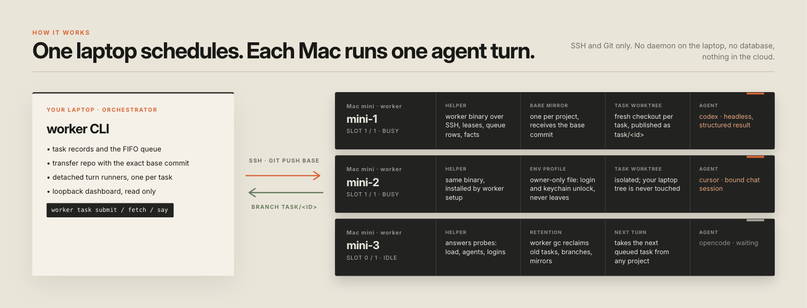

<p align="center">
  
</p>

# mac-worker

**Hand a coding task to a pool of Mac minis. Get a Git branch back.**

`mac-worker` is a small Rust CLI that turns a few spare Macs into a pool of headless coding agents. From your laptop you submit a prompt; the pool picks an idle worker, runs a coding agent (Codex, Cursor, or OpenCode) inside an isolated copy of your repository, and publishes the result as a branch you can fetch, review, and merge. A read-only dashboard shows what every machine is doing.

It is a personal tool, built for one person with a MacBook and three Mac minis on the same network. It is deliberately boring: SSH, Git, plain files, no daemon on the laptop, no database, no cloud.

- **One command per task.** `worker task submit --agent codex --prompt-file task.md`
- **Results are branches.** Nothing touches your working tree; you `fetch` and decide.
- **Agents are interchangeable.** Codex, Cursor, and OpenCode run through the same task lifecycle.
- **Nothing sensitive leaves the worker.** Logins live on the minis; the CLI never copies or prints them.
- **Everything is observable.** `worker task list`, `worker workers`, and a loopback dashboard.

## How it works

<p align="center">
  
</p>

1. **You submit a task** from a Git worktree on your laptop. The CLI records the task locally, snapshots the exact base commit into a small transfer repository, and puts one *turn* on the FIFO queue.
2. **The scheduler picks a worker.** Each configured Mac mini has one slot. A local detached *turn runner* takes the queue row and talks to the worker's helper over SSH; the remote lease is authoritative, so two runners can never share a slot.
3. **The worker runs the agent.** The helper materialises the base commit into a per-task worktree (backed by a bare mirror per project), unlocks what the agent needs, and launches it headless with a composed prompt: your text plus the task context and a required structured result.
4. **The result is published.** When the agent finishes, the helper commits whatever the agent left in the worktree, publishes it as `task/<id>`, and records the structured outcome: `done`, `needs_input`, or `blocked`, with a summary, questions, and changed files.
5. **You fetch and decide.** `worker task fetch` brings the branch into your repository as a remote-tracking ref. Ask a follow-up with `worker task say`, or close the task.

The laptop is the orchestrator and the only place with a copy of your intent. Workers hold mirrors, worktrees, and agent sessions, all of which `worker gc` can reclaim.

## Quick start

### Requirements

- **Laptop (orchestrator):** macOS or Linux, Rust 1.85 or newer (the crate uses the 2024 edition), Git, and SSH aliases for every worker.
- **Workers:** Macs on the same network with Remote Login enabled, Git, and the agent CLIs you want to use: [Codex](https://github.com/openai/codex) (`codex`), [Cursor](https://cursor.com) (`cursor-agent`), or [OpenCode](https://opencode.ai) (`opencode`). Each agent is logged in on the worker itself, once.

The [macOS worker setup guide](docs/setup-macos-worker.md) walks through the account, SSH, agent installation, and login on each worker.

### 1. Build and install the CLI

```bash
git clone https://github.com/kirchik95/mac-worker.git
cd mac-worker
cargo build --release
install -m 755 target/release/worker ~/.local/bin/worker
```

### 2. Describe your workers

```bash
mkdir -p ~/.config/mac-worker
cp config.example.toml ~/.config/mac-worker/config.toml
```

```toml
version = 1

[[workers]]
name = "mini-1"
ssh = "mac1"                       # an alias from ~/.ssh/config
slots = 1
capabilities = ["darwin-arm64"]
```

`ssh` is an alias that already works non-interactively (`ssh mac1 true`). Add one `[[workers]]` block per machine.

### 3. Install the helper and check the pool

```bash
worker setup mini-1 mini-2 mini-3   # copies the helper binary to each worker
worker workers --refresh            # probes hosts, agents, and logins
```

`worker workers` shows each machine's slot, load, and which agents are installed and authenticated. Rerun `worker setup` after upgrading the CLI; the protocol version is checked on every call.

### 4. Run your first task

From any Git repository on your laptop:

```bash
worker task submit --agent codex --wait \
  --prompt "Add a failing test for the empty-cart checkout bug, then fix it. Run cargo test."

worker task result <task-id>    # summary, questions, changed files
worker task fetch  <task-id>    # the branch task/<task-id> lands in this repository
git log --oneline mac-worker/mini-1/task/<task-id>
```

Drop `--wait` to return immediately and follow with `worker task list`, `worker task wait`, or the dashboard.

## Agents

| Agent | Flag | Login lives | Notes |
|---|---|---|---|
| Codex | `--agent codex` | file-based login on the worker | `--model gpt-5.6-luna --effort max` are passed through; runs in the Codex workspace sandbox |
| OpenCode | `--agent opencode` | OpenCode auth store on the worker | uses the worker's default model; pick another with `--model opencode-go/<model>` |
| Cursor | `--agent cursor --env-profile agents` | Cursor login on the worker + an env profile | needs the profile described below because Cursor keeps its login in the macOS keychain |
| Claude Code | `--agent claude` | env profile | adapter exists; disabled on the workers until you opt in |

Every agent gets the same contract: work only in the task worktree, do not switch branches or push, and end with a JSON result. Agents that cannot ask questions interactively return `needs_input` with the exact question; you answer with `worker task say <id> --message "…" --wait`, which starts the next turn in the same agent session.

### Env profiles

Some agents need environment variables or a keychain unlock on the worker. Put them in an owner-only file on each worker, never in the repository:

```sh
umask 077
mkdir -p ~/.config/mac-worker/env && chmod 700 ~/.config/mac-worker/env
$EDITOR ~/.config/mac-worker/env/agents.env      # KEY=value per line
chmod 600 ~/.config/mac-worker/env/agents.env
```

Recognised keys include `CURSOR_API_KEY`, and the host-only `MAC_WORKER_KEYCHAIN_PASSWORD` (plus optional `MAC_WORKER_KEYCHAIN_PATH`), which mac-worker feeds to `security unlock-keychain` on stdin right before an agent that needs the login keychain runs. The two keychain values are consumed by the helper and never exported to the agent, logged, or shown anywhere. A profile that is group- or world-readable is refused.

## Task lifecycle

<p align="center">
  
</p>

```text
worker task submit   --agent <a> (--prompt TEXT | --prompt-file PATH) [--wait] [--model M] [--effort E]
worker task batch    tasks.toml [--max-parallel N] [--wait]      # several tasks as one named run
worker task list     [--run ID] [--state open] [--outcome needs-input]
worker task status   <id>          worker task logs <id> [-f]     worker task diff <id> --stat
worker task wait     --task-id <id> | --run <run-id> [--timeout 30m]
worker task say      <id> --message "…" [--wait]                  # answer or steer, next turn
worker task result   <id>          worker task fetch <id>
worker task cancel   <id>          worker task close <id> [--discard]
worker task reconcile              # re-own dead runners, re-queue orphaned turns; submits nothing
worker gc [--apply]                # preview, then reclaim old tasks, branches, mirrors on the workers
```

Outcomes are recorded on the task, independent of the process exit code:

- `done`: the agent finished and the branch is published. Tasks close themselves by default (`--close-on done`).
- `needs_input`: the agent has a bounded question; `say` answers it.
- `blocked`: the agent could not finish. Read `result` and `logs`, then `say` guidance or `close --discard`.
- `unknown`: the agent did not return a structured result; the branch is still published.

A batch file groups independent tasks into a run with shared defaults:

```toml
version = 1
agent = "codex"
model = "gpt-5.6-luna"
timeout = "45m"

[[tasks]]
title = "Flaky login spec"
prompt_file = "tasks/fix-flaky-login.md"

[[tasks]]
title = "Extract billing client"
prompt = "Move the billing HTTP client into packages/billing-client …"
agent = "opencode"
```

Project-wide defaults live in `.worker.toml` next to your code:

```toml
[task]
default_agent = "codex"
model = "gpt-5.6-luna"
effort = "max"
env_profile = "agents"
source = "local"            # or "origin": start from the exact commit on your Git remote
publish = ["fetch"]         # add "push" to also push task/<id> to origin
timeout = "45m"
max_followups = 10
```

Writing good briefs is its own skill. Two Claude Code skills ship with the repository and work from any project: [`pool-task-authoring`](.claude/skills/pool-task-authoring/SKILL.md) turns an objective into one-turn, headless-safe tasks, and [`pool-dispatch`](.claude/skills/pool-dispatch/SKILL.md) is the mechanical submit / wait / answer / fetch loop. Say "send it to the pool" and Claude Code uses them.

## Dashboard

<p align="center">
  
</p>

```bash
worker dashboard                 # opens http://127.0.0.1:<port>
worker dashboard --port 8765 --no-open
```

The dashboard is a loopback-only observer: workers with slot state and host load, the FIFO queue with blocking reasons, active turns with live logs, the task ledger with filters, per-task detail with the outcome, changed files, and the exact `worker task fetch` command, and a run history. It polls, keeps no database, never starts or cancels anything, and never shows prompts, credentials, or profile values. Its Settings view can save native model and effort defaults for future launches; that is its only write. The JSON it renders is available at `GET /api/v1/snapshot`, `GET /api/v1/tasks/<id>`, and `GET /api/v1/tasks/<id>/turns/<turn>/logs`.

The interface is a React application in `ui/`, built with Tailwind and shadcn/ui and embedded into the binary at build time, so `cargo build` needs no JavaScript toolchain.

## What the pool will and will not do

- A task worktree is isolation for your repository, not a security boundary: agent turns run with the worker account's full access. Only dispatch prompts you trust, on machines you own.
- Your working tree is never modified. Results arrive as remote-tracking refs; merging is your decision.
- Workers hold a bare mirror per project, a worktree per task, agent sessions, and bounded logs. `worker gc` previews and reclaims them: idle open tasks after 7 days, result branches after 30 days or on `close --discard`.
- The CLI adds no secrets to its own diagnostics, redacts worker paths from agent summaries, and refuses insecure profiles. Application logs can still contain whatever the agent printed.
- Every command is idempotent or explicitly recoverable: `worker task reconcile` repairs after a laptop reboot, and `worker setup` migrates workers after an upgrade.

## Plain remote commands

The task system is built on a simpler layer that is still available: run any trusted, non-interactive command on a worker from a snapshot of the current worktree.

```bash
worker run -- cargo test --locked           # scheduler picks a worker
worker run --worker mini-2 -- npm test      # pin one
worker status                               # recent jobs
worker logs -f <job-id>
worker cancel <job-id>
worker doctor --project .                   # validate a project before its first job
```

## Repository layout

```text
src/            the CLI, scheduler, transfer and publication, host helper, agent adapters, dashboard server
src/agent/      one adapter per agent: codex.rs, cursor.rs, opencode.rs, claude.rs
ui/             dashboard front end (React + Tailwind), built into src/dashboard/static/app
tests/          integration suites with recorded agent transcripts under tests/fixtures
docs/           worker setup guide, acceptance runbook, sanitised validation records
docs/superpowers/   design specs, implementation plans, and review notes
.claude/skills/ the two pool skills for Claude Code
```

## Documentation

- [Set up a macOS worker](docs/setup-macos-worker.md): account, SSH, agents, profiles, sleep settings.
- [Phase 5 acceptance runbook](docs/phase-five-acceptance-runbook.md) and its [validation record](docs/phase-five-validation.md): how the pool was proven end to end on three machines.
- [Dashboard validation](docs/dashboard-validation.md).
- [Design specs](docs/superpowers/specs/) and [plans](docs/superpowers/plans/): why things are shaped the way they are.

## Status

Tested daily on one MacBook and three Apple-silicon Mac minis running macOS 26 with Codex, Cursor, and OpenCode. Expect the protocol to change between releases; the CLI refuses to talk to a worker with a different protocol version until you rerun `worker setup`.

## License

[MIT](LICENSE)
