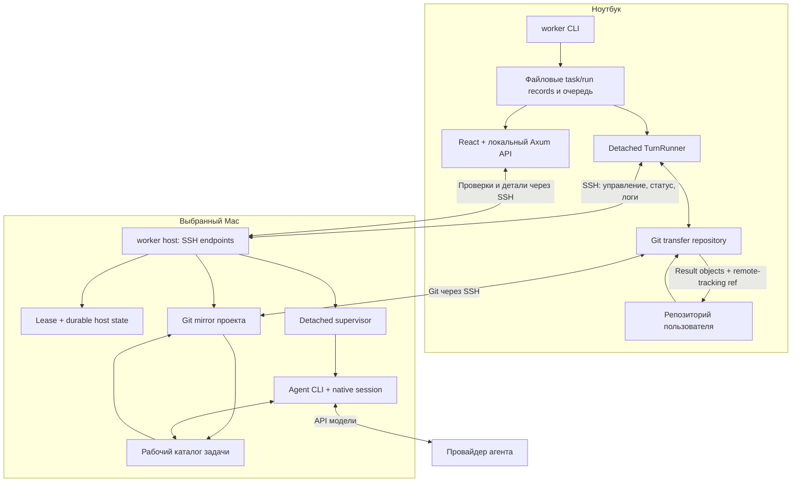

# mac-worker: архитектура, производительность и рабочий сценарий

Разбор текущего checkout на 8 сентября 2026 года, HEAD `57f9276`. Изучены CLI, очередь, runner, SSH/Git transport, worker storage, supervisor, адаптеры агентов, dashboard, onboarding, тесты и проектные документы. Исходники приложения не изменялись. Настроенные Mac и реальные агенты не запускались. Старые acceptance-записи использованы как исторические свидетельства, а не как подтверждение состояния сегодняшней установки.

Это исходный срез до реализации исправлений. Transfer lock, admission isolation и передача ожидающего runner уже исправлены и включены в main; актуальный статус и результаты проверок находятся в [плане работ](superpowers/plans/2026-09-08-pool-reliability-roadmap.md).

**Главный вывод:** приложение уже содержит полноценный механизм выполнения и восстановления удалённых задач. Наибольший ближайший выигрыш даст устранение случайной сериализации задач одного репозитория и ошибок распределения по доступным Mac. После этого — уменьшение повторных запросов и сокращение времени между вопросом агента и ответом пользователя. Для этих шагов пригодна существующая архитектура одного Rust-бинарника.

## Что делает приложение

`worker` позволяет отправить coding task с ноутбука на один из собственных Mac, выполнить её установленным там агентом и получить Git-ветку для проверки. Поддерживаются Codex, Claude Code, Cursor и OpenCode. Ноутбук владеет очередью и историей; выбранный Mac — рабочим каталогом, процессом агента и его native session. Провайдер модели получает запросы от агента на Mac.

Есть два сценария: `worker run` исполняет обычную команду на файловом snapshot; `worker task` исполняет многоходовую агентную задачу на Git-базе. Они используют общие механизмы lease, supervision, состояния и транспортных операций, но имеют разные способы подготовки входов и получения результата.

Пользовательский цикл: `init` → `task submit` / `task batch` → наблюдение → при необходимости `task say` → результат и fetch → локальный review/merge → retention/GC. Dashboard сейчас в основном наблюдатель; его единственная предусмотренная запись — настройки агентов. Ответы, fetch и diff предлагаются как команды для терминала.

**Task** — долговечная задача; **Turn** — один запуск/продолжение агента; **Job** — инфраструктурная единица запуска, аренды и supervision. `done`, `needs_input`, `blocked` описывают результат агента, поэтому exit code процесса сам по себе не доказывает выполнение задания. Следующий turn использует прежний workspace и session на том же Mac.

## Как устроена архитектура

| Слой | Реализация и ответственность |
|---|---|
| Входные команды | `src/cli.rs`, `src/lib.rs`: разбор аргументов, команды CLI, hidden runner/host endpoints |
| Задачи и orchestration | `src/task_client.rs`, `src/turn_runner.rs`: submit, follow-up, восстановление runner, dispatch, follow, fetch |
| Scheduler | `src/scheduler.rs`, `src/scheduler_adapter.rs`, `src/client_state.rs`: совместимость, FIFO для подходящих задач, affinity, резервирование назначения, ограничения run |
| SSH и процессы | `src/transport.rs`, `src/transfer.rs`, `src/process.rs`: фиксированные host-команды, JSON-протокол, deadlines, ограниченные ответы |
| Входы и Git | `src/snapshot.rs`, `src/transfer_repo.rs`, `src/git_transport.rs`: snapshot обычных jobs, committed/WIP base для задач, передача и получение Git-объектов |
| Worker runtime | `src/host_store.rs`, `src/lease.rs`, `src/job_service.rs`, `src/supervisor.rs`: durable acceptance, отдельная process group, таймауты, отмена, восстановление |
| Агент и результат | `src/agent/*.rs`, `src/task_store.rs`, `src/turn.rs`: launch/resume, session binding, structured result, commit/publication |
| Хранение | `src/rooted_fs.rs`, `src/client_state.rs`, `src/host_store.rs`: JSON/files, locks, atomic replacement, fsync, проверка идентичности объектов |
| Наблюдение | `src/dashboard/*`, `ui/src/*`: локальный HTTP API, проекции состояния, кэш наблюдений, React views |

При submit фиксируется точный base commit; `--wip` позволяет создать базу с незакоммиченными изменениями через отдельный transfer repository. Runner выбирает Mac, получает lease и запускает удалённую подготовку. Рабочий каталог задачи технически создаётся через **`git clone --shared --no-checkout`**, а затем checkout ветки задачи: это отдельный clone с общими объектами, хотя в пользовательской документации он называется worktree. Это существенно для понимания lock/GC и не означает полный повторный clone истории для каждой задачи. [Создание workspace](/Users/kirchik/Documents/project/mac-worker/src/task_store.rs:1517).

Supervisor на Mac продолжает выполнять уже принятый turn независимо от окна терминала ноутбука. Однако очередь, следующие dispatch и получение результатов остаются обязанностью ноутбука: завершение удалённой работы и автономное продвижение всей очереди — разные гарантии. Reconciliation уже предусмотрен. [Detached runner](/Users/kirchik/Documents/project/mac-worker/src/turn_runner.rs:90), [reconciliation](/Users/kirchik/Documents/project/mac-worker/src/task_client.rs:1072).

## Что уже есть и что следует переиспользовать

| Existing mechanism | Где находится | Следствие для улучшений |
|---|---|---|
| Общие Git-объекты и зеркало проекта | `src/transfer_repo.rs:362`, `src/task_store.rs:1471` | Оптимизировать границы блокировки и подготовку зависимостей; базовая дедупликация Git уже существует |
| Affinity и ранжирование совместимых Mac | `src/scheduler.rs:233` | Добавлять стоимость прогрева/ресурсные ограничения в существующую политику |
| Admission cache с TTL 2 секунды и координацией refresh | `src/client_state.rs:1269` | Использовать до SSH, а не заводить второй кэш |
| Параллельные probes с общим бюджетом | `src/transport.rs:113` | Подключить к task admission; не писать новый fan-out |
| Byte cursor и terminal log drain | `src/job.rs:4046`, `src/job.rs:4139` | Переиспользовать семантику EOF для task runner и UI |
| Атомарные records, fencing и recovery | `src/client_state.rs`, `src/host_store.rs`, `src/rooted_fs.rs` | Сокращать лишние операции с сохранением гарантий восстановления |
| Model/effort defaults и env profiles | `src/agent_settings.rs`, `src/project_config.rs` | Исправить UI-контракт; не вводить параллельную систему настроек |
| Project doctor и повторяемый init | `src/doctor.rs:37`, `src/onboarding.rs` | Расширять проверкой реальной готовности проекта |
| Подготовка briefs и dispatch через skills | `.claude/skills/pool-task-authoring/SKILL.md`, `.claude/skills/pool-dispatch/SKILL.md` | Стандартизировать ежедневный flow поверх имеющихся команд |
| Herdr reporter в проекте документации | `docs/superpowers/specs/2026-09-08-herdr-reporter-design.md` | Это уже предложенное направление notifications/observability, пока не реализованная возможность исходников |

## Приоритетные проблемы

Приоритеты ниже отражают влияние на основной сценарий личного пула. «Подтверждено по коду» означает прослеженную цепочку вызовов; это не измерение реального fleet. Изолированные воспроизведения отмечены отдельно.

### 1. Блокировка transfer repository удерживается весь turn

**Приоритет: первый. Подтверждено по коду и отдельным воспроизведением поведения lock.**

`TransferRepo::open_or_create` получает blocking `flock(LOCK_EX)`. Guard живёт в `Arc<File>` до освобождения `TransferRepo`. Runner открывает его перед запуском агента, затем держит во время всего `follow_remote` и передаёт в завершающую публикацию. [Lock](/Users/kirchik/Documents/project/mac-worker/src/transfer_repo.rs:326), [получение](/Users/kirchik/Documents/project/mac-worker/src/turn_runner.rs:437), [удержание через follow](/Users/kirchik/Documents/project/mac-worker/src/turn_runner.rs:743).

Следствие: при одном cache root и общем canonical Git common directory задачи разных Mac сериализуются. Новый submit или fetch этого репозитория также может ждать окончания чужого turn. Отдельные clones с разными common directory не затронуты этой конкретной блокировкой.

Изолированный executable, связанный с текущей библиотекой, подтвердил: второе открытие в другом процессе оставалось заблокированным, пока первый handle удерживался 350 мс, и завершилось через 6 мс после его освобождения. Это проверка механизма lock; два полноценных удалённых turn не запускались.

**Изменение:** отделить дескриптор transfer repository от короткой эксклюзивной транзакции. Освобождать guard после подготовки/передачи базы и повторно получать для изменения refs/import. Сохранить durable base pin и защиту от GC на время удалённого выполнения. В submit уже есть пример явного `drop(transfer)` перед handoff. [Пример](/Users/kirchik/Documents/project/mac-worker/src/task_client.rs:819).

**Проверка:** два runner одного репозитория на разных fake workers должны оба дойти до remote submit, пока первый turn удерживается активным. Параллельно проверить новый submit, fetch, GC и восстановление после остановки runner.

### 2. Неисправный Mac прерывает выбор исправных

**Приоритет: первый. Высокая уверенность по коду.**

В `TurnRunner::observe_admission` отсутствие `health.probe` считается устаревшими facts. Затем `refresh_facts(worker)?` поднимает ошибку всего прохода, а `collect<Result<Vec<_>, _>>` отбрасывает уже собранные исправные кандидаты. Это возможно при automatic selection даже при наличии доступного Mac. [Цепочка](/Users/kirchik/Documents/project/mac-worker/src/turn_runner.rs:1149).

**Изменение:** failures отдельного воркера преобразовывать в unavailable observation и продолжать выбор. Ошибки локального хранилища/конфигурации оставить ошибками операции. Использовать bounded parallel probe и общий deadline из уже существующего `WorkersService`.

**Проверка:** healthy + offline в обоих порядках конфигурации; pinned offline должен объяснять недоступность выбранного Mac; automatic должен запускать healthy.

### 3. Ожидающие runner занимают лимит всего пула

**Приоритет: первый для batches и pinned-задач. Высокая уверенность по коду.**

Число живых локальных runner ограничено числом Mac; при этом учитываются и runner, ожидающие capacity. Остальные задачи переводятся в Parked. [Решение о запуске](/Users/kirchik/Documents/project/mac-worker/src/task_client.rs:786), [подсчёт](/Users/kirchik/Documents/project/mac-worker/src/task_client.rs:2178).

Пример без влияния lock из пункта 1: три Mac, задачи из разных репозиториев, первые три pinned на mini-1. Один turn работает, два runner ждут mini-1. Четвёртая detached-задача для свободного mini-2 паркуется, потому что все три локальных runner уже живы. Ожидающие runner могут claim только свою строку очереди; свободный mini-2 сам по себе не продвигает parked-задачу. [Claim по owner](/Users/kirchik/Documents/project/mac-worker/src/client_state.rs:747).

**Изменение:** ограничивать активные назначения на Mac, отдельно контролируя число ожидающих процессов. Планировщик должен будить совместимую задачу при освобождении capacity. Возможен небольшой общий dispatcher; это отдельное решение относительно принятого режима без daemon. Одно увеличение числа runner устраняет ограничение лишь временно.

**Проверка:** описанный сценарий должен запускать задачу mini-2 до завершения mini-1; сохраняются FIFO совместимых задач, run caps и корректная отмена. При пробуждении учитывать также текущий backoff до 30 секунд. [Backoff](/Users/kirchik/Documents/project/mac-worker/src/turn_runner.rs:401).

### 4. Settings не может сохранить изменения из текущего React-клиента

**Приоритет: первый; небольшая правка. Подтверждён конфликт контракта.**

Frontend передаёт только `Content-Type`, backend дополнительно требует `X-Mac-Worker-Settings: 1`. Встроенный JS bundle имеет ту же ошибку. Запрос UI отвергается с `400 SETTINGS_REQUEST_INVALID` до вызова сохранения. [Frontend](/Users/kirchik/Documents/project/mac-worker/ui/src/lib/api.ts:202), [backend](/Users/kirchik/Documents/project/mac-worker/src/dashboard/web.rs:379).

**Изменение:** согласовать клиент с существующим API, сохранив проверку origin и optimistic revision. **Проверка:** реальный HTTP-контракт frontend → loopback backend с fake settings source. Rust-тесты уже проверяют отсутствие/наличие заголовка; UI-тесты подменяют fetch и этого не проверяют. [Тест backend](/Users/kirchik/Documents/project/mac-worker/tests/dashboard_settings.rs:227).

### 5. Логи теряют окончание, а recovery может добавлять дубликаты

**Приоритет: первый для наблюдаемости и диагностики.**

UI завершённого turn читает только один блок 64 KiB. При переходе `live=true → false` effect сбрасывает уже прочитанные текст и offset, после чего снова получает только первый блок. Воспроизведение на настоящем transpiled hook: лог 65 540 байт отображает 65 536; после завершения длина падает с 65 540 до 65 536 и строка `TAIL` исчезает. [Hook](/Users/kirchik/Documents/project/mac-worker/ui/src/hooks/useTurnLog.ts:29).

На стороне runner есть независимая проблема: status Open/terminal останавливает цикл перед дочитыванием окончательных bytes. При рестарте оба offset снова равны нулю, хотя локальный файл открыт append-only. Следствия по коду: неполный хвост или повторно добавленный префикс локального лога. [Runner](/Users/kirchik/Documents/project/mac-worker/src/turn_runner.rs:977).

**Изменение:** сохранять cursor при смене lifecycle, дочитывать финальные потоки до подтверждённого EOF/длины, восстанавливать checkpoints по потокам. Использовать существующую семантику `TerminalLogDrain`, сохранив корректную обработку UTF-8 и ограничение отображаемой истории.

**Проверка:** multi-chunk completion, финальные bytes между log/status запросами, позднее открытие завершённого turn, restart после части лога, split UTF-8. Утверждение об отсутствии дубликатов требует согласования записи bytes и checkpoint при аварии.

## Следующие ускорения и исправления

| Изменение | Текущая причина и эффект | Что переиспользовать / как проверить |
|---|---|---|
| Кэш admission до сети | Runner делает SSH probe **до** `admission_observation`, поэтому свежий кэш не экономит этот запрос; workers обходятся последовательно. `src/turn_runner.rs:1149`, `:1179` | Существующий refresh cache и budgeted `WorkersService`; считать запросы при cache hit, cold start и offline worker |
| Один follow-запрос вместо трёх | Каждая итерация последовательно читает stdout, stderr, ждёт 100 мс, читает status. `src/turn_runner.rs:997` | Combined status/chunks либо адаптивный poll; backlog дочитывать без лишнего sleep. Измерять RPC/turn и задержку последнего события |
| Повторное использование SSH | Приложение само не настраивает ControlMaster/ControlPersist. `src/transport.rs:653` | Проверить фактическую SSH-конфигурацию установки, затем при необходимости добавить управляемый multiplexing. Он может уже быть включён пользователем; новый SSH-процесс не обязательно означает новый полный handshake |
| Убрать no-op записи состояния | Каждый status poll вызывает durable replacement, directory scan и общий state lock даже при идентичном record. `src/turn_runner.rs:1025`, `src/client_state.rs:1858` | Equality/revision check с сохранением защиты от конкурентного изменения; проверить fsync counters и crash tests |
| Прямой поиск task по ID | Каждый detail/log request вызывает `list_tasks()` и парсит всю историю под lock. `src/dashboard/task.rs:58` | Уже есть `load_task(task_id)` в `src/client_state.rs:1832`; нагрузочные fixtures 100/1 000/10 000 records |
| Устранить наложение detail polls | UI стартует запрос каждые 2 с, backend может ждать SSH 30 с. За это время вкладка инициирует около 15 fetch; фактическую параллельность HTTP/SSH ограничивает также браузер. Snapshot single-flight не защищает detail. `ui/src/views/TaskDetail.tsx:126`, `src/dashboard/task.rs:98` | Completion-based polling, дедупликация, shared detail cache; fake worker с задержкой должен давать максимум один выполняющийся запрос на ключ |
| Собирать observation независимо от HTTP-запроса | Snapshot single-flight объединяет только перекрывающиеся refresh. Детали Active/Open tasks опрашиваются последовательно, медленный Mac расходует общий бюджет. `src/dashboard/service.rs:241`, `src/dashboard/task.rs:166` | Background collection внутри уже работающего dashboard, быстрый ответ последним snapshot с freshness; bounded fan-out по workers. SSE рассматривать после этого |
| Разделить source=local и source=origin | Первый turn всегда вызывает `push_base`, затем origin-source ещё делает `fetch_origin`. Две сетевые Git-операции подтверждены; повторная передача всех объектов не утверждается. `src/turn_runner.rs:607`, `src/task_store.rs:672` | Для origin создать durable base ref на стороне worker после fetch; сохранить GC pin и проверки OID при исключении лишнего push |
| Ленивый разбор результата | Publisher читает до 256 MiB stdout до использования final message; Codex также eagerly строит кандидатов из stream. `src/turn.rs:773`, `src/agent/codex.rs:112` | Сначала bounded final message; fallback — потоковый NDJSON разбор. Сравнить RSS/время на 1/64/256 MiB и совпадение результатов всех адаптеров |
| Ограничить stderr | stdout проходит capped pump, stderr напрямую направлен в append-файл и не имеет аналогичного byte cap. `src/supervisor.rs:1875`, `:1946`, `:1965` | Расширить существующий capped output pump; сохранить tail и непрерывное дренирование pipe после cap |
| Отделить origin delivery от занятого execution slot | `publish=push` выполняется до освобождения lease; Git deadline — до 15 минут. Медленный origin удерживает законченный turn. `src/turn.rs:816`, `src/supervisor.rs:2455`, `src/git_transport.rs:27` | Durable delivery record с конкретным immutable OID и retries. Не отпускать fencing раньше без такого протокола; тестировать push одновременно с новым turn |
| Восстановление UI после краткого сбоя | Успешный detail poll не очищает прежнюю error. При неизменном наборе ожидающих задач attention загружает только первые шесть; остальные не загружаются, ошибки не повторяются до изменения набора или перемонтирования. `ui/src/views/TaskDetail.tsx:118`, `ui/src/hooks/useAttentionQuestions.ts:21` | Перенести last-good-snapshot pattern на detail; различать loading/error/empty; лимитировать параллельность, не число доступных задач |

Величина выигрыша перечисленных оптимизаций пока не измерена на реальном fleet. Фиксированная секундная пауза после выхода child тоже есть (`src/supervisor.rs:2159`), но для длинных coding tasks её приоритет ниже lock, scheduler и I/O.

## Как сократить пользовательский flow

**Сохранить возможность доработки после review.** Уже сейчас для итеративных coding tasks полезен `--close-on never`: стандартный `--close-on done` закрывает задачу сразу после успешного ответа агента, а `say` для Closed возвращает `TASK_CLOSED`. Цикл с существующим механизмом: submit с `--close-on never` → дождаться результата → review → при необходимости say → повторный review → явный close после принятия. В интерфейсе это можно представить как «Готово к проверке» и «Принято», сохранив outcome агента отдельно от решения пользователя. [Default policy](/Users/kirchik/Documents/project/mac-worker/src/task_client.rs:2729), [ограничение say](/Users/kirchik/Documents/project/mac-worker/src/task_client.rs:1306).

**Сделать входящие вопросы исполнимыми.** Сейчас «Waiting on you» ведёт к подготовке reply-файла и копированию CLI-команды. Поле ответа, выбор предложенного варианта и действие «Продолжить» могут использовать тот же `TaskClient::say`, сохраняя task/turn identity и защиту от повторной отправки. Это сознательное расширение нынешнего observer-dashboard. [Текущий экран](/Users/kirchik/Documents/project/mac-worker/ui/src/views/Tasks.tsx:193), [существующий say](/Users/kirchik/Documents/project/mac-worker/src/task_client.rs:1296).

**Свести результат к одному месту review.** Показывать summary, changed files, diff, результаты проверок и фактический fetched ref в карточке; открыть локальный review worktree одной командой. Автоматический fetch уже есть, поэтому новая автоматизация должна использовать существующий результат, а не повторять передачу. Различать «agent закончил», «ветка опубликована» и «результат получен на ноутбук»: текущий runner сохраняет terminal status перед fetch. [Завершение](/Users/kirchik/Documents/project/mac-worker/src/turn_runner.rs:820).

**Возвращаться сразу к нужной задаче.** Хранить task/run/filter в URL; добавить ссылки из уведомлений. Сейчас выбранная задача живёт только в React state. Разработку уведомлений согласовать с уже написанным Herdr reporter draft, чтобы не создавать дублирующий механизм. [App state](/Users/kirchik/Documents/project/mac-worker/ui/src/App.tsx:52).

**Отделить готовность Mac от готовности проекта.** `init` уже проверяет SSH/helper/agent auth, `doctor` — Git inputs и declared capabilities. Следующий полезный шаг — явная подготовка toolchain/dependencies и короткая проверка проекта перед первым дорогим turn. В существующей `TaskSettings` нет lifecycle setup-команд. Добавлять их стоит рядом с project settings/task preparation, с кэшем по lockfile + версии toolchain + архитектуре. Кэш пакетов может быть общим, изменяемые каталоги сборки задач должны иметь определённого владельца. [TaskSettings](/Users/kirchik/Documents/project/mac-worker/src/project_config.rs:35), [doctor](/Users/kirchik/Documents/project/mac-worker/src/doctor.rs:37).

**Улучшить batch briefs.** Готовые skills уже описывают независимые задачи, границы файлов и критерий приёмки. Продуктовая надстройка может показывать preview batch: выбранная база, agent/model, зависимости, пересекающиеся области изменений, ожидаемые команды проверки. DAG и автоматический merge нужны только при подтверждённых сценариях зависимых задач; для независимых briefs уже достаточно существующего batch.

## Что взять из источников вдохновения

| Источник | Полезная идея для mac-worker | Архитектурная граница |
|---|---|---|
| [Cursor Self-Hosted Machines](https://cursor.com/blog/self-hosted-machines) | Доступная capacity подхватывает задачу, reusable/warm workspace, измеряемое время запуска, сохранение среды для follow-up | У Cursor agent loop остаётся в облаке и посылает tool calls через outbound connection. В mac-worker native agent CLI работает на Mac, ноутбук управляет задачей по SSH. Autoscaling через spawn scripts имеет смысл позже, когда пул перестанет быть фиксированным набором Mac |
| [Superset Remote Access](https://docs.superset.sh/remote-access) | Единый доступ к удалённому workspace, review и previews; соединение переиспользуется для трафика workspace | Это host service/relay с интерактивным доступом. Личный batch pool может получить удобный review без немедленного перехода на такую инфраструктуру |
| [Orca](https://www.onorca.dev/) | Worktree как единица пользовательской работы: задача, агент, терминал, diff и browser рядом; обратная связь по diff | mac-worker сейчас headless task executor. Подключение существующей рабочей среды пользователя может быть дешевле создания полного IDE |
| [Paseo](https://paseo.sh/docs) | Одна сессия доступна через desktop/mobile/web/CLI; уведомление и быстрый ответ уменьшают паузы | Paseo использует постоянный daemon. Для автономной очереди при выключенном ноутбуке mac-worker тоже потребуется постоянно доступный владелец очереди — на одном из Mac или отдельном controller |

Сопоставление выше — продуктовые выводы из первичных описаний проектов на дату разбора. Их страницы не доказывают характеристики производительности mac-worker.

## Предлагаемая последовательность работ

1. **Восстановить ожидаемую работу пула:** сократить transfer lock; исправить изоляцию ошибок admission и scheduling parked-задач; согласовать Settings; исправить финальные логи. Критерии — отдельные regression-сценарии выше.
2. **Измерить и убрать повторную работу:** direct task lookup, no-op status updates, cache-before-network, bounded polls, origin source path. Сохранять existing recovery/fencing/GC guarantees.
3. **Ускорить обратную связь пользователя:** ответ на вопросы, task deep links, готовый review, уведомления через запланированный канал, project readiness.
4. **После измерений принять крупные решения:** общий dispatcher, постоянное соединение/streaming, автономный controller, resource-aware slots и delivery queue. При нынешнем one-slot-per-Mac режиме сначала исправить недоиспользование существующих машин.

Архитектурно полезно выделить явные границы `TaskService`, `Scheduler/Admission`, `WorkerRuntime`, `GitWorkspace/Publication`, `Observation`, `Storage`. Сейчас task, legacy run и dashboard по-разному получают health/status и по-разному дренируют логи; это уже приводит к расхождению поведения. Общие типизированные операции и контрактные тесты дадут более прямой эффект, чем массовое разбиение файлов или замена файлового состояния на внешнюю БД. UI/HTTP контракты следует проверять совместно; текущая ошибка Settings показывает предел отдельных mocked tests. Единственный текущий workflow `.github/workflows/release.yml` запускается на release tags и проверяет Rust/installer. Добавить проверки PR и UI, включая сравнение пересобранных assets со встроенными, — полезное дополнение к runtime-исправлениям.

## Что измерять

Разделить время задачи на `queue_wait`, `transfer_lock_wait`, `admission/probe`, `base_transfer`, `workspace_prepare`, `agent`, `publication`, `fetch` и `human_wait`. Фиксировать p50/p95, SSH-запросы/turn, bytes/turn, cache hit, число одновременных HTTP/SSH calls, пик RSS, durable writes и долю времени, когда совместимый Mac свободен при непустой очереди.

Нужны сценарии: один и несколько tasks одного репозитория; разные проекты; cold/warm mirror; 1/3/10 fake workers; один offline; первые задачи pinned на занятый Mac; несколько вкладок dashboard; 100/1 000/10 000 task records; длинные stdout/stderr; restart runner; медленный origin. Сначала воспроизводимые локальные fixtures, затем отдельный benchmark на реальных Mac. Проценты ускорения до этого были бы предположением.

## Проверка этого разбора

- UI: `npm test` — 10 файлов, 67 тестов passed.
- UI: TypeScript build и Vite production build в `/tmp/mac-worker-audit-ui-dist` завершились успешно; встроенные assets checkout не перезаписывались. Пересобранные `index.html`, `index.js`, `index.css` побайтно совпадают со встроенными файлами.
- UI lint: exit 0, 14 warnings; это не полностью чистый lint.
- Rust: `cargo fmt --all --check` — passed.
- Rust: `cargo clippy --locked --offline --all-targets -- -D warnings` — passed.
- Rust: `cargo test --locked --offline --all-targets` — exit 0, 1 511 passed, 0 failed, 0 ignored; 59 test binaries, 62 сводки результатов с учётом дочерних прогонов.
- Изолированное воспроизведение UI log hook: `/tmp/mac-worker-dashboard-audit.cjs`; подтвердило оба сценария потери хвоста.
- Изолированная проверка transfer lock: `/tmp/mac-worker-lock-audit-result.txt`; реальная библиотека и два локальных процесса, без SSH и coding agents.

Первый Rust-прогон внутри sandbox остановился на dashboard bind tests. Отдельный `bind(127.0.0.1, 0)` дал `EPERM`, подтвердив ограничение среды; повторный локальный прогон с разрешённым loopback завершился успешно. Результаты старых live acceptance в `docs/phase-five-validation.md` не заменяют этот прогон и не подтверждают сегодняшнюю работу всех четырёх провайдеров.
