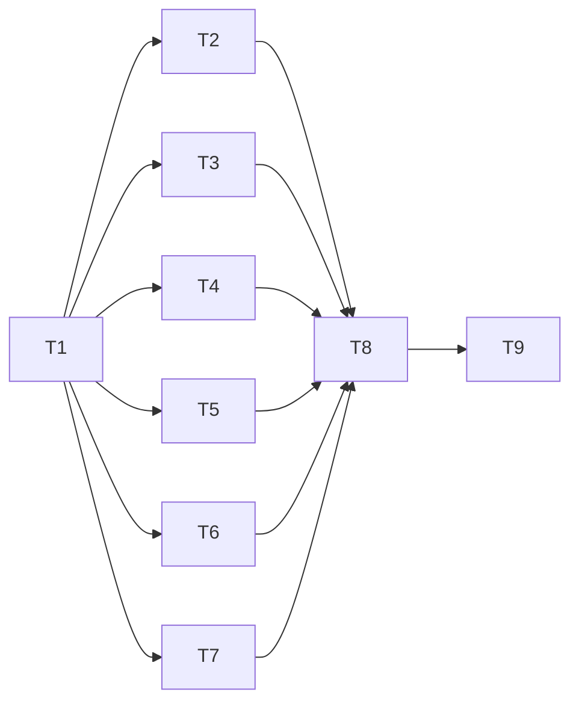

# Controller Events Implementation Plan

> **For agentic workers:** REQUIRED SUB-SKILL: Use superpowers:subagent-driven-development (recommended) or superpowers:executing-plans to implement this plan task-by-task. Steps use checkbox (`- [ ]`) syntax for tracking.

**Goal:** Deliver controller lifecycle hints, promptly confirmed laptop task notifications and a live dashboard with safe N-1 dispatch and durable-state authority.

**Architecture:** Collect durable hints under existing fences, then enqueue them outside those fences to a bounded best-effort journal publisher. Existing task.list carries safe selectors for journal reads, addressed task facts and resumable task-only repair; a local viewer tails the journal without RPC. Commit interfaces/fakes first, run six independent implementation tracks, then integrate and build assets once.

**Tech Stack:** Rust 2024; existing serde/UUID/sha2/libc/rooted_fs/flock/ProcessRunner; Axum 0.8/Tokio; tokio-stream 0.1 sync for SSE only; React/TypeScript/Vitest/Vite, Node 22; osascript and existing laptop Herdr JSON-RPC.

**Spec:** [2026-09-30-controller-events-design.md](../specs/2026-09-30-controller-events-design.md), Round 3 against `37915a9c21c20dd022d2d140156cd234a267ee14`.

## Global Constraints

- Owner approval precedes implementation. This documentation track changes only the spec and plan; the report is ignored.
- Keep protocol 7; `controller.events` is controller-only. Never send a new top-level command: all logical reads are `task.list` with exactly one `controller_events` selector (spec Decisions 1, 5).
- Existing strict reply, saved task/run and TOML schemas stay unchanged. State-only task handlers have their own minimal existing-state opener; journal access is optional/lazy (Decisions 5–7).
- Journal events are title-free identifiers/states/stable codes only, ≤1,024 UTF-8 bytes including newline. Batch ≤32 events/32 KiB; retained 64 × 256 KiB = 16 MiB plus one 256 KiB recovery segment (Decisions 2, 4).
- Manifest/pending/each metadata stage ≤64 KiB. Rooted recovery evidence ≤512 KiB/32 files. Entire journal, including residue, ≤18 MiB/128 regular files; validate before allocation (Decision 4).
- Journal root `controller_state_root()/events/`; notifier cache `controller_cache_root()/events/<target-sha256>/`; directories 0700/files 0600. Only the leader initializes; other processes attach only existing host journals (Decisions 3–4, 9).
- Publisher try-only, one worker/128 batches per process; no journal I/O, sleep or join under StateLock, QueueLock, drain or runner-log fences. Journal admission and optional exit grace each ≤50 ms outside fences; local check 200 ms; three same-binding ESTALE retries (Decisions 3–4).
- RPC frame <1 MiB; read limit defaults 128/clamps 1..256; server long-poll cap 20,000 ms/client default 15,000 ms; retain monotonic 30 s RPC budget (Decision 5).
- Addressed task set 1..16 distinct IDs, row ≤2 KiB, display title ≤512 bytes. Proof checks ≤32 dispatching associations/request; incomplete proof is unknown. Repair defaults 64/caps 128 rows and reads at most limit records, ≤8 MiB task input, 50 ms cooperative record/fact work; continuation ≤2 KiB. Each page enumerates names once, admits ≤100,000 directory entries including residue, validates/sorts IDs and seeks strictly after after_task_id; names cost is measured separately (Decision 6).
- Nonoverlapping task repair starts every 15 s even with a valid cursor; budgeted pages resume rather than restart on the timer. Baseline H precedes state enumeration, replay starts after H (Decision 6).
- SSE capacity 256/eight streams; named heartbeat plus comment 10 s, browser watchdog 30 s, debounce 100 ms. Healthy browser anti-entropy 15 s/fallback 2 s; server collection stays 2 s with 10 s idle probes; live logs stay 1 s (Decisions 10–11).
- Notifier ring 4,096/pending 256 plus independently persisted overflow fingerprint; save before delivery; coalesce >60 s/on repair/>5 decisions; quiet consumes. Titles default on with --no-titles. Done/Request/None sound map; N-1 says eligibility unknown and displays no unconfirmed banners (Decisions 8–9).
- No event-assisted wait, run settlement/banners/aggregates, semantic worker availability, rich CLI replay/emulation, universal snapshot or phase-3 implementation. Baseline 100 ms waits stay unchanged (Deferred).
- Only T5 owns tokio-stream/Cargo.lock. T9 alone regenerates embedded UI assets. No intermediate build advertises/deploys the feature (Decisions 11–12).
- Only T2 may minimally change src/rooted_fs.rs for named journal staging/creation evidence. Repair uses existing list_names/binding helpers; no enumeration API change (Decisions 4, 6).
- Tests use isolated durable roots, clocks/channels/hooks, CARGO_BUILD_JOBS=4, nextest or serial plain Cargo integration targets (`docs/testing.md:26`, `docs/testing.md:34`, `docs/testing.md:90`).

## Review Focus

- Discovery succeeds on a new binary, then rollback serves an old binary: all three selectors reject without active receipts or req rows (T4, T8).
- Crash inside rooted exchange/cleanup or sealed-segment replacement: bounded recovery validates every retained identity and every residue before exposing a head (T2).
- Hidden continuation, recorded dead runner or a large dispatch queue: addressed reads never confirm false attention; key pages progress over more records than one work budget, below-cursor insertions converge next sweep, and over-cap repair fails explicitly while addressed reads remain available (T4, T7).
- >4,096 decisions, eviction, valid-cursor restart, lost hint, quiet and epoch reset: cold history stays baselined and unchanged overflow never re-alerts (T4, T7).
- Event arrives before cache publication or after an old collector began, then tunnel heartbeat expires: visible projection/questions stay fresh, drafts/log cursors survive, and SSE shuts down into polling/reconnect (T5, T6, T8).

---

## File ownership and dependency order

Existing path:line anchors are baseline locations. Proposed paths are exact ownership boundaries. Avoid unrelated refactors. Codex/Cursor indicate task fit; both obey the same contracts and review gates.

| Task | Size / fit | Depends on | Exclusive ownership during this task |
| --- | --- | --- | --- |
| T1 contracts | L / Codex | Owner approval | Create `src/controller/events.rs`, `src/controller/events/contracts.rs`, `src/controller/events/testing.rs`, initial contract-only `src/controller/events/journal.rs`, `src/controller/events/rpc.rs`, `src/controller/events/client.rs`, `src/controller/events/notify.rs`; modify `src/controller/mod.rs`; create the five controller event test modules and dashboard event test module listed below; modify `tests/controller/main.rs`, `tests/dashboard/main.rs`; create `ui/src/lib/controllerEvents.contract.ts`, `ui/src/lib/controllerEvents.fixtures.json` |
| T2 journal | L / Codex | T1 only | `src/controller/events/journal.rs`; create `src/controller/events/journal/fs.rs`, `src/controller/events/journal/publisher.rs`; modify `src/rooted_fs.rs` for named staging/creation evidence only; own `tests/controller/controller_event_journal.rs` after T1 |
| T3 producers | L / Codex | T1 only | Create `src/client_state/events.rs`; modify `src/client_state.rs`, `src/task_client.rs`, `src/turn_runner.rs`, `src/controller/drain.rs`, `src/runner_log.rs`; own `tests/controller/controller_event_producers.rs` after T1 |
| T4 RPC + client | M / Codex | T1 only | `src/controller/events/rpc.rs`, `src/controller/events/client.rs`; create `src/controller/events/task_reads.rs`; own `tests/controller/controller_event_rpc.rs` after T1 |
| T5 viewer SSE | L / Codex | T1 only | Create `src/dashboard/events.rs`; modify `src/dashboard/mod.rs`, `src/dashboard/web.rs`, `src/dashboard/service.rs`, `src/dashboard/source.rs`, `src/dashboard/task.rs`, `src/dashboard/command.rs`, `Cargo.toml`, `Cargo.lock`; own `tests/dashboard/dashboard_events.rs` after T1 |
| T6 browser | M / Cursor | T1 only | Create `ui/src/lib/controllerEvents.ts`, `ui/src/lib/controllerEvents.test.ts`, `ui/src/hooks/ControllerEventsContext.tsx`; modify `ui/src/App.tsx`, `ui/src/App.test.tsx`, `ui/src/hooks/useSnapshot.ts`, `ui/src/hooks/useSnapshot.test.ts`, `ui/src/hooks/useAttentionQuestions.ts`, `ui/src/hooks/useAttentionQuestions.test.ts`, `ui/src/hooks/useTaskPreviews.ts`, `ui/src/views/TaskDetail.tsx`, `ui/src/views/TaskDetail.test.tsx` |
| T7 notifier core/channels | M / Cursor | T1 only | `src/controller/events/notify.rs`; create `src/controller/events/notify/cache.rs`, `src/controller/events/notify/channels.rs`; own `tests/controller/controller_event_notifier.rs` after T1 |
| T8 integration/wiring | L / Codex | T2–T7 accepted | Modify `src/lib.rs`, `src/cli.rs`, `src/controller/execute.rs`, `src/features.rs`; own `tests/controller/controller_event_wiring.rs` after T1; modify `tests/controller/controller_features.rs`, `tests/cli/cli_help.rs`; lease predecessor-owned files only after their commits if integration finds a defect |
| T9 docs/assets/acceptance | M / Cursor | T8 accepted | Modify `docs/usage.md`, `ui/README.md`, generated `src/dashboard/static/app/`; create `docs/superpowers/validation/2026-09-30-controller-events.md`; lease source only for a proven acceptance defect |



T1 is a committed interface gate. T2–T7 are **six independent parallel tracks**, using T1 traits and fakes; none depends on a sibling's concrete implementation. An orchestrator can schedule as many as available capacity permits. T1 predeclares the module roots/test modules and seeds each new test file with a meaningful contract assertion; ownership then transfers exactly as above. The initial journal/rpc/client/notify facades export their contracts, not unfinished production functions. No feature is advertised until T8. During the parallel wave events.rs/contracts.rs/testing.rs, controller/mod.rs and test main.rs roots are frozen. A contract correction requires an orchestrator-owned serial commit before continuing consumers; no overlapping leases. No task edits tests/support, CI or generated assets before T9.

T1 creates `tests/controller/controller_event_journal.rs`, `tests/controller/controller_event_producers.rs`, `tests/controller/controller_event_rpc.rs`, `tests/controller/controller_event_notifier.rs`, `tests/controller/controller_event_wiring.rs`, and `tests/dashboard/dashboard_events.rs`. They are modules of **controller** and **dashboard**, not individual Cargo targets (`tests/controller/main.rs:40`, `docs/testing.md:6`). Help tests belong to **cli**. Library unit binary is **mac_worker** (`cargo test --lib`); no proposed per-file integration binary names.

Each behavior uses a small red/green cycle: add its named failing assertion, run the exact target/filter and confirm nonzero selected tests, implement that behavior, rerun, review owned diff and commit. The code blocks are concrete interface/test seeds; the adjacent named matrix is also required. A green fake test alone does not satisfy real filesystem/RPC/runtime acceptance.

## T1 — commit all shared contracts and in-memory fakes

**Size / fit:** L, Codex: shared Rust/wire contracts and concurrency-test seams.

**Dependencies / files:** owner approval; T1's exclusive paths in the ownership table. This is a single reviewed contract commit before dispatching T2–T7.

**Grounding:** protocol 7 `src/protocol.rs:5`; read envelope `src/controller/read.rs:25`; eight outcomes `src/task.rs:337`; IDs `src/task.rs:82`, `src/task.rs:83`; monotonic runtime `src/transfer.rs:142`; existing Tokio sync `Cargo.toml:24`; strict list key rejection `src/controller/read.rs:450`.

**Interfaces produced:** contracts.rs defines the following types, serde validation, bounds and traits. Required constructors validate before creating owned types; tolerant replies ignore additive fields, but required identifiers/critical bounds are checked. Internal fields never use unvalidated path/prose strings.

```rust
use std::{collections::BTreeMap, sync::Arc, time::Duration};
use crate::{error::WorkerError, task::{TaskId, TurnId, RunId}};

pub struct Seq(u64);
pub struct EventCursor { pub journal_id: uuid::Uuid, pub seq: Seq }
pub struct JournalWindow {
    pub journal_id: uuid::Uuid, pub oldest_seq: Seq, pub head_seq: Seq,
}
pub struct ReadQuery {
    pub after: Option<EventCursor>, pub limit: usize, pub wait_ms: u64,
}
pub struct WireEvent {
    pub schema_version: u32, pub journal_id: uuid::Uuid, pub seq: Seq,
    pub time_millis: u64, pub kind: String, pub data: serde_json::Value,
}
pub struct ReadBatch {
    pub schema_version: u32, pub journal_id: uuid::Uuid,
    pub oldest_seq: Seq, pub head_seq: Seq, pub next_after: EventCursor,
    pub events: Vec<WireEvent>, pub has_more: bool,
}
pub struct SnapshotRequired { pub reason: String, pub window: JournalWindow }
pub enum EventReadResult { Batch(ReadBatch), SnapshotRequired(SnapshotRequired) }
pub enum SafeOutcome { Done, NeedsInput, Blocked, Unknown, Failed,
                       Cancelled, TimedOut, Lost }
pub struct SafeCode(String);
pub struct WorkerName(String);
pub struct TaskHint {
    pub task_id: TaskId, pub run_id: Option<RunId>,
    pub turn_id: Option<TurnId>, pub state: String, pub code: Option<SafeCode>,
}
pub struct TurnHint {
    pub task_id: TaskId, pub turn_id: TurnId, pub run_id: Option<RunId>,
    pub outcome: SafeOutcome, pub code: Option<SafeCode>,
}
pub struct AcceptedHint {
    pub task_id: TaskId, pub turn_id: TurnId,
    pub run_id: Option<RunId>, pub worker: WorkerName,
}
pub struct QueueHint {
    pub turn_id: Option<TurnId>, pub state: Option<String>,
    pub kind: Option<String>, pub code: Option<SafeCode>,
}
pub enum NewEvent {
    TaskCreated(TaskHint), TaskChanged(TaskHint), TaskRemoved(TaskHint),
    TurnStarted(AcceptedHint), TurnFinished(TurnHint), TurnOutcomeChanged(TurnHint),
    AutoContinueScheduled { task_id: TaskId, run_id: Option<RunId>,
                            previous: TurnId, next: TurnId },
    TaskClosed(TaskHint), TaskAbandoned(TaskHint), QueueChanged(QueueHint),
    RunChanged { run_id: RunId, task_id: Option<TaskId> },
    DagChildAdmitted { run_id: RunId, task_id: TaskId, turn_id: TurnId },
    WorkerChanged { worker: WorkerName, ready: Option<bool>,
                    observed_at_millis: u64, code: Option<SafeCode> },
    ControllerDrainChanged { drained: bool },
}
pub struct EventBatch(Vec<NewEvent>);
pub enum PublishAttempt { Queued, Dropped }
pub trait EventSink: Send + Sync {
    fn try_publish(&self, batch: EventBatch) -> PublishAttempt;
}
pub trait EventRuntime: Send + Sync {
    fn now(&self) -> Duration;
    fn sleep(&self, duration: Duration);
    fn cancelled(&self) -> bool;
}
pub trait JournalReader: Send + Sync {
    fn window(&self, deadline: Duration) -> Result<JournalWindow, WorkerError>;
    fn read(&self, query: ReadQuery, deadline: Duration)
        -> Result<EventReadResult, WorkerError>;
}
pub trait JournalWriter: JournalReader {
    fn append(&self, batch: EventBatch, deadline: Duration)
        -> Result<EventCursor, WorkerError>;
}
pub trait JournalProvider: Send + Sync {
    fn open_existing(&self, deadline: Duration)
        -> Result<Option<Arc<dyn JournalReader>>, WorkerError>;
}
```

Seq exposes ZERO/new/as_u64/Display/FromStr, canonical string serde, checked increment. ReadQuery.normalized clamps limits/wait without overflow. EventBatch::try_new(Vec<NewEvent>) enforces 32/32 KiB; NewEvent::to_wire(UUID, Seq, millis) measures newline-inclusive encoding. SafeCode::from_public_code maps unknown prose to TURN_FAILED; WorkerName::parse uses existing validation. TaskHint/QueueHint state/kind strings validate a closed allowlist. WireEvent::affected_task() returns an optional validated task ID; unknown well-formed kinds use global invalidation. Unknown raw data is never printed by the debugging CLI.

```rust
pub struct OpaqueCursor(String);
pub struct TaskFacts {
    pub task_id: TaskId, pub run_id: Option<RunId>, pub state: String,
    pub latest_turn_id: Option<TurnId>, pub outcome: Option<SafeOutcome>,
    pub code: Option<SafeCode>, pub runner_present: bool,
    pub close_intent: bool, pub auto_continue_intent: bool,
    pub queue_dispatching: Option<bool>, pub result_imported: bool,
    pub busy: Option<bool>, pub quiescent: Option<bool>,
    pub fact_digest: String, pub title: Option<String>,
}
pub struct TaskAddressQuery {
    pub task_ids: Vec<TaskId>, pub include_titles: bool,
    pub proof_after: Option<OpaqueCursor>,
}
pub struct TaskFactsBatch {
    pub rows: Vec<TaskFacts>, pub missing: Vec<TaskId>,
    pub proof_after: Option<OpaqueCursor>, pub baseline_after: Option<EventCursor>,
}
pub struct TaskRepairQuery {
    pub after: Option<OpaqueCursor>, pub limit: usize,
    pub baseline_after: Option<EventCursor>,
}
pub struct TaskRepairPage {
    pub rows: Vec<TaskFacts>, pub next: Option<OpaqueCursor>, pub complete: bool,
    pub restart: bool, pub baseline_after: Option<EventCursor>,
}
pub enum EventSelector {
    Read(ReadQuery), Tasks(TaskAddressQuery), Repair(TaskRepairQuery),
}
pub trait TaskProjectionReader: Send + Sync {
    fn addressed(&self, query: TaskAddressQuery, deadline: Duration)
        -> Result<TaskFactsBatch, WorkerError>;
    fn repair(&self, query: TaskRepairQuery, deadline: Duration)
        -> Result<TaskRepairPage, WorkerError>;
}
pub trait TaskProjectionProvider: Send + Sync {
    fn open_existing(&self, deadline: Duration)
        -> Result<Arc<dyn TaskProjectionReader>, WorkerError>;
}
pub enum EventSupport { Supported, Unsupported }
pub trait EventSource: Send + Sync {
    fn discover(&self, deadline: Duration) -> Result<EventSupport, WorkerError>;
    fn read(&self, query: ReadQuery, deadline: Duration)
        -> Result<EventReadResult, WorkerError>;
    fn tasks(&self, query: TaskAddressQuery, deadline: Duration)
        -> Result<TaskFactsBatch, WorkerError>;
    fn repair(&self, query: TaskRepairQuery, deadline: Duration)
        -> Result<TaskRepairPage, WorkerError>;
}
pub enum PreviousProjection {
    Absent, Present(BTreeMap<TaskId, TaskFacts>),
}
pub enum BaselineKind { Cold, Warm }
pub struct TaskEligibilitySignature {
    pub latest_turn_id: Option<TurnId>, pub outcome: Option<SafeOutcome>,
    pub code: Option<SafeCode>, pub busy: Option<bool>, pub quiescent: Option<bool>,
    pub current_attention: bool, pub abandoned_without_turn: bool,
}
pub enum ChangeCause {
    ReplayTerminal { turn_id: TurnId, outcome: SafeOutcome },
    ReplayAbandoned, RepairDifference,
}
pub struct DerivedTaskChange {
    pub task_id: TaskId, pub previous: Option<TaskFacts>,
    pub current: Option<TaskFacts>, pub cause: ChangeCause,
}
pub enum RepairProgress { NotStarted, InProgress, Complete, Restarted }
pub struct ReconcileInput {
    pub read: Option<EventReadResult>, pub repair_due: bool, pub include_titles: bool,
}
pub struct AttentionSummary { pub count: usize, pub fingerprint: String }
pub struct Reconciliation {
    pub consumed_after: Option<EventCursor>, pub baseline: BaselineKind,
    pub changes: Vec<DerivedTaskChange>, pub confirmed: Vec<TaskFacts>,
    pub pending_ids: Vec<TaskId>, pub repair: RepairProgress,
    pub attention: Option<AttentionSummary>, pub repair_needed: bool,
}
pub trait EventReconciler {
    fn reconcile(&mut self, source: &dyn EventSource, input: ReconcileInput,
                 deadline: Duration) -> Result<Reconciliation, WorkerError>;
}
```

EventSelector::request_body serializes **only** controller_events/op, with serde tag op and snake_case variants. EventReadResult uses tag type and batch/snapshot_required variants; SnapshotRequired carries reason/window exactly as above. OpaqueCursor::parse validates ≤2 KiB encoding; clients do not interpret its position/identity fields. Repair tokens are versioned after_task_id keys pinned to client/root/tasks identity; addressed proof tokens remain separate and carry the digests/generation from Decision 6. Request DTOs reject unknown critical keys, duplicate IDs, bad types and combined filters. TaskFacts has typed internal validation and a tolerant TaskFactsWire DTO with the same field names but String state/outcome/code and optional booleans; conversion validates required identifiers/proofs and bounds. TaskFacts::eligibility_signature() returns TaskEligibilitySignature above; metadata/title or closing an already quiescent Done does not change it. Never believe quiescent=true with a missing proof, busy=true, unknown state or intent/runner. Unknown outcome stays non-notifying until supported. Define concrete constants for every Global Constraint, including REPAIR_MAX_DIRECTORY_ENTRIES = 100_000 and stable error CONTROLLER_EVENTS_REPAIR_REGISTRY_TOO_LARGE; defaults/caps have one Rust source. Current/previous complete projections are memory state inside the reconciler, never serialized into notify.json. Reconciliation changes/confirmed are yielded in chunks ≤256; pending IDs ≤256 plus repair_needed. Cold baseline never fabricates RepairDifference completions. Opaque proof tokens carry no prompt/title.

```rust
pub enum ViewerMessage {
    ControllerEvent(WireEvent), SnapshotRequired(SnapshotRequired),
    Ready(JournalWindow), SnapshotReady { revision: u64 }, Heartbeat,
    Unavailable { code: String },
}
pub trait ViewerEventSource: Send + Sync {
    fn subscribe(&self, after: Option<EventCursor>)
        -> Result<tokio::sync::mpsc::Receiver<ViewerMessage>, WorkerError>;
    fn stop(&self);
}
pub trait LocalProjectionRefresh: Send + Sync {
    fn request_refresh(&self);
    fn subscribe_publications(&self) -> tokio::sync::broadcast::Receiver<u64>;
}
pub enum NotifyChannel { Auto, Macos, Herdr, Both }
pub struct NotifyOptions {
    pub follow: bool, pub quiet: bool, pub no_titles: bool,
    pub channel: NotifyChannel,
}
pub enum NoticeSound { None, Done, Request }
pub struct Notice {
    pub fingerprint: String, pub title: String, pub body: String,
    pub sound: NoticeSound,
}
pub struct PendingCandidate { pub task_id: TaskId, pub turn_id: Option<TurnId> }
pub struct NotifyState {
    pub schema_version: u32, pub consumed_after: Option<EventCursor>,
    pub last_complete_repair_millis: Option<u64>, pub decisions: Vec<String>,
    pub pending: Vec<PendingCandidate>, pub attention_overflow: Option<String>,
    pub repair_needed: bool,
}
pub struct NotifyPlan { pub next: NotifyState, pub notices: Vec<Notice> }
pub trait NoticeChannel: Send + Sync {
    fn deliver(&self, notice: &Notice, deadline: Duration) -> Result<(), WorkerError>;
}
```

ViewerMessage::event_name freezes controller.event/snapshot_required/ready/snapshot.ready/heartbeat; Unavailable uses snapshot_required with reason unavailable, stable code and null window, then close. ViewerMessage::cursor returns Some only for ControllerEvent. TypeScript contract.ts exports EventCursor, WireEvent, JournalWindow and a discriminated ViewerMessage union with these exact names/fields. fixtures.json contains bootstrap, event_above_2pow53, snapshot.ready and heartbeat examples matching Rust serialization. No contract test changes generated assets.

**Fakes and seam contracts:** testing.rs provides ManualEventRuntime (advance/cancel/on_sleep, never real sleep), RecordingSink (batches/drop mode), MemoryJournal (JournalReader and JournalWriter; committed window, append, replace_epoch, trim_to, read/long-poll wake hook), FakeJournalProvider (present/absent/error), MemoryTaskReader (rows plus budgeted pages/proof continuations), FakeTaskProjectionProvider (reader/error/open counter), ScriptedEventSource (queued discovery/read/tasks/repair results and captured request bodies), FakeEventReconciler (queued Reconciliation values), MemoryViewerEventSource (bounded subscribe/push/stop), FakeLocalProjectionRefresh (request counter and revision broadcast), and RecordingNoticeChannel (captured notices/deadlines or injected error). They implement **every** trait above with bounded queues. Public test builders: TaskFacts::test_terminal(TaskId, TurnId, SafeOutcome, quiescent: bool), NotifyState::empty(), ReadQuery::follow(EventCursor), MemoryJournal::new(), ManualEventRuntime::new(), RecordingSink::new(). Production TaskFacts constructors still require proof validation; test builders are doc-hidden. NotifyOptions::default() is follow=false, quiet=false, no_titles=false, channel=Auto. Derive Clone/Debug/PartialEq where test comparisons below require them, and Ord for Seq/cursor within one UUID.

- [ ] Start with these shared invariants and run them red:

```rust
#[test]
fn cursor_and_dispatch_are_safe_contracts() {
    let seq = "9007199254740993".parse::<Seq>().unwrap();
    assert_eq!(serde_json::to_string(&seq).unwrap(), "\"9007199254740993\"");
    assert!("01".parse::<Seq>().is_err());
    let body = EventSelector::Read(ReadQuery {
        after: None, limit: 128, wait_ms: 15_000,
    }).request_body().unwrap();
    assert_eq!(body.as_object().unwrap().len(), 1);
    assert_eq!(body["controller_events"]["op"], "read");
}

#[test]
fn no_baseline_is_not_an_empty_registry() {
    assert!(matches!(PreviousProjection::Absent, PreviousProjection::Absent));
    assert!(matches!(PreviousProjection::Present(BTreeMap::new()),
                     PreviousProjection::Present(_)));
    assert_eq!(ViewerMessage::Heartbeat.event_name(), "heartbeat");
    assert!(ViewerMessage::Heartbeat.cursor().is_none());
}
```

- [ ] Run `CARGO_BUILD_JOBS=4 cargo test --locked --lib controller::events:: -- --test-threads=1`. Confirm named tests fail until contracts/fakes are implemented; a zero-test run is failure.
- [ ] Implement all envelopes/selector serialization, safe event catalog, numeric bounds and fakes. Add all_outcomes, title/prose exclusion, unknown kind global invalidation, newline-inclusive event size, frame accounting, selector key exclusivity, long-poll cancellation, unknown proof and baseline distinction tests.
- [ ] Seed each controller area module with a matching contract assertion: MemoryJournal commit/next_after; RecordingSink no partial batch; all three selectors have one safe key; cold reconciliation produces no historical notice; absent journal is representable. Seed dashboard_events with control messages having no journal cursor. Export components through the initial re-export facades, register test modules and freeze shared roots.
- [ ] Run targeted library tests plus `CARGO_BUILD_JOBS=4 cargo nextest run --locked --test controller -E 'test(/controller_event_/)'`. Run separately `CARGO_BUILD_JOBS=4 cargo nextest run --locked --test dashboard -E 'test(/dashboard_events::/)'`. If nextest is absent, run `CARGO_BUILD_JOBS=4 cargo test --locked --test controller controller_event_ -- --test-threads=1` and separately `CARGO_BUILD_JOBS=4 cargo test --locked --test dashboard dashboard_events:: -- --test-threads=1`.
- [ ] Validate JSON fixture parity and TypeScript contract with `cd ui` then `npx tsc -b`; do not run production build. Review every consumer signature with the spec, commit only T1 files: `feat(controller): define event interfaces and test fakes`.

**Acceptance:** all six parallel tracks can compile their component against these committed traits/fakes without touching a frozen file. Every shared type/name/bound/DTO and SSE name is defined; existing DTOs, feature registry and production entry points remain unchanged.

## T2 — journal, bounded rooted recovery and publisher

**Size / fit:** L, Codex: cross-process durability, lock admission and crash recovery.

**Dependencies / files:** T1 only; T2 files in the table. No producer, RPC, viewer or notifier edits. The sole rooted_fs change is minimal named staging/creation evidence: replacement currently chooses a fresh random stage (`src/rooted_fs.rs:1874`), which cannot support the journal's fixed role/recovery budget without evidence. Reuse existing named no-replace publication (`src/rooted_fs.rs:2022`); leave enumeration and unrelated rooted APIs unchanged.

**Grounding:** rooted append/binding `src/rooted_fs.rs:1752`, `src/rooted_fs.rs:1050`; exchange/fsync/remove `src/rooted_fs.rs:1892`, `src/rooted_fs.rs:1913`, `src/rooted_fs.rs:1914`; named no-replace internals `src/rooted_fs.rs:2147`; cleanup evidence `src/rooted_fs.rs:2487`; same-binding retry `src/controller/health.rs:327`; sibling root `src/paths.rs:54`.

**Interfaces consumed:** T1 JournalReader/JournalWriter/JournalProvider/EventSink/EventRuntime, EventBatch, cursors/bounds. Tests use ManualEventRuntime and RecordingSink contract cases; production fsync gates are task-local.

**Interfaces produced:**

```rust
pub struct ControllerJournal;
pub struct ExistingJournalProvider;
pub struct BoundedPublisher;
pub struct PublisherHandle;
pub struct JournalOptions { pub runtime: Arc<dyn EventRuntime> }
impl ControllerJournal {
    pub fn initialize_for_leader(paths: &crate::paths::PathLayout,
        leader: &crate::controller::ControllerLeader, options: JournalOptions)
        -> Result<Arc<Self>, WorkerError>;
    pub fn open_existing(paths: &crate::paths::PathLayout, options: JournalOptions)
        -> Result<Option<Arc<Self>>, WorkerError>;
    pub fn append(&self, batch: EventBatch, deadline: Duration)
        -> Result<EventCursor, WorkerError>;
}
impl ExistingJournalProvider {
    pub fn new(paths: crate::paths::PathLayout, runtime: Arc<dyn EventRuntime>) -> Self;
}
impl BoundedPublisher {
    pub fn start(journal: Arc<dyn JournalWriter>, runtime: Arc<dyn EventRuntime>)
        -> (Arc<dyn EventSink>, PublisherHandle);
}
impl PublisherHandle {
    pub fn finish_with_grace(&self, grace: Duration);
    pub fn stop_without_join(&self);
}
```

ControllerJournal implements JournalReader and JournalWriter. ExistingJournalProvider opens lazily under the passed original deadline and never initializes. Journal fault hook receives a typed JournalFaultPoint for every row of the spec fault matrix, including named stage evidence, exchange, first fsync, removal/final sync and append/manifest commit. A test-only JournalHarness::new() owns private temporary paths, an acquired local leader and ManualEventRuntime; methods append_one(), head(), reopen(), inject(point), replace_sealed_owned_copy(), residue_bytes(), regular_file_count() and recover() expose the exact effects named below. Harness is defined inside controller_event_journal.rs, never tests/support. No actual host/service calls.

- [ ] Add sealed replacement/reopen and exchange-residue tests before implementation:

```rust
#[test]
fn sealed_binding_is_pinned_across_reopen() {
    let mut h = JournalHarness::new();
    h.append_one().unwrap();
    h.seal_active_for_test().unwrap();
    h.replace_sealed_owned_copy().unwrap();
    let error = h.reopen().err().unwrap();
    assert_eq!(error.public_code(), "CONTROLLER_EVENTS_UNAVAILABLE");
}
```

Define seal_active_for_test on the same harness to force a 256 KiB rotation boundary using valid bounded events. Replacement has valid owned 0600 bytes and size, but a different inode; test both replacement before first open and after reopen.

- [ ] Run `CARGO_BUILD_JOBS=4 cargo nextest run --locked --test controller -E 'test(/controller_event_journal::/)'`; require the new real-filesystem case to fail, not just the contract seed to pass.
- [ ] Implement stable EX/SH locking, leader-only resumable initialization, all-retained manifest entries and exact sealed sizes. Build journal paths from PathLayout without changing paths.rs; no entry in the closed client-state root. Validate root/lock/role/type/owner/device/binding and final encoded budgets before allocation.
- [ ] Extend rooted_fs only for named journal staging plus durable creation/identity evidence needed by the fixed role/recovery budget; keep this diff minimal. New helper contract: `replace_private_regular_exact_in_role(role, expected, replacement, hooks)`; matching role publication reuses the existing named no-replace primitive. Task-private JournalRole includes fixed target/stage names, expected target/stage PrivateEntryIdentity, journal/transaction UUIDs and creation evidence; JournalRoleHooks receives the typed fault boundaries. Existing callers retain random staging and behavior. Before allocating, resume verified role/cleanup intents; never delete unknown prefix matches. Preserve exchange, first directory fsync, evidenced removal, final sync. Count generic rooted cleanup namespaces inside the 512 KiB/32-file and 18 MiB/128-file budget. Add inline helper tests for partial stage with/without evidence. No repair/enumeration helper belongs in this change.
- [ ] Implement pending-before-append, matching partial-tail completion, segment fsync, manifest commit visibility, pending cleanup and identity-pinned retirement. Pending stores the ≤32 KiB exact batch as base64 and a ≤4 KiB manifest delta/evidence plus expected digest, not a complete 64 KiB manifest copy; measure the final ≤64 KiB encoding before publication. Read committed prefixes only; EX recovery precedes ambiguous-head serving. Overflow/unknown seq/tail/corruption fails unavailable without state changes or implicit reset. Manifest and role digest comparison use exact bounded bytes, not a filename assertion.
- [ ] Add a table-driven matrix for each role and JournalFaultPoint: reopen after fault, validate old/new pairing, recover, append next batch, assert strict contiguous committed seq, no double delivery on cursor resume and inclusive budgets. Cover initialization, pending, manifest, rotation and retirement, plus append partial record. Ordinary matrix hits each distinct point once; `_stress` repeats ≥200 iterations and is ignored per `docs/testing.md:78`.
- [ ] Add concurrent process append/read, 64-segment rotation/expired cursor, oldest-1, ahead/reset, 1 KiB/32-event bounds, unsafe symlink/hardlink/mode, wrong epoch, same-binding ESTALE then success and retry exhaustion tests. Retry up to three times without new seq assignment or adopting a foreign root. Measure only cooperative work counters; no elapsed upper bounds.
- [ ] Implement the try-only publisher with 128-batch queue, one worker, stable drop diagnostics and bounded shutdown grace. A blocked fsync hook must not block try_publish/stop_without_join. No worker panic turns a state result into failure. Use per-process publisher lifetime; no unbounded spawn per event.
- [ ] Run targeted controller journal tests and separately `CARGO_BUILD_JOBS=4 cargo test --locked --lib rooted_fs::tests::journal_role_ -- --test-threads=1` for new role tests, then `CARGO_BUILD_JOBS=4 cargo test --locked --lib rooted_fs::tests::bounded_private_read_ -- --test-threads=1` for existing race primitives. Do not run unrelated integration binaries. Review fs helper compatibility and commit: `feat(controller): implement bounded event journal recovery`.

**Acceptance:** manifest pins all retained files; every supported fault matrix point resumes within the inclusive disk/file budget; unknown evidence fails closed; transient ESTALE is retryable; publisher is nonblocking and shutdown cannot join stalled fsync. No initialization by read/open_existing.

## T3 — durable producer hooks and deferred release

**Size / fit:** L, Codex: lock lifetimes, CAS publication and writer coverage.

**Dependencies / files:** T1 only. Consume RecordingSink and no concrete journal implementation. Own producer paths/test module in the table; no lib.rs or execute.rs wiring until T8.

**Grounding:** central task durability `src/client_state.rs:3204`, derived failure `src/client_state.rs:3211`; State→Queue `src/client_state.rs:5201`; queue sync/direct bypass `src/client_state.rs:5408`, `src/client_state/runner_dispatch.rs:102`; accepted saves `src/turn_runner.rs:1390`, `src/turn_runner.rs:1419`; corrected outcome `src/turn_runner.rs:2242`; runner-log/drain fences `src/runner_log.rs:156`, `src/controller/drain.rs:95`.

**Interfaces produced:** ClientStateStore::with_event_sink(Arc<dyn EventSink>) preserves optional sink across clones; a deadline reopen adapter preserves/re-attaches in the same initialized binding. ClientStateStore::capture_accepted_turn(AcceptedHint) is called only after accepted-status save. Bare open remains no-event. `DeferredHints::begin(Arc<dyn EventSink>) -> DeferredHints`, `DeferredHints::capture(NewEvent)`, `DeferredHints::finish(self)` and a thread-bound nesting guard collect without I/O. Inner scopes merge into outer scope with bounded coalescing; after all surrounding fence guards drop, finish/drop enqueues already-durable hints, including on an error return. A fake fence counter asserts no release while State/Queue/drain/log guard is active. The scope is not Send and never outlives its process-local sink binding.

- [ ] Write the core lock containment test first:

```rust
#[test]
fn durable_hints_are_released_after_all_outer_fences() {
    let sink = Arc::new(RecordingSink::new());
    let scope = DeferredHints::begin(sink.clone());
    {
        let log_fence = TestFence::enter("runner_log");
        let drain_fence = TestFence::enter("drain");
        {
            let state_fence = TestFence::enter("state");
            scope.capture(NewEvent::ControllerDrainChanged { drained: true });
            assert_eq!(sink.batches().len(), 0);
            drop(state_fence);
        }
        assert_eq!(sink.batches().len(), 0);
        drop(drain_fence);
        drop(log_fence);
    }
    scope.finish();
    assert_eq!(sink.batches().len(), 1);
}
```

TestFence is task-local: a thread-local set of active names with RAII enter/drop; RecordingSink release hook asserts the set is empty. Add real store/runner/drain seam tests as well; fake fences alone do not prove actual guard placement.

- [ ] Run `CARGO_BUILD_JOBS=4 cargo nextest run --locked --test controller -E 'test(/controller_event_producers::/)'` and `CARGO_BUILD_JOBS=4 cargo test --locked --lib client_state::events:: -- --test-threads=1` red, then implement buffer/release scope. Verify declared tests are selected.
- [ ] Insert capture after task publication and before derived cleanup, compare safe fields for semantic no-op/CAS loser suppression, and capture removals only after durable deletion. Each public store write enters a scope before acquiring its state/queue lock. Keep before_final_sync callbacks free of events.
- [ ] Add explicit runner/drain outer scopes so nested writes do not enqueue early. Drop log/finalization/drain guards before releasing. Do not change log ownership or sleep under state. Capture accepted hints only at 1390/1419, not prepared status, submit call or raw logs; fence-spanning delayed start is documented/tested. Cover finish_terminal, finish_publication_failure and finalize_completed_turn correction.
- [ ] Instrument all families in spec Decision 3: continuation creation/clear/rollback; close/cancel/handoff/capacity/lost; rollback delete; central queue publisher including direct completion/bypass; affinity; run/DAG creation/partial recovery/reservations/membership/MarkSubmitted; admission winning observation/invalidation; drain changed flag. Queue overflow becomes one generic hint. No run settlement scan and no worker availability edge.
- [ ] Add exact cases no_hint_before_durability, losing_cas_and_noop_are_silent, durable_task_hint_survives_index_cleanup_error, every_queue_publication_path_is_covered, accepted_status_proof_required, finalizer_changes_terminal_outcome, continuation_precedes_retirement, dag_recovery_admission_requires_two_records, observation_cas_loser_and_ttl_are_silent, drain_hint_after_lock_release, bare_local_store_is_silent. Verify private titles/prompts/paths cannot enter RecordingSink serialization.
- [ ] Add a coverage test documenting worker host gc close→no controller hint until persist_remote_task/reconcile; leader/health/bookkeeping and runner-log sidecar writes are excluded. record_turn_herdr's timestamp-preserving metadata rewrite and legacy job Running must not create task semantic hints. No process-liveness absence shortcut.
- [ ] Run producer tests plus the touched existing controller drain/publication modules with `CARGO_BUILD_JOBS=4 cargo nextest run --locked --test controller -E 'test(/controller_event_producers::|controller_drain::|controller_publication_failure::/)'`. Review actual scope/guard ordering at every map row and commit: `feat(controller): capture durable hints outside authoritative fences`.

**Acceptance:** every first-wave durable family has capture coverage; no append/enqueue before surrounding fences release; errors after durability keep hints; optional sink never changes state success; no-event bare stores and excluded signals stay silent. Runtime host attachment is explicitly T8.

## T4 — safe selectors, bounded task reads and laptop reconciliation

**Size / fit:** M, Codex: wire compatibility, key-paged record work and state confirmation using existing directory helpers.

**Dependencies / files:** T1 only. rpc/client facades and new task_reads.rs; controller_event_rpc tests. Declare `#[path = "task_reads.rs"] pub mod task_reads;` inside the owned rpc.rs and re-export TaskEventReadStore/ExistingTaskProjectionProvider there. This avoids any edit to frozen events.rs. Use fake JournalProvider/TaskProjectionProvider; do not wait for T2/T3 or edit their files, including rooted_fs.rs. Production dispatcher integration belongs to T8.

**Grounding:** old safe list rejection `src/controller/read.rs:450`, health precedent `src/controller/health_read.rs:233`, receipt-before-prepare `src/controller/store.rs:523`; open costs `src/client_state.rs:814`; existing names/residue/filename validation `src/client_state.rs:3226`, `src/client_state.rs:3230`, `src/client_state.rs:3242`; whole-directory names `src/rooted_fs.rs:1247`, `src/rooted_fs.rs:11800`; unbounded turn enumeration to avoid `src/client_state.rs:4361`; raw rooted fd/binding/metadata for locks and identity `src/rooted_fs.rs:1008`, `src/rooted_fs.rs:977`, `src/rooted_fs.rs:1012`; busy/quiescent `src/client_state.rs:122`, `src/task_client.rs:6093`.

**Interfaces consumed:** all T1 selector DTOs, JournalProvider, TaskProjectionReader/TaskProjectionProvider, EventSource/EventReconciler, task facts, previous projection/derived changes and clocks.

**Interfaces produced:**

```rust
pub fn is_event_selector(request: &crate::controller::ControllerRequest) -> bool;
pub fn serve_selector_with(request: &crate::controller::ControllerRequest,
    journal: &dyn JournalProvider, tasks: &dyn TaskProjectionProvider,
    deadline: Duration) -> Result<Vec<u8>, WorkerError>;
pub struct TaskEventReadStore;
impl TaskEventReadStore {
    pub fn open_existing(paths: &crate::paths::PathLayout,
        runtime: Arc<dyn EventRuntime>) -> Result<Self, WorkerError>;
}
pub struct ExistingTaskProjectionProvider;
impl ExistingTaskProjectionProvider {
    pub fn new(paths: crate::paths::PathLayout, runtime: Arc<dyn EventRuntime>) -> Self;
}
pub struct ControllerEventClient;
impl ControllerEventClient {
    pub fn new(runner: Arc<dyn crate::process::ProcessRunner>,
        controller: crate::config::ControllerConfig,
        runtime: Arc<dyn EventRuntime>) -> Self;
}
pub struct TaskReconciler;
impl TaskReconciler {
    pub fn new(previous: PreviousProjection, cursor: Option<EventCursor>,
        pending: Vec<TaskId>, runtime: Arc<dyn EventRuntime>) -> Self;
}
```

TaskEventReadStore implements TaskProjectionReader; ExistingTaskProjectionProvider opens it lazily and implements TaskProjectionProvider. events.read never opens task state. ControllerEventClient implements EventSource; TaskReconciler implements EventReconciler. ProcessRunner is the existing trait (`src/process.rs:64`, public module `src/lib.rs:113`), not a second process abstraction. Constructor holds a ProcessRunner with the existing 30 s policy, not a laptop state store. Build task.list identity using the existing read-request pattern (`src/lib.rs:5816`) and parse_request; verify unchanged read reply identity, never send the logical op as a command. For a locally validated selector request, the old-server `INVALID_REQUEST: task.list body contained unexpected key controller_events` rejection (`src/controller/read.rs:741`) maps to EventSupport::Unsupported. Other transport/state errors remain unavailable rather than proving an old peer; damaged new journal does not disable supported state selectors. New state read replies use the unchanged generic envelope. The private builder is concrete:

```rust
fn selector_request(selector: &EventSelector)
    -> Result<crate::controller::ControllerRequest, WorkerError>
{
    let payload = serde_json::to_vec(&serde_json::json!({
        "protocol_version": crate::protocol::PROTOCOL_VERSION,
        "request_id": format!("{:x}", uuid::Uuid::new_v4().simple()),
        "command": "task.list",
        "body": selector.request_body()?,
    })).map_err(|_| WorkerError::Protocol("CONTROLLER_EVENTS_INVALID".into()))?;
    crate::controller::parse_request(&payload)
}
```

**Task-local test harness:** RpcHarness::new() owns private state/controller roots, injected providers and baseline dispatch shim identical to the existing old-health test (`tests/controller/controller_health_routes.rs:305`). It exposes discover_new_then_dispatch_old(selector), is_unsupported_selector(error), active_receipts(), request_rows(), encoded_reply(selector), addressed(ids), repair_to_eof(budget), damage_event_directory(), damage_event_lock(), seed_hidden_busy_case(case), append_during_repair(hook). Add counters for names calls, record reads/input bytes and association checks, an injected work clock, and deterministic sorted task-ID fixtures with insert/remove hooks between pages. Shim uses old is_read_command/list key rejection; never fake an unknown-command success. Key-cursor tests re-exec the consolidated controller binary with support::libtest_name for a different-process resume (`docs/testing.md:44`), using only the opaque token and the same client/root, without retained process state.

- [ ] Add the rollback safety test first, for each selector:

```rust
#[test]
fn discovery_then_old_dispatch_leaves_no_durable_request_artifacts() {
    for op in ["read", "tasks", "repair"] {
        let mut h = RpcHarness::new();
        let error = h.discover_new_then_dispatch_old(op).unwrap_err();
        assert!(h.is_unsupported_selector(&error));
        assert_eq!(h.active_receipts(), 0);
        assert_eq!(h.request_rows(), 0);
    }
}
```

- [ ] Run `CARGO_BUILD_JOBS=4 cargo nextest run --locked --test controller -E 'test(/controller_event_rpc::/)'` red. Implement exact selector grammar and read dispatch, including combined/duplicate selector rejection before the mutation kernel. events.read requires lazy existing journal; tasks/repair never require its successful open. Test damaged directory/lock before any journal handle, not only malformed JSON.
- [ ] Implement minimal read-only state open with existing client/root bindings and StateLock-equivalent directory flock. No ClientStateStore::open bootstrap, state/index writes, SSH/Git/reconcile or log locks. Read one bounded queue snapshot/request. Known intent/Active/runner proves busy; dispatch association tests only exact turns/<task>/<job> names. Proof cursor binds task/queue digests, root IDs and each task's turn-directory generation or proven absence; ≤32 checks then unknown+continuation. On changed state or turn namespace restart proof, including insertion behind an already-tested queue index. Never equate dead runner to absent identity. Task status/history decoding stays ≤1 MiB.
- [ ] Implement names/key paging inside task_reads.rs with existing RootedDir::list_names() once per page. Check count including residue before filtering/sorting: >100,000 returns CONTROLLER_EVENTS_REPAIR_REGISTRY_TOO_LARGE ("repair unavailable, registry too large") before any task/queue read or fact work; exactly 100,000 is admitted. Ignore recognized private residue without deleting it, reject other invalid names, validate canonical TaskId.json names, sort IDs by canonical text and seek first ID > after_task_id. Do not invoke full list_tasks. A versioned ≤2 KiB token pins client ID and root/tasks device/inode identities plus last processed task ID; validate bindings using existing helpers. Wrong client/root fails, while insertions/replacements/removal of the cursor ID do not restart enumeration. No rooted_fs edit.
- [ ] Implement task-only repair at most limit records (default 64/cap 128), 8 MiB input/32-association/50 ms cooperative record/fact limits after names work. Commit each completed row to the page; yield next at its ID on budget exhaustion. Reserve allowance for one maximal record and process it once, allowing an unknown proof row rather than repeatedly restarting. Empty/exhausted sorted list returns complete=true/next=None. Insertions below the cursor belong to the next sweep; complete means this sweep's sorted IDs are exhausted, not an atomic snapshot. No RunRecord/member/DAG/worker traversal, partial complete=true or synthetic baseline. Check overall RPC deadline around names work; existing whole-directory allocation/I/O is outside the record budget.
- [ ] Add cases addressed_hidden_auto_continue_runner_none, dead_runner_is_still_busy, dispatch_proof_resumes_and_invalidates, closed_historical_needs_input_is_not_attention, large_frozen_registry_key_pages_complete, maximal_task_record_yields_once, residue_excluded_without_record_reads, below_cursor_insertion_found_next_sweep, above_cursor_insertion_found_on_later_page, removed_cursor_id_still_progresses, cursor_reused_in_new_process, registry_at_cap_admitted, registry_over_cap_fails_before_record_or_queue_reads, residue_counts_toward_cap, large_run_not_read, unsafe_root_and_bad_key_cursor, event_directory_or_lock_damage_still_returns_state, encoded_frame_under_one_mib, limit_wait_overflow_clamps, read_deadline_and_cancellation, ESTALE_retries_same_binding. Force the injected record budget to fit fewer rows than the frozen registry, assert monotonic after_task_id progress and exact once-per-sweep coverage; verify an over-cap repair preserves the previous projection and independent addressed reads still work.
- [ ] Measure real names collection/validation/sort separately from record reads/fact work using isolated fixtures of 1,000, 10,000, 100,000 and 100,001 entries. Record entry/name-byte counts, per-page record/byte/association counters and observed timings for T9's validation record; at 100,001 assert zero record/fact work. Include private residue in counts. Timings are observations, not elapsed-time pass thresholds; deterministic assertions use the injected clock/counters, with no sleeps. Document that existing list_names allocates all names before rejecting an oversized directory.
- [ ] Implement the laptop client and TaskReconciler: bounded addressed groups, pending confirmation priority, partial task sweep retained across ticks, H before enumeration and replay after H, 15 s nonoverlap independent of event traffic. Addressed include_titles comes from ReconcileInput; repair always excludes titles. Advance only validated consumed events whose candidates are accounted for. Full replacement only at complete=true; old view survives failed/over-cap pages; removals only from complete sweep. Below-cursor insertions converge next sweep, with addressed reads/event replay available throughout. Unknown kinds trigger global repair. No fallback to local store or all-domain snapshot.
- [ ] Add lost_hint_warm_busy_to_quiescent_is_derived_change, absent_baseline_even_with_valid_cursor, present_empty_detects_new_row, unchanged_history_after_ring_eviction_has_no_change, replay_hint_after_saved_cursor_is_separate, generic_hint_on_cold_history_is_not_completion, closing_quiescent_done_is_not_new_completion, repair_never_jumps_to_post_snapshot_head, repeated_restart_preserves_last_complete_view, continuous_events_do_not_starve_repair, unknown_outcome_is_non_notifying. ReplayTerminal must match confirmed latest turn/outcome; generic hints trigger reads, not cold completion changes. Verify changes have no fabricated seq. Cold-start lost-hint completion is baselined and explicitly tested as accepted loss.
- [ ] Run RPC tests plus existing health/read compatibility modules: `CARGO_BUILD_JOBS=4 cargo nextest run --locked --test controller -E 'test(/controller_event_rpc::|controller_health_routes::|controller_read_routes::/)'`. Review N-1 shim, work counters and interface parity, commit: `feat(controller): add safe event selectors and task reconciliation`.

**Acceptance:** three operations are read selectors only; rollback creates no receipts/req rows; unsafe journal cannot block state repair; addressed confirmation handles hidden busy state; admitted frozen history larger than one work budget completes by bounded key pages across processes; concurrent insertions converge over sweeps; >100,000 entries fail explicitly before record/fact work while addressed reads remain available; separate names/row cost measurements are recorded. Baseline/derived changes obey cold versus warm policy. No required concrete journal dependency or rooted_fs change.

## T5 — local viewer SSE and fenced cache refresh

**Size / fit:** L, Codex: bounded replay/fan-out, security, shutdown and concurrent cache publication.

**Dependencies / files:** T1 only. Own dashboard backend/Cargo paths and dashboard_events test module. Use MemoryJournal and fake LocalProjectionRefresh/ViewerEventSource; never wait for RPC/producers or edit lib.rs/browser files.

**Grounding:** loopback/security `src/dashboard/web.rs:84`, `src/dashboard/web.rs:205`, `src/dashboard/web.rs:451`; cache read/publication `src/dashboard/service.rs:401`, `src/dashboard/service.rs:503`; local projector `src/task_view.rs:334`; remote collector exclusion `src/dashboard/task.rs:167`; cadence `src/dashboard/cache.rs:5`, `src/dashboard/cache.rs:9`; tunnel timer `src/dashboard/tunnel.rs:46`, `src/dashboard/tunnel.rs:47`.

**Interfaces consumed:** T1 JournalReader/EventRuntime/ViewerEventSource/ViewerMessage/LocalProjectionRefresh, all SSE names/limits. Tailer is local, no EventSource RPC.

**Interfaces produced:** LocalViewerEventSource::new(Arc<dyn JournalReader>, Arc<dyn EventRuntime>, Arc<dyn LocalProjectionRefresh>) -> Arc<Self> implements ViewerEventSource. DashboardHttpServer::bind_with_events retains the existing bind arguments plus Arc<dyn ViewerEventSource>; existing bind/HttpState shape stays usable. SystemDashboardLauncher::with_events(source) -> Self injects only the optional source. DashboardService implements LocalProjectionRefresh; refresh_local_projection() uses saved local records and `project_task_list_with_blocking_codes`, retains cached worker/freshness facts and publishes revision only after cache visibility. A task-local SseHarness::new(MemoryJournal, ManualEventRuntime) starts loopback server, exposes subscribe(after), publish_local_revision(revision), hold_full_collector(), release_full_collector(), fire_viewer_timeout(), received_names(), stream_closed() and security_request(host, origin, fetch_site).

- [ ] Add stale-cache/order and shutdown cases first:

```rust
#[test]
fn a_late_full_collector_cannot_restore_older_local_tasks() {
    let mut h = SseHarness::new(MemoryJournal::new(), ManualEventRuntime::new());
    h.hold_full_collector();
    h.publish_local_revision(2);
    h.release_full_collector();
    assert_eq!(h.visible_task_revision(), 2);
    assert!(h.worker_observations_merged());
    h.fire_viewer_timeout();
    assert!(h.stream_closed());
}
```

Define visible_task_revision and worker_observations_merged on that harness using a local projection generation and independently stamped worker fixtures, not equality between cache revision and journal seq.

- [ ] Run `CARGO_BUILD_JOBS=4 cargo nextest run --locked --test dashboard -E 'test(/dashboard_events::/)'` red. Add tokio-stream 0.1 sync/Cargo.lock; leave notification dependencies unchanged.
- [ ] Build one local tailer with injected 200 ms checks and bounded broadcast. Subscribe live before capturing H, replay through H, drain >H, deduplicate and enter live mode. Test append at each handoff hook, lag during replay, cap 256/eight streams, reset/expired/ahead/unavailable, conflicting cursor sources and controls without IDs. Slow subscribers close for repair and never block journal append.
- [ ] Add SSE route with exact Host, present foreign Origin and cross-site rejection, no wildcard CORS, no-store and named heartbeat/comment every 10 s. Local no-source route is 404. Cancel tailing, streams and fast refresh before graceful join. Inject tunnel EOF/30 s stdin timeout separately from SSE heartbeat; no real SSH or waiting for wall time. Preserve mutation JSON/generation guards and CSP.
- [ ] Implement debounced single-flight local projector with dirty flag, no SSH/per-task remote status, no queue/run/worker RPC. Capture local generation before full collection; publication retains any newer local projection and merges valid worker observations. Emit snapshot.ready after completed cache publication for local and full refreshes; never increment journal sequence for it. Keep collector 2 s/idle 10 s; 15/20 s are deadlines only. Local projector work runs independently of tailer/heartbeats.
- [ ] Add cases event_then_snapshot_ready_reads_fresh_cache, local_refresh_calls_no_remote_collector, full_publication_sends_control, slow_full_collection_does_not_stall_heartbeat, ttl_freshness_without_worker_event, leader_health_poll_independent_of_sse, lag_closes_stream, cancellation_precedes_graceful_join, tunnel_timeout_closes_tcp_and_reconnect_can_resume. Use actual loopback request tests for Host/Origin/cursor route and a fake clock for timers.
- [ ] Run dashboard_events plus touched existing dashboard service/web/tunnel cases with `CARGO_BUILD_JOBS=4 cargo nextest run --locked --test dashboard -E 'test(/dashboard_events::|dashboard_service::|dashboard_web::|dashboard_tunnel_reconnect::/)'`. Review task-view versus SSH collector call graph and commit: `feat(dashboard): stream local controller hints and fresh snapshots`.

**Acceptance:** replay/live has no silent gap; bounded slow clients repair; Host/Origin remain enforced; tunnel loss closes streams without shutdown hang; visible local projection wins old full collector while workers merge. No RPC dependency; old bind fixtures compile.

## T6 — browser client, resource invalidation and polling fallback

**Size / fit:** M, Cursor: React hooks, UX state and deterministic browser tests.

**Dependencies / files:** T1 only. Own listed UI sources/tests; T1 contract.ts/fixtures.json are frozen inputs. No assets, backend or package dependencies.

**Grounding:** App root `ui/src/App.tsx:67`; snapshot polling `ui/src/hooks/useSnapshot.ts:6`; questions set key/concurrency `ui/src/hooks/useAttentionQuestions.ts:20`, `ui/src/hooks/useAttentionQuestions.ts:6`; previews key `ui/src/hooks/useTaskPreviews.ts:11`; mutation/drafts `ui/src/views/TaskDetail.tsx:45`, `ui/src/views/TaskDetail.tsx:128`; log identities `ui/src/hooks/useTurnLog.ts:41`.

**Interfaces consumed:** TypeScript T1 EventCursor/WireEvent/ViewerMessage plus exact JSON fixtures and names. Mock EventSource/timer factory simulates viewer; no T5 server dependency.

**Interfaces produced:**

```ts
export type EventClientOptions = {
  makeSource: (url: string) => EventSource
  now: () => number
  setTimer: (fn: () => void, delay: number) => number
  clearTimer: (id: number) => void
  invalidate: (taskIds: string[] | null) => void
  health: (healthy: boolean) => void
}
export type EventClient = { start: () => void; stop: () => void }
export function createControllerEvents(options: EventClientOptions): EventClient
```

ControllerEventsContext provides stream health, a global resource invalidation revision and per-task revision; useSnapshot/useAttentionQuestions/TaskDetail subscribe without separate streams. Per-task revision refreshes questions even when the waiting ID set is unchanged. Snapshot.ready/global invalidate bumps the snapshot key and previews follow the existing task-revision mechanism. A mock source harness records URLs/listeners/close and has emit(name, payload, lastEventId), error() and advance(ms) using Vitest fake timers.

- [ ] Write the unhealthy-stream fallback test and same-ID new-turn question test first:

```ts
it('falls back after stream silence and preserves string cursor on reconnect', () => {
  const h = makeEventHarness()
  h.client.start()
  h.emitFixture('event_above_2pow53')
  h.advance(30_000)
  expect(h.lastHealth()).toBe(false)
  expect(h.lastReconnectUrl()).toContain('9007199254740993')
  expect(h.closedSources()).toBeGreaterThan(0)
})
```

makeEventHarness is a task-local Vitest factory implementing EventClientOptions with a mock source, captured health/URLs and fake timers; methods return recorded values. No real network sleep.

- [ ] Run `cd ui` then `npm test -- src/lib/controllerEvents.test.ts src/hooks/useSnapshot.test.ts src/hooks/useAttentionQuestions.test.ts src/views/TaskDetail.test.tsx src/App.test.tsx` red. Implement safe parsing, one App-root source, 100 ms invalidation, 10 s named-heartbeat awareness/30 s watchdog and bounded reconnect. Unknown well-formed kinds/versions invalidate globally; malformed/oversized data repairs. Controls do not change replay cursor.
- [ ] Healthy snapshot/detail anti-entropy becomes 15 s, errors/404/reset/watchdog restore 2 s immediately. Close old native EventSource and recreate with latest cursor; no obsolete query versus Last-Event-ID conflict. On reconnect/visibility fetch fresh snapshot. Keep last good data and one in-flight fetch/resource; use abort/generation fencing.
- [ ] Thread global/per-task invalidation into snapshots/detail/questions/previews. Event-before-cache triggers one fetch and snapshot.ready triggers fresh fetch; a new latest turn refetches same-ID attention questions. Preserve concurrency six, errors/drafts/cancel and mutation expected generation. Browser toast policy remains snapshot-derived; do not synthesize notifications from event data.
- [ ] Add cases one_source_for_many_hooks, named_heartbeat_keeps_health, tunnel_disconnect_immediate_polling, unknown_kind_global, malformed_payload_closes_source, reset_controls_never_skip_cursor, event_then_publication_refetch, stale_detail_or_questions_does_not_overwrite, same_waiting_ids_new_turn_refetches, six_fetch_cap, draft_preserved_on_refresh, visibility_repairs, unsubscribe_closes_timer_and_source. Verify fake unknown outcomes do not invent task state.
- [ ] Leave useTurnLog.ts unchanged; rerun its existing unit file with `npm test -- src/hooks/useTurnLog.test.ts` to pin exact task/turn/stream/UTF-8/current-end behavior. Terminal hint may trigger a bounded extra read only through existing hook API, never declare EOF.
- [ ] Run named tests, `npm run lint` and `npx tsc -b` in ui; no npm run build. Review contract fixture parity and commit source/tests only: `feat(ui): refresh controller views from shared event stream`.

**Acceptance:** mocked T1 SSE contracts suffice; one stream, bounded reconnect, correct fallback and same-task new-turn invalidation; drafts and log-byte semantics preserved. No generated asset changes.

## T7 — notifier policy, private cache and local channels

**Size / fit:** M, Cursor: desktop copy/channels, dedup and user-facing fallback.

**Dependencies / files:** T1 only. Own notifier paths/tests. Use ScriptedEventSource/FakeEventReconciler and TaskFacts builders; no T4 client or CLI dependency.

**Grounding:** laptop cache `src/paths.rs:64`; socket discovery `src/herdr.rs:110`; sound/show `src/herdr.rs:147`, `src/herdr.rs:619`; rich formatter excluded `src/herdr_notify.rs:33`; title redaction `src/redaction.rs:171`, `src/task.rs:20`; hidden intents `src/client_state.rs:126`, `src/client_state.rs:128`; N-1 strict status `src/controller/read.rs:115`.

**Interfaces consumed:** T1 Reconciliation with DerivedTaskChange and BaselineKind, TaskFacts, NotifyOptions/State/Plan/Notice/NoticeChannel, EventRuntime. Distinguish unknown eligibility from unsupported transport.

**Interfaces produced:**

```rust
pub fn plan_notifications(saved: &NotifyState, result: &Reconciliation,
    options: &NotifyOptions, now_millis: u64) -> NotifyPlan;
pub struct NotifyCache;
impl NotifyCache {
    pub fn open(paths: &crate::paths::PathLayout,
        controller: &crate::config::ControllerConfig) -> Result<Self, WorkerError>;
    pub fn load(&self) -> Result<NotifyState, WorkerError>;
    pub fn save(&self, state: &NotifyState) -> Result<(), WorkerError>;
}
pub fn commit_then_deliver(cache: &NotifyCache, plan: NotifyPlan,
    channels: &[Arc<dyn NoticeChannel>], runtime: &dyn EventRuntime)
    -> Result<Vec<bool>, WorkerError>;
```

NotifyCache owns per-target lock; no laptop task registry. Constructors for MacosChannel and HerdrChannel accept existing ProcessRunner/HerdrSocket plus options; fake channels record NoticeSound/argv. A local NotifierHarness::new() owns a temporary cache, seeded state and scripted Reconciliation values, with consume(result, options), restart_with_valid_cursor(), change_epoch(), decisions(), delivered(), delivered_since_restart(), overflow_fingerprint() and interrupt_after_save(). Cold/warm builders explicitly set BaselineKind and DerivedTaskChange rather than synthesizing WireEvent.

- [ ] Start with the combined M2 regression:

```rust
#[test]
fn evicted_history_and_unchanged_overflow_do_not_replay() {
    let mut h = NotifierHarness::new();
    h.consume_more_than_4096_decisions();
    h.consume_attention_overflow_quiet();
    let fingerprint = h.overflow_fingerprint();
    h.restart_with_valid_cursor();
    h.consume_cold_history_with_lost_hint();
    h.change_epoch();
    h.consume_unchanged_attention_overflow();
    assert_eq!(h.overflow_fingerprint(), fingerprint);
    assert_eq!(h.delivered_since_restart(), 0);
}
```

Define these harness methods using ≥4,097 unique task/turn decisions, >256 confirmed attention tuples with stable sorted digest, quiet=true during first overflow, saved valid cursor and a Cold reconciliation with no replay hint. Add a separate replay-hint-after-saved-cursor case that does notify after fresh eligibility, so the regression does not suppress all work.

- [ ] Run `CARGO_BUILD_JOBS=4 cargo nextest run --locked --test controller -E 'test(/controller_event_notifier::/)'` red. Implement pure policy first: latest confirmed quiescent turn; all eight outcomes; Open latest NeedsInput/Blocked attention only; abandoned without terminal; busy/unknown/continuation/close/dead runner/currently superseded hint suppress. No run banners or routine queue/worker/start/drain banners.
- [ ] Implement cold historical baseline regardless of saved cursor, warm derived busy→quiescent changes, unchanged history suppression after eviction and Present(empty) distinction. Persist one independent stable attention-overflow fingerprint from completed confirmed set; no journal epoch/time/page key. Save this set fingerprint below 256 members and during quiet too, preventing unchanged cold-start summaries after individual ring eviction. Incomplete repair retains pending/repair-needed and cannot claim whole-registry summary. Coalesce >60 s/on repair/>5 decisions; quiet saves everything without channels. Accepted lost-hint completion across cold restart is explicitly baselined.
- [ ] Build private target-hash cache, rooted mode/lock validation, schema bounds, atomic/fsynced save-before-channel and safe corrupt-cache rebaseline. At most 4,096 decisions/256 candidates plus overflow fingerprint. Test duplicate notifier lock, unsafe/symlink cache, crash after save, channel failure, epoch reset preserving decisions, quiet exit/no backlog and second cold start with an empty saved registry.
- [ ] Add titles-by-default from addressed/local result; --no-titles removes them. Reapply redaction/control escape and 512-byte cap; no titles stored in journal/cache fingerprints. Missing title uses safe ID. Plant secret/path/control text and assert it cannot reach output unchanged. Existing TaskTitle itself caps 120 bytes (`src/task.rs:20`); display cap is defense in depth.
- [ ] macOS adapter: fixed AppleScript `on run argv` with title/body separate ProcessRequest argv, deadline 2 s, no shell. Script body is `display notification (item 2 of argv) with title (item 1 of argv)` inside the fixed handler. Herdr adapter maps NoticeSound to NotificationSound Done/Request/None; Done outcome→Done, NeedsInput/Blocked→Request, others/abandonment→None; summary Request if attention, Done if done-only, otherwise None. Auto uses laptop reachable socket plus notifications.herdr, else macOS; explicit channel failure is a safe diagnostic; both attempts two channels once. Quiet calls neither.
- [ ] Against EventSupport::Unsupported, diagnostics say eligibility unknown and no channel is called. Existing remote read polling may show IDs/outcomes, but no task.wait.poll or inferred busy proof. Add hidden-continuation/dead-runner/dispatch/closed-history fallback cases, latest-turn replacement, title opt-out, sound map for all outcomes, argv injection, coalesced sound and no controller account socket.
- [ ] Run notifier tests and relevant existing Herdr tests without real commands: `CARGO_BUILD_JOBS=4 cargo nextest run --locked --test controller -E 'test(/controller_event_notifier::/)'`, then `CARGO_BUILD_JOBS=4 cargo nextest run --locked --test dashboard -E 'test(/herdr_client::/)'`. Review persisted schema and channels with fake ProcessRunner/socket only; commit: `feat(controller): confirm and deduplicate laptop task notifications`.

**Acceptance:** confirms before notifying; derived/cold distinction suppresses historical replay; stable overflow survives restart/quiet/epoch; save-before-channel crash loss is explicit; title opt-out and exact sounds work; N-1 never banners unknown eligibility. No CLI, LaunchAgent or new notification crate.

## T8 — integrate selectors, host attachment, CLI and feature

**Size / fit:** L, Codex: real process entry points and compatibility acceptance.

**Dependencies / files:** accepted T2–T7. Own lib/cli/execute/features and wiring/help/feature tests; predecessor leases are exclusive after merge. Keep controller/lifecycle.rs source unchanged.

**Grounding:** leader acquisition/store `src/lib.rs:1421`, `src/lib.rs:1423`; real child/local shared open `src/lib.rs:1625`, `src/lib.rs:1646`; viewer shared open `src/lib.rs:1124`, viewer branch `src/lib.rs:834`; RPC stores/dispatch `src/controller/execute.rs:559`, `src/controller/execute.rs:564`, `src/controller/execute.rs:568`, `src/controller/execute.rs:579`; baseline wait `src/controller/lifecycle.rs:164`; feature list `src/features.rs:8`.

**Interfaces consumed:** T2 provider/journal/publisher; T3 sink/deferred store; T4 selector/client/reconciler; T5 source/launcher; T6 browser contracts; T7 cache/policy/channels. Constructors use a production EventRuntime adapter around existing monotonic timing, not wall-clock deadlines.

**Interfaces produced:** `open_with_existing_controller_events(paths, runtime)` returns a state store plus optional publisher lifetime without initializing the journal; leader uses initialize_for_leader after acquiring leadership. `worker events -f [--json]` and `worker notify [--follow] [--quiet] [--no-titles] [--channel auto|macos|herdr|both]` are wired user commands. No new task wait transport/signature or config fields.

**Task-local integration harness:** ProcessWiringHarness owns temporary controller/laptop homes and fake workers/ProcessRunner. Methods start_controller_leader(), spawn_detached_runner_fixture(), run_laptop_local_fixture(), tail_committed_events(), journal_exists(), hold_publisher_fsync(), perform_unrelated_state_change(), toggle_drain(), run_wait_fixture() test real re-exec entry points without a pool. Use support::libtest_name for fixture names; existing shared fixtures stay unmodified.

- [ ] Write detached-controller-runner versus laptop-local regression first:

```rust
#[test]
fn child_attachment_uses_initialized_host_journal() {
    let mut controller = ProcessWiringHarness::controller();
    controller.start_controller_leader();
    controller.spawn_detached_runner_fixture();
    assert!(controller.tail_committed_events().iter()
        .any(|event| event.kind == "turn.finished"));
    let mut laptop = ProcessWiringHarness::laptop_local();
    laptop.run_laptop_local_fixture();
    assert!(!laptop.journal_exists());
}
```

- [ ] Run `CARGO_BUILD_JOBS=4 cargo nextest run --locked --test controller -E 'test(/controller_event_wiring::/)'` red. Initialize only leader after lock. Attach existing host journal at every Decision 3 store entry, particularly child 1625 and dashboard 1124/834, deadline reopen and direct helpers. Neither config.enabled=false nor parent sink determines attachment. Opening journal failure disables sink, not authoritative store.
- [ ] Insert event selector recognition in serve_rpc_with_runtime before health/list handling and before durable fallback, with strict selector conflict rejection. Construct minimal TaskEventReadStore independently of lazy ExistingJournalProvider. Real encoded requests always say task.list. Run new-discovery/old-execution fixtures for all selectors and strict old-laptop/new-server status/list/log/wait/drain decoding; no active receipts or req rows.
- [ ] Wire notifier loop: discover, cold baseline, tail/read, confirm candidates, apply bounded repair pages every 15 s, reconcile/persist before channels. Set ReconcileInput.include_titles = !options.no_titles for addressed confirmation; no title fetch in --no-titles or periodic repair. On rollback/unsupported, show eligibility unknown and use reduced diagnostic polling; no banners. On a new server with unavailable journal, retain state-only addressed/repair confirmation and null cursor; do not confuse this with an unsupported old selector. Cap each long-poll by next repair/cancellation deadline; busy event traffic cannot postpone sweep. Persist pending candidates before consuming corresponding cursor. Ctrl-C stops admission/read/channel work without unbounded join. Finish one-shot notify after completed current-attention baseline or explicit incomplete diagnostic.
- [ ] Wire debug tail with required -f/no --since: capture current journal head, emit ready, follow future batches; safe unknown kind metadata only; reset/expiry controls rebaseline; unsupported exits clearly. No fake snapshots, old polling or local task state. Add cli_help parsing/exclusion cases for all switches and invalid combinations.
- [ ] Inject local viewer source only for controller-viewer plus initialized journal; normal laptop-local source absent/404. Bind generation refresh/publication to the real source. Hook actual viewer heartbeat EOF/timeout cancellation so SSE closes before graceful join. Browser fallback/reconnect integration uses loopback fixtures and fake tunnel runner.
- [ ] Hold publisher fsync at a deterministic gate after state durability; prove unrelated state mutation/drain toggles and state-only task reads complete using channels before releasing the gate. Also prove no sleep/append under State/Queue/drain/log fence, bounded full publisher drops, and exit does not join the gate. This tests M3 in the actual wiring, not just the fake sink.
- [ ] Run unchanged waits and retry regressions: `CARGO_BUILD_JOBS=4 cargo nextest run --locked --test controller -E 'test(/controller_say_wait_exit::|controller_lifecycle_compat::|controller_retry::/)'`. Add a wiring test asserting task waits issue only existing task.wait.poll and never discovery/events selector, with a short injected deadline and eventless quiescence/DAG progress. Preserve WAIT_BLOCKED, IDs/exit/null status behavior. No lifecycle.rs production edit.
- [ ] After all attachments/routes/consumers pass, add sorted controller.events to CONTROLLER_FEATURES (HOST_FEATURES unchanged), update controller feature tests. Run these complete commands separately, then run UI event/hook tests once against integrated DTO fixtures:

```sh
CARGO_BUILD_JOBS=4 cargo nextest run --locked --test controller -E 'test(/controller_event_|controller_features::|controller_health_routes::/)'
CARGO_BUILD_JOBS=4 cargo nextest run --locked --test dashboard -E 'test(/dashboard_events::|dashboard_tunnel_reconnect::/)'
CARGO_BUILD_JOBS=4 cargo nextest run --locked --test cli -E 'test(/cli_help::/)'
```
- [ ] Review all concrete implementations against T1 interfaces; no stub/fake on production routes, no strict DTO or deferred feature slipped in. Commit: `feat(controller): wire event producers and laptop consumers`.

**Acceptance:** real child emits only on initialized controller host; laptop-local never creates journal; every process open/reopen is audited; safe selectors survive rollback; optional journal stalls do not hold state/drain; foreground commands work; waits remain baseline; feature advertised only by integrated build.

## T9 — operator docs, single asset build and acceptance

**Size / fit:** M, Cursor: operator behavior, source/assets parity and final evidence.

**Dependencies / files:** T8 accepted; exact docs/assets/validation paths in table. No speculative changes to source or CI; record any acceptance defect and use an exclusive owner lease to fix it before completion.

**Grounding:** usage controller/service `docs/usage.md:485`, `docs/usage.md:500`; build `ui/package.json:8`, `ui/vite.config.ts:19`, `src/dashboard/web.rs:41`, `.github/workflows/ci.yml:36`; full gate `docs/testing.md:15`; consolidated target guidance `docs/testing.md:6`.

**Interfaces consumed / produced:** fully wired first wave; docs describe exact CLI, limits and failure states. Produce a validation record with commit/build identity, commands/result counts, key-page progress/cross-process/insertion/cap results, separate names/record cost measurements, journal crash gates and acceptance checklist statuses. Never claim an unperformed live check passed.

- [ ] Update usage/README: foreground notifier ownership/cancellation, titles and --no-titles, local channel/sound/quiet behavior, at-most-once crash loss, cold lost-hint loss, coalescing and persisted overflow; N-1 eligibility unknown/no banner; minimal debug tail unsupported old peer; periodic key repair/unknown proof/record-work limits; 100,000-entry cap including residue, explicit registry-too-large result, whole-directory names allocation/cost, below-cursor insertion picked up next sweep and complete=true sweep semantics; journal drops and operator-visible unavailable without reset; TTL/health/GC/log exclusions; unchanged waits; deferred scope and phase-3 sketch. Include T4's measured counts/timings, with separate names and record work. Do not add LaunchAgent install instructions or automatic reset/delete commands.
- [ ] Run UI tests/lint/typecheck after all source merges: from ui, `npm test`, `npm run lint`, `npx tsc -b`. Select Node 22 as CI does; do not install unrelated tools. Then one production `npm run build`; T9 alone commits src/dashboard/static/app including fonts. Cargo does not rebuild UI.
- [ ] Reproduce CI parity into a fresh temporary outDir: from ui run `npx vite build --outDir <private-temporary-directory>` after typecheck, then `diff -r ../src/dashboard/static/app <private-temporary-directory>`. Pass the real created temporary directory as argv using proper shell quoting. Compare the whole tree, not just JS/CSS. This second temporary build does not rewrite production assets.
- [ ] Run `cargo fmt --all --check` and `CARGO_BUILD_JOBS=4 cargo clippy --locked --all-targets -- -D warnings`. Run the required full suite once only after targeted checks are green: `CARGO_BUILD_JOBS=4 MAC_WORKER_GATE_RAMDISK_MB=0 scripts/test-gate.sh`. No real agent CLI, pool/SSH or service install is part of automated verification. Record key-page progress/insertion/cap tests and the ordinary journal fault matrix; ignored journal stress is an explicitly scheduled release gate and its result/status belongs in validation.
- [ ] Verify documents, T1/Rust/TypeScript wire fixtures, feature list, compiled embedded assets and diff scope. Record save-before-display/cold-history limits and any blocked live acceptance honestly. Commit docs/assets/validation: `docs(controller): document event notifications and rebuild dashboard assets`.
- [ ] After explicit implementation/deployment authorization, integrator runs the live checklist below on approved hosts and updates validation. This plan's existence and this design-author task do not authorize pool contact, SSH, launchctl, credentials or Herdr commands.

**Acceptance:** UI assets exactly match source; required local gates pass; operator docs state reduced fallback/unknown/loss limits; validation distinguishes local verification from pending live checks. No phase-3 code.

## Live acceptance checklist — future authorized integrator

- [ ] Deploy the fully integrated controller/laptop build, record identities and protocol 7/features; old laptop still decodes unchanged list/status/log/wait/drain.
- [ ] Submit a task and a follow-up; local viewer shows lifecycle promptly; laptop gets one title-bearing banner after confirmed latest-turn retirement. --no-titles removes title.
- [ ] Check NeedsInput and Blocked Request sound, Done Done sound and remaining outcomes None; explicit both makes two channel attempts for one decision.
- [ ] Auto-continuation and a recorded dead-but-not-retired runner never produce a false attention banner. Check a dispatching queue row and close intent too.
- [ ] Confirm controller detached child attaches existing journal; laptop-local commands/dashboard neither initialize nor emit; direct/viewer/RPC writes are covered.
- [ ] Drop an event after state commit; addressed checks and warm periodic repair converge without advancing to undelivered head.
- [ ] Restart notifier with valid cursor after dedup eviction; historical completions stay silent, current attention coalesces, quiet/overflow summary stays consumed across epoch repair.
- [ ] Simulate publisher backpressure/journal unavailability on a fixture installation; state/drain and state-only selectors still work; operator gets drop/unavailable diagnostics.
- [ ] Verify admitted frozen task registry larger than one work budget completes by multiple key pages, including cursor reuse by another RPC process. Insert an ID below the cursor and confirm next-sweep repair; on an isolated >100,000-entry fixture verify explicit registry-too-large with zero record/fact reads and independent addressed checks. Record names/record costs separately; large runs do not enter RPC repair.
- [ ] Check N-1 controller says unsupported for debug tail and eligibility unknown for notifier, with no banners; new discovery→old execution leaves no controller receipts/req rows.
- [ ] Disconnect laptop tunnel or stop heartbeats; viewer closes SSE at existing 30 s timeout, UI preserves last good data/drafts, polls and resumes after tunnel reconnect. SSE heartbeat is independent.
- [ ] With a slow worker collector, event refresh still uses local projector; snapshot.ready yields fresh task/queue/run view and stale full collection only merges workers. Idle TTL/leader health remain their documented polling signals.
- [ ] Slow browser tab repairs after lag; foreign Host/Origin fails; new turn on same waiting task refreshes questions; UTF-8 trailing log bytes survive terminal hint.
- [ ] Check unchanged task.wait short timeout/WAIT_BLOCKED/run DAG/aggregate exit behavior and same-ID mutation retry.
- [ ] Verify deployed binary's embedded UI equals accepted asset build; record all unperformed checks as pending, then measure append/repair/notification cost before tuning bounds.

## Spec coverage and handoff

| Spec decision | Implementing tasks |
| --- | --- |
| 1 existing boundaries/feature | T1, T4, T8 |
| 2 event catalog/privacy | T1, T3 |
| 3 attachment/outside-fence publication | T2, T3, T8 |
| 4 journal/recovery/ESTALE | T2, T8 |
| 5 safe selectors/deadlines | T1, T4, T8 |
| 6 addressed proof/resumable repair | T4 |
| 7 DTOs/minimal CLI/unchanged waits | T1, T4, T8 |
| 8 channels/titles/sounds/N-1 | T7, T8 |
| 9 derived/cold/dedup/overflow | T1, T4, T7 |
| 10 SSE/local cache/tunnel | T5, T8 |
| 11 browser/assets | T6, T9 |
| 12 deterministic parallel acceptance | T1–T9 |
| 13 sketch/Deferred/open questions | T9 documents; no implementation task |

Self-review checks all orchestrator decisions and every Changes after review row against this table and task acceptance cases. Confirm signatures/types/names, no placeholders or undefined test harness methods, exact consolidated targets, disjoint leases in T2–T7 and one final asset owner. Owner reviews both documents before code. After approval the prescribed execution order is T1 commit, six parallel component tracks, T8 integration and T9 docs/assets/acceptance.
