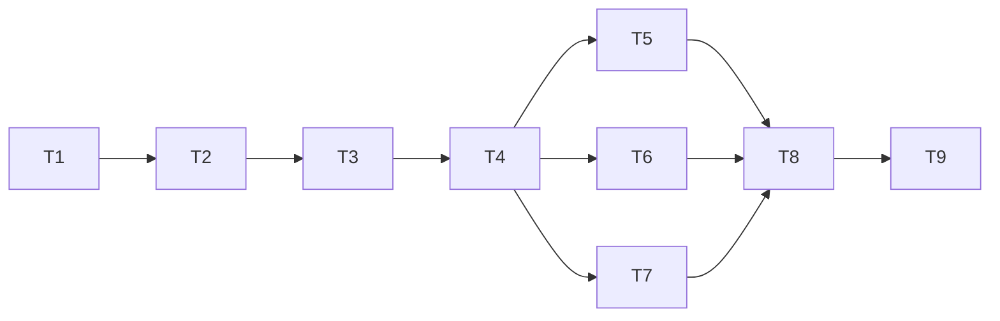

# Controller Events Implementation Plan

> **For agentic workers:** REQUIRED SUB-SKILL: Use superpowers:subagent-driven-development (recommended) or superpowers:executing-plans to implement this plan task-by-task. Steps use checkbox (`- [ ]`) syntax for tracking.

**Goal:** Deliver safe controller lifecycle hints, laptop notifications, and a live dashboard while preserving durable-state authority and N-1 interoperability.

**Architecture:** Controller writers append bounded typed hints to a shared private journal after state publication. Feature-gated remote readers and a local viewer tailer reconcile snapshots; event loss affects responsiveness, not lifecycle correctness. Separate notifier, dashboard, and browser tasks integrate only after the shared contracts and durable producers are verified.

**Tech Stack:** Rust 2024, existing serde/UUID/rooted_fs/flock/ProcessRunner, Axum 0.8 and Tokio; tokio-stream 0.1 with sync for SSE; React/TypeScript/Vitest/Vite with Node 22; osascript and existing Herdr JSON-RPC for notifications.

**Spec:** [2026-09-30-controller-events-design.md](../specs/2026-09-30-controller-events-design.md), proposed against `37915a9c21c20dd022d2d140156cd234a267ee14`.

## Global Constraints

- Owner approves the spec/open questions before any implementation. This track authors documents only.
- Keep `PROTOCOL_VERSION = 7`. New commands are gated by `controller.events`; existing strict wire/persisted DTOs and TOML shapes remain unchanged (spec Decisions 1 and 6).
- Events contain identifiers, states and stable codes only. No prompts, titles, questions, prose, paths, SSH bindings, OIDs, branches, secrets or raw logs (Decision 2).
- Journal root: `controller_state_root()/events/`; laptop cursor root: `controller_cache_root()/events/<target-sha256>/`; directories 0700 and files 0600 (Decisions 4 and 9).
- Event/row maximum 1,024 UTF-8 bytes; append maximum 32 events/32 KiB; segment 256 KiB; 64 retained segments/16 MiB; one extra recovery segment; manifest and pending each at most 64 KiB (Decisions 4 and 5).
- RPC frame maximum 1 MiB; default read/page limit 128, clamp 1..256; long-poll server cap 20,000 ms and laptop default 15,000 ms within the existing 30 s RPC policy (Decision 5).
- Journal-lock admission budget 50 ms; local journal check 200 ms; anti-entropy sweep every 15 s with no overlap; task-wait event wait ceiling 1,000 ms and legacy delay 100 ms (Decisions 4, 5 and 7).
- SSE broadcast 256 events, eight streams, keepalive comment and named heartbeat 10 s, client watchdog 30 s, invalidation debounce 100 ms; healthy snapshot/detail anti-entropy 15 s, fallback 2 s; live log polling remains 1 s (Decisions 10 and 11).
- Notification dedup ring 4,096, pending candidates 256; coalesce beyond 60 s downtime, on repair, or above five eligible decisions; save before delivery; quiet consumes without delivery (Decision 9).
- No SSH/Git/HTTP/notification calls or sleeping under state/journal locks. Journal is acquired last and never calls state code; snapshots read state and drain separately (Decision 4).
- Add no notification dependency. Only dashboard task T6 owns the tokio-stream addition and Cargo.lock; no phase-3 persistent channel work (Decisions 10 and 13).
- No intermediate build is a deployment candidate. Advertise the feature only in T8 after producer/consumer wiring is complete; T9 alone rebuilds generated UI assets (Decisions 11 and 12).
- Tests use isolated temporary durable roots, injected clocks/channels/hooks and `CARGO_BUILD_JOBS=4`; nextest or serial plain Cargo for integration targets (`docs/testing.md:26`, `docs/testing.md:34`, `docs/testing.md:90`).

## Review Focus

- A controller restart/rollback may present a valid numeric cursor from another epoch: repair without skipping state or replaying old banners (T2, T4, T5).
- A task may finish between subscribing and checking, or a writer may crash after state fsync: wait and snapshot consumers must converge despite no new hint (T3, T4, T8).
- A very large run/history/queue may exceed one page or hint batch: bounds must not truncate state silently, and a partial snapshot must preserve the last complete view (T2, T3, T4).
- A terminal Done may become Failed during import, or NeedsInput may auto-continue: laptop notifications and waits must observe final quiescence, not the first hint (T3, T5, T8).
- An old slow dashboard collector or stale task/questions/log request may complete after a newer event: preserve the newer projection, user draft, question generation and UTF-8 byte cursor (T6, T7).

---

## File map and dependency order

All references to existing files below are at the baseline; line numbers are anchors, not line positions expected after edits. New paths are the agreed ownership boundaries. Do not refactor unrelated large modules while inserting hooks.

| Task / size | Deliverable | Exclusive source and test ownership |
| --- | --- | --- |
| T1 / S | Wire types, bounds, privacy and scope contracts | Create `src/controller/events.rs`; modify `src/controller/mod.rs` only for module export; inline unit tests in events.rs |
| T2 / L | Rooted append journal and rotation/crash recovery | Create `src/controller/events/journal.rs`; modify `src/paths.rs`; lease `src/controller/events.rs` after T1 for journal declaration; inline journal tests |
| T3 / L | Durable producer hooks and safe state paging | Create `src/client_state/events.rs`; modify `src/client_state.rs`, `src/task_client.rs`, `src/turn_runner.rs`, `src/controller/drain.rs`; inline tests in the new state-events module and drain/runner modules |
| T4 / M | RPC routes and reusable laptop reconciliation client | Create `src/controller/events/rpc.rs`, `src/controller/events/client.rs`, `tests/controller/controller_events_rpc.rs`; modify `src/controller/execute.rs`, `tests/controller/main.rs`; lease events.rs after T2 for module declarations |
| T5 / M | Notification policy, private cursor, channels | Create `src/controller/events/notify.rs`; lease events.rs after T4 for notify declaration; inline notifier tests |
| T6 / L | Viewer tailer, SSE/security, fresh local cache | Create `src/dashboard/events.rs`, `tests/dashboard/dashboard_events.rs`; modify `src/dashboard/mod.rs`, `web.rs`, `service.rs`, `source.rs`, `task.rs`, `command.rs` within that directory, `tests/dashboard/main.rs`, Cargo.toml and Cargo.lock |
| T7 / M | Shared browser event client and invalidation | Create `ui/src/lib/controllerEvents.ts`, `controllerEvents.test.ts`, `ui/src/hooks/ControllerEventsContext.tsx`; modify `ui/src/App.tsx`, `App.test.tsx`, `ui/src/hooks/useSnapshot.ts`, `useSnapshot.test.ts`, `useAttentionQuestions.ts`, `useAttentionQuestions.test.ts`, `ui/src/views/TaskDetail.tsx`, `TaskDetail.test.tsx` |
| T8 / L | CLI, exact wait semantics, all runtime wiring and feature | Modify `src/cli.rs`, `src/lib.rs`, `src/controller/lifecycle.rs`, `src/features.rs`, `tests/cli/cli_help.rs`, `tests/controller/controller_features.rs`, `tests/controller/controller_say_wait_exit.rs`; create `tests/controller/controller_events_runtime.rs`; lease execute.rs and tests/controller/main.rs after T4 |
| T9 / M | Operator docs, embedded assets, final checks/acceptance record | Modify `docs/usage.md`, `ui/README.md`, generated `src/dashboard/static/app/`; create `docs/superpowers/validation/2026-09-30-controller-events.md` |

Dependency graph:



T5, T6 and T7 are the parallel agent wave. All earlier tasks are serial foundation work; T8/T9 are serial integration. One agent owns a task and its listed files. Shared-file leases transfer only after the predecessor commit is accepted; no two active agents edit the same file. T5 alone edits events.rs in the parallel wave; T6/T7 consume its established types without adding root module declarations. Agents needing an unowned edit send the exact change to the owner, rather than editing opportunistically. Test support remains task-local; none modifies `tests/support/`, CI workflows, or generated assets before T9.

Each task follows the same small cycle for each numbered behavior: write the named failing assertion, run its targeted filter, make that behavior pass, review the diff, then commit only its owned files. Code blocks below are contract/test seeds and ordered implementation logic; they are not permission to replace the full fault/privacy test matrix with one happy-path assertion. A task is complete only when its acceptance criteria and named cases pass.

## T1 — typed contracts and wire compatibility (S)

**Depends on:** owner approval.

**Grounding:** feature separation `src/features.rs:7`; strict response wrapper `src/controller/read.rs:24`; eight outcomes `src/task.rs:337`; redaction `src/redaction.rs:171`; JavaScript consumers currently read snapshot numbers (`ui/src/hooks/useSnapshot.ts:20`).

**Interfaces produced in events.rs:**

```rust
pub struct Seq(u64); // Serialize/Deserialize as canonical decimal string.
pub struct EventCursor { pub journal_id: uuid::Uuid, pub seq: Seq }
pub struct JournalWindow {
    pub journal_id: uuid::Uuid,
    pub oldest_seq: Seq,
    pub head_seq: Seq,
}
pub struct EventReadArgs {
    pub after: Option<EventCursor>,
    pub limit: usize,
    pub wait_ms: u64,
}
pub struct WireEvent {
    pub schema_version: u32,
    pub journal_id: uuid::Uuid,
    pub seq: Seq,
    pub time_millis: u64,
    pub kind: String,
    pub data: serde_json::Value,
}
pub enum EventReadResult { Batch(EventBatch), SnapshotRequired(SnapshotRequired) }
pub struct EventBatch {
    pub schema_version: u32,
    pub journal_id: uuid::Uuid,
    pub oldest_seq: Seq,
    pub head_seq: Seq,
    pub next_after: EventCursor,
    pub events: Vec<WireEvent>,
    pub has_more: bool,
}
pub struct SnapshotRequired {
    pub schema_version: u32,
    pub reason: String,
    pub journal_id: uuid::Uuid,
    pub oldest_seq: Seq,
    pub head_seq: Seq,
}
pub enum EventScope {
    Global, Task(crate::task::TaskId), Run(crate::task::RunId),
    Queue, Workers, Controller,
}
pub trait EventSink: Send + Sync { fn publish(&self, events: &[NewEvent]); }
```

Also define `NewEvent` with every typed variant in spec Decision 2; its `ControllerDrained { drained: bool }` variant selects drained/undrained wire kind. Define `SafeOutcome` with all eight outcome names, `SnapshotKind`, `SnapshotKey { kind, id }`, `SnapshotPageArgs { baseline_after, after_key, limit }`, `SafeSnapshotRow { kind, id, data }`, `SnapshotPage { schema_version, baseline_after, rows, next_key, complete }`, and `SafeSnapshot { rows: BTreeMap<SnapshotKey, SafeSnapshotRow> }`. Internal safe row payloads are typed exactly as the Decision 5 table; wire rows tolerate unknown fields/kinds and preserve required known fields.

`Seq` provides `ZERO`, `new(u64)`, `as_u64()`, Display and FromStr. `EventReadArgs::normalized()` rejects invalid cursor syntax and clamps limit/wait. `WireEvent::scope()` returns Global for unknown schema/kind; `NewEvent::to_wire(journal_id, seq, time_millis)` validates allowlisted fields and the 1,024-byte bound. `SnapshotKey` is ordered by the spec's kind/identifier order and validates UUID, inventory name or fixed controller ID. `EventReadResult` serializes with `type: batch|snapshot_required`; unknown repair reasons remain strings.

- [ ] Add the decimal cursor regression first:

```rust
#[test]
fn seq_round_trips_above_javascript_integer_precision() {
    let seq = "9007199254740993".parse::<Seq>().unwrap();
    assert_eq!(seq.as_u64(), 9_007_199_254_740_993);
    assert_eq!(serde_json::to_string(&seq).unwrap(), "\"9007199254740993\"");
    assert!("01".parse::<Seq>().is_err());
    assert!("-1".parse::<Seq>().is_err());
}
```

- [ ] Run `CARGO_BUILD_JOBS=4 cargo test --locked --lib controller::events::`. Expect failure until the new contract exists; do not accept a zero-test run.
- [ ] Implement the structures/serde rules and privacy constructor. Never add fields to existing task/status/config DTOs. Unknown well-formed wire kind/version returns Global; malformed critical identifiers return a stable invalid-event error.
- [ ] Add cases `all_outcomes_have_safe_wire_names`, `failed_prose_becomes_stable_code`, `worker_name_cannot_be_a_path`, `record_byte_bound_includes_envelope`, `unknown_wire_fields_are_tolerated`, `unknown_kind_invalidates_globally`, `read_args_clamp_without_integer_overflow`, `snapshot_keys_reject_paths_and_bad_order`. Plant `/Users/alice/private`, a token and newline escapes in excluded inputs; assert serialized output contains none.
- [ ] Run the targeted unit filter and `cargo fmt --all --check`; review the module-only change. Commit: `feat(controller): define safe event wire contracts`.

**Acceptance:** every catalog kind has a typed safe producer; strings/limits survive JSON round-trip; unknown extensions do not break new event clients; no existing protocol or persisted schema is changed.

## T2 — durable rooted journal and recovery (L)

**Depends on:** T1.

**Grounding:** sibling controller root `src/paths.rs:54`; client root rejects new entries `src/client_state.rs:6896`; rooted locks/append/sync `src/rooted_fs.rs:1343`, `src/rooted_fs.rs:1752`, `src/rooted_fs.rs:1913`, `src/rooted_fs.rs:3627`.

**Interfaces produced:**

```rust
impl EventJournal {
    pub fn open(root: &std::path::Path) -> Result<Self, WorkerError>;
    pub fn open_with_runtime(root: &std::path::Path,
        runtime: std::sync::Arc<dyn ResolutionRuntime>) -> Result<Self, WorkerError>;
    pub fn open_if_initialized(root: &std::path::Path)
        -> Result<Option<Self>, WorkerError>;
    pub fn window(&self) -> Result<JournalWindow, WorkerError>;
    pub fn append(&self, events: &[NewEvent]) -> Result<Vec<WireEvent>, WorkerError>;
    pub fn read_now(&self, after: Option<&EventCursor>, limit: usize)
        -> Result<EventReadResult, WorkerError>;
}
```

`EventJournal` implements `EventSink` by recording a stable failure diagnostic and swallowing only its optional journal failure. Add `PathLayout::controller_events_root()` and `controller_event_cache_root()`, joining only the established controller roots. No change to client-state allowed names or ControllerStore request enumeration. Test-only journal limits/fault hooks remain in journal.rs; no rooted_fs refactor is required to use its existing fd APIs.

- [ ] Write the reopen/sequence test:

```rust
#[test]
fn sequence_and_epoch_survive_reopen() {
    let temp = tempfile::tempdir().unwrap();
    let path = temp.path().join("events");
    let first = EventJournal::open(&path).unwrap();
    let one = first.append(&[NewEvent::ControllerDrained { drained: true }]).unwrap();
    let epoch = one[0].journal_id;
    drop(first);
    let second = EventJournal::open(&path).unwrap();
    let two = second.append(&[NewEvent::ControllerDrained { drained: false }]).unwrap();
    assert_eq!(two[0].journal_id, epoch);
    assert_eq!(two[0].seq.as_u64(), one[0].seq.as_u64() + 1);
}
```

- [ ] Run `CARGO_BUILD_JOBS=4 cargo test --locked --lib controller::events::journal::`; confirm the missing implementation causes failure.
- [ ] Implement the pending/append/manifest/cleanup transaction in Decision 4. Use exact identities/bytes for recovery; exclusive recovery completes before shared readers serve an ambiguous pending head.

```text
state publication has already completed
take bounded EX journal.lock
validate root, manifest, segment identity and any pending batch
finish validated pending recovery
allocate the next sequence range
fsync private pending batch
append bounded complete records; fsync segment
atomically replace/fsync manifest
remove pending; fsync directory
retire manifest-excluded owned segments; fsync directory
release lock
```

- [ ] Add deterministic fault cases after pending sync, partial append, segment sync, manifest sync, pending removal and retention-manifest publication. Reopen must finish a matching batch once and never serve duplicate/nonmonotonic committed sequences. Unexpected complete bytes/inode swaps fail closed; no silent truncation.
- [ ] Add subprocess writers synchronized by channels/barriers, each appending a known small batch; assert one epoch, disjoint contiguous committed sequences and no interleaved JSON records. Test lock contention with a held lock and virtual 50 ms runtime budget, not elapsed-time assertions.
- [ ] With tiny test limits, force rotation and prove the 64-segment production rule scales as configured, transient residue is one segment, oldest-minus-one is valid, expired/ahead/epoch mismatch need repair, and a slow reader cannot block a writer beyond lock admission. Reject symlink, hardlink, foreign-owner/type/mode and replaced-lock targets.
- [ ] Verify the reader count/serialized-byte budget, no-op empty append, exhausted u64 sequence failure, unknown kinds, corrupt manifest, oversized record and cleanup failure. Exhaustion fails unavailable; it does not wrap/reuse a sequence.
- [ ] Run journal unit tests, existing rooted_fs targeted tests needed by any newly exercised API, and format check. Commit: `feat(controller): add bounded durable event journal`.

**Acceptance:** bounded disk/reply size; persistent epoch/sequence; no reader sees ambiguous partial publication; append failure cannot alter authoritative state; state and transport roots remain compatible with N-1 validators.

## T3 — writer hooks, derived settlement, safe snapshot pages (L)

**Depends on:** T2.

**Grounding:** central task write `src/client_state.rs:3131`; queue publication `src/client_state.rs:5385`; dispatch bypass `src/client_state/runner_dispatch.rs:102`; admission CAS `src/client_state.rs:2382`; drain fence `src/controller/drain.rs:95`; pure wait predicates `src/client_state.rs:122`, `src/task_client.rs:6093`.

**Interfaces produced:**

```rust
pub enum JournalAttachMode { Initialize, IfInitialized }
pub fn open_controller_state(paths: &PathLayout, mode: JournalAttachMode,
    deadline: Option<std::time::Instant>) -> Result<ClientStateStore, WorkerError>;

impl ClientStateStore {
    pub fn with_event_sink(self, sink: std::sync::Arc<dyn EventSink>) -> Self;
    pub fn safe_event_snapshot_page(&self, query: &SnapshotPageArgs,
        deadline: crate::client_state::WaitDeadline) -> Result<SnapshotPage, WorkerError>;
    pub(crate) fn publish_accepted_turn(&self, task_id: TaskId, turn_id: TurnId)
        -> Result<(), WorkerError>;
}
pub(crate) fn saved_task_is_quiescent(record: &LocalTaskRecord,
    entry: Option<&QueueEntry>) -> bool;
```

`open_controller_state` opens state with the existing deadline behavior, then attaches initialized journal if available. Optional journal failure produces a stable diagnostic/disabled sink, not failure of state opening. Initialize is used only at explicit controller entry points; IfInitialized is used for direct helpers and the runner reopen at `src/turn_runner.rs:181`. `publish_accepted_turn` loads/validates the saved matching turn and emits after acceptance observation was durably recorded; publication failure is swallowed through the sink. The caller must have genuine acceptance proof, not prepared timestamps.

Snapshot state-domain pages are produced here; T4 composes the controller drain row after releasing state locks. The deadline bounds enumeration/derived work as well as file reads. Safe run settlement consumes saved member tasks, queue and DAG records; missing/inconsistent member state is an error or nonquiescent state, never a finished run.

- [ ] Pin the pure wait predicate before changing call sites:

```rust
pub(crate) fn saved_task_is_quiescent(
    record: &LocalTaskRecord,
    entry: Option<&QueueEntry>,
) -> bool {
    matches!(record.status().state(),
        TaskState::Open | TaskState::Closed | TaskState::Abandoned | TaskState::Lost)
        && crate::client_state::task_operator_busy_reason(record, entry).is_none()
}
```

Use existing task fixtures to test Open-with-runner false, Open-with-continuation false, Open-with-close-intent false, terminal-with-dispatch row false, Open/no-busy true. Ensure `TaskClient::tasks_are_quiescent` calls this same helper; do not change its result classification or reconciliation.
- [ ] Run `CARGO_BUILD_JOBS=4 cargo test --locked --lib client_state::events::` for the new assertions. Add a test-local recording/failing EventSink; it records the state visible at publish so an assertion fails if a hook precedes durable publication.
- [ ] Add task creation/CAS/replacement hooks after fsync and before derived index retirement. Test `failed_cas_has_no_event`, `identical_write_has_no_event`, `durable_task_before_index_failure_is_visible`, and `journal_failure_does_not_fail_mutation`.
- [ ] Add acceptance helpers to normal and ExistingAccepted runner branches after persisted status, including deadline store reopen. Test prepared Active is not a start, cancellation before acceptance has no start, accepted start follows saved status, and recovery duplicates remain safe hints. Do not copy runner-log JSON.
- [ ] Add before/after outcome, continuation, close/abandon/removal and result-proof detection to the central task hook. Test all eight outcomes, Done-to-PUBLISH_FAILED correction, preacceptance capacity/handoff abandonment, queued cancel versus close, auto-continuation retry/rollback, and deletion after durable submission rollback.
- [ ] Hook the central queue publisher, not only update_queue. Test enqueue/claim/revert, spawn slot reserve/release/complete, dispatch yield, park/unpark, dead dispatch recovery, replacement-budget reset, cancel and row removal/restore. More than 32 changes produces one global hint. Affinity writes/removals emit global invalidation only after their own directory sync.
- [ ] Add run/DAG hooks covering creation and partial-creation recovery, membership, publication reservations, claim/retake/block, binding and MarkSubmitted recovery. Test `dag_claim_is_not_admitted`, `membership_without_submitted_is_not_admitted`, `recovered_mark_submitted_is_admitted`, `blocked_dag_can_settle`, `followup_reopens_run`, and bounded affected-run work yielding run.changed without historical leader scans.
- [ ] Add winning admission-observation hooks and drain hooks. Test unchanged-ready update only worker.changed, stale timestamp/CAS loser no edge, invalidation unknown without unavailable, available/unavailable edges on committed known states, repeated drain no semantic duplicate, drain launch fence unchanged. Include private DrainState decoder compatibility.
- [ ] Implement bounded safe state pages. Tests: 257 tasks span pages without record truncation; giant run member array becomes counts/derived state; task run_id before durable membership yields a false membership flag; queue task mapping and missing member are handled; insertion below previous key and task deletion converge on the next sweep; page deadline produces an error, not complete=true; no nested state/drain locks; no private fields/remote calls.
- [ ] Simulate a writer crash after durable state and before sink call while the consumer cursor remains valid. A subsequent complete snapshot reveals the new terminal task/absent queue row even though journal head is unchanged. This is a required correctness test.
- [ ] Run `CARGO_BUILD_JOBS=4 cargo test --locked --lib client_state::`, the changed runner/task-client unit filters, and `CARGO_BUILD_JOBS=4 cargo nextest run --locked --test controller -E 'test(/controller_drain/) | test(/controller_publication_failure/)'`. Use serial plain Cargo if nextest is absent. Commit: `feat(controller): publish durable state hints and safe snapshots`.

**Acceptance:** every row in the spec writer map has a tested central hook or documented private/derived-only disposition; no failed/CAS/no-op write becomes a semantic event; snapshot repair closes the valid-cursor crash gap; wait predicates are identical; no all-history scan is added to leader tick.

## T4 — bounded RPC and reusable laptop client (M)

**Depends on:** T3.

**Grounding:** route-before-mutation fallback `src/controller/execute.rs:559`; envelope verification `src/controller/read.rs:69`; request key validation `src/controller/read.rs:450`; long-poll clock `src/transfer.rs:142`; log wait tests `tests/controller/controller_read_routes.rs:329`.

**Interfaces produced:**

```rust
pub fn serve_events(request: &ControllerRequest, paths: &PathLayout,
    state: &ClientStateStore, journal: &EventJournal,
    runtime: &dyn ResolutionRuntime) -> Result<Vec<u8>, WorkerError>;

pub trait EventTransport {
    fn supports_events(&mut self) -> Result<bool, WorkerError>;
    fn read(&mut self, query: EventReadArgs) -> Result<EventReadResult, WorkerError>;
    fn snapshot_page(&mut self, query: SnapshotPageArgs)
        -> Result<SnapshotPage, WorkerError>;
}
pub struct Reconciliation {
    pub cursor: Option<EventCursor>,
    pub snapshot: SafeSnapshot,
    pub hints: Vec<WireEvent>,
    pub repaired: bool,
}
pub struct ControllerEventClient<'a> {
    pub runner: &'a dyn ProcessRunner,
    pub controller: &'a ControllerConfig,
}
pub fn reconcile_events(transport: &mut dyn EventTransport,
    cursor: Option<EventCursor>, previous: &SafeSnapshot,
    runtime: &dyn ResolutionRuntime) -> Result<Reconciliation, WorkerError>;
```

ControllerEventClient implements EventTransport with cached explicit capability discovery. Its polling fallback projects safe task fields from unchanged task.list/status/drain replies and marks unsupported domains; it never creates ordered events. Reconciliation captures a baseline, constructs a complete replacement projection, replays after baseline, and keeps the previous projection on incomplete page/replay failure. Its caller owns the 15 s anti-entropy timer and cancellation/deadline-wrapped ProcessRunner.

- [ ] Add strict request fixtures and a virtual-clock cap assertion:

```rust
#[test]
fn event_read_normalization_preserves_server_cap() {
    let args = EventReadArgs { after: None, limit: usize::MAX, wait_ms: u64::MAX };
    let normalized = args.normalized().unwrap();
    assert_eq!(normalized.limit, 256);
    assert_eq!(normalized.wait_ms, 20_000);
}
```

Add a test-local ResolutionRuntime patterned on LogWaitClock: on each virtual wait append a known event from another handle. Assert the handler releases locks before this hook and returns that event; virtual no-change wait expires at the capped budget.
- [ ] Run `CARGO_BUILD_JOBS=4 cargo nextest run --locked --test controller -E 'test(/controller_events_rpc/)' `. Expect failure before routing/handler implementation.
- [ ] Route both event commands before durable mutation handling. Reject unknown/duplicate keys and incorrect types. Build unchanged read envelopes and implement payload verification for new results. Do not advertise the feature yet.

```text
verify capability before a laptop sends events.*
validate request/cursor/limits
read_now under short journal lock
if batch nonempty or snapshot_required: frame bounded reply
if empty and wait budget remains: release all locks, runtime.sleep(<=200 ms), reread
if empty and budget exhausted: reply with unchanged next_after
for snapshot: read bounded state page, release locks, append drain row at its key
validate serialized frame budget and reply identity
```

- [ ] Add named RPC cases: `bootstrap_requires_snapshot`, `oldest_minus_one_is_valid`, `expired_ahead_and_epoch_reset_repair`, `empty_wait_keeps_cursor`, `has_more_does_not_skip_to_head`, `maximum_reply_fits_frame`, `events_reads_create_no_request_rows`, `snapshot_drain_reads_after_state_unlock`, `corrupt_journal_keeps_state_snapshot_available`.
- [ ] Add client cases: old health selector/absent/null feature never sends events.*, transport failure is not unsupported, bad envelope/digest/cursor/key/order rejected, unknown kind/version global invalidation, task/status/list/drain strict old shapes decode new server replies, partial snapshot preserves old view, concurrent changes replay after baseline, and periodic state-only reconciliation observes a missed event.
- [ ] Run the new filter plus existing `controller_features` and `controller_read_routes` targeted modules; format check. Commit: `feat(controller): expose bounded event reads and reconciliation`.

**Acceptance:** server cap/deadline/frame bounds proven; no durable request row for either route; bootstrap/reset/gap/ahead are explicit; every client validates replies; unknown command is never sent to an old controller.

## T5 — foreground notifier core, cache and channels (M)

**Depends on:** T4; parallel with T6/T7.

**Grounding:** runner-host notification gap `src/turn_runner.rs:513`; laptop socket discovery `src/herdr.rs:98`; notification.show `src/herdr.rs:619`; cache lock pattern `src/controller/envelope.rs:127`; strict config `src/config.rs:89`.

**Interfaces produced:**

```rust
pub enum NoticeChannelChoice { Auto, Macos, Herdr, Both }
pub struct NotifyState; // Private versioned schema from spec Decision 9.
pub struct Notice { pub title: String, pub body: String }
pub struct NotifyPlan { pub next_state: NotifyState, pub notices: Vec<Notice> }
pub struct NotifyCache; // Holds the private per-target lifetime lock.
pub trait NoticeChannel { fn show(&self, notice: &Notice) -> Result<(), WorkerError>; }
pub fn should_coalesce(disconnected_ms: u64, eligible_count: usize, repaired: bool) -> bool;
pub fn plan_notifications(saved: &NotifyState, current: &Reconciliation,
    now_millis: u64, quiet: bool) -> NotifyPlan;
pub fn commit_then_deliver(cache: &NotifyCache, plan: &NotifyPlan,
    channels: &[&dyn NoticeChannel]) -> Result<Vec<bool>, WorkerError>;
```

NotifyState implements Default; NotifyCache provides `open(paths, controller)`, `load()` and `save(&NotifyState)`, with a stable target hash and rooted fsync. Channel implementations are `MacosNoticeChannel` (ProcessRunner) and `HerdrNoticeChannel` (laptop HerdrSocket). `commit_then_deliver` returns one success flag per attempted channel; save failure returns before any delivery, channel failure does not erase the consumed decision. T8 owns the foreground loop and CLI parsing.

- [ ] Add the threshold test:

```rust
#[test]
fn downtime_and_backlog_coalesce_without_replaying_every_turn() {
    assert!(!should_coalesce(60_000, 5, false));
    assert!(should_coalesce(60_001, 1, false));
    assert!(should_coalesce(1, 6, false));
    assert!(should_coalesce(0, 1, true));
}
```

- [ ] Run `CARGO_BUILD_JOBS=4 cargo test --locked --lib controller::events::notify::`; expect failure before the policy exists.
- [ ] Implement eligibility from latest quiescent saved task/run rows, not event text. Generate fixed ID/outcome notices, pending candidate reconciliation, bounded fingerprints and overflow summary. Persist ring/pending/cursor in one private atomic write.
- [ ] Implement the cache-before-channel ordering, with injected failure after each operation:

```rust
pub fn commit_then_deliver(
    cache: &NotifyCache, plan: &NotifyPlan, channels: &[&dyn NoticeChannel],
) -> Result<Vec<bool>, WorkerError> {
    cache.save(&plan.next_state)?;
    let mut delivered = Vec::new();
    for notice in &plan.notices {
        for channel in channels {
            delivered.push(channel.show(notice).is_ok());
        }
    }
    Ok(delivered)
}
```

- [ ] Implement fixed `osascript` handler, passing arguments without shell/AppleScript interpolation:

```applescript
on run argv
  display notification (item 2 of argv) with title (item 1 of argv)
end run
```

Fixture ProcessRunner inspects executable/argument separation, 2 s deadline, output bounds, and quoting/control characters. Test channels with fixtures only; no real osascript or Herdr server during tests.
- [ ] Add `restart_does_not_repeat_decision`, `epoch_reset_keeps_outcome_fingerprints`, `cache_failure_sends_nothing`, `crash_after_save_before_send_does_not_replay`, `quiet_consumes_without_channel_calls`, `needs_input_continuation_is_suppressed`, `done_then_publication_failure_notifies_failed_only`, `run_summary_replaces_member_done`, `ring_eviction_does_not_replay_historical_rows`, `candidate_overflow_is_one_summary`, `corrupt_or_foreign_cache_fails_closed`, `two_notifiers_same_target_are_fenced`.
- [ ] Test auto Herdr success makes no macOS call; missing/failing automatic Herdr falls back once; explicit Herdr missing socket is clear; both makes exactly two bounded attempts. Old-controller polling uses the same eligibility and privacy rules.
- [ ] Run notifier unit filter and format check. Commit: `feat(controller): add laptop notification policy and private cursor`.

**Acceptance:** channel choice uses the laptop runtime; cache/lock never creates a laptop task store; restart/quiet/downtime behavior matches Decision 9; notifications wait for quiescence and contain only fixed safe text.

## T6 — local viewer SSE and fast projection publication (L)

**Depends on:** T4; parallel with T5/T7.

**Grounding:** local viewer `src/lib.rs:834`; HTTP state/bind/security `src/dashboard/web.rs:58`, `src/dashboard/web.rs:73`, `src/dashboard/web.rs:205`; completed cache `src/dashboard/service.rs:400`; existing singleflight `src/dashboard/service.rs:475`; remote task projection `src/dashboard/source.rs:348`.

**Interfaces produced:**

```rust
pub enum ViewerMessage {
    ControllerEvent(WireEvent),
    SnapshotRequired(SnapshotRequired),
    Ready { journal_id: uuid::Uuid },
    SnapshotReady { revision: u64 },
    Heartbeat,
}
pub struct ViewerSubscription {
    pub receiver: tokio::sync::mpsc::Receiver<ViewerMessage>,
}
pub trait ViewerEventSource: Send + Sync {
    fn subscribe(&self, after: Option<EventCursor>) -> Result<ViewerSubscription, ApiError>;
    fn stop(&self);
}
pub struct LocalDashboardProjection {
    pub task_view: TaskListProjection,
    pub queue: Vec<DashboardQueueEntry>,
}
```

`LocalViewerEventSource::new(journal: Arc<EventJournal>, runtime: Arc<dyn ResolutionRuntime>, refresh: Arc<dyn Fn() -> Result<u64, DashboardError> + Send + Sync>, published: tokio::sync::broadcast::Receiver<u64>)` implements ViewerEventSource; the refresh callback calls the viewer service's local refresh and returns its published revision. `DashboardHttpServer::bind_with_events(port, state, Option<Arc<dyn ViewerEventSource>>)` preserves existing bind as a no-events wrapper. `SystemDashboardLauncher::with_events(source)` opts into it. DashboardDataSource gains default `local_projection() -> Result<Option<LocalDashboardProjection>, DashboardError>` returning None; the real source supplies a saved-state-only projector. `DashboardService::refresh_local_projection() -> Result<u64, DashboardError>` publishes a fenced cache revision. `DashboardService::subscribe_publications() -> tokio::sync::broadcast::Receiver<u64>` supplies successful cache revisions with capacity 256. The source emits SnapshotReady after publication, deduplicates revision overlap between callback/subscription, and treats a lagged revision subscription as a current-cache invalidation. T8 injects this source only for controller-viewer.

- [ ] Add SSE integration cases in dashboard_events.rs and declare only that module in tests/dashboard/main.rs. Seed an actual private journal and use a virtual runtime plus receive channels; assert `controller.event` IDs, bootstrap and replay after Last-Event-ID.
- [ ] Run `CARGO_BUILD_JOBS=4 cargo nextest run --locked --test dashboard -E 'test(/dashboard_events/)' `; expect missing route/source behavior to fail.
- [ ] Add the single local tailer and bounded per-viewer fan-out. Register live delivery before capturing replay cutoff; replay through that cutoff, discard overlap by cursor, then drain live records. Retention overtaking replay produces repair/close. This subscribe/replay race must have an explicit barrier test.
- [ ] Implement router cursor parsing, no-store SSE framing, 10 s keepalive comments and named heartbeat, and eight-stream admission. Add tokio-stream with sync in Cargo.toml and update Cargo.lock as this task's only dependency change. Reject invalid/oversized/conflicting cursor inputs before filesystem access.
- [ ] Preserve exact Host and existing mutation guards; add SSE present-Origin/Sec-Fetch-Site checks:

```text
wrong Host -> reject before subscribing
foreign present Origin -> reject
Sec-Fetch-Site cross-site -> reject
valid same-origin or absent Origin -> admit if stream capacity available
no viewer event source -> 404, polling remains usable
```

- [ ] Factor a local saved-state projector using existing task/run/queue adapters; no per-task SSH. On hints and bootstrap/reset, debounce refreshes by 100 ms; publish under a generation fence; only then broadcast SnapshotReady. A slow older full refresh merges eligible worker results with the newer local projection rather than replacing that projection or discarding all metrics. Full successful cache publications also send SnapshotReady through the service's publication subscription.
- [ ] Add `event_refresh_does_not_probe_workers`, `event_refresh_reads_saved_tasks`, `snapshot_ready_follows_visible_cache`, `older_full_collector_cannot_overwrite_event_projection`, `collector_failure_keeps_last_good_event_view`. Use collector barriers rather than sleeps to complete the old collector last.
- [ ] Add `slow_subscriber_repairs_and_closes`, `ninth_stream_rejected`, `journal_reset_repairs_tabs`, `foreign_origin_or_host_never_subscribes`, `missing_origin_same_host_allowed`, `cursor_conflict_rejected`, `shutdown_cancels_open_streams_before_graceful_join`. Runtime/spies assert no controller RPC/SSH in tailing; viewer EOF cancellation must terminate streams.
- [ ] Run new dashboard filter and affected dashboard_service/dashboard_web/dashboard_tasks modules; format and scoped clippy. Commit: `feat(dashboard): stream local controller events over SSE`. Do not build or stage static/app.

**Acceptance:** local fan-out without RPC; replay/live handoff has no silent gap; stream/record counts are bounded; security and shutdown rules remain intact; refetch after SnapshotReady sees updated task/run/queue state without waiting for an offline peer.

## T7 — shared browser stream and invalidation (M)

**Depends on:** T4 contracts; consumes T6's agreed SSE names; parallel with T5/T6.

**Grounding:** root snapshot consumers `ui/src/App.tsx:67`; completion-scheduled polling `ui/src/hooks/useSnapshot.ts:20`; task draft/generation guards `ui/src/views/TaskDetail.tsx:128`; attention concurrency `ui/src/hooks/useAttentionQuestions.ts:5`; byte-cursor log rules `ui/src/hooks/useTurnLog.ts:41`.

**Interfaces produced:**

```typescript
export type ControllerInvalidation = {
  scope: "global" | "task" | "run" | "queue" | "workers" | "controller";
  taskId?: string;
  runId?: string;
};
export type StreamHealth = "connecting" | "live" | "polling";
export type EventSourceFactory = (url: string) => EventSource;
export type EventClock = {
  now(): number;
  setTimeout(callback: () => void, delay: number): ReturnType<typeof setTimeout>;
  clearTimeout(handle: ReturnType<typeof setTimeout>): void;
};
export function parseControllerInvalidation(raw: string): ControllerInvalidation;
export function createControllerEvents(options: {
  source: EventSourceFactory; clock: EventClock;
  invalidate: (value: ControllerInvalidation) => void;
  health: (value: StreamHealth) => void;
}): { start(): void; stop(): void };
```

ControllerEventsContext provides `useControllerInvalidation()` with a generation token and health to existing hooks/detail. It owns one client at App root, closing it on unmount. The parser consumes seq as a string, validates critical UUIDs/version, and maps unknown kinds to global. The client handles ready/snapshot_required/snapshot.ready, bounded reconnect, the watchdog and 100 ms debounce.

- [ ] Add a parser/precision test with concrete data:

```typescript
it("unknown event kinds invalidate safely without rounding the cursor", () => {
  const raw = JSON.stringify({
    schema_version: 1,
    journal_id: "614dc3be-668f-4922-bd31-b1d7a0056790",
    seq: "9007199254740993",
    time_millis: 1790726400000,
    kind: "future.resource_changed",
    data: {},
  });
  expect(parseControllerInvalidation(raw)).toEqual({ scope: "global" });
});
```

- [ ] In `ui/`, run `npm test -- src/lib/controllerEvents.test.ts`; expect failure before the client/parser exists.
- [ ] Implement a fixture EventSource factory and Vitest fake timers. Track replay cursor independently from viewer revision, close an errored source before constructing a new cursor-bearing URL, treat malformed stream data as repair/polling, and handle ready plus the named heartbeat for the 30 s watchdog. Transport keepalive comments alone do not expose activity to JavaScript; T6 emits heartbeat every 10 s without a replay cursor.
- [ ] Wire the context at App root and completion-scheduled resource refreshes. Healthy snapshot/detail anti-entropy is 15 s; disconnect/watchdog/404 fallback is 2 s. Never overlap same-resource fetches or discard last good state on error.
- [ ] Invalidate selected task details and attention questions by task generation even when waiting IDs are unchanged. Maintain the six-request question cap, abort stale requests, preserve typed input drafts and expected-generation mutation guards.
- [ ] Add `one_event_source_for_all_consumers`, `events_debounce_one_refetch`, `snapshot_ready_refetches_after_cache_publication`, `unknown_kind_global_refresh`, `reset_rebaselines_without_cursor_jump`, `disconnect_and_watchdog_restore_polling`, `reconnect_uses_latest_cursor_without_header_query_conflict`, `reconnect_visibility_refetches`, `unmount_aborts_and_closes`, `same_waiting_id_new_turn_refreshes_questions`, `event_during_reply_preserves_draft_and_revision_fence`, `old_fetch_cannot_replace_new_generation`.
- [ ] Keep useTurnLog.ts unchanged. Run its existing tests plus the new event/client/hook/detail tests; a terminal-event integration fixture must not stop current-end log draining or invent final EOF.
- [ ] Run `npm test`, `npm run lint`, and `npx tsc -b` with Node 22. Commit: `feat(ui): refresh dashboard resources from controller events`. Do not invoke production asset build or stage static/app.

**Acceptance:** one shared stream; safe parsing of new kinds and string cursors; current state still converges without SSE; questions/drafts/stale-response guards preserved; logs retain exact current byte semantics.

## T8 — CLI, task wait, runtime attachment and feature enablement (L)

**Depends on:** T5, T6 and T7.

**Grounding:** global JSON/command enum `src/cli.rs:17`, `src/cli.rs:26`; all store entry points in spec Decision 3; wait/deadline `src/controller/lifecycle.rs:164`, `src/client_state/deadline.rs:89`; controller-only registry `src/features.rs:8`.

**Interfaces consumed:** open_controller_state, EventJournal, ControllerEventClient/EventTransport, reconciliation and notifier APIs, ViewerEventSource/launcher builder, existing WaitDeadlineRunner and WaitReport.

**Interfaces produced:** user commands exactly as spec Decisions 7–8; existing public wait function signature/result remains unchanged.

- [ ] Add CLI help/parse assertions for events -f, global --json after subcommand, --since valid u64/invalid/negative, notify --follow/--quiet/channel choices, disabled controller diagnostic and existing hidden runner flags unchanged. Add controller_events_runtime module in tests/controller/main.rs.
- [ ] Add virtual-time wait fixtures covering subscriptions before/after task completion, and old feature absence. Run the new controller filter and cli_help filter; expect missing commands/wake strategy to fail.
- [ ] Replace every mutating controller-host store entry point in the Decision 3 process table with open_controller_state; initialize journal on leader/events RPC, attach initialized journal for runner/direct/viewer helpers. Preserve the existing local no-events path and read-only export/GC behavior. Add a process fixture each for leader tick, detached runner, one-shot RPC, direct drain and viewer mutation; each proves a durable hint exists. No real pool process is required.
- [ ] Add CLI event inspection/drain/follow and labeled old-controller snapshot fallback. Ordered --since replay on an old controller errors explicitly; one-shot replay stops at the initially captured head even with busy writers. Unknown kind output contains validated metadata, not opaque data. All output goes through safe event/row formatters; broken stdout/cancellation terminates follow without repeating mutations.
- [ ] Add the foreground notifier loop with lifetime cache lock, laptop channel selection, 15 s maximum poll, 15 s anti-entropy, quiet/coalescing and interruptible backoff. Use the process runtime's laptop identity/socket; no task store open or new TOML key.
- [ ] Implement the wait loop exactly as Decision 7:

```text
create original deadline and deadline-wrapped runner
poll_wait immediately; return only its quiescent result
if busy: discover feature within original deadline
if supported: capture event cursor, then poll_wait again
while busy:
  if events usable: read with min(15_000, 1_000, remaining_ms)
  else: use original bounded 100 ms poll delay
  check original deadline; poll_wait; check deadline again
  return only poll_wait task IDs/exit_code when quiescent
optional event failure -> existing polling; authoritative wait failure -> propagate
```

- [ ] Test `already_quiescent_needs_no_event_rpc`, `subscribe_check_race_finishes`, `valid_cursor_without_event_still_reconciles`, `new_dag_child_extends_run_wait`, `terminal_before_import_does_not_finish_wait`, `publication_failure_has_aggregate_exit_one`, `needs_input_has_aggregate_exit_zero`, `parked_repeat_failure_is_WAIT_BLOCKED`, `feature_and_wait_reads_share_timeout_budget`, `events_failure_returns_to_legacy_polling`, `run_selector_and_unrelated_events_do_not_skip_members`.
- [ ] Advertise controller.events only now, sorted before controller.task-logs-wait. Verify missing/null/old lists preserve fallback, old laptops decode all unchanged read/lifecycle/drain responses, new RPC with an old leader/runner still repairs through snapshots, and host feature lists omit controller.events.
- [ ] Run changed CLI/controller filters, existing controller_features/controller_lifecycle_compat/controller_say_wait_exit/controller_retry/controller_dashboard modules, and affected library units. Verify mutation retry keeps the same logical ID and never appends a start on request ACK. Commit: `feat(controller): wire events notifications and event-assisted waits`.

**Acceptance:** all audited controller writers are attached; public CLI behaves as specified; timeout/quiescence/exit and mutation retries match baseline; event loss/old peers degrade to polling; feature advertisement is now truthful about the serving binary's supported routes.

## T9 — docs, single asset rebuild, final verification and acceptance (M)

**Depends on:** T8.

**Grounding:** embedded assets `src/dashboard/web.rs:41`; build output `ui/vite.config.ts:19`; source parity CI `.github/workflows/ci.yml:36`; final checks `docs/testing.md:15`; controller deployment/service guidance `docs/usage.md:485`.

- [ ] Document the new CLI, safe event fields, replay/cursor resets, foreground notifier and channel/quiet/coalescing behavior in docs/usage.md. Explain observed worker availability, reversible run settlement, at-most-once delivery window, old-controller reduced snapshot, and log-byte polling. Record that phase 3 is only a sketch.
- [ ] In ui/README.md document SSE/polling fallback and the final integrator's exclusive generated-asset ownership; Cargo build alone does not build UI.
- [ ] Create the validation record with baseline/new build identities, supported features, deterministic test results, asset parity result, and the live checklist below. Mark unperformed live rows “not run”; do not describe them as passed.
- [ ] With Node 22 in ui/, run `npm ci`, `npm test`, `npm run lint`, then **one** `npm run build` into the committed static/app directory after all UI changes are integrated.
- [ ] Verify fresh temporary output against the entire embedded directory, including fonts, following CI:

```sh
asset_dir="$(mktemp -d "${TMPDIR:-/tmp}/controller-events-ui.XXXXXX")"
(cd ui && npm run build -- --outDir "$asset_dir")
diff -r "$asset_dir" src/dashboard/static/app
```

Use a task-specific temporary directory; remove only that exact directory after inspection. This parity build is into temporary output and does not regenerate/stage shared assets again.
- [ ] Run final formatting, lint and one full suite after targeted tasks pass:

```sh
cargo fmt --all --check
CARGO_BUILD_JOBS=4 cargo clippy --locked --all-targets -- -D warnings
MAC_WORKER_GATE_RAMDISK_MB=0 CARGO_BUILD_JOBS=4 scripts/test-gate.sh
```

The zero RAM-disk setting avoids creating a volume for verification. Do not rerun broad suites without a new change/failure to justify it.
- [ ] Audit the complete diff against spec writer map, privacy rules, DTO audit, locks, runtime entry points and bounds. Check no generated asset was changed by a source task; no phase-3 files or unrelated refactors. Commit docs/assets only: `docs(controller): document live events and refresh embedded dashboard`.
- [ ] Execute the live checklist only after owner approval authorizes the implementation's pool acceptance. Record actual observed results and build identities; any deployment/restart follows existing operator procedure and authorization. This document-authoring track does not perform it.

**Acceptance:** targeted/full checks pass, embedded asset tree exactly matches source build, compatibility matrix recorded, owner can assess actual live results and known limits. Do not call the implementation deployed/accepted if live rows remain not run.

## Live acceptance checklist — approved integrator on the real pool

Use safe fixture tasks, short fixed prompts without secrets, and controlled test hooks where a crash window cannot safely be induced operationally. Do not kill a production runner merely to demonstrate a journal gap. Preserve normal scheduling limits and existing deployment procedure.

- [ ] Record laptop/controller/worker build identities and protocol 7. Confirm controller.events is advertised by the new RPC binary and omitted from host features; record live leader/runner versions separately.
- [ ] Start `worker events -f --json` on the laptop. Submit one ordinary task; verify accepted start and terminal hints carry matching IDs and no prompt/path/prose, and fresh snapshots show the same state.
- [ ] Exercise done, needs_input, a controlled ordinary failure and cancellation; use deterministic fixtures for timed_out/lost/unknown/blocked and publication-failure cases if inducing them live would disturb the pool. Record which are live versus fixture-only.
- [ ] Close and discard separate safe tasks; verify closed/abandoned edges, no false close on cancel, and immediate close/say/fetch usability after task wait.
- [ ] Exercise auto-continuation; verify scheduled intent/new turn IDs, no premature needs-input banner, and final latest-turn notification.
- [ ] Run a two-node DAG with a dependency. Observe child admitted after parent gate/submission and run finished only after member/queue/DAG quiescence. Follow up a member and observe run reopened.
- [ ] Apply drain/undrain using authorized operator controls while a safe task is running. Running work keeps progressing, later handoffs obey the fence, idempotent flag writes do not produce duplicate banners.
- [ ] Observe a committed unavailable then ready admission result for an approved test worker. Verify that idle workers are not claimed to have heartbeat coverage; do not disrupt a worker carrying unrelated tasks.
- [ ] Run `worker notify --follow` on the laptop, with a fixture laptop Herdr socket and then macOS channel. Confirm delivery originates on the laptop, fixed safe text, no duplicate successful automatic channel, quiet consumption, restart dedup and one downtime summary.
- [ ] Open two dashboard tabs through the existing controller tunnel. Verify task/run/queue/detail/question updates follow events and SnapshotReady; log output still drains by bytes. Keep one slow tab and verify bounded disconnect/repair.
- [ ] Disconnect/reconnect the laptop tunnel; verify browser polling/last good view during disruption, safe cursor repair on reconnect, and task drafts survive. Confirm viewer shutdown/heartbeat loss closes SSE streams.
- [ ] Use a test journal with tiny retention or a fixture controller to exercise expired/ahead/reset cursors. Reconcile snapshots without old-banner replay; use failure hooks for state-fsync/event-append gap.
- [ ] Test laptop-new/controller-old, laptop-old/controller-new, and new RPC with an old leader/runner. Old peers retain existing wait/log/mutation behavior; event consumers converge by polling/snapshots and never create a laptop task registry.
- [ ] Inspect generated assets and the running binary build identity; ensure the deployed UI is the verified source build. Record observed latency descriptively; do not turn the brief's 40 ms context into a claimed measurement.

## Spec coverage and handoff

| Spec decision | Implementing tasks |
| --- | --- |
| 1–2 existing mechanisms, safe typed model | T1, T4, T8 |
| 3 every durable writer and derived run/worker meaning | T3, T8 |
| 4 journal durability, locks, bounds, recovery | T2, T3 |
| 5 read RPC, safe pages, anti-entropy | T1, T3, T4, T8 |
| 6 bidirectional N-1 audit | T1, T4, T8 |
| 7 inspection and exact wait semantics | T4, T8 |
| 8–9 notifier/channels/dedup/quiet/coalescing | T5, T8 |
| 10 local SSE, security, fresh viewer cache | T6, T8 |
| 11 browser refetch/fallback, questions/logs/assets | T7, T9 |
| 12 deterministic tests, staged live acceptance | Every task; final gate T9 |
| 13 optional persistent channel | Design sketch only; deliberately no first-wave task |

The owner first confirms the eight open questions in the spec. The future implementation coordinator then assigns the strict task/file leases above, carries accepted interfaces across agents, and integrates the parallel wave before feature enablement and the sole production asset rebuild. This authoring track does not start implementation or ask for deployment access.
