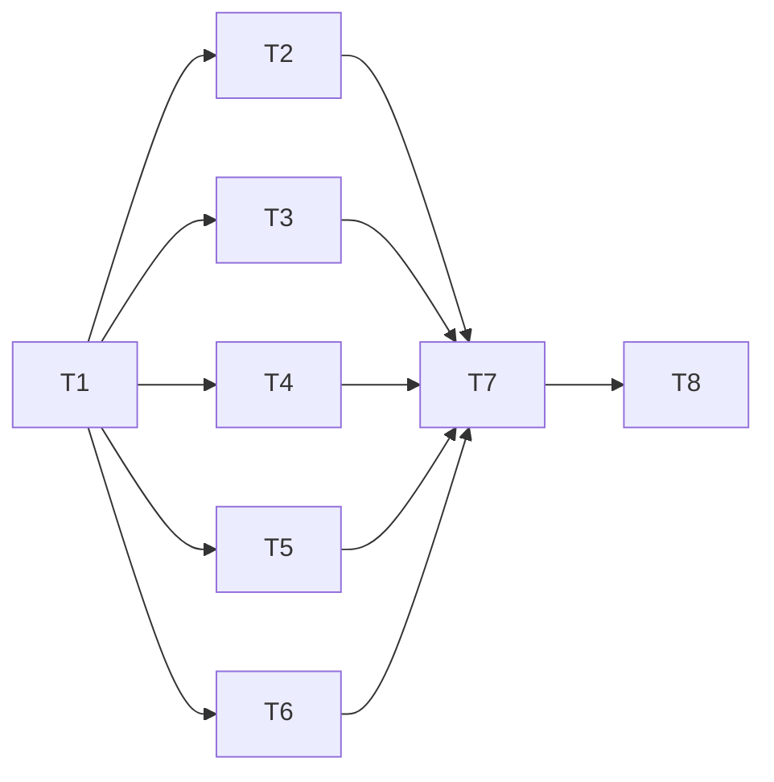

# Persistent Controller Channel Implementation Plan

> **For agentic workers:** REQUIRED SUB-SKILL: Use superpowers:executing-plans to implement your assigned track task-by-task. Steps use checkbox (`- [ ]`) syntax. The orchestrator schedules parallel tracks and independent reviews; do not start internal subagent or review rounds.

**Goal:** Remove per-RPC SSH sessions from warm controller traffic while preserving one-request child-process safety, authenticated identity and same-ID recovery.

**Architecture:** The existing controller leader listens on a private Unix socket and supervises the existing host controller-rpc child for every application request. A foreground laptop command bootstraps identity over authenticated stdio, checks a private stable pin, adds a command-private forward to the existing ControlMaster, and uses a sequential framed session. The existing ProcessRunner-based RPC clients consume a scoped adapter; stdio remains the fallback.

**Tech Stack:** Rust 2024; existing serde/serde_json, UUID, SHA-256, libc, rooted_fs, ProcessRunner, Tokio net/runtime/sync/time. No new dependency, daemon, token store, TOML schema or UI asset build.

**Spec:** [2026-10-01-controller-socket-design.md](../specs/2026-10-01-controller-socket-design.md), against `0802421541679443e7d1982988a8c6482e5fdbe9`. Also read [.briefs/p3-rules.md](../../../.briefs/p3-rules.md) and [.briefs/p3-survey-report.md](../../../.briefs/p3-survey-report.md), section 3's ten process assumptions.

## Global Constraints

- Phase 3 design and implementation are owner-approved. T1 starts on `integ/p3` at the final accepted `integ/ev-wave` head; update line anchors and resolve real baseline drift before freezing contracts.
- Keep protocol 7; channel version 1 is additive. Existing strict request/reply/task/drain/service/envelope DTOs stay unchanged. Identity is a task.list controller_socket selector, never a new top-level wire command.
- One existing host controller-rpc child per application request. Never run task/store/drain/journal handlers in leader session threads. Preserve all ten process assumptions in spec Decision 2.
- Controller path controller_state_root()/rpc/s; laptop transport cache controller_cache_root()/channel/. Directories 0700, sockets and regular files 0600; pin 4 KiB, service/hello/ready 8 KiB. No blind unlink or chmod/adoption of unsafe entries.
- Frame payload 1..1,048,576 bytes; four-byte big-endian length; 8 KiB read scratch; one retained frame, no pipeline/queue. Reply wrapper counts toward the frame cap; maximum-size old replies fall back intact to stdio.
- 16 live sessions; 8 running-or-cleaning supervisors, one child each; one application request in flight per connection. Only fully captured ProcessResult releases a slot. Runner errors/supervisor panics retain slots for the leader lifetime because the runner can abandon I/O threads. No listener restart to replenish them; exhaustion withdraws availability and uses stdio until leader restart.
- 5 s handshake/partial-frame/setup guards; 60 s idle; 30 s application guard. Client setup consumes the existing caller deadline and is skipped cold when at most 5 s remains. Keep 15 s client/20 s server long-polls and the existing 100 ms task.wait sleep.
- Cancellation is connection close, never task.cancel or a definitive rejection. Combine session EOF, deadline and leader shutdown; preserve detached task runners and durable recovery. No unbounded join of request supervision on leader shutdown.
- Existing multiplexed master only when multiplex=true; keep ControlPersist=60, BatchMode=yes, ForwardAgent=no, ExitOnForwardFailure=yes, 10 s/3 keepalives, StreamLocalBindMask=0177, StreamLocalBindUnlink=no and child-only umask 077. Control forward/cancel omits ClearAllForwardings; ordinary SSH retains it. No shared-master exit or dedicated -N fallback.
- Socket paths are absolute UTF-8, contain no NUL/control/colon and are fewer than 104 bytes. Long/custom roots use stdio; no path broker or /tmp relocation.
- Every connection gets fresh authenticated stdio identity: route digest, protocol, client/account, ProcessIdentity, service-generation UUID, persistent journal UUID and features. Stable pin contains only schema/route/client/account; journal/generation never auto-rotate the pin.
- Pin mismatch/handshake failure disables socket use and retains stdio fallback. Wrong complete reply identity is unverified evidence, not retryable EOF. Mutation fallback retains exact frozen bytes, request ID/digest, existing envelope and settlement.
- Ordinary reconnect eligibility is 1, 2, 4, then 5 s, in memory; callers use stdio without sleeping. Unsupported/identity/path safety failure disables this command's attempts. No persisted backoff or laptop service.
- Frozen gate files cannot change in T2–T6. Stop and print CONTRACT ISSUE: <track> for a wrong contract; the orchestrator makes a serial correction. No shared-file edits or overlapping leases.
- All tests use private temporary layouts, fake SSH, fixture binaries, injected clocks/channels/hooks. Run only consolidated area targets under nextest with NEXTEST_TEST_THREADS=6 CARGO_BUILD_JOBS=4. Filters must select more than zero tests. No sleeps or wall-clock speed bounds; hang guards are 30 s or more.
- Each behavior uses red test → exact filtered run → minimum implementation → same run green → buildable conventional commit. End each track with cargo fmt --all and CARGO_BUILD_JOBS=4 cargo clippy --locked --all-targets -- -D warnings.
- Never run the whole suite: the orchestrator owns that gate and independent reviews. Never contact real hosts/pool, SSH, setup, launchctl, credentials/keychains, Herdr or notifications. Do not delete target/, push, merge/rebase other branches or edit other worktrees.

## Review Focus

- Reinstall or alias/account change with a plausible ready response: no socket application bytes before a matching stable pin and fresh generation; unexpected identity never silently repins (T4, T6, T7).
- Concurrent mutation, stalled child, leaked hints/deadline or cancellation: requests remain separate processes; leader signal/tick continues and occupied cleanup slots are not replaced (T3, T7).
- Partial/oversize/coalesced frames and a long-poll while another request arrives: bounded allocation, no pipelining, cancellation on EOF, independent connections and intact maximum-size stdio fallback (T2, T3, T6).
- Existing master with old bind options, expired master, wrong -F namespace, long XDG root or SIGKILL residue: validate ownership, cancel only the exact forward, preserve uncertain files and use stdio (T4, T5, T7).
- Complete unverified reply versus loss after durable publication: no false rejected settlement/new mutation ID; replay preserves source-finish-before-submit ordering and non-envelope recovery/idempotence (T1, T6, T7).

## File ownership and dependency order

| Task | Size | Depends on | Exclusive ownership |
| --- | --- | --- | --- |
| T1 interface gate | L | Final events-wave baseline | Create src/controller/channel.rs, channel/contracts.rs, channel/testing.rs and facade-only channel/{codec,server,files,identity,pin,forward,client}.rs; modify src/controller/mod.rs, src/controller/health_read.rs (visibility only), src/process.rs (private spawn hook), src/error.rs and src/controller/execute.rs (unverified error guard only); declare/seed all new tests listed below in tests/controller/main.rs, tests/transfer/main.rs, tests/cli/main.rs |
| T2 session codec / I/O | M | T1 only | src/controller/channel/codec.rs; create src/controller/channel/codec/io.rs; tests/controller/controller_socket_codec.rs |
| T3 listener / child supervision | L | T1 only | src/controller/channel/server.rs; create src/controller/channel/server/child.rs; tests/controller/controller_socket_service.rs |
| T4 identity / files / pin | L | T1 only | src/controller/channel/{files,identity,pin}.rs; minimal src/rooted_fs.rs socket helpers; tests/controller/controller_socket_identity.rs |
| T5 master forward | M | T1 only | src/controller/channel/forward.rs; src/transport.rs; tests/transfer/controller_socket_forward.rs |
| T6 scoped client / selection | L | T1 only | src/controller/channel/client.rs; tests/controller/controller_socket_client.rs |
| T7 integration / fixtures / observations | L | T2–T6 accepted | src/lib.rs, src/cli.rs, src/features.rs, src/controller/health_read.rs, src/controller/execute.rs, src/controller/events/{foreground,tail,client}.rs, src/controller/events/notify/follow.rs; tests/controller/controller_socket_wiring.rs, controller_socket_benchmark.rs, controller_features.rs, controller_health_routes.rs; tests/cli/controller_channel.rs, cli_help.rs; predecessor files only under an explicit post-track lease |
| T8 operator docs / acceptance | M | T7 accepted | docs/usage.md, docs/testing.md (only new filtered/measurement commands), docs/superpowers/validation/2026-10-01-controller-socket.md; these Phase 3 spec/plan files only for accepted contract/anchor corrections |

Paths in the table beginning `channel/` are beneath `src/controller/`. T1 creates `tests/controller/controller_socket_contracts.rs`, `controller_socket_codec.rs`, `controller_socket_service.rs`, `controller_socket_identity.rs`, `controller_socket_client.rs`, `controller_socket_wiring.rs`, `controller_socket_benchmark.rs`; `tests/transfer/controller_socket_forward.rs`; `tests/cli/controller_channel.rs`. These are modules of controller, transfer and cli, **not** individual Cargo targets (`docs/testing.md:6`, `tests/controller/main.rs:15`).



T2–T6 are **five independent parallel tracks**. The orchestrator can schedule all five subject to available capacity; each uses T1 fakes for its siblings. During this wave freeze channel.rs/contracts.rs/testing.rs, controller/mod.rs, process.rs/error.rs/execute.rs gate seams and all test main.rs roots. Facade files contain exports/module declarations only until their owner implements them; no production todo/panic stub or feature advertising. Ownership of seeded test modules transfers at T1 commit. No task changes tests/support, Cargo dependencies/lock, CI, dashboard source or generated assets. More tracks would split one of codec, supervisor, ownership, forward or selection across a safety boundary without an independent deliverable.

## T1 — committed contracts, test seams and seeded modules

**Files:** Exactly T1's paths above. Freeze them after this task; do not put optional channel calls on production routes.

**Grounding:** ControllerRequest/parser/framing `src/controller/protocol.rs:18`, `src/controller/protocol.rs:127`; current runner interface/pre-exec `src/process.rs:64`, `src/process.rs:158`; health leader check `src/controller/health_read.rs:175`; unverified classification `src/controller/execute.rs:666`, `src/controller/execute.rs:756`; ProcessIdentity `src/job.rs:687`; account `src/protocol.rs:503`; ClientId read `src/controller/events/task_reads.rs:851`.

**Interfaces produced:** contracts.rs owns validated schema/bound types below. All constructors/serde entry points reject malformed required values before handing them to consumers. RouteDigest is 64 lowercase hex, client IDs use the existing ClientId grammar, UUIDs are canonical non-nil v4, and service/journal UUIDs must differ. Reply parsing is tolerant only of additive fields; hello, selector and pin parsing are strict. EntryIdentity includes device/inode/owner/type/mode, never a pathname-only deletion capability.

```rust
pub const CHANNEL_VERSION: u32 = 1;
pub const MAX_SESSIONS: usize = 16;
pub const MAX_SUPERVISORS: usize = 8;
pub const IDENTITY_BYTES: usize = 8 * 1024;
pub const PIN_BYTES: usize = 4 * 1024;
pub const READ_SCRATCH_BYTES: usize = 8 * 1024;
pub const SETUP_GUARD: Duration = Duration::from_secs(5);
pub const IDLE_GUARD: Duration = Duration::from_secs(60);
pub const REQUEST_GUARD: Duration = Duration::from_secs(30);

pub struct ConfiguredRoute {
    pub ssh: String,
    pub remote_binary: String,
    pub ssh_config_file: Option<PathBuf>,
}
pub struct RouteDigest(String);
pub struct ControllerAccount {
    pub uid: u32,
    pub username: String,
    pub home: PathBuf,
}
pub struct ServiceIdentity {
    pub protocol_version: u32,
    pub channel_version: u32,
    pub controller_client_id: ClientId,
    pub account: ControllerAccount,
    pub leader: ProcessIdentity,
    pub service_generation: Uuid,
    pub journal_id: Uuid,
    pub socket_path: PathBuf,
    pub features: Vec<String>,
}
pub struct SocketIdentity {
    pub route_sha256: RouteDigest,
    pub service: ServiceIdentity,
}
pub struct Pin {
    pub schema_version: u32,
    pub route_sha256: RouteDigest,
    pub controller_client_id: ClientId,
    pub account: ControllerAccount,
}
pub struct EntryIdentity {
    pub device: u64, pub inode: u64, pub owner: u32,
    pub kind: u32, pub mode: u32,
}
pub struct SocketBinding {
    pub parent: EntryIdentity, pub socket: EntryIdentity,
}
pub struct ServiceRecord {
    pub schema_version: u32,
    pub service: ServiceIdentity,
    pub binding: SocketBinding,
}
pub struct ForwardPath {
    pub directory: PathBuf,
    pub directory_identity: EntryIdentity,
    pub socket_path: PathBuf,
}
pub enum SocketIdentityResult {
    Available(SocketIdentity), Unavailable(ChannelReason),
}
pub enum ChannelFailure {
    Unavailable(ChannelReason), UnverifiedReply,
}
pub enum ChannelReason {
    Unsupported, ServiceUnavailable, PinMismatch, UnsafePath,
    ForwardLost, Busy, InvalidFrame, Timeout, Cancelled,
}
pub trait ChannelRuntime: Send + Sync {
    fn now(&self) -> Duration;
    fn cancelled(&self) -> bool;
}
pub struct ExchangeContext {
    pub runtime: Arc<dyn ChannelRuntime>,
    pub deadline: Duration,
    pub cancelled: Arc<AtomicBool>,
}
pub struct DecodeProgress {
    pub consumed: usize,
    pub payload: Option<Vec<u8>>,
}
pub trait FrameDecoder: Send {
    fn feed(&mut self, input: &[u8]) -> Result<DecodeProgress, ChannelFailure>;
    fn retained_bytes(&self) -> usize;
}
pub trait ChannelCodec: Send + Sync {
    fn decoder(&self) -> Box<dyn FrameDecoder>;
    fn encode_hello(&self, expected: &SocketIdentity) -> Result<Vec<u8>, ChannelFailure>;
    fn decode_hello(&self, payload: &[u8]) -> Result<SocketIdentity, ChannelFailure>;
    fn encode_ready(&self, identity: &SocketIdentity) -> Result<Vec<u8>, ChannelFailure>;
    fn decode_ready(&self, payload: &[u8], expected: &SocketIdentity) -> Result<(), ChannelFailure>;
    fn encode_reply(&self, request: &ControllerRequest, result: &ProcessResult) -> Result<Vec<u8>, ChannelFailure>;
    fn decode_reply(&self, payload: &[u8], request: &ControllerRequest) -> Result<ProcessResult, ChannelFailure>;
}
pub trait ChannelExecutor: Send + Sync {
    fn run(&self, wire_frame: &[u8], ctx: &ExchangeContext) -> Result<ProcessResult, WorkerError>;
}
pub trait IdentitySource: Send + Sync {
    fn read(&self, raw: &dyn ProcessRunner, route: &ConfiguredRoute, ctx: &ExchangeContext) -> Result<SocketIdentity, ChannelFailure>;
}
pub trait PinStore: Send + Sync {
    fn verify_or_create(&self, paths: &PathLayout, identity: &SocketIdentity) -> Result<(), ChannelFailure>;
    fn repin(&self, paths: &PathLayout, identity: &SocketIdentity, expected: ClientId) -> Result<(), ChannelFailure>;
}
pub trait ForwardPaths: Send + Sync {
    fn allocate(&self, paths: &PathLayout) -> Result<ForwardPath, ChannelFailure>;
    fn validate_socket(&self, path: &ForwardPath) -> Result<EntryIdentity, ChannelFailure>;
    fn cleanup(&self, path: &ForwardPath, socket: Option<EntryIdentity>) -> Result<(), ChannelFailure>;
}
pub trait ForwardLease: Send {
    fn local_socket(&self) -> &Path;
    fn verify(&self) -> Result<(), ChannelFailure>;
    fn cancel(&mut self, raw: &dyn ProcessRunner, ctx: &ExchangeContext) -> Result<(), ChannelFailure>;
}
pub trait ForwardControl: Send + Sync {
    fn open(&self, raw: &dyn ProcessRunner, route: &ConfiguredRoute, identity: &SocketIdentity, ctx: &ExchangeContext) -> Result<Box<dyn ForwardLease>, ChannelFailure>;
}
pub trait SocketSession: Send {
    fn exchange(&mut self, wire_frame: &[u8], request: &ControllerRequest, ctx: &ExchangeContext) -> Result<ProcessResult, ChannelFailure>;
    fn close(&mut self);
}
pub trait SocketConnector: Send + Sync {
    fn connect(&self, local: &Path, identity: &SocketIdentity, ctx: &ExchangeContext) -> Result<Box<dyn SocketSession>, ChannelFailure>;
}
pub struct ClientDeps {
    pub identity: Arc<dyn IdentitySource>,
    pub pins: Arc<dyn PinStore>,
    pub forwards: Arc<dyn ForwardControl>,
    pub connector: Arc<dyn SocketConnector>,
    pub runtime: Arc<dyn ChannelRuntime>,
}
```

Derive Clone/Debug/Eq where the contained types allow it, Serialize/validated Deserialize for wire/data types, and use manual equality for any reused account representation. Define `ConfiguredRoute::new(&ControllerConfig, &SshConfig) -> Result<Self, WorkerError>`, `digest() -> RouteDigest`, `Pin::from_identity(&SocketIdentity) -> Pin`, `SocketIdentity::validate()`, `verify_expected_service(expected, actual) -> Result<(), ChannelFailure>`, `ExchangeContext::remaining() -> Result<Duration, ChannelFailure>` and `ExchangeContext::for_cleanup(Arc<dyn ChannelRuntime>) -> ExchangeContext`. Cleanup context retains the monotonic clock/5 s limit but ignores an already-consumed foreground cancel signal; it cannot admit application requests. Feature lists cap 64 entries of 64 bytes each and require sorted uniqueness; final encoded identity cap also applies. Home/account fields are UTF-8/no controls, absolute home, username at most 256 bytes, and no nil IDs.

testing.rs provides `identity_fixture() -> SocketIdentity`, `request_fixture(command: &str, body: Value) -> ControllerRequest`, `result_fixture(request: &ControllerRequest, result: Value, exit_code: u8) -> ProcessResult`; `ManualRuntime::{default,advance(Duration),cancel}`; `RecordingRunner::{new(Vec<Result<ProcessResult,WorkerError>>),calls() -> Vec<ProcessRequest>}`; `ScriptedIdentitySource::new(Vec<Result<SocketIdentity,ChannelFailure>>)`; `MemoryPinStore::{default,pin() -> Option<Pin>}`; `FakeForwardControl::{new(PathBuf),opens() -> usize,cancels() -> usize,fail_next(ChannelReason)}`; `ScriptedConnector::{new(Vec<Result<ProcessResult,ChannelFailure>>),frames() -> Vec<Vec<u8>>,connections() -> usize}`; `RecordingExecutor::{new(Vec<Result<ProcessResult,WorkerError>>),frames() -> Vec<Vec<u8>>}`; `FakeForwardPaths` and `StubCodec` implementing the gate's traits. Fakes do not touch real SSH, hosts or notifications. Only real codec tests assert byte grammar; StubCodec is explicitly not a wire implementation.

- [ ] Write contracts tests red: every changed route member changes the digest; stable Pin ignores leader/generation/journal/features; expected-service check rejects each changed required identity field; invalid IDs/schema/feature size/path/pin size reject. Seed every downstream test module with a relevant passing gate assertion. Add the actual mutation no-retry/pending-envelope case below before changing its classification.

```rust
#[test]
fn stable_pin_does_not_pin_service_or_journal_generation() {
    let first = identity_fixture();
    let mut restarted = first.clone();
    restarted.service.service_generation = Uuid::new_v4();
    restarted.service.journal_id = Uuid::new_v4();
    assert_eq!(Pin::from_identity(&first), Pin::from_identity(&restarted));
    assert!(verify_expected_service(&first, &restarted).is_err());
}
```

- [ ] Run red and confirm selected counts: `NEXTEST_TEST_THREADS=6 CARGO_BUILD_JOBS=4 cargo nextest run --locked --test controller -E 'test(/^controller_socket_contracts::/)'`. Build contracts/fakes and add `WorkerError::ControllerUnverifiedReply(Box<WorkerError>)`, delegating its public code/exit/redaction to the safe cause, never serializing new wire fields. In classify_mutation_exchange handle that variant before generic Err becomes Ambiguous:

```rust
Err(WorkerError::ControllerUnverifiedReply(error)) =>
    return MutationOutcome::UnverifiedAck(*error),
Err(error) => return MutationOutcome::Ambiguous(error),
```

- [ ] Add `ProcessRunner::run_private_interruptible(&self, request: &ProcessRequest, should_stop: &dyn Fn() -> bool) -> Result<ProcessResult,WorkerError>` with default delegation; implement SystemProcessRunner by sharing its existing spawn/capture path and setting umask 077 only in child pre_exec. Preserve run/run_in_new_session/run_interruptible behavior. Extend the existing `ProcessRunner for &T` delegation (`src/process.rs:86`) and add `ProcessRunner for Arc<T>` for all four methods, including the private hook: T7 uses both borrowed and owned shared raw runners. Test child mask and unchanged normal/new-session policies using a fixture process, plus fake delegation/cancellation through both wrappers. No new ProcessRequest field or shell wrapper. Expose existing health `observe_leader` as pub(crate) without changing its behavior/DTO.
- [ ] Rerun controller contracts plus `NEXTEST_TEST_THREADS=6 CARGO_BUILD_JOBS=4 cargo nextest run --locked --lib -E 'test(/^process::tests::|^controller::execute::tests::|^error::tests::/)'`; inspect actual module names/nonzero counts before relying on the filter. Run all seeded modules using controller `/^controller_socket_/`, transfer `/^controller_socket_forward::/`, cli `/^controller_channel::/`. None is an empty target. Format/clippy; review the complete frozen API and serde fixtures against spec Decisions 3, 6–8, 10.
- [ ] Commit all gate paths: `feat(controller): freeze persistent channel interfaces and fakes`. Record commit hash/API ownership and hand off T2–T6. No feature advertisement or production socket attempt.

**Acceptance:** all consumers can compile against one gate; fakes have concrete method names; no unverified reply can enter mutation retry; private-spawn hook is tested; old send functions/stdio tests remain usable; downstream modules exist with nonzero seeded tests.

## T2 — bounded codec and client session I/O

**Files:** Modify src/controller/channel/codec.rs; create src/controller/channel/codec/io.rs; own tests/controller/controller_socket_codec.rs. No controller/protocol.rs, Cargo or frozen contract edit.

**Consumes:** ChannelCodec/FrameDecoder/SocketConnector/SocketSession, validated SocketIdentity, ExchangeContext and bound constants from T1; existing encode_frame/parse_request/deserialize_unique_json. **Produces:** `SessionCodec::new() -> SessionCodec` implementing ChannelCodec; `FramedSocketConnector::new(Arc<dyn ChannelCodec>) -> FramedSocketConnector` implementing SocketConnector. Its connection sends hello, validates ready and then exchanges one raw existing RPC frame for one wrapped reply. `BoundedFrameDecoder` implements FrameDecoder.

**Grounding:** inclusive frame bound/EOF `src/controller/protocol.rs:62`, `src/controller/protocol.rs:90`, `src/controller/protocol.rs:199`; duplicate JSON `src/controller/protocol.rs:211`; stdio statuses/errors `src/lib.rs:1778`, `src/controller/execute.rs:872`.

- [ ] Write red cases for every prefix/payload split, two coalesced frames with exact consumed count, multiple sequential frames, EOF partial prefix/payload, zero/oversize/u32 max length before allocation, retained-bytes bound, duplicate nested keys, hello/ready 8 KiB cap, unknown hello fields and missing identity. Seed with the real decoder behavior:

```rust
#[test]
fn decoder_extracts_one_frame_without_retaining_the_next() {
    let one = encode_frame(br#"{"kind":"hello"}"#).unwrap();
    let two = encode_frame(br#"{"command":"task.list"}"#).unwrap();
    let both = [one.as_slice(), two.as_slice()].concat();
    let codec = SessionCodec::new();
    let mut decoder = codec.decoder();
    let decoded = decoder.feed(&both).unwrap();
    assert_eq!(decoded.consumed, one.len());
    assert_eq!(decoded.payload.unwrap(), br#"{"kind":"hello"}"#);
    assert!(decoder.retained_bytes() <= MAX_FRAME_BYTES + 4);
}
```

- [ ] Run red: `NEXTEST_TEST_THREADS=6 CARGO_BUILD_JOBS=4 cargo nextest run --locked --test controller -E 'test(/^controller_socket_codec::/)'`. Implement prefix-first length validation, one-frame extraction, unique JSON parsing and schema checks. No buffering tail frames or modifying strict stdio read_frame.
- [ ] Add red wrapper tests: unchanged inner ACK/read/HostControlError, exit codes 0/69/75, signalled child as loss, wrong outer request ID/digest as UnverifiedReply, additive ready/reply fields, payload with split UTF-8/log bytes, exact 1 MiB final frame, inner-at-limit requiring fallback instead of truncation. Test requests retain original bytes. Rerun red, then implement wrapper encoding/decoding into ProcessResult; old inner DTO validators remain downstream.
- [ ] Add isolated UnixStream fixture tests red for hello-before-RPC, EOF/deadline/cancel while reading/writing, short/partial writes, ready generation/journal/client/account/route mismatch and no application write on mismatch. Use channels/ManualRuntime; for real blocking waits use at least a 30 s hang guard. Implement nonblocking readiness/poll I/O with the context's remaining budget and 8 KiB scratch, closing on failure. No general connection pool or signal installer.
- [ ] Rerun the same filter green, format/clippy and commit: `feat(controller): add bounded persistent channel framing`.

**Acceptance:** grammar and identity are tested with the real codec/I/O; per-connection allocations are bounded; no stdio EOF relaxation; whole reply status/identity survives; a malformed or stale ready never sends a task request.

## T3 — bounded server and per-request child supervisor

**Files:** Modify src/controller/channel/server.rs; create src/controller/channel/server/child.rs; own tests/controller/controller_socket_service.rs. No lib.rs/runtime.rs/store/client-state/events/process changes during the wave.

**Consumes:** prebound std::os::unix::net::UnixListener; ServiceIdentity; ChannelCodec, ChannelExecutor, ChannelRuntime/ExchangeContext; a shared Arc<AtomicBool> shutdown flag. Test with StubCodec/RecordingExecutor and a gate-based blocking executor, independently of T2/T4. **Produces:** `ServerDeps { codec: Arc<dyn ChannelCodec>, executor: Arc<dyn ChannelExecutor>, runtime: Arc<dyn ChannelRuntime> }`; `SocketService::start(listener: UnixListener, service: ServiceIdentity, deps: ServerDeps, shutdown: Arc<AtomicBool>, runtime: &tokio::runtime::Runtime) -> Result<SocketService,WorkerError>`; `SocketService::{ready() -> bool, stop()}`. Start drives a readiness barrier on the caller's runtime before returning success; a bound pathname alone is not readiness. The leader calls start before entering its tick block_on, rather than nesting block_on inside an async task. `ChildRpcSpec { executable: PathBuf, config: PathBuf, environment: Vec<(OsString,OsString)>, binary_identity: Arc<dyn BinaryIdentitySource> }`; `ChildRpcExecutor::new(Arc<dyn ProcessRunner>, ChildRpcSpec) -> ChildRpcExecutor` implementing ChannelExecutor with fixed argv and raw frame stdin/EOF. Production injects the captured SystemBinaryIdentitySource; tests use the existing FixedBinaryIdentitySource. Caller owns filesystem advertisement/unlink.

ServerDeps also contains `binary_identity: Arc<dyn BinaryIdentitySource>`, shared with ChildRpcSpec. Server checks it before hello and admission; executor checks again immediately before spawn. Missing/changed evidence or exhausted permits retires only the optional listener/streams and makes ready false, without setting the leader's shared shutdown flag. No new listener starts in that leader. A remaining service record is unavailable because its local hello probe fails; caller-owned withdraw/cleanup still uses exact bindings on stop.

**Grounding:** child entry/error `src/lib.rs:1755`, `src/lib.rs:1778`; handler branches/publisher `src/controller/execute.rs:568`; process cancellation/groups/capture `src/process.rs:131`, `src/process.rs:185`, `src/process.rs:401`; leader tick/signal `src/controller/runtime.rs:56`, `src/lib.rs:1683`; binary source/test fake `src/binary_identity.rs:57`, `src/binary_identity.rs:85`; survey section 3/spec Decision 2.

- [ ] Write red tests for not-ready admission, wrong peer uid/hello identity, no request before hello, 16-session cap including incomplete hello, 8-supervisor cap including cleanup, one in flight, pipeline bytes/partial second frame causing cancel, independent session progress while another long-poll blocks, child panic/invalid/empty/oversize/signalled result closing only one connection. Run `NEXTEST_TEST_THREADS=6 CARGO_BUILD_JOBS=4 cargo nextest run --locked --test controller -E 'test(/^controller_socket_service::/)'` red with nonzero count.
- [ ] Implement the small state machine and try-only permit admission; no request queues or detached unbounded task spawning. Use the caller's runtime for I/O; share its shutdown flag. Run each admitted synchronous executor on a native thread holding its permit, with oneshot completion and panic containment. Do not put it on Tokio spawn_blocking or join it during runtime/leader shutdown. Set cancellation on socket EOF/extra data/deadline. An executor gate is the deterministic stall probe:

```rust
struct GatedExecutor {
    entered: std::sync::mpsc::Sender<Vec<u8>>,
    release: std::sync::Mutex<std::sync::mpsc::Receiver<ProcessResult>>,
}

impl ChannelExecutor for GatedExecutor {
    fn run(&self, bytes: &[u8], ctx: &ExchangeContext) -> Result<ProcessResult, WorkerError> {
        self.entered.send(bytes.to_vec()).unwrap();
        while ctx.remaining().is_ok() {
            match self.release.lock().unwrap().try_recv() {
                Ok(result) => return result,
                Err(TryRecvError::Empty) => std::thread::yield_now(),
                Err(TryRecvError::Disconnected) => break,
            }
        }
        Err(ProcessError::Cancelled.into())
    }
}
```

The fixture defines entered/release channels and is bounded by a test hang guard; production uses ProcessRunner, not this loop. Hold one gate, obtain another session's verified reply, then close the first and assert cancellation without replenishing its slot. Test an intentionally stuck cleanup gate keeps the slot occupied and never grows the supervisor count. Because ProcessRunner may detach I/O threads on error, retain every runner-error/panic permit for this leader lifetime; only fully captured ProcessResult releases it. Prove eight successive faults/cancellations withdraw availability and fall back to stdio, with no same-leader listener restart. No new cleanup-observer contract is needed.

- [ ] Add red ChildRpcExecutor argv/environment/EOF tests with RecordingRunner: absolute captured binary/config, fixed host/controller-rpc args, exact stdin bytes, same HOME/XDG roots, 30 s/1 MiB+4/256 KiB policy, no request-supplied program/env, cancellation through run_interruptible. Add command allowlist tests covering baseline reads/lifecycle/drain/health/transfer/durable commands and unknown shell-looking strings. Implement constructor validation and the existing runner call; require known started/installed binary identities matching the captured path before every spawn, and stop admission on missing/changed identity. Inject the existing identity source for red unknown/replaced-binary tests; binary_is_outdated alone treats unknown as false. Do not hash the binary each request.
- [ ] Add red shutdown tests: closes listener/streams before another child can enter, sends owned-child cancellation, independently progresses leader-control fake while child is stalled, no second signal installer, no unconditional join of stalled supervision/capture. Detached task execution is outside the cancelled transient RPC group. Server stop is idempotent. Resource permits remain tied to actual cleanup; no "timed out therefore free" shortcut.
- [ ] Run the same filter green, format/clippy; commit: `feat(controller): supervise RPC children on a private socket`.

**Acceptance:** the ten survey assumptions remain in actual child processes; transport/supervision never invokes handlers in the leader; fault/stall containment and overload are deterministic; shutdown does not wait forever for a request worker; original tick guard ordering remains an integration responsibility.

## T4 — rooted socket files, identity selector and stable pin

**Files:** src/controller/channel/files.rs, identity.rs, pin.rs; minimal src/rooted_fs.rs socket bind/evidence/unlink helpers only; tests/controller/controller_socket_identity.rs. No changes to health_read.rs or execute.rs after the gate, and no events journal implementation edits.

**Consumes:** T1 identities/records/bindings/PinStore/ForwardPaths/IdentitySource, pub(crate) observe_leader, existing RootedDir/private publication and JournalReader::window. Tests use seeded owned roots and real local sockets; no sibling server needed. **Produces:** `PrivateChannelFiles::new() -> PrivateChannelFiles` implementing ForwardPaths; `bind_leader(paths: &PathLayout, leader: &ControllerLeader) -> Result<LeaderSocketLease,WorkerError>`; `LeaderSocketLease::{take_listener() -> UnixListener, binding() -> SocketBinding, publish(&ServiceIdentity), withdraw()}`. `read_live_service(paths: &PathLayout, home: &Path, codec: &dyn ChannelCodec, ctx: &ExchangeContext) -> Result<Option<ServiceIdentity>,WorkerError>` validates existing record/account/client/journal/leader/socket and local hello. `is_socket_selector(&ControllerRequest) -> bool`; `serve_identity_selector(request: &ControllerRequest, paths: &PathLayout, home: &Path, codec: &dyn ChannelCodec, ctx: &ExchangeContext) -> Result<Vec<u8>,WorkerError>`. `StdioIdentitySource::new() -> StdioIdentitySource` implements IdentitySource through the raw private runner. `PrivatePinStore::new() -> PrivatePinStore` implements PinStore.

**Grounding:** read-selector rejection `src/controller/read.rs:450`, safe health pattern `src/controller/health_read.rs:233`; account `src/controller/init.rs:654`; client read `src/controller/events/task_reads.rs:851`; journal UUID/window `src/controller/events/journal.rs:355`, `src/controller/events/journal.rs:426`; rooted exact publication/bindings `src/rooted_fs.rs:1003`, `src/rooted_fs.rs:1383`, `src/rooted_fs.rs:1831`, `src/rooted_fs.rs:2216`.

- [ ] Write red socket/file matrix: 0700/0600/euid/type/inode/link checks; symlink/FIFO/regular/wrong-owner/permissive/listening socket untouched; only matching prior record + dead/reused prior ProcessIdentity + ECONNREFUSED + retained parent/entry can unlink stale s. Replace the parent/socket at a pre-unlink hook and assert both replacements survive. Missing evidence/crash before publish disables channel; missing socket plus safely stale record can restart; long/non-UTF-8/colon/control paths decline. Run `NEXTEST_TEST_THREADS=6 CARGO_BUILD_JOBS=4 cargo nextest run --locked --test controller -E 'test(/^controller_socket_identity::/)'` red.
- [ ] Implement descriptor-relative exact-evidence socket unlink and binding validation in rooted_fs, scoped to this socket use. Keep pathname bind/connect's before/after lineage checks and no global cwd/umask. Reuse regular-file publication; do not implement a socket cleanup journal, prefix deletion or a new native enumeration mechanism. Unknown residue is preserved and diagnosed. Use fresh generation after a successful bind; service publication follows ready, never precedes it.
- [ ] Write red read-selector cases: strict grammar, mixed controller_health/controller_events/list filter rejection, existing-only opener with zero req/active receipts and no new client/journal, unavailable journal/leader/record omits feature, account/client/journal/leader/binding mismatch, generation distinct from journal, local hello probe failure. Implement the minimal identity read. Use a fake codec/probe endpoint for the wave; no actual server dependency. Verify route digest echo/envelope is checked by StdioIdentitySource; raw stdio always, deadline/cancel/private spawn hook, no recursion.
- [ ] Write red pin cases for first bootstrap, concurrent same/different stable identity, generation/journal restart retained, client/account/route mismatch preserved, corrupt/oversize/symlink/hardlink/wrong-owner pin fail closed, exact repin only with expected ClientId and freshly trusted identity. A concrete file test can use the declared public pin API:

```rust
#[test]
fn a_service_restart_keeps_the_private_stable_pin() {
    let root = tempfile::tempdir().unwrap();
    let paths = fixture_paths(root.path());
    let pins = PrivatePinStore::new();
    let first = identity_fixture();
    pins.verify_or_create(&paths, &first).unwrap();
    let mut restarted = first.clone();
    restarted.service.service_generation = Uuid::new_v4();
    restarted.service.leader = ProcessIdentity::new(fixture_pid(2), 2).unwrap();
    pins.verify_or_create(&paths, &restarted).unwrap();
}
```

Define `fixture_paths(root: &Path) -> PathLayout` in this owned test file using four private subdirectories; do not invent a tests/support change. Assert file bytes/mode/inode through the actual pin path as well, not only API success.

- [ ] Implement no-replace first pin/exact replacement repin with fsync/rename, ≤4 KiB; preserve the old pin and all envelopes/notify cache on failure. Implement command-private forward-directory allocation and retained owner/type/inode validation/cleanup behind ForwardPaths for T5. No implicit GC of other commands. Rerun identity filter and targeted rooted helpers (`NEXTEST_TEST_THREADS=6 CARGO_BUILD_JOBS=4 cargo nextest run --locked --lib -E 'test(/^rooted_fs::tests::.*channel_socket/)'`, actual new tests named channel_socket_* and nonzero); format/clippy; commit: `feat(controller): bind channel identity and private laptop pins`.

**Acceptance:** safe bootstrap/rotation is independently testable; optional service failure leaves existing state/read path intact; no socket or pin is deleted/adopted based on filename alone; stale cleanup/probe races retain evidence; known journal/client/account identities are reused.

## T5 — exact ControlMaster forward lifecycle

**Files:** src/controller/channel/forward.rs, src/transport.rs, tests/transfer/controller_socket_forward.rs. No dashboard/tunnel.rs, config schema, process gate or identity/files implementation changes.

**Consumes:** T1 ForwardControl/ForwardLease/ForwardPaths/ConfiguredRoute/SocketIdentity/ExchangeContext and run_private_interruptible; FakeForwardPaths for independent wave tests. **Produces:** `MasterForwardControl::new(paths: PathLayout, files: Arc<dyn ForwardPaths>, ssh: SshConfig) -> MasterForwardControl`; implements ForwardControl. Transport adds private `controller_socket_forward_request(route: &ConfiguredRoute, local: &Path, remote: &Path) -> Result<ProcessRequest,WorkerError>` and matching `controller_socket_cancel_request` returning a request with the captured same control namespace/-L pair. A lease captures the complete cancel request/namespace at open and never resolves a different master on close.

**Grounding:** worker -F `src/transport.rs:894`, mux/control path `src/transport.rs:943`, `src/transport.rs:979`, namespace isolation `src/transport.rs:1001`; original exec clear-forwarding `src/transport.rs:938`; dedicated dashboard `src/transport.rs:879`; real SSH override safety `src/transport.rs:1188`. External syntax/options rationale is spec Decision 5, not an assumption that -O success proves the endpoint.

- [ ] Write red argv/policy tests for -S captured private %C path, -O forward/cancel, Unix -L pair, destination/--/-F retention; mask 0177/unlink=no/BatchMode/no agent/forward failure/keepalives/private umask hook; no -N/-f/-O exit, no shell, no ClearAllForwardings on control calls. Multiplex-off/unsafe control namespace/invalid paths must decline before calling SSH. Use a configured route with spaces/quotes in the config path to prove argv is structured. Run `NEXTEST_TEST_THREADS=6 CARGO_BUILD_JOBS=4 cargo nextest run --locked --test transfer -E 'test(/^controller_socket_forward::/)'` red.
- [ ] Implement the two short control constructors using the existing worker SSH settings and ssh_program fail-closed override. Do not reuse control_directory_unusable's broad socket scan as channel ownership validation; do not create/delete a master. Add mask/unlink settings to mac-worker master creation while retaining existing RPC/Git argv and dashboard options. No settings mutation on the parent process; old masters are accepted only after owned local mode/ready checks.
- [ ] Write red fake-SSH lifecycle cases: forward success but no endpoint, unsupported stream-local error, old master producing a nonprivate socket, master expires between bootstrap/-O, cancellation failure, long route paths, two commands/disjoint paths, one cancellation cannot remove the other's forward, command after SIGKILL cannot reuse residue. Capture exact opens/cancels and assert unrelated SSH/delegated traffic remains valid. FakeForwardPaths supplies deterministic ownership failure; actual private-directory cases belong to T4/T7.
- [ ] Implement open/readiness ownership verification and lease cancel; cancel exact forward with bounded private raw runner, then exact cleanup. A failed cancel or replaced binding preserves uncertain entries. No loop/sleep or persistent -N fallback; caller reconnect policy belongs to T6. Test negative ExitOnForwardFailure result and successful control response separately from ready verification.
- [ ] Run the same transfer filter green and existing library transport regressions: `NEXTEST_TEST_THREADS=6 CARGO_BUILD_JOBS=4 cargo nextest run --locked --lib -E 'test(/^transport::tests::.*(multiplex|forward|managed|ssh_argv)/)'`, confirm nonzero. Format/clippy; commit: `feat(transport): manage controller forwards on the existing master`.

**Acceptance:** on-demand forwarding uses exactly the authenticated bootstrap route/master; no extra persistent process or user SSH/trust change; old/direct/unusable masters decline; precise graceful cancel and uncertain-residue preservation are tested; dashboard and worker/origin routing regressions pass.

## T6 — command-scoped session choice, fallback and retry evidence

**Files:** src/controller/channel/client.rs; tests/controller/controller_socket_client.rs. No execute.rs/envelope/lifecycle/event policy or frozen DTO changes.

**Consumes:** ClientDeps/IdentitySource/PinStore/ForwardControl/SocketConnector/runtime from T1; gate typed ControllerUnverifiedReply; existing ProcessRequest and canonical parsed request. Use all sibling fakes. **Produces:** `ChannelProcessRunner<R: ProcessRunner>::new(raw: R, route: ConfiguredRoute, paths: PathLayout, deps: ClientDeps) -> ChannelProcessRunner<R>` implementing ProcessRunner and owning one forward/session; `close(&self)` is idempotent and closes session before cancelling/cleaning the forward. R can be `&dyn ProcessRunner` for existing scoped synchronous calls or `Arc<dyn ProcessRunner>` for event foreground clients. Identity/forward traits receive raw runner arguments, so they need no borrowed runner stored inside a 'static Arc.

**Grounding:** shared sends `src/controller/execute.rs:727`, `src/controller/execute.rs:842`; independent event exchange `src/controller/events/client.rs:52`; one-shot wait deadlines `src/controller/lifecycle.rs:170`; retained frame/settlement `src/controller/execute.rs:728`, `src/controller/execute.rs:731`; new classification seam from T1.

- [ ] Write red selection tests: only exact configured controller-rpc shape + valid framed stdin intercepts; worker/origin/Git/service/probe/dashboard/non-RPC/new-session traffic delegates byte-identically; local/multiplex-off and unsupported identity use raw SSH. Valid setup order must be identity→pin durable→forward→hello→RPC. Wrong account/client/route/generation/journal/missing feature/unsafe pin yields zero application socket frames. Run `NEXTEST_TEST_THREADS=6 CARGO_BUILD_JOBS=4 cargo nextest run --locked --test controller -E 'test(/^controller_socket_client::/)'` red.
- [ ] Implement one lazy setup owner and try-only session checkout, no global broker, no waiting behind an active long-poll. Do not rebuild/mutate the input ProcessRequest.stdin. Pass only the raw runner to bootstrap/control and use its private spawn hook. Share supplied cancellation runtime; install no signals. Cold short-deadline request delegates immediately, setup consumes time, and fallback ProcessPolicy uses only the remaining original deadline.
- [ ] Write red failure tests before implementing fallback: partial/full request/lost reply, wrapped oversize, child timeout/panic/EOF → one same-byte raw stdio fallback; cancelled/expired caller → no fallback; wrong complete outer identity → typed ControllerUnverifiedReply and no fallback; correctly wrapped inner wrong ACK → existing classifier; typed rejection/resumable/success keep original exit code and semantics. Keep request IDs/digests frozen and preserve server conflict behavior.

```rust
#[test]
fn lost_socket_reply_replays_the_original_stdio_input() {
    let request = request_fixture("task.submit", serde_json::json!({}));
    let mut ssh = controller_rpc_ssh_request(&controller_fixture()).unwrap();
    ssh.stdin = Some(encode_json_frame(&serde_json::json!({
        "protocol_version": 7, "request_id": request.request_id(),
        "command": request.command(), "body": request.body()
    })).unwrap());
    let original = ssh.stdin.clone();
    let raw = RecordingRunner::new(vec![Ok(result_fixture(&request, serde_json::json!({}), 0))]);
    let connector = Arc::new(ScriptedConnector::new(vec![Err(
        ChannelFailure::Unavailable(ChannelReason::ForwardLost)
    )]));
    let deps = fake_client_deps(connector.clone());
    let adapter = ChannelProcessRunner::new(&raw, route_fixture(), paths_fixture(), deps);
    let _ = adapter.run(&ssh);
    assert_eq!(connector.frames(), vec![original.clone().unwrap()]);
    assert_eq!(raw.calls()[0].stdin, original);
}
```

Define controller_fixture/route_fixture/paths_fixture/fake_client_deps in this test file from T1's ConfiguredRoute, ManualRuntime, ScriptedIdentitySource, MemoryPinStore and FakeForwardControl constructors. They must share one identity/route and provide no real filesystem or SSH; fake IdentitySource/ForwardControl do not consume raw replies. The test is about transport bytes; T7 tests a real durable mutation.

- [ ] Implement typed failure handling: unavailable causes eligibility backoff plus permitted same-request stdio fallback; UnverifiedReply wraps the gate error and bypasses both fallback and outer mutation retry. Valid complete application outcomes are returned as ProcessResult to existing classification, never reinterpreted from message strings. Subsequent retries after a lost socket remain stdio until eligibility, with same request bytes.
- [ ] Write/run red backoff/deadline/cleanup cases: ManualRuntime advances 1/2/4/5 s, earlier calls use stdio without sleep, one eligible setup owner, success resets only after a verified reply, permanent mismatch/unsupported disable lifetime, concurrent call while long-poll returns via stdio, command close/cancel verifies exact forward cleanup with for_cleanup context. Implement then rerun green; format/clippy; commit: `feat(controller): select persistent sessions with safe stdio fallback`.

**Acceptance:** existing request identity/envelopes and inner checks remain authoritative; no recursive bootstrap or accidental other-process interception; loss and unverified evidence stay distinct; no application timing/polling policy is rewritten; teardown is bounded and precise.

## T7 — wire real paths, compatibility, recovery and fixture measurement

**Files:** Exactly T7 paths in ownership table. Predecessor fixes require an exclusive lease after that owner's commit; document lease and release. Do not expand into dashboard/UI/Git or real deployment.

**Consumes:** T2 SessionCodec/FramedSocketConnector, T3 SocketService/ChildRpcExecutor, T4 files/selector/stdio/pin, T5 MasterForwardControl, T6 ChannelProcessRunner and T1 guard/hook/contracts. **Produces:** real leader socket lifecycle; read selector; conditional feature advertisement; scoped laptop adapters on both ordinary and event RPC paths; operator identity/repin command; actual process/fake-SSH tests and benchmark observation output. `EventChannelRuntime(Arc<dyn EventRuntime>)` implements ChannelRuntime by delegating now/cancelled; existing foreground EventRuntime remains signal owner. System channel runtime uses the existing monotonic ResolutionRuntime plus a supplied shutdown flag.

**Grounding:** command routing/events early returns `src/lib.rs:912`, `src/lib.rs:940`; leader/journal/signal/tick `src/lib.rs:1631`, `src/lib.rs:1635`, `src/lib.rs:1683`, `src/lib.rs:1693`, `src/lib.rs:1738`; selector insertion `src/controller/execute.rs:579`; event runner ownership `src/controller/events/client.rs:31`; service restart proof `src/controller/service.rs:648`; submit ordering `src/lib.rs:5946`, transfer `src/controller/stream_client.rs:66`; survey sections 1, 3 and 7.

- [ ] Before wiring, write real red process tests in controller_socket_wiring: isolated leader starts socket only after lock/journal; socket identity matches authenticated stdio; feature absent before ready, on bind/journal/record failure, after installed-binary replacement and after shutdown; state-only stdio stays available. Dispatch controller_socket before event/health/read/durable branches, rejecting mixed selectors without receipts. Run `NEXTEST_TEST_THREADS=6 CARGO_BUILD_JOBS=4 cargo nextest run --locked --test controller -E 'test(/^controller_socket_wiring::/)'` red, nonzero.
- [ ] Wire leader start and ready→service publication using existing account/client/journal window and a fresh generation, captured executable/config/HOME/XDG and one shared captured binary identity source. Use the existing runtime and Arc shutdown flag; withdraw/stop before the leader guard drops without changing tick join ordering. Prove retirement on exhausted slots or unknown/replaced binary keeps the leader tick/stdio alive and does not restart the optional service. Add socket feature constant and dynamic composition in health/identity/ready with the required live hello probe. Keep common static features and host registry intact; no feature from mere compiled support/stale file.
- [ ] Add scoped adapters to enabled laptop task/controller/retry/health/drain/transfer-RPC paths, including doctor's health RPC (`src/lib.rs:422`, `src/doctor.rs:52`), preserving public send APIs and raw runner for unrelated processes. Events and notify **currently bypass the injected runner** at lib.rs:940 and create their own foreground clients: explicitly construct an owned ChannelProcessRunner<Arc<dyn ProcessRunner>> inside their command setup and pass it to ControllerEventClient. Reuse ForegroundRuntime cancellation through EventChannelRuntime, with no second signal listener. Ordinary lib entry accepts a borrowed runner: use ChannelProcessRunner<&dyn ProcessRunner>. Do not intercept host/controller run/local mode; setup/restart proof and identity/repin remain raw.
- [ ] Add red CLI parse/help/behavior tests in tests/cli/controller_channel.rs and cli_help.rs: identity --json raw read; repin required canonical --expect-client-id, refreshed identity before replacement, mismatch failure, no state/config/cache deletion, invalid combinations. Wire new ControllerCommand::Channel with Identity/Repin variants to T4. Run `NEXTEST_TEST_THREADS=6 CARGO_BUILD_JOBS=4 cargo nextest run --locked --test cli -E 'test(/^controller_channel::|^cli_help::/)'` red/green. No auto-repin/prompt/setup.
- [ ] Add red compatibility/recovery matrix using a frozen baseline fixture response/server, not only new-new fakes: old laptop strict status/list/log/wait/drain/ACK/service decode against new stdio; new identity selector to old task.list and new discovery→old execution leave zero req/active receipts; new binary/old leader omits feature; restart keeps stable pin/journal but changes ProcessIdentity/service generation; alias/account/reinstall mismatch never sends socket RPC. Fixtures must pin their version and be seeded in this owned module, not tests/support. Implement/fix under leases, rerun.
- [ ] Add red real-child concurrency/isolation tests for the survey's ten items: two simultaneous same-ID mutations still exclude across processes and execute once; another connection progresses during a gated child; distinct child pids per request; no cross-request DeferredHints/WaitDeadline/config state; per-child publisher exit behavior; child stdout never leader log frames; SIGINT/TERM once in the leader; EOF child framing; request cancel closes only its group and preserves detached task runner. Crash/kill leader between publication and reply, stdio replay same frame and one durable task/turn; hardkill stale exact socket cleanup; ambiguous cleanup leaves residue and feature absent. Barriers/fixture hooks establish ordering, not sleeps or elapsed-time assertions.
- [ ] Add red mid-request mutation tests against the actual adapter + send_controller_mutation: before send, partial send, after active receipt, after durable publication, after effect, during reply, valid ACK, definitive rejection, resumable, wrong wrapper/inner IDs and cache settlement failure. Assert pending/settled envelope and same frozen request in all attempts, one logical effect and preserved source transfer finish order. Test typed unverified errors produce one attempt/no settlement. Test at-limit reply wrapper fallback gives original complete DTO.
- [ ] Add red lost-reply replay coverage for non-envelope surfaces: drain desired-value set twice has one final value; wait/reconcile/publish-retry resume existing work; source.prepare/source.finish/result.prepare preserve identities, receipt and finish-before-task.submit. Include task.result's follow-up status. Keep any unproven surface stdio-only and report CONTRACT ISSUE: p3-integration; do not invent a request journal. Apply leases if code fails, rerun.
- [ ] Run targeted existing regressions after wiring, separately:

```sh
NEXTEST_TEST_THREADS=6 CARGO_BUILD_JOBS=4 cargo nextest run --locked --test controller -E 'test(/^controller_socket_|^controller_retry::|^controller_lifecycle_compat::|^controller_say_wait_exit::/)'
NEXTEST_TEST_THREADS=6 CARGO_BUILD_JOBS=4 cargo nextest run --locked --test controller -E 'test(/^controller_read_routes::|^controller_event_rpc::|^controller_event_wiring::|^controller_event_notifier::|^controller_features::|^controller_health_routes::/)'
NEXTEST_TEST_THREADS=6 CARGO_BUILD_JOBS=4 cargo nextest run --locked --test transfer -E 'test(/^controller_socket_forward::|^transport::/)'
NEXTEST_TEST_THREADS=6 CARGO_BUILD_JOBS=4 cargo nextest run --locked --test dashboard -E 'test(/^dashboard_tunnel_reconnect::|^dashboard_events::/)'
```

Inspect each selected count >0. Preserve WAIT_TIMEOUT/WAIT_BLOCKED, IDs/aggregate exit/DAG progress, log offsets/turn identity, notify eligibility/cursor/repair, source streams and dashboard liveness. Add specific short wait and one-shot notify deadline regressions rather than weakening existing assertions.

- [ ] Implement ignored observation test `controller_socket_benchmark::fixture_transport_cost_observations` with correctness/count assertions only: identical seeded roots/requests/real RPC children, fake-SSH stdio vs local forward/session, 10 warmups + 200 samples for each cheap/representative request class, cold setup separately. Print JSON rows with scenario/sample count, mean/p50/p95, fake SSH/control/child counts, framing bytes and max supervisor/buffer observations. No speed threshold or sleep; zero-wait and injected-readiness long-poll scenarios separate deliberate idle time. Run once using `NEXTEST_TEST_THREADS=6 CARGO_BUILD_JOBS=4 cargo nextest run --locked --test controller --run-ignored only --no-capture -E 'test(/^controller_socket_benchmark::fixture_transport_cost_observations$/)'`; record actual results for T8. Gate seed test is not ignored so the ordinary module has a nonzero contract test too.
- [ ] Format/clippy. Review real route construction, fakes absent from production, allowed command list and outer/inner checks; commit: `feat(controller): wire persistent channel and compatibility fallback`. Record all targeted counts/results, fixture measurements, leases and any contract issues. Do not run the whole suite or deploy.

**Acceptance:** real process entry points use the channel with all old safety properties; both laptop transports are wired; unavailable service never blocks healthy stdio; strict N-1/rollback tests pass; lifecycle/retry/replay/short-deadline semantics are verified; benchmark records observations honestly and shows zero per-warm-RPC SSH invocations with one child each.

## T8 — operator documentation and acceptance evidence

**Files:** docs/usage.md, docs/testing.md, docs/superpowers/validation/2026-10-01-controller-socket.md. Spec/plan corrections only for accepted contract/baseline changes; no UI/generated asset work. Proven source defect requires a documented exclusive post-track lease.

**Consumes:** integrated T7 build/identities, tests and fixture measurement rows. **Produces:** exact operator behavior/defaults and acceptance record. The orchestrator, not this track, supplies whole-suite gate and independent reviews.

**Grounding:** service/SSH user guidance `docs/usage.md:485`, `docs/usage.md:500`; area target/nextest rules `docs/testing.md:6`, `docs/testing.md:26`; current installed binary/restart proof `src/controller/service.rs:648`; spec Decisions 4–7, 10–12.

- [ ] Update usage: multiplex-enabled selection; child-per-RPC remaining cost; private controller/laptop paths and all resource/deadline bounds, including the conservative error-slot retention and stdio-only behavior until leader restart after exhaustion; stable pin/bootstrap/reinstall identity and repin commands; StreamLocalBindUnlink=no rationale and exact cleanup; long-path/unknown-residue fallback; graceful/hardkill/master-expiry limitations; transport cancellation vs task.cancel; same-ID loss recovery; wrong reply identity fail closed; unchanged Git/dashboard/local mode. Explain cold one-shot setup penalty and optional journal-startup requirement. No laptop/phone/per-mini setup instructions, automatic reset/delete command or unmeasured speed claim.
- [ ] Add exact targeted/ignored-fixture measurement commands to testing docs without changing whole-suite policy. Publish validation with commit/build/base identity, test commands/counts/results, boundary/race/mutation/N-1 matrix, T7 observation rows and known limitations. Label live measurements pending; do not present fake-SSH milliseconds as live latency. Record every stopped/unverified/gated scenario and accepted risk.
- [ ] Verify doc links/code anchors/commands, exact spec-to-plan matrix below, ownership leases released and no deferred mechanism implemented. Run `cargo fmt --all` and `CARGO_BUILD_JOBS=4 cargo clippy --locked --all-targets -- -D warnings`; targeted tests only if a correction introduced new code/failure. Record the orchestrator's full-gate/review status as supplied or pending. Commit: `docs(controller): document channel pinning fallback and measurements`.
- [ ] Hand the following checklist to the future deployment integrator. Record unperformed checks pending. This design/docs work does not authorize host contact, deployment or notifications.

**Acceptance:** documents accurately describe the deployed candidate's behavior, fixture data and limitations; local gates are distinguished from pending orchestrator/live evidence; no UI artifacts or real-pool work.

## Live acceptance / measurement — future authorized integrator

- [ ] Record accepted commit/build/macOS/OpenSSH versions and route configuration; deploy new controller/laptop through the existing authorized process. Verify protocol 7, private permissions, served feature and stdio identity/ready agreement.
- [ ] Old laptop uses unchanged stdio; new laptop on old controller uses fallback without receipts. New binary with unrestarted leader omits the socket feature. Confirm service restart changes leader/generation, retains client/pin/journal, and existing restart verification still works.
- [ ] On an approved disposable task, capture paired warm/cold stdio vs channel observations: 10 warmups/200 exchanges where useful; per-RPC mean/p50/p95, setup cost, effective task.wait start-to-start cadence versus unchanged 100 ms sleep, quiet/busy logs/events/notify requested wait vs transport overhead, SSH/control/child counts and CPU.
- [ ] Confirm warm sessions issue no per-RPC SSH but retain one worker child; report small/no benefit honestly, including cold one-shot penalty and the remaining child/store/publisher overhead.
- [ ] Observe approved network/master loss, leader restart and a lost mutation reply; same ID settles/resumes one logical operation, no false rejection/new ID, pending envelope guidance remains correct. Short waits and notify budgets still behave correctly.
- [ ] Check graceful cancel removes only its forward; a hard-killed command's residual path cannot be reused by another command. Shared master remains available to other clients. Long/unsafe paths and socket/service/pin residue use stdio without blind deletion.
- [ ] Perform legitimate reinstall/repin only on an approved fixture installation; unexpected stable identity blocks socket requests, explicit authenticated expected-client rotation restores them without deleting task/envelope/notification state.
- [ ] Verify dashboard dedicated viewer/SSE and Git streams still use their own transports. Record measurements and any pending checks in validation; no test latency thresholds or automatic bound tuning.

## Spec coverage and handoff

| Spec decision | Tasks and required evidence |
| --- | --- |
| 1 reuse / scope | T1 gate, T7 existing-route regressions, T8 docs |
| 2 child serving / ten survey assumptions | T3 isolated supervisor and fixed spawn; T7 actual child/process matrix |
| 3 bounds / cancellation / shutdown | T1 values; T2 decoder/I/O; T3 permits/control; T6 deadline fallback; T7 real shutdown |
| 4 controller permissions / stale evidence | T4 rooted/race fixtures; T7 publication/restart |
| 5 master forward / laptop lifetime | T1 private spawn; T4 ForwardPaths; T5 exact argv/lease; T7 fake-master hardkill cases |
| 6 identity selector / handshake | T1 schemas; T2 hello/ready; T4 existing-only bootstrap; T6 order; T7 safe dispatch/N-1 |
| 7 pin / repin | T4 file/rotation tests; T6 fail-closed selection; T7 CLI; T8 docs |
| 8 multi-frame / IDs / wrapper status | T2 byte grammar; T3 state machine; T6 evidence classification; T7 maximum-size fallback |
| 9 caller selection | T6 adapter; T7 ordinary and independent event command setup, exclusions and short deadlines |
| 10 fallback / mutation / non-envelope replay | T1 unverified guard; T6 byte/backoff tests; T7 durable and idempotence/order process matrix |
| 11 advertising / N-1 | T4 live identity; T7 dynamic feature/strict baseline/rollback fixtures; T8 matrix |
| 12 measurement | T7 ignored fixture observations; T8 validation/live checklist; orchestrator live/full gate |
| 13 parallel ownership | T1 freeze; five T2–T6 tracks; T7 leases/integration; T8 evidence |
| Deferred / open defaults | T8 documents; no implementation tasks for deferred work |

Self-review checks spec coverage, signatures/field names, exact nonzero consolidated filters, numeric bounds, all ten survey assumptions, no unspecified fake/harness methods, five disjoint tracks and no automatic pin/socket trust reset. Execution order is T1 committed interface gate → five parallel tracks → T7 integration → T8 docs/acceptance. Every track writes .briefs/<track>-report.md with commits, changes/why, tests/results, leases, risks and contract issues, then prints TRACK DONE: <track>. The orchestrator assigns concrete track names and owns independent review/full-suite/deploy gates.
