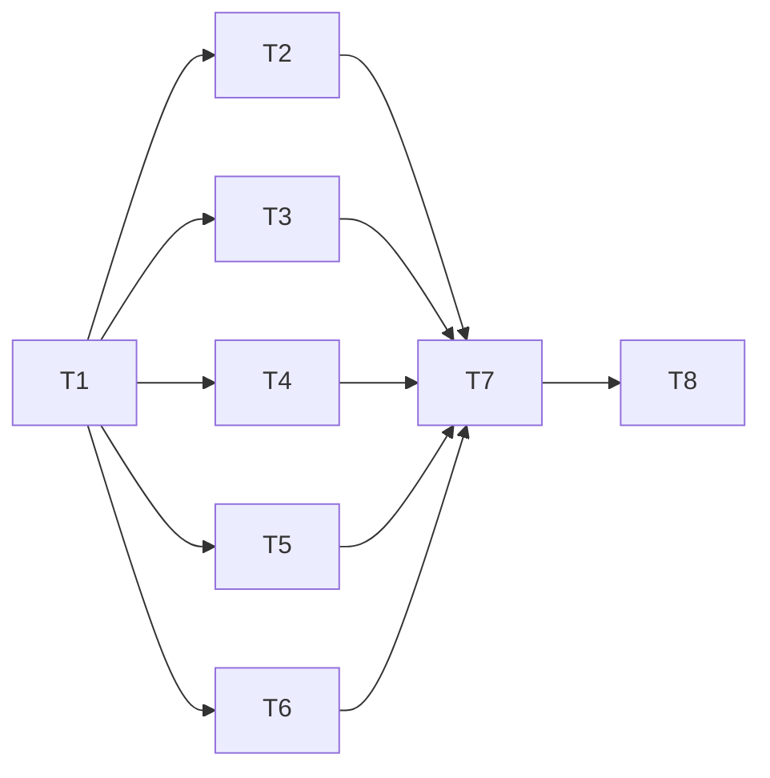

# Persistent Controller Read-Loop Implementation Plan

> **Local sources:** `.briefs/` paths below identify excluded working
> briefs, not published repository pages. They remain historical
> references; no decisions or recorded results are changed.

> **For agentic workers:** REQUIRED SUB-SKILL: Use superpowers:executing-plans to implement your assigned track task-by-task. The orchestrator schedules parallel tracks and independent reviews; no internal subagents/reviewer rounds.

**Goal:** Remove SSH execution sessions from repeated wait/log/event/notify reads, preserving per-request child isolation and all existing stdio mutation behavior.

**Architecture:** Leader-owned private Unix listener, generation-specific hard link to its loaded executable, existing host controller-rpc child per eligible frame. Foreground read loops bootstrap identity/pin on authenticated stdio, resolve one concrete existing master, add an exclusive config-free Unix forward, and reuse a sequential session. Loss permits one same-read stdio fallback within the existing budget. Everything outside the frozen read-loop allowlist stays raw stdio.

**Tech stack:** Rust 2024; existing serde/serde_json, UUID parsing/string wrappers, SHA-256, libc, rooted_fs, ProcessRunner and Tokio. No dependency/uuid-feature/TOML/daemon/UI change.

**Spec:** [2026-10-01-controller-socket-design.md](../specs/2026-10-01-controller-socket-design.md). Read rules (`.briefs/p3-rules.md`), D1–D10 (`.briefs/p3-spec-round2.md`), E1–E5 (`.briefs/p3-spec-round3.md`), survey section 3 (`.briefs/p3-survey-report.md`), review (`.briefs/p3-review-report.md`), coverage (`.briefs/p3-coverage-report.md`) and re-review F1–F4 (`.briefs/p3-review2-report.md`). D1–D10 and E1–E5 are settled; this plan applies them. Baseline `0802421541679443e7d1982988a8c6482e5fdbe9`, re-anchor at the final accepted events head before T1 on integ/p3.

## Global constraints

- Protocol 7, additive channel version 1, unchanged strict old DTOs and stdio EOF. No channel mutation, setter, transfer, one-shot-read, doctor or general-health optimization. No mutation classifier/error/envelope changes.
- Freeze scope plus request grammar in T1. Wait: task.wait.poll. Logs follow: task.logs and loop-local health. Events follow/notify: task.list controller_events read/tasks/repair and loop-local health. --wait creates its adapter only after raw mutation/transfer work.
- One existing RPC child per admitted read. Private generation-specific image link must match independently established loaded-image dev/ino before advertising. RPCs spawn from link; every socket RPC receives the captured canonical installed path for detached RunnerExecutor launches. Runners and later handoffs use the installed path across replacement. Withdraw the link only after that generation's socket RPC children have exited; no cancellation/wait of detached groups. Unverifiable image disables optional service.
- Controller rpc directory 0700, socket/data files 0600; executable mode preserved in private directory, never chmod hard link. Stable pin <=4 KiB, service/hello/ready <=8 KiB. Journal UUID is an optional string hint, not availability/authentication authority. UUIDs use validated explicit string serde, no Cargo change.
- 16 sessions / 8 child supervisor slots / one in flight. Up to 32 child-related native threads (8 supervisors + 16 captures + 8 stdin), plus one native control job/thread. Try-only bounds; no unbounded queues/blocking pool/Tokio spawn_blocking. Retained unknown cleanup includes its I/O threads in that budget.
- All blocking channel metadata/image/bind/publication/withdrawal/cleanup is native control or supervisor work. Nonblocking Tokio listener/session operations only on the current-thread signal runtime. Runtime sees bounded shared-state/oneshot results, never synchronous filesystem probes.
- 1..1 MiB frame payload including reply wrapper; 8 KiB scratch/one retained frame. 5 s handshake/partial/setup/cleanup, 60 s idle, 30 s app. Skip cold setup with <=5 s remaining; every app/fallback consumes the original per-call deadline. Preserve 15 s client/20 s server poll caps, wait 100 ms and existing outage/repair policies.
- Borrowed should_stop is live through all synchronous client stages, without Send/Sync/'static requirements. Server cancellation context is owned. No fallback after cancellation/expiry. Close cancellation does not mean task.cancel or rollback.
- Cleanup Completed releases permits even after cancellation/error. Unknown/abandoned/panic retains them for the leader lifetime; eight unknown slots retire only the channel. Never infer completion from time elapsed. One common before-unpoll finalization awaits stream closure and actual child-group cancellation on every runtime exit (signal, tick error, diagnostic-write error, diagnostic-channel closure), preserves the original result, then retains tick join/leader guard ordering.
- Master resolution uses bounded ssh -G with original worker config/options; authenticated bootstrap uses original -F/trust plus the captured literal -S. Only config-free -F /dev/null -O check/forward/cancel uses that literal endpoint and one owned -L. Explicit master mask 0177/unlink=no, BatchMode/no agent/forward failure/keepalives retained. No private-umask runner hook/pre-exec policy, master exit, dedicated -N or implicit multiplex enablement.
- Validate private paths, owners/modes/type/dev/ino; socket paths UTF-8/absolute, byte length <104, no NUL/control/colon/%/$ and enough creation-suffix room for new masters. The default cold managed kirchik path is 94+17=111 bytes and declines channel setup; control-directory shortening is deferred. No /tmp shortening or manual %C expansion.
- Cancel closes the session first; cleanup_if_refused requires a settled producer plus ECONNREFUSED and exact bindings. Exit 0 alone is insufficient. Interrupted/unacknowledged open without a terminal result always returns Retained, never refusal cleanup as proof. Unknown open/cancel cleanup preserves residue and permanently retires setup for that foreground command: at most one uncertain allocation, regardless of backoff advances.
- Stable pin is schema/route/client/account only. Existing client-id is PathLayout.state/client-id; identity reader must not load_or_create_client_id. Notify cache retains its existing independent key and lock. Operator identity/repin always raw stdio.
- Per eligible exchange <=1 channel application attempt +1 immediate same-read stdio fallback; no adapter retry loop. Any remaining same-exchange retries are raw stdio. Subsequent read calls can reconnect at 1/2/4/5 s eligibility without sleeping. Count setup/control separately.
- Existing mutation four-attempt ~1/3/9 s jittered retry can expire inside launchd's 30 s ThrottleInterval. D1 leaves it unchanged on stdio; no claim that this transport fixes outcome-unknown.
- Tests: consolidated area targets only, nextest with NEXTEST_TEST_THREADS=6 CARGO_BUILD_JOBS=4, selected count >0. Inject clocks/channels/hooks; no sleeps or speed bounds; hang guards >=30 s. Never whole suite or real pool/SSH/setup/launchctl/credentials/Herdr/notifications; do not delete target or modify other worktrees/push/merge/rebase.
- Each behavior: red test → exact filtered red run → implementation → same green run → buildable conventional commit. End each track with cargo fmt --all and CARGO_BUILD_JOBS=4 cargo clippy --locked --all-targets -- -D warnings. Frozen-contract defect: stop/report CONTRACT ISSUE: <track>; orchestrator serial correction.

## Ownership and dependency order

| Task | Size | Depends on | Exclusive files |
| --- | --- | --- | --- |
| T1 interface gate | L | Final accepted baseline | Create src/controller/channel.rs, channel/contracts.rs, channel/testing.rs and empty facade channel/{codec,server,files,image,identity,pin,forward,client}.rs; src/controller/mod.rs; health_read.rs visibility only; src/process.rs cleanup companion/delegation seam only; seed/declare tests/controller/main.rs, tests/transfer/main.rs, tests/cli/main.rs and modules listed below |
| T2 codec / client I/O | M | T1 only | src/controller/channel/codec.rs, new codec/io.rs; tests/controller/controller_socket_codec.rs |
| T3 server / native jobs / child | L | T1 only | src/controller/channel/server.rs, new server/{child,control}.rs; tests/controller/controller_socket_service.rs |
| T4 files / image / identity / pin | L | T1 only | src/controller/channel/{files,image,identity,pin}.rs; minimal src/rooted_fs.rs link/socket/evidence helpers; tests/controller/controller_socket_identity.rs |
| T5 concrete master / forward | L | T1 only | src/controller/channel/forward.rs; src/transport.rs; tests/transfer/controller_socket_forward.rs |
| T6 read-loop client policy | M | T1 only | src/controller/channel/client.rs; tests/controller/controller_socket_client.rs |
| T7 serial integration / observations | L | T2–T6 accepted | src/lib.rs (including run_host_controller_rpc in T7a), src/turn_runner.rs (T7a detached executable input), src/cli.rs, src/features.rs, src/controller/{runtime,lifecycle,health_read,execute}.rs, src/controller/events/{foreground,tail,client}.rs, events/notify/follow.rs; tests/controller/{controller_socket_wiring,controller_socket_benchmark,controller_features,controller_health_routes}.rs; tests/cli/{controller_channel,cli_help}.rs; predecessor files only by exclusive post-track lease |
| T8 docs / acceptance | M | T7 accepted | docs/usage.md, docs/testing.md, docs/superpowers/validation/2026-10-01-controller-socket.md; spec/plan only for accepted corrections |

T1 seeds tests/controller/controller_socket_{contracts,codec,service,identity,client,wiring,benchmark}.rs; tests/transfer/controller_socket_forward.rs; tests/cli/controller_channel.rs. These are modules of consolidated controller/transfer/cli targets, not Cargo targets (`docs/testing.md:6`, `tests/controller/main.rs:15`). No tests/support, Cargo, CI, dashboard or generated-asset edits.



Five independent parallel tracks remain after D1 shrinks T6. T6 owns policy against fakes; only T7 owns loop routing. T5 grows to endpoint/evidence work but owns no T4 implementation. T1 gate files/module/test roots freeze; facade/test ownership transfers to its named track. No sibling concrete implementation is a wave dependency. T7/T8 obtain exclusive predecessor leases only after acceptance, recording/releasing them.

## T1 — corrected committed interface gate

**Files:** T1 row above. No src/error.rs, mutation classifier or private-spawn policy. No production channel call/advertising.

**Grounding:** runner methods/delegation/capture cleanup `src/process.rs:64`, `src/process.rs:86`, `src/process.rs:401`, `src/process.rs:437`, `src/process.rs:457`; envelope/read dispatch `src/controller/execute.rs:568`; leader liveness `src/controller/health_read.rs:175`; ID string serde pattern `src/job.rs:40`; ClientId existing reader `src/controller/events/task_reads.rs:851`; uuid features `Cargo.toml:27`.

**Frozen types/constants (contracts.rs):**

```rust
pub const CHANNEL_VERSION: u32 = 1;
pub const MAX_SESSIONS: usize = 16;
pub const MAX_SUPERVISORS: usize = 8;
pub const IDENTITY_BYTES: usize = 8 * 1024;
pub const PIN_BYTES: usize = 4 * 1024;
pub const READ_SCRATCH_BYTES: usize = 8 * 1024;
pub const SETUP_GUARD: Duration = Duration::from_secs(5);
pub const IDLE_GUARD: Duration = Duration::from_secs(60);
pub const REQUEST_GUARD: Duration = Duration::from_secs(30);
pub const DETACHED_RUNNER_EXECUTABLE_ENV: &str = "MAC_WORKER_DETACHED_RUNNER_EXECUTABLE";

pub enum ReadLoopScope { Wait, LogsFollow, EventsFollow, Notify }
pub struct ConfiguredRoute {
    pub ssh: String, pub remote_binary: String,
    pub ssh_config_file: Option<PathBuf>,
}
pub struct RouteDigest(String);
pub struct UuidString(String);
pub struct ControllerAccount { pub uid: u32, pub username: String, pub home: PathBuf }
pub struct ServiceIdentity {
    pub protocol_version: u32, pub channel_version: u32,
    pub controller_client_id: ClientId, pub account: ControllerAccount,
    pub leader: ProcessIdentity, pub service_generation: UuidString,
    pub socket_path: PathBuf, pub features: Vec<String>,
    pub journal_id: Option<UuidString>,
}
pub struct SocketIdentity { pub route_sha256: RouteDigest, pub service: ServiceIdentity }
pub struct Pin {
    pub schema_version: u32, pub route_sha256: RouteDigest,
    pub controller_client_id: ClientId, pub account: ControllerAccount,
}
pub struct EntryIdentity {
    pub device: u64, pub inode: u64, pub owner: u32, pub kind: u32, pub mode: u32,
}
pub struct SocketBinding { pub parent: EntryIdentity, pub socket: EntryIdentity }
pub struct RunningImage { pub path: PathBuf, pub device: u64, pub inode: u64 }
pub struct PinnedExecutable { pub path: PathBuf, pub binding: EntryIdentity }
pub struct ChildRpcSpec {
    pub executable: PinnedExecutable,
    pub detached_runner_executable: PathBuf,
    pub config: PathBuf, pub environment: Vec<(OsString, OsString)>,
}
pub struct ServiceRecord {
    pub schema_version: u32, pub service: ServiceIdentity,
    pub binding: SocketBinding, pub executable: PinnedExecutable,
}
pub struct ForwardPath {
    pub directory: PathBuf, pub directory_identity: EntryIdentity,
    pub socket_path: PathBuf,
}
pub struct MasterPlan {
    pub control_path: PathBuf, pub parent: EntryIdentity,
    pub bootstrap_request: ProcessRequest,
}
pub enum SocketIdentityResult { Available(SocketIdentity), Unavailable(ChannelReason) }
pub enum ChannelFailure { Unavailable(ChannelReason), UnverifiedReply }
pub enum ChannelReason {
    Unsupported, ServiceUnavailable, PinMismatch, UnsafePath,
    ForwardLost, Busy, InvalidFrame, Timeout, Cancelled,
}
pub enum ForwardDisposition { Cleaned, Retained }
// Retained whenever an open has no demonstrable terminal result.
pub struct ForwardOpenFailure {
    pub failure: ChannelFailure, pub disposition: ForwardDisposition,
}
pub trait ChannelRuntime: Send + Sync {
    fn now(&self) -> Duration;
    fn cancelled(&self) -> bool;
}
pub struct ClientContext<'a> {
    pub runtime: &'a dyn ChannelRuntime,
    pub deadline: Duration,
    pub should_stop: &'a dyn Fn() -> bool,
}
pub struct CleanupContext {
    pub runtime: Arc<dyn ChannelRuntime>, pub deadline: Duration,
}
pub struct ServerContext {
    pub runtime: Arc<dyn ChannelRuntime>, pub deadline: Duration,
    pub cancelled: Arc<AtomicBool>,
}
pub struct DecodeProgress { pub consumed: usize, pub payload: Option<Vec<u8>> }
pub trait FrameDecoder: Send {
    fn feed(&mut self, input: &[u8]) -> Result<DecodeProgress, ChannelFailure>;
    fn retained_bytes(&self) -> usize;
}
pub trait ChannelCodec: Send + Sync {
    fn decoder(&self) -> Box<dyn FrameDecoder>;
    fn encode_hello(&self, expected: &SocketIdentity) -> Result<Vec<u8>, ChannelFailure>;
    fn decode_hello(&self, payload: &[u8]) -> Result<SocketIdentity, ChannelFailure>;
    fn encode_ready(&self, identity: &SocketIdentity) -> Result<Vec<u8>, ChannelFailure>;
    fn decode_ready(&self, payload: &[u8], expected: &SocketIdentity) -> Result<(), ChannelFailure>;
    fn encode_reply(&self, request: &ControllerRequest, result: &ProcessResult) -> Result<Vec<u8>, ChannelFailure>;
    fn decode_reply(&self, payload: &[u8], request: &ControllerRequest) -> Result<ProcessResult, ChannelFailure>;
}
pub trait ChannelExecutor: Send + Sync {
    fn run(&self, frame: &[u8], ctx: &ServerContext) -> ProcessCompletion;
}
pub trait RunningImageSource: Send + Sync {
    fn capture(&self) -> Result<RunningImage, ChannelFailure>;
}
pub trait IdentitySource: Send + Sync {
    fn read(&self, raw: &dyn ProcessRunner, route: &ConfiguredRoute,
        master: Option<&MasterPlan>, ctx: &ClientContext<'_>) -> Result<SocketIdentity, ChannelFailure>;
}
pub trait PinStore: Send + Sync {
    fn verify_or_create(&self, paths: &PathLayout, identity: &SocketIdentity) -> Result<(), ChannelFailure>;
    fn repin(&self, paths: &PathLayout, identity: &SocketIdentity, expected: ClientId) -> Result<(), ChannelFailure>;
}
pub trait ForwardPaths: Send + Sync {
    fn allocate(&self, paths: &PathLayout) -> Result<ForwardPath, ChannelFailure>;
    fn validate_socket(&self, path: &ForwardPath) -> Result<EntryIdentity, ChannelFailure>;
    // Precondition: creation has settled; its producer cannot still create/listen.
    fn cleanup_if_refused(&self, path: &ForwardPath, socket: Option<EntryIdentity>,
        ctx: &CleanupContext) -> ForwardDisposition;
}
pub trait ForwardLease: Send {
    fn local_socket(&self) -> &Path;
    fn verify(&self) -> Result<(), ChannelFailure>;
    fn cancel(&mut self, raw: &dyn ProcessRunner, ctx: &CleanupContext) -> ForwardDisposition;
}
pub trait ForwardControl: Send + Sync {
    fn resolve(&self, raw: &dyn ProcessRunner, route: &ConfiguredRoute,
        ctx: &ClientContext<'_>) -> Result<MasterPlan, ChannelFailure>;
    fn open(&self, raw: &dyn ProcessRunner, master: &MasterPlan, identity: &SocketIdentity,
        ctx: &ClientContext<'_>) -> Result<Box<dyn ForwardLease>, ForwardOpenFailure>;
}
pub trait SocketSession: Send {
    fn exchange(&mut self, frame: &[u8], request: &ControllerRequest,
        ctx: &ClientContext<'_>) -> Result<ProcessResult, ChannelFailure>;
    fn close(&mut self);
}
pub trait SocketConnector: Send + Sync {
    fn connect(&self, local: &Path, identity: &SocketIdentity,
        ctx: &ClientContext<'_>) -> Result<Box<dyn SocketSession>, ChannelFailure>;
}
pub struct ClientDeps {
    pub identity: Arc<dyn IdentitySource>, pub pins: Arc<dyn PinStore>,
    pub forwards: Arc<dyn ForwardControl>, pub connector: Arc<dyn SocketConnector>,
    pub runtime: Arc<dyn ChannelRuntime>,
}
```

Define `ConfiguredRoute::new(&ControllerConfig,&SshConfig)`/digest(), `UuidString::{new_v4,parse,as_str}`, `Pin::from_identity`, `eligible_read(scope,request)`, `server_eligible_read(request)`, `verify_expected_service(expected,actual)` excluding journal hints, and remaining/check methods on both contexts. Client check invokes should_stop every time as well as runtime/deadline. Cleanup context uses clock-only 5 s budget and cannot be used for application setup/read. Feature cap 64 entries/64 bytes, sorted unique; account/home bounded UTF-8/no controls and absolute home; pin schema strict. Canonical UUID string parsing rejects nil/non-v4/noncanonical text, journal equals service when present, duplicates and caps. Explicit Serialize/Deserialize wrappers, never deriving serde on bare Uuid or adding uuid features. Clone/Debug/Eq only where contained types permit.

**E1 launch/lifetime contract:** RunningImage.path is the canonical absolute installed executable path captured at generation startup and verified against loaded-image/link identity. ChildRpcSpec.executable is the private RPC link; detached_runner_executable is that captured installed path. T3 sets DETACHED_RUNNER_EXECUTABLE_ENV from the field on every RPC child, overriding inherited values; no socket request chooses either executable. T7a consumes the input in run_host_controller_rpc and injects a configured DetachedRunnerExecutor at the existing RunnerExecutor seam. Present input replaces current_exe for detached spawn; absent input preserves stdio RPC/CLI/leader behavior. Detached runners and handoffs execute the installed path, including its later replacement. Freeze T4 LeaderSocketLease::withdraw semantics here: stop admission and prove all generation socket RPC children exited before unlinking its exact-bound link; retain it on unknown exit proof. Detached groups impose no withdrawal dependency and are never cancelled to release the link.

**E2 forward-failure contract:** ForwardOpenFailure.disposition = Retained for any interrupted/unacknowledged open without a demonstrable terminal result, even if bindings are unchanged and connect refuses. Never call cleanup_if_refused to prove such creation settled; best-effort cancellation alone does not supply terminal creation evidence. Cleaned means no owned allocation remains, established by no producer/allocation or settled creation plus positive exact cleanup. For established/settled forwards, cleanup_if_refused may prove refusal and bindings after stream closure/cancel; its caller must establish the settled-producer precondition. No new trait method. Retained permanently disables subsequent setup for that foreground command.

**Cleanup seam (src/process.rs, frozen):**

```rust
pub enum CleanupState { Completed, Unknown }
pub struct ProcessCompletion {
    pub outcome: Result<ProcessResult, WorkerError>, pub cleanup: CleanupState,
}
pub trait TrackedProcessRunner: ProcessRunner {
    fn run_interruptible_with_cleanup(&self, request: &ProcessRequest,
        should_stop: &dyn Fn() -> bool) -> ProcessCompletion;
}
```

SystemProcessRunner shares one internal spawn/capture implementation for existing methods and the companion trait; existing methods return outcome unchanged. No fourth private-umask ProcessRunner method. Completed requires reap/owned-group-gone and joined stdin/captures, or proven no child; unknown detach/cleanup failure/panic never becomes Completed. Preserve original error/status/code/redaction. Extend three-method delegation for &T and add Arc<T> delegation; tracked wrappers delegate the companion only where T implements it. Fakes explicitly supply cleanup evidence, with no unsafe default proof.

**Fakes (testing.rs):** concrete constructors frozen: identity_fixture(), request_fixture(command,body), result_fixture(request,result,exit_code); ManualRuntime::{default,advance,cancel}; RecordingRunner::{new(Vec<Result<ProcessResult,WorkerError>>),calls}; RecordingTrackedRunner::{new(Vec<ProcessCompletion>),calls}; ScriptedImageSource::new(Vec<Result<RunningImage,ChannelFailure>>); ScriptedIdentitySource::new(Vec<Result<SocketIdentity,ChannelFailure>>); MemoryPinStore::{default,pin}; FakeForwardControl::{new(PathBuf),opens,cancels,resolutions,set_disposition(ForwardDisposition),fail_next(ForwardOpenFailure)}; ScriptedConnector::{new(Vec<Result<ProcessResult,ChannelFailure>>),frames,connections}; RecordingExecutor::{new(Vec<ProcessCompletion>),frames}; FakeForwardPaths and StubCodec. All receive/poll the frozen context; fake identity/forward work consumes no raw application replies. Byte grammar is proved only with real codec tests. Test modules define their own local layout/config/gate fixtures; no unspecified tests/support APIs.

- [ ] Red contract tests: every route field changes digest; scope/body allowlist includes four loop families and excludes every D1 raw family, even identical logs bytes outside follow; mixed selectors invalid. Expected service rejects changed required fields but accepts absent/changed journal; malformed UUID string/size/schema rejects. ClientContext polls a borrowed non-Send/non-Sync predicate after entry without command-runtime cancellation. Fixtures carry distinct RPC-link/installed-runner paths and the exact launch env name; uncertain ForwardOpenFailure is Retained, with refusal cleanup allowed only for settled producers. Run `NEXTEST_TEST_THREADS=6 CARGO_BUILD_JOBS=4 cargo nextest run --locked --test controller -E 'test(/^controller_socket_contracts::/)'`, count >0.
- [ ] Implement contracts/fakes, empty facade/test declarations and meaningful gate seeds. Expose observe_leader as pub(crate) only. No concrete sibling imports, todo/panic production stubs or advertising.
- [ ] Red runner cleanup tests before refactor: success, nonzero exit, no-child spawn failure, fully cleaned timeout/cancel, stdin error, abandoned capture/kill-budget uncertainty; outcome identical for old callers. Fake/wrapper delegation preserves should_stop. Run `NEXTEST_TEST_THREADS=6 CARGO_BUILD_JOBS=4 cargo nextest run --locked --lib -E 'test(/^process::tests::/)'` red; implement tracked seam; same green. Do not change session policies/umask.
- [ ] Green contracts and all seeded modules: controller `/^controller_socket_/`, transfer `/^controller_socket_forward::/`, cli `/^controller_channel::/`; each exact filter selects nonzero. Check frozen serialization fixtures and cleanup ownership; fmt/clippy. Commit `feat(controller): freeze read channel contracts and cleanup evidence` and publish gate hash. No process.rs edit mid-wave.

**Acceptance:** D1 eligibility, D4/E2 settled cleanup and Retained-open disposition, D6 predicate, D7 evidence and E1 ChildRpcSpec/installed-path env/withdrawal contract are compile-ready; optional journal/string UUID and three-method runner compatibility tested. Every parallel consumer can build against sibling fakes.

## T2 — bounded codec and synchronous client session I/O

**Files:** codec.rs, codec/io.rs, tests/controller/controller_socket_codec.rs. **Produces:** `SessionCodec::new()` implementing ChannelCodec; `BoundedFrameDecoder`; `FramedSocketConnector::new(Arc<dyn ChannelCodec>)` implementing SocketConnector. **Consumes:** frozen contexts/identities/decoder/limits. No protocol.rs/Cargo edit.

**Grounding:** strict EOF/bounds/duplicates `src/controller/protocol.rs:62`, `src/controller/protocol.rs:90`, `src/controller/protocol.rs:199`, `src/controller/protocol.rs:211`; status interpretation `src/controller/execute.rs:872`.

- [ ] Red prefix/payload splits, coalesced frames consumed count, EOF partial, zero/oversize/u32 max before allocation, retained bytes, nested duplicate keys, strict hello/tolerant ready, UUID string errors and null/missing journal accepted. Run `NEXTEST_TEST_THREADS=6 CARGO_BUILD_JOBS=4 cargo nextest run --locked --test controller -E 'test(/^controller_socket_codec::/)'` red/nonzero; implement one-frame decoder without tail queue; same green.
- [ ] Red wrapper status 0/69/75, exact outer ID/digest, unchanged inner read/error JSON, wrong common inner version/command/ID/digest, signalled/invalid output, whole cap including wrapper and maximum-size inner requiring intact fallback. Decode uses ControllerReadReply<Value>::verify_envelope for non-error payloads before returning ProcessResult; typed payload checks stay downstream. Preserve status/framed inner JSON; no mutation classifier. Implement, same filter green.
- [ ] Red UnixStream fixture hello-before-RPC, changed stable/service/route identity, optional journal changes, partial read/write, EOF/cancel/deadline. Borrow independent should_stop through connect/write/read with a predicate capturing Rc plus an externally toggled flag; command runtime stays uncancelled. Use readiness channels/hooks, >=30 s hang guards. Implement nonblocking readiness/poll client I/O with live ClientContext, no predicate moved into 'static worker. No application frame on failed hello.
- [ ] Rerun filter, fmt/clippy, commit `feat(controller): frame sequential read channel sessions`.

**Acceptance:** real grammar/I/O bounds, required identity checks, optional journal and independent cancellation pass; old EOF stays strict; exit/status payload survives.

## T3 — nonblocking listener, bounded native control and tracked child

**Files:** server.rs, server/child.rs, server/control.rs, tests/controller/controller_socket_service.rs. No runtime.rs/lib.rs/process.rs during wave.

**Consumes:** T1 ChannelCodec/ChannelExecutor/RunningImageSource/ChildRpcSpec, owned ServerContext, ProcessCompletion and tracked runner; prebound nonblocking std UnixListener and ServiceIdentity. Test with StubCodec/RecordingExecutor/source gates. **Produces:** `NativeControl::new()` with `try_run<T:Send+'static>(Box<dyn FnOnce()->T+Send>) -> Result<tokio::sync::oneshot::Receiver<T>,ChannelFailure>`, at most one native job/no queued replacement; `ServerDeps { codec:Arc<dyn ChannelCodec>, executor:Arc<dyn ChannelExecutor>, runtime:Arc<dyn ChannelRuntime> }`; `SocketService::start(listener:std::os::unix::net::UnixListener,service:ServiceIdentity,deps:ServerDeps,shutdown:Arc<AtomicBool>) -> Result<SocketService,WorkerError>` called inside the already-entered runtime; `ready(&self) -> bool`; `async wait_ready(&self) -> Result<(),WorkerError>` backed by an explicit readiness notification; `async shutdown(&self,ctx:&ServerContext) -> ShutdownEvidence`, where evidence contains completed/unknown usize counts. Caller awaits readiness before submitting publication; neither a bound pathname nor start returning implies readiness. `ChildRpcExecutor::new(Arc<dyn TrackedProcessRunner>,ChildRpcSpec)` implementing ChannelExecutor passes the frozen installed-runner launch input while spawning the RPC from the pinned link. Caller owns blocking filesystem/image work via NativeControl, and publication after readiness.

**Grounding:** child entry/exit `src/lib.rs:1755`, `src/lib.rs:1778`; current-thread signals/tick `src/lib.rs:1678`, `src/controller/runtime.rs:81`, `src/controller/runtime.rs:95`; capture/group cleanup `src/process.rs:401`, `src/process.rs:457`; survey ten-item audit/spec Decisions 2–3.

- [ ] Red tests for hello/peer uid, no app before ready, 16 sessions including incomplete handshakes, 8 permits including unknown cleanup, disallowed command/body before spawn, independent progress during long-poll, malformed/empty/oversize child reply, supervisor panic containment. Run `NEXTEST_TEST_THREADS=6 CARGO_BUILD_JOBS=4 cargo nextest run --locked --test controller -E 'test(/^controller_socket_service::/)'` red/nonzero.
- [ ] Implement Tokio nonblocking listener/session state machine and try-only bounds. Native child threads hold permits and report completion through oneshot; no spawn_blocking/unbounded join. NativeControl accepts one job; a gated RunningImageSource/stat/write job cannot block runtime signal or control-task progress. Test native metadata entry barrier plus signal/another runtime task. Runtime only sees shared status, not a direct image/stat call.
- [ ] Red completion-handoff test: hold final reply write, prove early next bytes are rejected; release completion, send next request immediately, and prove simultaneous read/write readiness handles final write completion before next-request inspection. Implement explicit reply-completed state transition. No read-ahead queue.
- [ ] Red fixed child argv/roots/EOF/caps/deadline, recorded pinned RPC executable and distinct captured installed-runner path. Set MAC_WORKER_DETACHED_RUNNER_EXECUTABLE explicitly on every child from ChildRpcSpec, overriding any inherited value; config/HOME/XDG remain captured and requests cannot select executables. Constructor refuses arbitrary argv/env. Child uses tracked runner/ServerContext cancellation; no installed-path check per request. Use completed versus unknown fake results, then more than 8 real fully cleaned cancellations retain availability and 8 deliberate abandoned cleanups retire it. Retain unknown permit on panic; normal nonzero child with joined cleanup may release it.
- [ ] Red actual child-group cancellation: a fixture child plus group descendant report entry; close stream/cancel/deadline/shutdown; prove group gone/reap plus capture completion, and detached task group survives. A flag assertion alone is insufficient. Test bounded Unknown outcome for gated cleanup; never replenish. Runtime shutdown closes listener/streams and drives native cancellation before its future finishes; no synchronous record withdrawal/runtime joins. Caller handles exact native cleanup.
- [ ] Green same filter, fmt/clippy; commit `feat(controller): supervise pinned read RPC children`.

**Acceptance:** ten process assumptions preserved in children, runtime remains signal-responsive during gated blocking control work, real group cancellation and cleanup evidence govern permits, correct sequential handoff, no synchronous filesystem admission.

## T4 — rooted image link, service identity, stable pin and refusal cleanup

**Files:** files/image/identity/pin.rs; minimal rooted_fs.rs; tests/controller/controller_socket_identity.rs. No sibling server or transport concrete dependency.

**Consumes:** RunningImageSource/RunningImage/PinnedExecutable, records/bindings, identity/pin/ForwardPaths/context traits, exposed observe_leader. **Produces:** `SystemRunningImageSource::new()` implementing RunningImageSource with canonical installed path; `PrivateChannelFiles::new()` implementing ForwardPaths; `bind_leader(paths:&PathLayout,leader:&ControllerLeader,image:&RunningImage,generation:&UuidString) -> Result<LeaderSocketLease,WorkerError>`; lease methods take_listener(), binding(), executable(), publish(&ServiceIdentity), withdraw(). Withdrawal obeys T1/E1: link unlink requires exact binding and all generation socket RPC children exited; unavailable exit proof retains the link, and detached groups are never awaited/cancelled for it. All are blocking and called only on T3 native control jobs. `read_live_service(paths,home,codec,ctx:&ClientContext) -> Result<Option<ServiceIdentity>,WorkerError>` for stdio child readers, no new store/journal. `is_socket_selector(request)`, `serve_identity_selector(request,paths,home,codec,ctx) -> Result<Vec<u8>,WorkerError>`. `StdioIdentitySource::new()` implements IdentitySource; Some(MasterPlan) uses its validated original-config bootstrap request, None uses ordinary raw request. `PrivatePinStore::new()` implements PinStore.

**Grounding:** existing client-id location/read `src/client_state.rs:70`, `src/controller/events/task_reads.rs:851`; account/liveness `src/controller/init.rs:654`, `src/controller/health_read.rs:175`; unsafe pathname-only image stat `src/binary_identity.rs:31`; rooted read/create/replace `src/rooted_fs.rs:1383`, `src/rooted_fs.rs:2216`, `src/rooted_fs.rs:1831`. Loaded-image API and hard-link rules are spec Decision 2.

- [ ] Red loaded-image vs current_exe/installed dev/ino agreement, unsupported/unverifiable source, source/link swap hook and EXDEV. Implement macOS mapped main-header vnode lookup plus strict result/region validation, and rooted no-replace link/evidence. Original file must be owned regular executable without unsafe write modes; preserve mode, never chmod link. Name includes full generation UUID to prevent path reuse. Run `NEXTEST_TEST_THREADS=6 CARGO_BUILD_JOBS=4 cargo nextest run --locked --test controller -E 'test(/^controller_socket_identity::/)'` red/nonzero, then green.
- [ ] Red executable replacement/rollback barrier between leader link creation and spawn: temp executables output old/new markers; spawning pinned link still executes old while RunningImage retains the verified canonical installed path for runner launches. Source replaced before linking must fail when it differs from the loaded image. Unknown identity means no publication and healthy raw service. Test exact link withdrawal after proven RPC exits, unknown exits retaining it, and prior-link cleanup requiring the same proof; detached-group lifetime does not gate withdrawal. No binary hash or installer-fence dependency.
- [ ] Red socket/record matrix: private owner/mode/type/dev/ino, wrong-owner/symlink/FIFO/file/live socket preserved, exact prior record + dead/reused identity + ECONNREFUSED before stale unlink; swapped parent/entry hooks preserve replacements. Missing creation evidence disables optional setup; missing socket/safely stale record can recover. Implement descriptor-relative unlink, before/after lineage for bind/connect, native-only publication/withdrawal. No broad deletion or cleanup journal.
- [ ] Red read-only selector grammar/mixed selectors, existing PathLayout.state/client-id, missing client-id does not create it, zero receipts/active rows, live listener proof, unavailable journal still available for wait/logs, optional journal/string validation. Implement existing-only identity with no load_or_create_client_id, ControllerStore or journal initializer; journal hint comes from service record/leader initialization. Borrowed should_stop interrupts raw bootstrap; Some master retains original -F/trust and literal -S.
- [ ] Red pin first/concurrent bootstrap, generation/journal restart stable, route/client/account mismatch, unsafe/corrupt/hardlink/oversize pin, exact expected-client repin with fresh raw identity. Implement private no-replace/exact replacement and preserve notify-cache digest/path/lock and envelopes. Tests inspect bytes/mode/inode, not API success alone.
- [ ] Red fresh forward allocation and cleanup-if-refused under its settled-producer precondition: active listener, exit-code-only/no proof, missing entry/timeout, swapped socket/parent all return Retained with residue intact; positive ECONNREFUSED plus exact bindings cleans only after producer settlement. Implement bounded local connect and exact unlink/rmdir; no implicit GC. T5 must not call this primitive for an unacknowledged/unsettled open and tests with FakeForwardPaths until integration.
- [ ] Green identity plus `NEXTEST_TEST_THREADS=6 CARGO_BUILD_JOBS=4 cargo nextest run --locked --lib -E 'test(/^rooted_fs::tests::.*channel_socket/)'` using new nonzero channel_socket_* tests; fmt/clippy; commit `feat(controller): pin service images and channel identity`.

**Acceptance:** exact loaded image is executable through link across rename, safe private startup/cleanup, read-only correct client-id source, optional journal, independent notify cache and proven refusal cleanup.

## T5 — expanded master endpoint and exclusive forward lifecycle

**Files:** forward.rs, transport.rs, tests/transfer/controller_socket_forward.rs. **Produces:** `MasterForwardControl::new(paths:PathLayout,files:Arc<dyn ForwardPaths>,ssh:SshConfig)` implementing resolve/open; private transport constructors for resolution/validated bootstrap and config-free check/forward/cancel from MasterPlan. Lease captures endpoint and complete -L cancel request once. **Consumes:** T1 MasterPlan/ForwardDisposition/ForwardOpenFailure and borrowed contexts; FakeForwardPaths for wave tests.

**Grounding:** original -F/options/master namespace `src/transport.rs:894`, `src/transport.rs:943`, `src/transport.rs:979`, `src/transport.rs:1001`; managed Host * fallback `src/controller/provision.rs:536`; ordinary forwarding clearing `src/transport.rs:938`; ssh program override safety `src/transport.rs:1194`. External expansion/control rationale is spec Decision 5.

- [ ] Red bounded ssh -G resolution with exactly original worker configuration and command-line master options; one concrete expanded controlpath, owner/private parent, socket mode/type/dev/ino after bootstrap, byte lengths/creation suffix, none/unexpanded/%/$/ambiguous output fail before allocation. Fake managed -F includes Host */ControlMaster no/ControlPath none: command-line options win; bootstrap captures literal -S and actual master is that socket, never none. Run `NEXTEST_TEST_THREADS=6 CARGO_BUILD_JOBS=4 cargo nextest run --locked --test transfer -E 'test(/^controller_socket_forward::/)'` red/nonzero; implement resolution/plan with no manual expansion or config parser; same green.
- [ ] Red E5 byte-length fixture constructs `/Users/kirchik/.cache/mac-worker/ssh-` + 16 hex bytes + `/` + 40 hex bytes: compute/assert 94 bytes; append the 17-byte OpenSSH cold-creation suffix and compute/assert 111 >=104. Cold route declines before bootstrap/allocation, with no shortening; separately an already-live safe 94-byte endpoint can qualify. This documents possible default cold managed-path unavailability, not a fix or conclusion about ordinary SSH multiplexing. Same T5 filter red/green.
- [ ] Red actual mux/config fixture, not argv alone: unrelated LocalForward/RemoteForward/DynamicForward, configuration changes between open/cancel, original -F/trust used on identity bootstrap, config-free -F /dev/null literal -S check/open/cancel. Assert exact control messages contain only owned -L (check none), unchanged endpoint after edits and unrelated forwards untouched. Constructors retain BatchMode/no agent/forward failure/keepalives, master mask 0177/unlink=no, ordinary ClearAllForwardings and no private-umask hook/-N/-O exit. Structured argv with spaces/quotes tested.
- [ ] Red open success/no endpoint, unsafe old-master socket, multiplex off, master expiry, control cancellation exit 0 with an error and listener still live. Close session before cancellation. Established/settled-forward cleanup requires actual refusal/binding proof via ForwardPaths; return Cleaned only on proof, otherwise Retained for caller retirement. Interrupted/unacknowledged open without a terminal result always returns ForwardOpenFailure.disposition = Retained and never calls cleanup_if_refused. No config reload or shared-master cleanup.
- [ ] Red E2 open/bind/listen barrier: master binds and is held before listen; interrupt the unacknowledged open, fail its cancellation, keep parent/socket bindings unchanged and make connect return ECONNREFUSED. Assert no refusal-cleanup call, no unlink/rmdir, preserved residue and Retained. T6 proves permanent command retirement for that failure against sibling fakes; T7c extends this T5 test under an exclusive lease to drive the real scoped client through many eligibility advances, with allocation/open counts fixed at one and residue preserved even after listen is released. Same T5 filter red/green; no new trait method or concrete sibling dependency during the wave.
- [ ] Borrow independent should_stop through -G/-O check/open; bootstrap is tested with T4 fake, no extra cancellation/signal installer. Cleanup uses bounded clock-only context and retains uncertainty on deadline. Same filter green plus `NEXTEST_TEST_THREADS=6 CARGO_BUILD_JOBS=4 cargo nextest run --locked --lib -E 'test(/^transport::tests::.*(multiplex|forward|managed|ssh_argv)/)'`; confirm nonzero; fmt/clippy. Commit `feat(transport): own forwards on a concrete existing master`.

**Acceptance:** original authenticated endpoint captured reliably; actual config-defined forward lists cannot leak into control calls; managed no/none overridden for bootstrap when byte-safe; exact default cold length declines; settled cancellation evidence and always-Retained unacknowledged opens explicit.

## T6 — scoped read selection, live cancellation and single fallback

**Files:** client.rs, tests/controller/controller_socket_client.rs. No execute/error/envelope/lifecycle or event-policy edits.

**Produces:** `ChannelProcessRunner<R:ProcessRunner>::new(raw:R,scope:ReadLoopScope,route:ConfiguredRoute,paths:PathLayout,deps:ClientDeps)` implementing existing three ProcessRunner methods; `close(&self) -> ForwardDisposition` idempotently closes session then reports cleanup disposition. R is borrowed &dyn ProcessRunner or owned Arc<dyn ProcessRunner>. run_interruptible constructs a borrowed ClientContext directly from should_stop; run uses a local false predicate. No predicate stored/moved into 'static state. **Consumes:** sibling fakes/T1 allowlist; raw arguments to resolve/bootstrap/control avoid recursion/lifetime boxing.

- [ ] Red exact configured controller-rpc/frame **and scope** interception; every D1 excluded family delegates byte-identically with zero resolution/pin/forward/socket calls. Same logs bytes outside follow remain raw. New-session/unrelated host/Git/dashboard delegates. Run `NEXTEST_TEST_THREADS=6 CARGO_BUILD_JOBS=4 cargo nextest run --locked --test controller -E 'test(/^controller_socket_client::/)'` red/nonzero.
- [ ] Red setup ordering: resolve concrete master → authenticated raw identity on plan → durable pin → forward → hello → eligible read. Fake siblings consume no raw app replies. Wrong stable/volatile identity, missing feature, unsafe pin, unavailable service use raw; optional journal does not block. Cold <=5 s skips all setup; remaining budget decreases through stages. Implement try-only lazy owner/session checkout; concurrent caller during poll uses raw without queue.
- [ ] Red loss after partial/full read and no reply, child timeout/EOF, wrapper overflow: exactly one byte-identical raw fallback with same ID/digest and remaining budget. Complete wrong identity means no fallback/new mutation guard; valid read/error remains original outcome. Assert app transmission <=2; eligibility advancing during this exchange cannot create another socket attempt. Existing outer read retry calls retain baseline semantics; no adapter retry loop.
- [ ] Red independent borrowed should_stop after fixture operation entry at resolve/bootstrap/open/connect/read/write, without runtime cancellation, including Rc-capturing predicate. Cancellation/expiry closes stream and does **not** send raw fallback. Implement polling through frozen context; default ProcessRunner interruptible behavior is insufficient. Cleanup-only clock context cannot admit application work.
- [ ] Red 1/2/4/5 s backoff with ManualRuntime/no sleeps, one setup owner, reset after verified read, and permanent retirement for unsafe/unsupported/unverified/Retained cleanup. Exit-0 cancel error returns Retained; advance many eligibility instants and assert allocations/opens remain one and residue remains. Include E2's interrupted/unacknowledged bind-before-listen failed-open disposition, no session reuse, exact close-before-cancel order.
- [ ] Green same filter, fmt/clippy; commit `feat(controller): select read loops with bounded stdio fallback`.

**Acceptance:** no cold one-shot/mutation interception; live borrowed cancellation and same-read <=2 bound; one uncertain allocation/command; no extra classifier or envelope state.

## T7 — serial integration in four buildable commits

**Files:** T7 ownership row. Predecessor fixes require exclusive accepted-track leases. **Consumes:** all accepted concrete implementations; no whole suite/deploy. Grounding: routing `src/lib.rs:940`, wait `src/controller/lifecycle.rs:164`, logs `src/lib.rs:6140`, selector `src/controller/execute.rs:579`, leader runtime `src/lib.rs:1678`, `src/controller/runtime.rs:95`, service proof `src/controller/service.rs:648`.

### T7a — leader, selector and feature lifecycle

**Exclusive wiring:** run_host_controller_rpc in src/lib.rs; src/turn_runner.rs's installed-executable input; RunnerExecutor injection into the existing TaskClient construction in src/controller/execute.rs. T3 only launches with the frozen input; T7a alone changes the RPC entry/runner behavior.

- [ ] Red actual isolated leader/process fixtures: lock before native startup; independently verified image → private link → listener readiness → native record publish. Journal missing/failing still serves wait/logs; event own epoch errors unchanged. Feature absent on unsafe bind/image/record, before ready and after stop. Selector uses PathLayout.state/client-id and leaves no new client/req/active receipt. Run `NEXTEST_TEST_THREADS=6 CARGO_BUILD_JOBS=4 cargo nextest run --locked --test controller -E 'test(/^controller_socket_wiring::.*(leader|selector|feature|shutdown|image|journal)/)'` red/nonzero.
- [ ] Register existing signals before launching bounded NativeControl startup jobs. Runtime polls their receivers/signals; startup journal hint is optional from the existing initialization result. Convert already-nonblocking listener inside runtime, create tracked pinned ChildRpcExecutor; advertise only after ready/native publish. Metadata/image/stat/write/withdraw never enters runtime callbacks. Define system ChannelRuntime and share owned shutdown, with separate channel-retired status.
- [ ] Red `image_rpc_runner_launch_input`: distinct private RPC link/installed executable; run_host_controller_rpc consumes MAC_WORKER_DETACHED_RUNNER_EXECUTABLE and injects DetachedRunnerExecutor at the existing RunnerExecutor seam (`src/turn_runner.rs:83`, `src/controller/execute.rs:616`). Honor present input instead of current_exe for spawn (`src/turn_runner.rs:185`); invalid present input fails before dispatch, never falls back to the generation link. No-input stdio RPC/CLI/leader behavior stays unchanged. Wire src/lib.rs/src/turn_runner.rs/src/controller/execute.rs; preserve existing public callers and obtain an exclusive predecessor export lease if needed. Same T7a wiring filter red/green; handoff-after-withdrawal regression is T7c.
- [ ] Add `run_tick_loop_with_shutdown` with one common async before-unpoll finalization: capture every loop result, await hook, return original result for signal, tick error, diagnostic-write error and diagnostic-channel closure (`src/controller/runtime.rs:86`, `src/controller/runtime.rs:88`, `src/controller/runtime.rs:90`). Preserve existing run_tick_loop wrapper/API and tick join/leader-guard order. Red named shutdown cases for each exit, using injected errors/channel closure and an actual live RPC child barrier. Assert stream closure and native child-group termination **before** runtime exits/join begins; the signal case also gates the tick. Include gated image/withdrawal job: signal/control task progresses and shutdown may return bounded Unknown, preserving residue and original result. Never rely on destructor to deliver cancel.
- [ ] Wire native exact file/link withdrawal only after generation socket RPC exits are proven, with no detached-group dependency; preserve link on unknown proof. Wire feature constant/dynamic live proof and task.list selector before durable dispatch. No mutation/strict DTO change. Green wiring filter plus existing service/health/drain regressions below, fmt/clippy; commit `feat(controller): serve pinned read channel generations`.

### T7b — scoped loop adapters and operator CLI

- [ ] Red named routing/count tests `controller_socket_wiring::loop_wait_mutation_separation`, `controller_socket_wiring::raw_exclusions_stay_stdio` and `controller_socket_wiring::route_loop_scopes_only`. Wait/run wait/submit-say-batch --wait/interrupt-settle use channel only for polls; transfers and mutations before wait are raw. task logs -f and its health discovery scoped; one-shot logs/status/list/diff/result, events without follow, doctor/general health, drain set/observe, reconcile/publish-retry, checkpoint and controller retry all raw with zero channel allocations. Events/notify bypass injected lib runner today: construct owned Arc adapter in foreground setup; ordinary wait/log uses borrowed adapter. Reuse ForegroundRuntime cancellation through `EventChannelRuntime(Arc<dyn EventRuntime>)`, no second signals. Run `NEXTEST_TEST_THREADS=6 CARGO_BUILD_JOBS=4 cargo nextest run --locked --test controller -E 'test(/^controller_socket_wiring::.*(loop|raw|route)/)'` red before wiring, then the exact same command green. List named results and require a nonzero executed count for each of wait/mutation separation, raw exclusions and loop routing; CLI/seed counts cannot substitute.
- [ ] Wire loop-local factories preserving public sends, WaitDeadlineRunner and borrowed should_stop. Leave logs polling/outage, event 200 ms pause, notify 15 s repair/30 s one-shot budget and own cache key/lock unchanged. Verify short waits and notify budget with injected clocks.
- [ ] Red CLI tests identity --json raw; repin requires canonical expected ClientId, refreshed stdio identity before exact replacement, no unsafe force/prompt/state/cache deletion. Wire ControllerCommand::Channel Identity/Repin to T4. `NEXTEST_TEST_THREADS=6 CARGO_BUILD_JOBS=4 cargo nextest run --locked --test cli -E 'test(/^controller_channel::|^cli_help::/)'` red/nonzero then green, plus the exact T7b wiring filter above and existing targeted read/logs/lifecycle/events/raw-exclusion regressions below at this first routing commit. fmt/clippy; commit `feat(controller): scope persistent reads to foreground loops`.

### T7c — compatibility, isolation and read recovery

- [ ] Red N-1/rollback through frozen baseline server/DTO fixtures in owned wiring module: old client strict read/log/wait/drain/ACK/service stdio unchanged; new selector to old task.list rejects with no receipts; installed binary rename between link and child spawn executes old generation, next leader executes replacement; unverifiable loaded identity has no feature. Restart refreshes service/leader, preserves stable pin; account/reinstall mismatch sends no socket reads. Missing/reset journal stays eligible for wait/logs; actual events reply drives cursor reset. No uuid feature changes.
- [ ] Red ten-assumption actual-child matrix: distinct RPC pids, cross-process state locks, no DeferredHints/WaitDeadline/config leakage, captured HOME/XDG with real per-child config loads, existing publisher exit grace, stdout never leader frames, one SIGINT/TERM registration, exact EOF, actual transient-group cancellation while detached runners survive. Real >8 fully cleaned cancellations remain available; eight deliberately Unknown cleanups retire without replacements. Reply-completion barrier protects immediate sequential requests.
- [ ] Red E1 actual handoff barrier: a socket task.wait.poll starts a replacement runner; hold that runner, stop/restart the leader, prove the generation's socket RPC children exited and its exact-bound link was withdrawn, then release the runner to finish and hand off to the next parked runner successfully. Repeat with installed-binary replacement while the first runner is gated; the handoff executes the replacement at the captured installed path. Assert both runner launches use the installed path and neither depends on the removed link. Do not cancel detached task groups. Name both tests with image/runner/handoff markers in the owned wiring module; run the existing T7c wiring filter red/green.
- [ ] Red read-loss/cancel matrix: before/partial/full send, handler in progress, partial reply, wrapper oversize, valid errors/capacity/cursor invalidity, wrong ID/turn/digest. At most one socket+one immediate raw transmission per eligible read, exact preserved frame, shared budget, no post-cancel fallback or artificial task cancellation. Reconnect/master loss uses concrete captured endpoint; exit-0 cancellation error with many eligibility advances makes no second allocation. Include actual config-defined forwards and edited config using accepted T5/T4 together.
- [ ] Under an exclusive lease on tests/transfer/controller_socket_forward.rs, extend T5's E2 open/bind/listen barrier with the accepted T6 scoped client: interrupt open, fail cancel, unchanged bindings/refusal, preserve residue, and advance many eligibility instants with allocation/open counts fixed at one and command permanently retired, including after releasing listen. No refusal-cleanup call on the unacknowledged open. Run T7c's exact transfer filter below red/green; record the lease and release it.
- [ ] Raw regression cases preserve opposing drain writes, intervening publish-retry/reconcile effects, mutation same-ID/envelope/retry/source-finish ordering; these **prove exclusion**, not new channel replay. Document unchanged retry can finish inside 30 s throttle with outcome-unknown, without widening policy. Keep notify cache separate from pin even when config-file route digest changes. Apply predecessor fixes only under leases.
- [ ] Run targeted existing/new groups separately, nonzero counts; fmt/clippy and commit `test(controller): verify read channel compatibility and recovery`.

```sh
NEXTEST_TEST_THREADS=6 CARGO_BUILD_JOBS=4 cargo nextest run --locked --test controller -E 'test(/^controller_socket_wiring::|^controller_lifecycle_compat::|^controller_say_wait_exit::|^controller_say_interrupt::|^controller_read_routes::/)'
NEXTEST_TEST_THREADS=6 CARGO_BUILD_JOBS=4 cargo nextest run --locked --test controller -E 'test(/^controller_event_rpc::|^controller_event_wiring::|^controller_event_notifier::|^controller_features::|^controller_health_routes::|^controller_health_runtime::|^controller_service::/)'
NEXTEST_TEST_THREADS=6 CARGO_BUILD_JOBS=4 cargo nextest run --locked --test controller -E 'test(/^controller_drain::|^controller_drain_attached::|^controller_drain_rpc::|^controller_publish_retry::|^controller_retry::|^controller_task_mutations::|^controller_transfer::|^controller_streamed_submit::/)'
NEXTEST_TEST_THREADS=6 CARGO_BUILD_JOBS=4 cargo nextest run --locked --test transfer -E 'test(/^controller_socket_forward::|^transport::/)'
NEXTEST_TEST_THREADS=6 CARGO_BUILD_JOBS=4 cargo nextest run --locked --test dashboard -E 'test(/^dashboard_tunnel_reconnect::|^dashboard_events::/)'
NEXTEST_TEST_THREADS=6 CARGO_BUILD_JOBS=4 cargo nextest run --locked --lib -E 'test(/^controller::runtime::tests::|^process::tests::/)'
```

controller_read_routes includes baseline logs-follow/outage/deadline tests; list exact names and count them before relying on the selection. T7a runs its service/health/drain groups when lifecycle first wires; T7b runs read/logs/lifecycle/events/raw-exclusion groups when routing first wires. Do not defer relevant regressions until T7c or select only seed tests.

### T7d — ignored paired fixture observations

- [ ] Add ignored `controller_socket_benchmark::fixture_transport_cost_observations` with real RPC children/fake SSH-mux and comparable seeded roots, paired/alternating stdio/socket order. 10 warmups/200 samples per cheap wait and representative logs/events class; complete cold command lifetimes (resolution, bootstrap, pin create/verify, forward, hello, reads, cancel/refusal proof/cleanup); fallback/reconnect; zero-wait and deliberately waiting scenarios labeled separately. Reuse manual readiness/clocks/barriers for correctness, not wall-clock speed assertions.
- [ ] Print JSON rows: scenario/order/sample count, mean/p50/p95, command/RPC/setup/teardown and requested-wait components, SSH execution/control/process/child counts, bytes/max buffers/supervisors, fallback/reconnect/cancel disposition. S+W+H+D vs W+H+D+O yields expected S-O; fixture does not measure real SSH S. Assert warm execution SSH count zero, one worker child/read, completed teardown or bounded retained allocation and no mutation channel attempts. Never assert latency improvement.
- [ ] Run only observation filter: `NEXTEST_TEST_THREADS=6 CARGO_BUILD_JOBS=4 cargo nextest run --locked --test controller --run-ignored only --no-capture -E 'test(/^controller_socket_benchmark::fixture_transport_cost_observations$/)'`; actual nonzero results, not projected timings. Keep a nonignored gate seed for the module. fmt/clippy; commit `test(controller): measure paired read channel fixture costs`.

**T7 acceptance:** four separate buildable commits; scoped real commands, preserved stdio exclusions, ten process assumptions, source-pinned generation, live cancellation/cleanup/shutdown, N-1 and observations proven; counts/results/leases recorded. No whole suite, deployment or live hosts.

## T8 — operator docs and acceptance evidence

**Files:** docs/usage.md, docs/testing.md, docs/superpowers/validation/2026-10-01-controller-socket.md. **Grounding:** SSH/service guidance `docs/usage.md:485`, `docs/usage.md:500`; testing areas `docs/testing.md:6`, `docs/testing.md:26`; unchanged throttle/retry `src/controller/service.rs:356`, `src/controller/execute.rs:757`.

- [ ] Document only repeated read-loop selection, all explicit raw exclusions, multiplex/default-off, pinned RPC image plus installed-path detached runners/handoffs and safe link withdrawal, master resolution/original bootstrap/config-free control, modes/bind options without umask hook, pin/operator repin, optional journal/cursor authority, separate notify-cache key, bounded resources/threads/budgets and settled-producer cleanup/always-Retained unacknowledged opens. Explain default cold managed-path 94+17=111-byte unavailability and deferred owner path-shortening decision; ordinary multiplexing feasibility remains an orchestrator performance question. Explain positive cancellation versus exit 0, no post-cancel fallback and unchanged mutation throttle limitation. No automatic deletion/GC or unmeasured gain.
- [ ] Add targeted testing/ignored benchmark commands with actual counts; validation distinguishes completed local correctness/measurements from pending orchestrator full gate/reviews/live evidence. Record paired cold/warm/fallback/reconnect/wait observations, process counts, versions/baseline/build identity and S-O limitations. No successful release claim based only on seed tests or fake network timings.
- [ ] Verify usage examples against integrated CLI/help with the exact cli filter, and cross-check record/pin/UUID/schema/ownership names against T1/T7. Documentation-only corrections use link/structure checks; source defect requires exclusive lease and its meaningful filtered red/green test.
- [ ] cargo fmt --all; CARGO_BUILD_JOBS=4 cargo clippy --locked --all-targets -- -D warnings. Commit `docs(controller): document scoped read channel acceptance`; report actual evidence and pending checks.

**Acceptance:** user-facing behavior and conservative fallbacks exact; unchanged raw mutation risks explicit; local evidence honest, live performance pending.

## Live acceptance — future authorized integrator

- [ ] Confirm fleet/OpenSSH stream-local support/permissions with isolated approved tasks; old/new pairing, managed -F master override, concrete control path and config-free exclusive forward behavior.
- [ ] Pair/alternate raw/channel read loops with identical state/sample counts; record complete cold command lifecycle, warm RPCs, requested waits, start-to-start wait cadence, events/notify process/CPU cost, fallback/reconnect, S-O and remaining worker cost. Numbers are observations.
- [ ] Exercise approved restart/master/network loss and actual transient-child cancellation; wait/log traffic survives unavailable journal, events retains cursor identity/reset behavior, mutations remain existing stdio retry even inside throttle.
- [ ] Verify positive graceful cleanup and one retained residue on uncertain cancel; shared master/unrelated configured forwards survive, no later allocation for that command. Inspect identity/repin only on an approved fixture reinstall without notify/envelope cache relocation/deletion.
- [ ] Dashboard/Git unchanged. Record pending checks; only the orchestrator owns deploy/full gate/independent review.

## Coverage and handoff

| Decision / finding | Required evidence |
| --- | --- |
| D1 / R1,R9 | T1 scope/grammar; T6 byte-identical exclusions; T7b/c opposing setter/raw retry/source order and <=2 eligible-read bound |
| D2 / R2 | T4 loaded image/link/rename probes; T7a/c actual generation/rollback |
| D3 / R3, coverage #1 | T1 concrete MasterPlan; T5 -G/config-free actual mux/managed no-none/config edit; T7c real combination |
| D4 / R4 | T1 disposition; T4 positive refusal/binding; T5 exit-0 errors; T6 no second allocation |
| D5 / R5 | T3 native-control gate; T7a before-unpoll signal/blocked-tick/group cancellation |
| D6 / R6 | T1 borrowed context; T2/T4/T5/T6 independent should_stop during live operations |
| D7 / R7 | T1 frozen tracked cleanup; T3/T7c >8 cleaned cancels versus 8 abandoned slots |
| D8 / R8 | No private hook/umask policy; T5 explicit master options/old-mode decline |
| D9 | T1 optional UUID string/hint; T4/T7a/c unavailable journal with wait/logs still served and events epoch authority |
| D10 acceptance/benchmark | T3 actual groups/reply barrier/thread counts; four T7 commits/existing filters/paired whole-command observations |
| E1 / F1 | T1 ChildRpcSpec field/env and withdrawal semantics; T3 installed-path input; T7a RPC/turn_runner injection; T7c handoff after link withdrawal and installed replacement |
| E2 / F2 | T1 settled-producer precondition/always-Retained unacknowledged open; T5 bind-before-listen barrier; T6 retirement; T7c leased T5 test across many eligibility advances |
| E3 / F3 | T7a common before-unpoll finalization preserving every exit result, live-child barriers for signal/tick error/diagnostic-write error/channel closure |
| E4 / F4 | T7b exact loop/raw/route red/green filter, three named routing families/nonzero counts and existing regressions at first wiring |
| E5 default cold length | T5 computes 94+17=111 >=104 and declines cold setup without shortening; spec/T8 risk and deferred owner follow-up; ordinary mux question left to performance phase |
| Coverage #3/#4 | T4 existing state/client-id reader and separate notify key; T7c fixtures; T8 docs |
| Coverage #2/#5 | Spec Decision 10 unchanged mutation throttle limitation; T7c raw policy; T8 docs |
| Five semantic citation mismatches | Correct features:6, rooted read vs create/replace, protocol constant, actual lock-order anchors and tunnel backoff in revised spec |
| Survey ten assumptions | Spec Decision 2; T3 and T7c actual isolated process proof |

Each track writes .briefs/<track>-report.md with commits, changes/why, tests/counts/results, leases, risks and contract issues, then prints TRACK DONE: <track>. The orchestrator assigns names and reviews. T1 → five parallel tracks → four serial T7 commits → T8; no sibling API invention during the wave.
