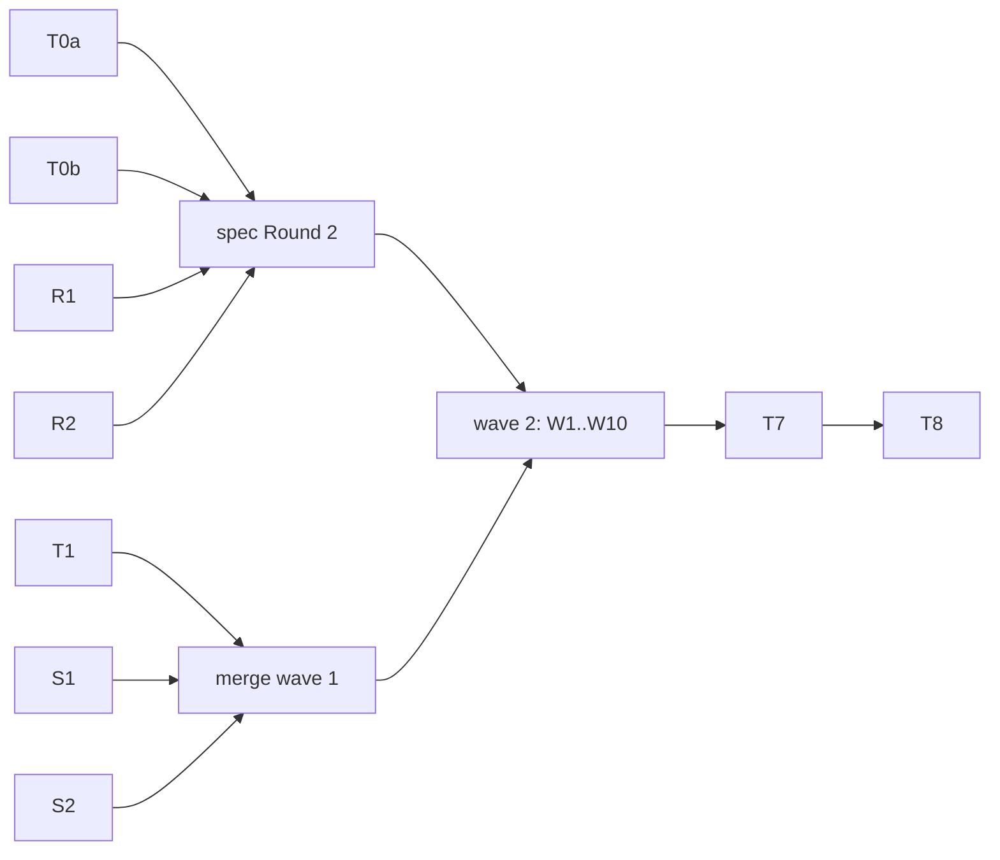

# Agent Session Transfer (Phase A) Implementation Plan

> **For agentic workers:** you are one pi agent among up to ten. Implement only your assigned track, in your own worktree, task-by-task. Read the common rules (`briefs/st-common.md` in the orchestrator's scratchpad, path given in your brief) before starting. The orchestrator schedules waves, merges and reviews; you do not merge, push or coordinate with other agents.

**Goal:** `worker task submit --from-session <agent>[:<id>]` starts a pool task by resuming a copy of a laptop Claude Code or Codex session, under pool policy, in direct and controller modes.

**Architecture:**
- **Package.** The laptop normalizes the native session into a package: a commit with `@@MW_WORKSPACE@@` and `@@MW_SESSION@@` tokens, secrets scrubbed.
- **Transport.** The package travels as a second git ref next to the base, `refs/mac-worker/sessions/<task>`.
- **Placement.** Host `task prepare` places it in the agent's native store under the first turn id and binds the session.
- **First turn.** The first turn runs as a resume.
- **Eligibility.** A host feature and the agent version gate which hosts can take the task.

**Tech stack:** Rust 2024; existing serde/serde_json, sha2, uuid (v4 only), rooted_fs, ProcessRunner, git plumbing. No new dependency (no regex crate: hand-written matchers), no TOML setting, daemon or UI.

**Spec:** [2026-10-03-session-transfer-design.md](../specs/2026-10-03-session-transfer-design.md). Integration branch `integ/session-transfer`, created from `main` at `3a1a097`.

## Global constraints

- Protocol stays 7. All wire fields are additive: `Option`, `#[serde(default, skip_serializing_if = "Option::is_none")]`, with existing `deny_unknown_fields` kept. Feature strings are `task.session-import.v1` (host) and `controller.session-import.v1` (controller). They are declared in T1 and advertised only in T7.
- Caps: 64 MiB raw per package, 64 MiB per file, 2,000 files. Complete JSONL lines only. Tokens are `@@MW_WORKSPACE@@` and `@@MW_SESSION@@`; an input that already contains a token is refused.
- Copy semantics. Laptop session files are opened read-only and never modified. Nothing is written into laptop agent stores in Phase A.
- Host writes into agent stores go through the T1 `StoreWriter`: owner-only modes, no following of symlinks below the store root, temp file then rename, refusal of differing existing content. The session id equals the first turn's `session_seed`, hyphenated lowercase.
- Failure codes come from the spec's catalog table only. No prose, paths or session ids in events.
- Tests:
  - Consolidated area targets only (agents, cli, controller, host, scheduler, task, transfer). Each track owns its own test module, seeded by T1 and declared in the area `main.rs`.
  - Command form: `NEXTEST_TEST_THREADS=4 CARGO_BUILD_JOBS=3 cargo nextest run --locked --test <area> -E 'test(/^<module>::/)'`. The selected count must be above 0.
  - Library unit tests: `CARGO_BUILD_JOBS=3 cargo nextest run --locked --lib -E 'test(/session_transfer::/)'`.
  - Fake `claude` and `codex` scripts under a temp HOME. No real agents, pool, SSH, setup, launchctl, credentials or Herdr in tests.
  - Warm fresh fixture scripts before bounded probes (`docs/testing.md`).
  - Never run the whole suite. Never delete `target/`.
- Each behaviour: red test → exact filtered red run → implementation → same green run → buildable conventional commit (`feat(session): …`, `test(session): …`). End each track with `cargo fmt --all` and `CARGO_BUILD_JOBS=3 cargo clippy --locked --all-targets -- -D warnings`.
- Frozen-contract defect: stop and report `CONTRACT ISSUE: <track>: <what and why>`. The orchestrator corrects serially.
- Your own worktree and branch only. No push, merge or rebase. No edits outside your exclusive files. A pass-through edit of at most 5 lines in an unowned file is allowed only to keep the build green, and it must be listed in the report.

## Waves and ownership

**Wave 1** (now, 7 agents):

| Track | Agent | Size | Exclusive files |
| --- | --- | --- | --- |
| T0a Claude spike | `st-t0-claude` | S | scratch dir only; report |
| T0b Codex spike | `st-t0-codex` | S | scratch dir only; report |
| T1 interface gate | `st-t1` | L | see T1 |
| S1 scrubber | `st-scrub` | M | `src/session_transfer/scrub.rs` (+ the minimal `mod` lines needed to compile) |
| S2 store writer | `st-store` | M | `src/session_transfer/place/fs.rs` (+ the minimal `mod` lines needed to compile) |
| R1 spec review, laptop and controller side | `st-review-laptop` | S | report only |
| R2 spec review, host and runner side | `st-review-host` | S | report only |

The orchestrator merges T1, then S1 and S2 (keeping T1's `mod.rs` files and taking S1's and S2's implementations), and folds T0 and R1/R2 into spec Round 2.

**Wave 2** (after wave 1 and F1 are merged into `integ/session-transfer`, 10 agents). Spec Round 2 (items 1–20) is binding.

| Track | Agent | Size | Exclusive files |
| --- | --- | --- | --- |
| W1 Claude capture | `st-cap-claude` | M | `src/session_transfer/capture/claude.rs`; `tests/agents/session_capture_claude.rs` |
| W2 Codex capture | `st-cap-codex` | M | `src/session_transfer/capture/codex.rs`; `tests/agents/session_capture_codex.rs` |
| W3 Claude placement | `st-place-claude` | M | `src/session_transfer/place/claude.rs`; `tests/host/session_place_claude.rs` |
| W4 Codex placement | `st-place-codex` | M | `src/session_transfer/place/codex.rs`; `tests/host/session_place_codex.rs` |
| W5 prepare and host GC | `st-prepare` | L | `src/task_store.rs` (prepare ordering, import receipt, store-root resolution through the account env profile, `delete_native_session`); `src/gc.rs` (session-ref enumeration, candidates, deletion); `tests/host/session_prepare.rs` |
| W6 transfer pins and pushes | `st-transport` | M | `src/transfer_repo.rs` (`write_session_package`, session pin, paired release, `validate_owned_pin_ref`); `src/git_transport.rs` (`push_base` and `push_controller_source` session refspecs, `--atomic`, `PRE_RECEIVE_HOOK`); `tests/transfer/session_transport.rs` |
| W7 controller source stream | `st-controller` | L | `src/controller/{stream_rpc,stream_client,transfer,execute}.rs` (session OID through prepare/finish/identity/receipt/hook; checkout fetch; re-pin `sessions/<task>` in the controller transfer repo); `tests/controller/controller_session_transfer.rs` |
| W8 imported first turn | `st-runner` | M | `src/turn_runner.rs` (`TurnStart`, local seed argv, `SessionRefPush` on the single push path); `src/job_service.rs` (first-turn import validation, including repair paths); `tests/task/session_import_turn.rs` |
| W9 eligibility | `st-sched` | M | `src/scheduler.rs` and `src/scheduler_adapter.rs` (`feature:` capabilities, `agent-min:` evaluation); version helper in `src/agent_facts.rs`; `tests/scheduler/session_eligibility.rs` |
| W10 docs | `st-docs` | S | `docs/usage.md` (session section and handoff recipe, outside the catalog block); `.claude/skills/pool-dispatch/SKILL.md` |

F1 (`st-claude-fix`, wave 1): `src/agent/claude.rs` passes `--verbose`; branch `fix/claude-stream-verbose` from `main`.

**Wave 3:**
- T7 serial integration (one agent):
  - `src/cli.rs` (`--from-session`, agent precedence, batch and DAG rejection);
  - `src/lib.rs` (direct and controller submit, controller health feature check, refusing envelope-only retry of source-incomplete imported requests);
  - `src/task_client.rs` (package build and pin before the initial record; paired release on every rollback path; the `release_base` caller audit);
  - `src/features.rs` (advertising);
  - `tests/cli/session_submit.rs`;
  - the end-to-end fixtures.
- Two review agents.
- T8 live acceptance with the owner.



## T0a / T0b — live spikes

The spike briefs are `briefs/st-t0-claude.md` and `briefs/st-t0-codex.md`. Each produces a report with commands, output excerpts and pass or fail per experiment (spec S1–S8), the facts that freeze contracts, and a cleanup list. No real user transcripts are used. Only new, spike-named paths are created in agent stores, and they are deleted at the end.

## T1 — interface gate

**Exclusive files:**
- **New:**
  - `src/session_transfer/{mod,contracts,tokens,claude_dir,store_root,testing}.rs`
  - `src/session_transfer/capture/{mod,claude,codex}.rs`, where `claude.rs` and `codex.rs` are facades
  - `src/session_transfer/place/{mod,claude,codex}.rs`, where `claude.rs` and `codex.rs` are facades
  - facade `src/session_transfer/scrub.rs` and facade `src/session_transfer/place/fs.rs`, carrying exactly the S1 and S2 APIs below and returning errors
  - `src/test_support/session.rs`
- **Edits:**
  - `src/lib.rs`: one `pub mod session_transfer;`
  - `src/test_support/mod.rs`: one line
  - `src/task.rs`: `TaskMetaInput` and `TaskMeta`, field, accessor and wire serde
  - `src/prepared_submit.rs`: `FrozenSubmitBody` field, `None` everywhere
  - `src/features.rs`: constants only
  - `src/error.rs`: catalog entries and their `build_catalog_error` mapping
  - `docs/usage.md`: catalog block rows only
  - mechanical signature freezes: `GitTransport::push_base` gains `session: Option<SessionRefPush<'_>>`, and every caller passes `None`; a `Some` returns `SESSION_PLACEMENT_FAILED` until W6. `SourceSubmitBind` gains `session_oid: Option<&'a str>`, `None` everywhere. `TransferRepo::write_session_package` is added as a method that returns `SESSION_IMPORT_UNSUPPORTED` until W6.
- **Test seeds:** one compiling smoke test each, declared in the area `main.rs`:
  - `tests/agents/session_contracts.rs`, owned by T1 itself, plus the wave-2 modules named in the table above
  - `tests/cli/session_submit.rs`

**Produces (frozen):**

```rust
// contracts.rs
#[derive(Debug, Clone, Copy, PartialEq, Eq, Hash, Serialize, Deserialize)]
#[serde(rename_all = "snake_case")]
pub enum SessionAgent { Claude, Codex }
impl SessionAgent {
    pub fn as_str(self) -> &'static str;                    // "claude" | "codex"
    pub fn agent_kind(self) -> crate::agent::AgentKind;
    pub fn from_agent_kind(kind: crate::agent::AgentKind) -> Option<Self>;
    pub fn format(self) -> SessionFormat;
}

#[derive(Debug, Clone, Copy, PartialEq, Eq, Hash, Serialize, Deserialize)]
#[serde(rename_all = "kebab-case")]
pub enum SessionFormat { ClaudeJsonlV1, CodexRolloutV1 }      // "claude-jsonl-v1" | "codex-rollout-v1"

#[derive(Debug, Clone, PartialEq, Eq)]
pub struct SessionSelector { agent: SessionAgent, id: Option<String> }
impl std::str::FromStr for SessionSelector { type Err = WorkerError; /* "claude" | "claude:<uuid>" | "codex[:<uuid>]";
    uuid = 8-4-4-4-12 hex, normalized to lowercase; anything else -> TASK_CONFIG_INVALID */ }
impl SessionSelector { pub fn agent(&self) -> SessionAgent; pub fn id(&self) -> Option<&str>; }

pub const MANIFEST_SCHEMA: u32 = 1;
pub const MAX_PACKAGE_BYTES: u64 = 64 << 20;
pub const MAX_FILE_BYTES: u64 = 64 << 20;
pub const MAX_PACKAGE_FILES: usize = 2_000;
pub const PACKAGE_MANIFEST_PATH: &str = "manifest.json";     // package tree root
pub const PACKAGE_SESSION_DIR: &str = "session";             // package tree: session/<file path>
pub const CLAUDE_MAIN_FILE: &str = "main.jsonl";
pub const CLAUDE_SIDECAR_DIR: &str = "sidecar";
pub const CODEX_ROLLOUT_FILE: &str = "rollout.jsonl";
pub const SESSION_REF_PREFIX: &str = "refs/mac-worker/sessions/";
pub const REQUEST_SESSION_REF_PREFIX: &str = "refs/mac-worker/request-sessions/";

#[derive(Debug, Clone, PartialEq, Eq, Serialize, Deserialize)]
#[serde(deny_unknown_fields)]
pub struct ManifestFile { pub path: String, pub bytes: u64, pub sha256: String } // path: plain relative components under session/

#[derive(Debug, Clone, PartialEq, Eq, Serialize, Deserialize)]
#[serde(deny_unknown_fields)]
pub struct SessionManifest {
    pub schema: u32, pub agent: SessionAgent, pub format: SessionFormat,
    pub source_session_id: String, pub source_agent_version: String,
    pub source_cwd_relative: String, pub files: Vec<ManifestFile>, pub scrubbed: u32,
}

#[derive(Debug, Clone, PartialEq, Eq)]
pub struct PackageFile { pub path: String, pub bytes: Vec<u8> }

#[derive(Debug, Clone, PartialEq, Eq)]
pub struct SessionPackage { manifest: SessionManifest, files: Vec<PackageFile> }
pub struct PackageSource { pub agent: SessionAgent, pub source_session_id: String,
    pub source_agent_version: String, pub source_cwd_relative: String, pub scrubbed: u32 }
impl SessionPackage {
    /// Computes ManifestFile entries (bytes, sha256), sorts files by path, validates caps and paths.
    pub fn build(source: PackageSource, files: Vec<PackageFile>) -> Result<Self, WorkerError>;
    /// Host side: parses manifest JSON (deny_unknown_fields), checks schema, file set equality, sizes, sha256, caps, paths.
    pub fn from_parts(manifest_json: &[u8], files: Vec<PackageFile>) -> Result<Self, WorkerError>;
    pub fn manifest(&self) -> &SessionManifest;
    pub fn files(&self) -> &[PackageFile];
    pub fn manifest_json(&self) -> Vec<u8>;                   // serde_json::to_vec, deterministic
}

#[derive(Debug, Clone, PartialEq, Eq, Serialize, Deserialize)]
#[serde(deny_unknown_fields)]
pub struct SessionImportMeta { agent: SessionAgent, format: SessionFormat, package_oid: String, source_agent_version: String }
impl SessionImportMeta {
    pub fn new(agent: SessionAgent, package_oid: impl Into<String>, source_agent_version: impl Into<String>) -> Result<Self, WorkerError>;
    // package_oid: 40 or 64 lowercase hex; version: 1..=64 printable ASCII without whitespace; format = agent.format()
    pub fn agent(&self) -> SessionAgent; pub fn format(&self) -> SessionFormat;
    pub fn package_oid(&self) -> &str; pub fn source_agent_version(&self) -> &str;
}

pub fn session_error(code: &'static str, message: impl Into<std::borrow::Cow<'static, str>>) -> WorkerError; // WorkerError::Task

pub struct CaptureContext<'a> { pub project_root: &'a Path, pub home: &'a Path, pub scrubber: &'a Scrubber, pub now: SystemTime }
pub struct CapturedSession { pub package: SessionPackage, pub source_path: PathBuf, pub recently_modified: bool, pub first_prompt_preview: Option<String> }
pub trait SessionCapture {
    fn agent(&self) -> SessionAgent;
    fn discover(&self, selector: &SessionSelector, cx: &CaptureContext<'_>) -> Result<PathBuf, WorkerError>;
    fn capture(&self, source: &Path, cx: &CaptureContext<'_>) -> Result<CapturedSession, WorkerError>;
}
pub struct PlaceContext<'a> { pub workspace: &'a Path, pub store: &'a StoreWriter, pub session_id: &'a str, pub now_millis: u64 }
pub struct PlacedSession { pub primary_file: PathBuf }
pub trait SessionPlace {
    fn agent(&self) -> SessionAgent;
    fn place(&self, package: &SessionPackage, cx: &PlaceContext<'_>) -> Result<PlacedSession, WorkerError>;
}
// capture/mod.rs and place/mod.rs
pub fn capture_for(agent: SessionAgent) -> Box<dyn SessionCapture>;
pub fn place_for(agent: SessionAgent) -> Box<dyn SessionPlace>;
// capture/mod.rs shared helpers (implemented in T1):
pub fn read_complete_lines(path: &Path, max_bytes: u64) -> Result<Vec<Vec<u8>>, WorkerError>; // drops a final partial line; each line must parse as JSON (SESSION_UNREADABLE); over cap -> SESSION_TOO_LARGE
pub fn relative_inside(root: &Path, cwd: &Path) -> Result<String, WorkerError>;             // canonicalize both; outside -> SESSION_OUTSIDE_PROJECT; "" for the root itself

// tokens.rs (implemented in T1)
pub const WORKSPACE_TOKEN: &str = "@@MW_WORKSPACE@@";
pub const SESSION_TOKEN: &str = "@@MW_SESSION@@";
pub fn rewrite_root(text: &[u8], from: &str, to: &str) -> Vec<u8>;
// match only where the preceding byte is not [A-Za-z0-9_.-] and the following byte is not [A-Za-z0-9_.-]
pub fn normalize(text: &[u8], roots: &[&str], session_id: &str) -> Result<Vec<u8>, WorkerError>;
// refuse when text already contains either token (SESSION_UNREADABLE); roots longest-first; then raw-replace session_id
pub fn materialize(text: &[u8], workspace: &str, session_id: &str) -> Vec<u8>;

// claude_dir.rs (implemented in T1)
pub fn claude_project_dir(cwd: &str) -> String;
// every UTF-16 unit that is not ASCII alphanumeric becomes '-'; over 200 chars: first 200, '-', then base36 of
// |Java-style i32 hash over UTF-16 units| (Claude Code's own rule, cross-checked with herdr-gpui Teleport)

// store_root.rs (implemented in T1)
pub fn store_root(agent: SessionAgent, home: &Path, profile_env: &[(String, String)]) -> PathBuf;
// Claude: CLAUDE_CONFIG_DIR from profile_env, else home/.claude; Codex: CODEX_HOME, else home/.codex

// scrub.rs (facade in T1; S1 implements)
pub const SCRUBBED: &str = "[scrubbed]";
pub struct Scrubber { /* private */ }
pub struct ScrubbedLine { pub bytes: Vec<u8>, pub replacements: u32 }
impl Scrubber {
    pub fn new(exact_secrets: Vec<String>) -> Self;          // secrets shorter than 8 bytes are ignored
    pub fn scrub_line(&self, line: &[u8]) -> Result<ScrubbedLine, WorkerError>;
}

// place/fs.rs (facade in T1; S2 implements)
pub struct StoreWriter { /* private */ }
#[derive(Debug, Clone, Copy, PartialEq, Eq)]
pub enum WriteOutcome { Created, Unchanged }
impl StoreWriter {
    pub fn open(root: &Path) -> Result<Self, WorkerError>;   // root must exist and be a directory (it may itself be a symlink)
    pub fn root(&self) -> &Path;
    pub fn write_file(&self, relative: &str, bytes: &[u8]) -> Result<WriteOutcome, WorkerError>;
    pub fn read_file(&self, relative: &str, max_bytes: u64) -> Result<Option<Vec<u8>>, WorkerError>;
}

// git_transport.rs (signature freeze)
pub struct SessionRefPush<'a> { pub package_oid: &'a str }
```

**Fixtures (`testing.rs`, test-support):**
- `claude_fixture(session_id, cwd, version, turns) -> Vec<u8>`
- `codex_fixture(thread_id, cwd, cli_version, items) -> Vec<u8>`
- `FakeAgentHome` (temp HOME with `.claude/projects/<enc>/…` and `.codex/sessions/YYYY/MM/DD/…`)
- `FakeCapture` and `FakePlace`, which record calls

Line shapes copy only the keys of real local transcripts. Never copy content.

**Steps:**
- [ ] Red tests in `tests/agents/session_contracts.rs` for:
  - `tokens`: the boundary rule both sides (`/w/feat` vs `/w/feature`, `/x/w/feat`), longest root first, collision refusal, and a normalize → materialize round trip;
  - `claude_project_dir`: `"/Users/penso/.herdr/worktrees/herdr-gpui/worktree-calm-forest-9099"` → `"-Users-penso--herdr-worktrees-herdr-gpui-worktree-calm-forest-9099"`, a ~156-character host path, and a >200-character path;
  - `SessionSelector` parsing;
  - `SessionPackage` build and `from_parts` (caps, unsafe paths, hash mismatch, unknown manifest field);
  - `SessionImportMeta` validation;
  - `read_complete_lines` and `relative_inside`;
  - `store_root`.
- [ ] Implement until green, one behaviour per commit.
- [ ] Wire fields, with serde tests for each struct:
  - `TaskMeta`: round-trip with and without `session_import`;
  - `FrozenSubmitBody`: an old body without the field still parses, and an unknown field is still rejected.
- [ ] Catalog entries and their mapping, plus the docs block rows; the existing catalog tests stay green.
- [ ] Signature freezes compile, and existing tests in the touched areas stay green: `transfer::` modules that call `push_base`, and `controller::` modules that build `SourceSubmitBind`. Run them by module filter.
- [ ] Facades and seeds compile; fmt; clippy.

**Acceptance:** contracts compile; serde compatibility is proven; no behaviour change for existing paths; report lists every touched file.

## S1 — scrubber (wave 1)

Implement the frozen `Scrubber` API exactly.
- Scan each line with a small JSON lexer. Only string **values** are scrubbed; object keys never are.
- Decode each value string with `serde_json`, match on the decoded text, and re-encode only the strings that changed. Untouched lines stay byte-identical, and every output line re-parses.
- **Patterns** (ASCII; the token must not be preceded by `[A-Za-z0-9_]`):
  - `Bearer ` followed by at least 16 of `[A-Za-z0-9._~+/=-]` → `Bearer [scrubbed]`
  - `sk-ant-` + at least 16 of `[A-Za-z0-9_-]`
  - `sk-` + at least 20 of `[A-Za-z0-9_-]`
  - `ghp_`, `gho_`, `ghs_`, `ghu_`, `ghr_` + at least 30 of `[A-Za-z0-9]`
  - `github_pat_` + at least 40 of `[A-Za-z0-9_]`
  - `xox[abprs]-` + at least 10 of `[A-Za-z0-9-]`
  - `AKIA` + exactly 16 of `[A-Z0-9]`, not followed by `[A-Za-z0-9]`
  - PEM blocks from `-----BEGIN … PRIVATE KEY-----` to the matching `-----END … PRIVATE KEY-----`
  - every exact secret
- A matched span becomes `[scrubbed]` (Bearer keeps its prefix), and the replacement count is returned.
- Invalid JSON fails with `SESSION_UNREADABLE`.
- Performance must be linear; lines of several MiB (base64 images) are normal.

Unit tests live in the source file (`#[cfg(test)]`). They must cover:
- false-positive guards: `disk-usage`, `task-…`, `sk-learn`, a 40-hex git OID, and UUIDs stay untouched;
- escaped content: `\n` before a token, and a token inside nested JSON text;
- keys untouched;
- an exact secret containing characters that need JSON escaping.

## S2 — store writer (wave 1)

Implement the frozen `StoreWriter` API exactly.
- Reuse `src/rooted_fs.rs`: `RootedDir`, openat-style no-follow traversal. `relative` must be plain components (no `..`, no absolute paths, no empty components) → otherwise `SESSION_PLACEMENT_FAILED`.
- **Parents:** create missing parents with mode 0700; existing parents keep their mode. A symlink below the root, at any component, is refused.
- **Write:** to a unique temp sibling (0600) with fsync, then rename into place, then fsync the parent.
- **Existing target:** identical bytes → `Unchanged`; different bytes → `SESSION_PLACEMENT_FAILED`; not a regular file → `SESSION_PLACEMENT_FAILED`.
- **`read_file`:** no-follow and bounded.

Unit tests in the source file must cover:
- a symlinked parent;
- a symlinked target;
- `..`;
- an existing identical file and an existing different file;
- mode bits;
- a root that is itself a symlink, which is allowed.

## R1 / R2 — spec review (wave 1)

Adversarial review of the spec Round 1 against the code at `3a1a097`. Briefs are `briefs/st-review-laptop.md` and `briefs/st-review-host.md`. Each delivers findings ranked by severity, with `path:line` evidence and a proposed spec change. Each finding is either a wrong assumption, a missing touchpoint, or a contract that cannot be implemented as written.

## Wave 2 tracks

Each track has its own brief in the orchestrator's scratchpad (`briefs/st-w<N>-*.md`). The brief is binding together with spec Round 2.

## Live acceptance — T8, with the owner

- [ ] Deploy per `docs/releasing.md` and the dev CLI install gotcha (new inode, dated backup, then setup, refresh-facts, doctor). Coordinate with the parallel session first, so there are no open tasks of theirs.
- [ ] Claude: an interactive laptop session of a few turns → `worker task submit --from-session claude --wip --prompt "continue: <next step>"`. The result shows earlier context was used, and a `worker task say` follow-up works.
- [ ] Codex: the same. If laptop Codex is newer than the minis, expect `SESSION_AGENT_TOO_OLD` first, then align versions.
- [ ] Controller mode: the same once via the mini-1 controller.
- [ ] A host without the feature is excluded before the lease.
- [ ] A real large session (owner's choice), to measure S7.
- [ ] Clean up: close the acceptance tasks with `--discard`, and list any Claude transcripts that remain.

## Coverage and handoff

| Spec item | Evidence |
| --- | --- |
| D2 package and normalization | T1 contract tests; W1/W2 round trips |
| D3 transport | W6 bare-repo tests; W7 controller hook tests; T8 controller run |
| D4 placement | S2 + W3/W4/W5 tests; T0 S1/S3/S4 |
| D5 imported resume | W8 argv and host acceptance; T7 end-to-end; T8 |
| D6 scrubber | S1 tests; T0 S6 |
| D7 eligibility | W9 tests; T8 old-host check |
| D8 discovery | W1/W2 tests; T7 CLI tests |
| D9 handoff recipe | W10 |

Each agent writes its report to the path in its brief and ends it with `TRACK DONE: <track>`, or `CONTRACT ISSUE: <track>: …`.
