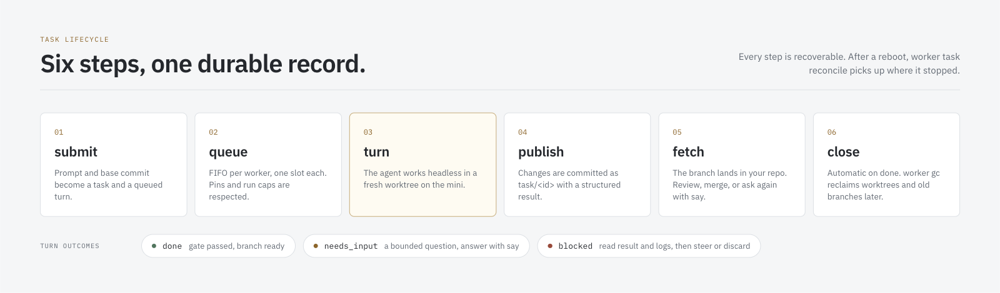

# Using mac-worker

Start with the [quick start](../README.md#quick-start) to install the CLI and connect one Mac. This reference covers agents, task settings, review, batches, capacity, origin delivery, the dashboard, and remote commands. Laptop skills live in the repository at [`.claude/skills/`](../.claude/skills/); they are a local-agent install, not a worker install.

## Agents

| Agent | Flag | Login lives | Notes |
|---|---|---|---|
| Codex | `--agent codex` | file-based login on the worker | `--model` / `--effort` are passed through; runs in the Codex workspace sandbox |
| OpenCode | `--agent opencode` | OpenCode auth store on the worker | uses the worker's default model; pick another with `--model opencode-go/<model>` |
| Cursor | `--agent cursor --env-profile agents` | Cursor login on the worker + an env profile | needs the profile described below because Cursor keeps its login in the macOS keychain |
| Claude Code | `--agent claude` | worker login or env profile | check with `worker init <ssh> --agent claude`; add `--env-profile` for profile credentials |

Honor the agent, model, and profile you configured. Do not copy credential profile contents. Every agent gets the same contract: work only in the task worktree, do not switch branches or push, and end with a JSON result. Agents that cannot ask questions interactively return `needs_input` with the exact question; you answer with `worker task say <id> --message "…" --wait`, which starts the next turn in the same agent session.

### Env profiles

Some agents need environment variables or a keychain unlock on the worker. Put them in an owner-only file on each worker, never in the repository:

```sh
umask 077
mkdir -p ~/.config/mac-worker/env && chmod 700 ~/.config/mac-worker/env
$EDITOR ~/.config/mac-worker/env/agents.env      # KEY=value per line
chmod 600 ~/.config/mac-worker/env/agents.env
```

Recognised keys include `CURSOR_API_KEY`, and the host-only `MAC_WORKER_KEYCHAIN_PASSWORD` (plus optional `MAC_WORKER_KEYCHAIN_PATH`), which mac-worker feeds to `security unlock-keychain` on stdin right before an agent that needs the login keychain runs. The two keychain values are consumed by the helper and never exported to the agent, logged, or shown anywhere. A profile that is group- or world-readable is refused.

A finished turn whose output matches an agent's authentication-failure signature has outcome `agent authentication failed`. `worker workers` then renders that agent as `unknown (auth failed in a turn at <UTC minute>)` until a later turn of the same agent and profile succeeds, 24 hours pass, Codex's `~/.codex/auth.json` is newer than the incident, or you run `worker workers --refresh --clear-auth-incidents`; on the worker, `worker host refresh-facts --clear-auth-incidents` does the same. The private incident record stores only the agent, profile name (or none), fixed reason `auth failed in a turn`, and time. It never stores log content.

You own SDKs, language tools, agent logins, and secrets on each Mac. mac-worker does not install toolchains or copy those profiles.

## Task lifecycle

<p align="center">
  
</p>

```text
worker task submit   --agent <a> (--prompt TEXT | --prompt-file PATH) [--wait] [--model M] [--effort E] [--close-on done|never]
worker task batch    FILE [--name NAME] [--max-parallel N] [--wait | --preview]
worker task list     [--run ID|NAME] [--state open] [--outcome needs-input]
worker task status   <id> [--full]     worker task logs <id> [-f]     worker task diff <id> --stat
worker task wait     --task-id <id> | --run <ID|NAME> [--timeout 30m]
worker task say      <id> (--message TEXT | --message-file PATH) [--wait]
worker task result   <id>          worker task fetch <id>
worker task cancel   <id>          worker task close <id> [--discard]
worker task reconcile              # re-own dead runners, re-queue orphaned turns; may launch already-frozen eligible DAG children
worker gc [--apply]                # preview, then reclaim old tasks, branches, mirrors on the workers
```

Confirm the installed grammar with `worker task --help`. There is no `worker task accept` verb.

`worker task batch FILE --preview` validates the file and prints the plan (`dag.status = "enforced"`). It does not open client state or dispatch. `--preview` conflicts with `--wait`. Submit of a named graph (`depends_on` or `base = "from:<id>"`) freezes that run and launches eligible roots; invalid or cyclic graphs are `TASK_CONFIG_INVALID` and create no run. Independent batches (empty `depends_on` and no `from:`) keep today's create-run-and-submit path.

`--max-parallel` is a **requested run cap**. Omitted, it defaults to `sum(worker.slots)` on the machine that owns the queue (each worker defaults to 1). An explicit positive value is accepted even when it is larger than that sum or than current host occupancy; extra tasks wait for a free execution slot. Zero is `TASK_CONFIG_INVALID`. The CLI does not reject “too many” relative to host capacity. On a controller-only laptop config, omit the flag rather than resolving it from an empty `[[workers]]` list; see [Remote controller](#remote-controller).

`worker task logs` without `--raw` prints recognised agent events one line at a time, hides per-token noise, and folds consecutive unrecognised structured events into `event: <type>[/<subtype>] ×N` summaries (the count is omitted for one event). It keeps stderr and launch failures verbatim and prints failure lines such as `turn 1 failed: …` even when the agent wrote nothing; use `--raw` for the original log bytes.

`worker task wait` returns only when all selected tasks are quiescent and their runners have released ownership, so `worker task close`, `worker task say`, and `worker task fetch` can run immediately afterward. `wait --run` is not complete while DAG nodes are still waiting or claimed; an empty materialized task list is not completion. After runner recovery, `worker task reconcile` also advances already-frozen eligible DAG nodes; it does not start a new operator batch. Capacity errors such as `CAPACITY_BUSY` and `CAPABILITY_MISSING` retain their public reason and exit code 75 through the controller.

`worker task reconcile` adopts, restarts, or finalizes a row only on positive proof that the previous runner exited: the pid was reused by a different process, or `Absent` was seen twice at least 750 ms apart. A single missed lookup, an ambiguous process-table read, or a transient error is unverifiable — the row is left alone, the report counts it, and `task list` shows `RUNNER_UNVERIFIABLE` only after that state has lasted 30 s. The operator path uses the same rule; it does not treat unverifiable as exited.

Outcomes are recorded on the task, independent of the process exit code:

- `done`: the agent finished and the branch is published. That is **not** human acceptance. Default `--close-on done` then closes the task. Origin `delivery` may still be `pending` / `retrying`. For a human review loop (ready for review → follow-up → accepted), submit with `--close-on never`, then `worker task say` as needed and `worker task close` when you accept.
- `needs_input`: the agent has a bounded question; `say` answers it.
- `blocked`: the agent could not finish. Read `result` and `logs`, then `say` guidance or `close --discard`.
- `unknown`: the agent did not return a structured result; the branch is still published.

If a worker job or its logs vanish after acceptance, the task outcome is `failed: LOG_DRAIN_UNAVAILABLE`. `worker task wait --task-id <id>` completes with exit 1, `worker task logs -f <id>` stops, and the dashboard shows the same outcome. A later `worker task say <id> --message "…"` starts a fresh turn. The result may still have been imported before the failure was finalized: inspect `worker task result <id>` and use `worker task fetch <id>` to check or import it.

When a replacement runner exits, its journal line distinguishes whether the worker accepted the turn. `exited: <code> …` is the pre-acceptance form: the worker did not accept that turn, so `worker task reconcile` can retry the handoff. `exited after acceptance: <code> …` means the journal already records acceptance; `worker task reconcile` resumes that turn from its committed offsets instead of submitting it again. After the post-acceptance form, inspect the worker with `worker workers --refresh`, especially if the job or its logs may have disappeared. Both lines are passed through `worker task logs` verbatim.

`worker task result` / `status --json` show the outcome, summary, and any **agent-reported** checks (`reported_checks` on protocol 7). Those checks are claims from the worker agent, not independent verification. `worker task diff <id> --stat` lists the published change. `worker task fetch <id>` prints the remote-tracking ref (`refs/remotes/mac-worker/<worker>/task/<id>`) — the current-turn import proof on the laptop. Your working tree stays unchanged.

### Review and close

Default `--close-on done` auto-closes after agent `done`. For an explicit review loop:

```bash
worker task submit --close-on never --agent <a> --prompt-file brief.md
worker task wait --task-id <id>
worker task result <id>
worker task diff <id> --stat
worker task fetch <id>
worker task close <id>            # human accept
# or: worker task say <id> --message-file followup.md --wait
# or: worker task close <id> --discard
```

Public CLI `say` / `close` have no revision flags. Wait first. Dashboard reply/accept are the same operations with a current-card check ([Dashboard](#dashboard)).

### Project setup

Optional `[setup]` in `.worker.toml` is opt-in. Absent, behavior is unchanged. Commands are operator-written; mac-worker never infers packages.

```toml
[setup]
timeout = "10m"
commands = ["cargo fetch --locked"]
check = "cargo fetch --locked --offline"
lockfiles = ["Cargo.lock"]
```

`check` proves **this** workspace only. A matching identity in another worktree is not readiness. You own the toolchain. Profile **names** may appear in identity hashes; profile values and secrets do not.

## Capacity and slots

Each `[[workers]]` entry defaults to `slots = 1` **per worker** (`1..=8`). That laptop value is a client **ceiling**. The Mac’s durable authority is `leases/capacity.json` `{ "slot_count": N }` on the host (hidden `worker host set-slots N`). Combined detached runner capacity is `sum(worker.slots)`, not the number of workers.

Same `task_id` is serialized (`WORKSPACE_BUSY`). Distinct task IDs from one checkout may overlap when that host’s `slot_count >= 2`. Layout, migrate, and probe occupancy: [multiple execution slots](superpowers/specs/2026-09-10-slots-design.md). Extra slots do not make Git/object transfers independent: a worker still serializes a job behind its transfer lock. On a controller, slow object verification and pinning can delay unrelated transfer preparation and finalization. The streaming pack child does not hold the global transfer lock for its lifetime.

`worker task submit` waits for capacity by default. Omitting `--wait` lets the CLI return after admission; it does not disable queueing. Add `--no-wait` to reject a submit when eligible workers are at capacity (`CAPACITY_BUSY`, exit 75). In controller mode an admission rejection with `CAPACITY_BUSY` or `CAPABILITY_MISSING` is saved as a final result: it keeps the public reason and cannot become a delayed task when capacity changes. To try again, submit a new request. Transport failures follow the controller's recovery path and are not capacity rejections.

## Origin delivery

With `publish = push`, each turn pins a durable delivery intent **before** the execution slot is released. Agent outcome and origin state are independent: `done` plus origin `pending` is valid. `status` / dashboard **project** remote delivery without rewriting a Closed local record. Discard while delivery is `pending`/`retrying` is `TASK_BUSY` (`DELIVERY_PENDING`).

Host pump (hidden `worker host`, not in top-level `--help`):

| Flag | Semantics |
|---|---|
| `--watch` | Take `outbox.lock` or exit immediately if another pump holds it. Publish watcher identity, recover the due registry once, then loop. |
| `--once` | Blocking one-shot pump. If the pump lock is held, `OUTBOX_BUSY`. Does not spawn `--watch`. |
| `--enable` | Write `locks/outbox-enabled.json`. Does not start a watcher. Reboot recovery is `--enable` plus a LaunchAgent that actually starts `--watch`. |
| `--wake` | Hidden. If a live watcher exists, no-op; else spawn `--watch` and exit. |

`--once` is a one-shot pump, not a substitute for `--watch`. Do not treat a single `--once` after a crash as proof that due-registry recovery already ran; `--watch` recovers the due index on start. Host layout of intents, pins, and the due registry: [durable origin outbox](superpowers/specs/2026-09-10-origin-outbox.md).

After a delivery reaches terminal `failed` (12 attempts, typically while origin credentials were broken), the watcher ignores it. Repair the worker login, then `worker task publish-retry <task_id>` resets that task's failed or retrying intents to `retrying` with attempt 0, records `retry_requested_at_millis`, and wakes the pump. Delivered or superseded intents are refused (`DELIVERY_ALREADY_DELIVERED`). An older helper that does not know `host outbox-retry` returns `HOST_COMMAND_UNSUPPORTED`. The task itself can already be Closed; this command does not reopen it.

Project defaults:

```toml
[task]
default_agent = "codex"
source = "local"            # or "origin": start from the exact commit on your Git remote
publish = ["fetch"]         # add "push" to also push task/<id> to origin
timeout = "45m"
max_followups = 10
```

`.worker.toml` `[task]` has no `close_on` field. Set close policy with `--close-on` on submit, or `close_on` at the batch top level or on a `[[tasks]]` entry (`done` or `never`).

To use the exact base commit from your Git remote and push the result branch back to that remote:

```toml
[task]
source = "origin"
publish = ["fetch", "push"]
```

The base commit must already be on the remote. The worker account needs its own Git access to that remote; SSH agent forwarding from the laptop is disabled. `--wip` cannot push (`PUBLISH_REQUIRES_COMMITTED_BASE`).

### Origin URL and worker credentials

The origin URL is the project's `origin` remote. mac-worker does not take a separate origin URL.

Declare the host on each worker that should fetch from or push to that remote:

```toml
[[workers]]
name = "mini-1"
ssh = "yourname@mini.local"
slots = 1
capabilities = ["darwin-arm64", "origin:github.com"]
```

`source = origin` and `publish = push` require `origin:<host>` where `<host>` matches the remote (`github.com`, `gitlab.example.com`). A pinned worker without it fails with `CAPABILITY_MISSING`. See [Prepare a Mac worker](setup-macos-worker.md#origin-remotes-optional) for the worker-side Git login.

Git on the worker stays hermetic during origin operations (the account `~/.gitconfig` is not loaded into the push). For **HTTPS** origins the worker account needs a credential helper: `gh auth login` then `gh auth setup-git` on the worker. For **SSH** origins the worker's own key must be registered with the remote.

`worker workers` prints `origin:github.com: helper configured` or `helper missing`. `worker doctor` warns `ORIGIN_HELPER_MISSING` when a declared origin has no HTTPS helper. A push git rejects as unauthenticated is `ORIGIN_AUTH_FAILED` (not the generic `PUBLISH_FAILED`) and keeps retrying with the existing backoff.

A batch file groups tasks into a run with shared defaults. Independent tasks (no `depends_on`, no `base = "from:<id>"`) still submit together:

```toml
version = 1
agent = "codex"
timeout = "45m"

[[tasks]]
title = "Flaky login spec"
prompt_file = "tasks/fix-flaky-login.md"

[[tasks]]
title = "Extract billing client"
prompt = "Move the billing HTTP client into packages/billing-client …"
agent = "opencode"
```

Named dependencies execute when each parent is **Closed and Done** (including `close_on = never`, which needs human `close` after a Done turn). Open+NeedsInput and Open+Done wait. Failed, Abandoned, Lost, or Closed without Done block descendants (`DAG_PARENT_FAILED`); they are not launched. `from:` copies that parent's current accepted imported OID on the laptop; origin `pending` does not block the bind when the local import proof is complete. Submit freezes each node's prompt, settings, and base OID; restart does not reread the batch file. List rows for not-yet-submitted nodes may show `DAG_WAITING` or `DAG_CLAIMED`.

```toml
version = 1
agent = "codex"
timeout = "45m"

[[tasks]]
id = "api"
prompt_file = "tasks/api-validation.md"
close_on = "never"

[[tasks]]
id = "tests"
depends_on = ["api"]
base = "from:api"
prompt_file = "tasks/api-tests.md"
```

Preview with `worker task batch tasks.toml --preview` before dispatch. Lifecycle: [batch DAG](dag-design.md).

```toml
[task]
default_agent = "codex"
model = "gpt-5.6-luna"
effort = "max"
env_profile = "agents"
source = "local"            # or "origin": start from the exact commit on your Git remote
publish = ["fetch"]         # add "push" to also push task/<id> to origin
timeout = "45m"
max_followups = 10

[setup]
commands = ["cargo fetch --locked"]
check = "cargo fetch --locked --offline"   # current workspace only
lockfiles = ["Cargo.lock"]
```

Optional `[setup]` runs in the task workspace with the same account and env-profile as the agent, before the agent starts. Absent `[setup]` keeps today's defaults. `check` proves **this** workspace is ready; a matching identity in another worktree is not skip proof. Toolchains stay user-owned.

`worker task batch FILE --preview` resolves agent/model/worker, declared files, acceptance, and setup without creating tasks, opening client state, or talking to workers. Preview reports `dag.status = "enforced"` (`Dependencies execute when parents are Closed and Done.`). Submit of `depends_on` or `base = "from:<id>"` executes that graph; independent batches stay on today's path. Declared `files` are advisory overlap hints. Declared `acceptance` is copied into the agent prompt as instructions, not proven by mac-worker.

To use the exact base commit from your Git remote and push the result branch back to that remote, change these project settings:

```toml
[task]
source = "origin"
publish = ["fetch", "push"]
```

The base commit must already be on the remote. The worker account needs its own Git access to that remote; SSH agent forwarding from the laptop is disabled.

Writing good briefs is its own skill. Two Claude Code skills ship with the repository and work from any project: [`pool-task-authoring`](../.claude/skills/pool-task-authoring/SKILL.md) turns an objective into one-turn, headless-safe tasks, and [`pool-dispatch`](../.claude/skills/pool-dispatch/SKILL.md) is the mechanical submit / wait / answer / fetch loop. Say "send it to the pool" and Claude Code uses them.

## When a turn fails

A turn can fail instead of returning `done`, `needs_input`, or `blocked`.
The outcome or error code is a fixed public string. Start with the command
listed for that string.

- `agent exited N`: read `worker task logs <id>`.
- `agent authentication failed`: re-login on the worker, then run
  `worker workers --refresh --clear-auth-incidents`.
- `LOG_DRAIN_UNAVAILABLE`: check `worker task result <id>`; the worker's
  job is gone and remaining stdout/stderr cannot be drained.
- `CAPACITY_BUSY` on a pinned submit: wait, or choose another worker.
- `TASK_BUSY` on close: wait for `worker task wait` to return, then retry.
- `ORIGIN_AUTH_FAILED`: the worker could not authenticate to origin. Check
  `worker workers` for `helper missing`, then on the worker run
  `gh auth login` and `gh auth setup-git` (HTTPS) or register the worker's
  SSH key. Delivery keeps retrying until 12 attempts; after `failed`, run
  `worker task publish-retry <task_id>` instead of resubmitting the task.

`worker task wait` is also the gate before `say` and `fetch` after a busy
turn.

A host I/O failure may include `HOST_IO (stage=…, residual=…)` on that job.
`stage` is one of `admission`, `prepare`, `launch`, `drain`, `publish`,
`cleanup`, `lease-release`, `cancel`, `follow`. `residual` lists leftovers of
**this job only** (`lease`, `cleanup-tree`, `job-dir`, `supervisor-lock`,
`transfer-lock`, `session`, `workspace`). Observation errors omit a residual
rather than guessing it is still there. This is diagnostic text on the existing
`HOST_IO` string, not a new CLI verb.

## Dashboard

<p align="center">
  
</p>

```bash
worker dashboard                 # opens http://127.0.0.1:<port>
worker dashboard --port 8765 --no-open
worker dashboard --no-facts-refresh   # skip stale agent-facts refresh only
```

The dashboard listens only on loopback. It does not start or cancel tasks. In the default (controller-disabled) mode it serves the laptop queue. When `[controller] enabled = true`, the same command does not open laptop task state: it starts a managed SSH local-forward to the controller host’s loopback dashboard, waits until that URL answers, prints `http://127.0.0.1:<port>`, and holds the tunnel until you stop the command. `--port`, `--no-open`, and `--no-facts-refresh` still apply. Tunnel or transport failure is `CONTROLLER_UNAVAILABLE` with no laptop-store fallback.

It shows workers (including slot occupancy and host load), the FIFO queue, active turns, the task ledger, per-task detail (outcome, summary, agent-reported checks, changed files, fetch ref, delivery), and run history. Deep link `#/tasks/<id>` selects that card. It never shows prompts, credentials, or profile values.

`--no-facts-refresh` disables the optional fifteen-minute agent-facts refresh so Overview does not probe idle workers. It is **not** a read-only switch: Settings can still save native model/effort defaults, and task cards can still reply or accept.

Reply and accept use the same `TaskClient::say` / `close` paths as the CLI. They require the **current card**. A stale card is rejected (`TASK_REVISION_CONFLICT`, HTTP 409) and must not enqueue another turn.

```text
POST /api/v1/tasks/{task_id}/reply
POST /api/v1/tasks/{task_id}/accept
```

Loopback `Host` / matching `Origin`, `Content-Type: application/json`, `X-Mac-Worker-Task: 1`, body ≤ 8192 bytes. JSON:

```json
{
  "message": "optional for reply",
  "expected_task_id": "<canonical>",
  "expected_turn_id": "<last turn>",
  "expected_turn_count": 1,
  "expected_head_oid": "<40 hex or null>",
  "expected_updated_at_millis": 123,
  "expected_state": "open"
}
```

Public CLI `say` / `close` do not take these fields. Snapshot GET JSON remains at `GET /api/v1/snapshot`, `GET /api/v1/tasks/<id>`, and `GET /api/v1/tasks/<id>/turns/<turn>/logs`.

The interface is a React application in `ui/`, built with Tailwind and shadcn/ui and embedded into the binary at build time, so `cargo build` needs no JavaScript toolchain.

### Herdr

If you run [herdr](https://herdr.dev) on the workers and on your laptop, the pool can show its turns there.

- **Sidebar rows on the worker's herdr.** A worker with `herdr = true` in `config.toml` opens a `mac-worker` workspace in its own herdr and one tab per running turn, labelled `task <id> · turn <n>`. `worker task close` removes the task tab; when it was the last task tab and no operator tab remains, the reporter removes the workspace too. The row carries the task title, the agent's icon, and the turn's state: `working` while the agent runs, `blocked` when it needs input, `done` when it finished, `unknown` with the reason when it failed, was cancelled, timed out, or was lost. Herdr 0.9's machine link and the herdr-mirror plugin both bring those rows to your laptop next to your local agents. A follow-up turn replaces the tab.
- **A readable log in the pane.** The tab's pane runs `worker host follow-turn`, a read-only command that renders the turn's event stream the way `worker task logs -f` does and prints the outcome line when the turn ends. You cannot type to the agent there: the turn stays headless.
- **Notifications on the laptop.** With `[notifications] herdr = true` (the default) the turn runner tells the herdr you started the command in that a turn ended: `task <id>: done` with the `done` sound, `needs_input` and `blocked` with the `request` sound. Without a reachable herdr socket nothing happens.
- **Where to check.** `worker workers` and `worker doctor` print a `herdr:` line per worker (`available (0.9.0)`, `not installed`, `installed, no socket`, `installed, no response`, or `unknown` when facts are missing); a known fact older than the TTL is printed with a `stale` suffix (`available (0.9.0), stale 69m`) rather than `unknown`; `doctor` and `setup` warn with `HERDR_UNAVAILABLE` when a worker has `herdr = true` but its herdr cannot be reached. Turns still run without the reporter, and `worker task status --json` records `herdr: attached`, `unavailable`, or nothing for each turn.
- **Dashboard chip and scheduling.** When the count is known and non-zero, the `herdr:` line from `worker workers` or `worker doctor` ends with `, N interactive agents`. The worker card and capabilities view show the same herdr fact in a chip (`herdr 0.9.0`, `herdr 0.9.0 · 2 agents`, `no herdr`, `herdr: no socket`, …), not counting mac-worker's own reporter tabs. Scheduling uses the count only as a last tie-breaker among otherwise equal workers; it never excludes a worker.

Sidebar tokens `task`, `turn`, `mw_title`, `mw_agent`, and `mw_outcome` are published with every row for custom herdr row layouts. The design and its budgets are in [the herdr reporter design](superpowers/specs/2026-09-08-herdr-reporter-design.md).

## Configuration

`~/.config/mac-worker/config.toml` is written by `worker init` and holds one `[[workers]]` block per Mac in the default laptop-owned mode. A controller-only laptop config may omit `[[workers]]` (see [Remote controller](#remote-controller)). Two optional keys concern herdr, the terminal workspace manager the pool can report into:

```toml
[notifications]
herdr = true      # default true: notify this laptop's herdr when a turn ends; silent without a socket

[[workers]]
name = "mini-1"
ssh = "yourname@mini.local"
slots = 1         # per-worker client ceiling; default 1, max 8; combined cap is the sum
herdr = false     # default false: show this worker's turns in its own herdr sidebar
```

The design behind both keys is in [the herdr reporter design](superpowers/specs/2026-09-08-herdr-reporter-design.md).

Optional remote controller (off unless you set it; see [Remote controller](#remote-controller)):

```toml
[controller]
enabled = false
# ssh = "yourname@always-on-host"
# remote_binary = "~/.local/bin/worker"   # only this path is accepted
```

## Remote controller

Opt-in. Default remains the laptop-owned queue: omit `[controller]`, or keep `enabled = false`. Confirm flags with `worker controller --help` and `worker dashboard --help`. Do not treat a missing table as a second store.

Use this when an always-on Mac should keep the queue after the laptop sleeps or disconnects. The laptop still freezes the prompt and Git objects. Execution workers stay ordinary `host` helpers. There is one task store — on the controller host — not a laptop copy that silently takes over.

### Enable

On the **laptop** `config.toml`:

```toml
[controller]
enabled = true
ssh = "yourname@always-on-host"
remote_binary = "~/.local/bin/worker"
```

`ssh` must be a valid destination (same family as a worker entry). `remote_binary` must be exactly `~/.local/bin/worker`. When this mode is on, a real SSH or `host controller-rpc` failure is `CONTROLLER_UNAVAILABLE` — not a silent return to a laptop task queue. Absence of `worker controller run` is not that outage.

On the **controller host**, install the same CLI, put that host’s execution workers in **its** `config.toml`, and run:

```bash
worker controller run
```

That process takes the leader lock, resumes unfinished requests and bounded active tasks, prints `controller leader acquired`, and stays in the foreground until you stop it. Keep it running for **autonomous** progress (recovery, DAG readiness, turn runners). Laptop task commands use a separate `host controller-rpc` over SSH; that helper can accept and persist a queued submit even when the leader is not up. Do not treat a missing leader as a transport failure, and do not assume every RPC requires a live `controller run`. A second live `controller run` on the same host is `CONTROLLER_LOCK_HELD`. Restart is stop, then `worker controller run` again — it resumes the same store. This is not `launchd` and is not started from the MacBook as a local daemon.

The controller host owns the worker list used for dispatch. A laptop config with `[controller] enabled = true` may omit `[[workers]]`. Laptop commands that then fail with `at least one worker is required` are `worker setup`, `worker doctor`, `worker workers`, `worker run`, streaming `worker logs`, and `worker gc`. Public job `status` and `cancel` stay laptop-local and do **not** use that inventory error. That is explicit, not empty-pool scheduling.

These stay on the laptop even when the controller is enabled: `init`, `setup`, `doctor`, `workers`, `gc`, `run`, job status/logs/cancel, and `worker task batch FILE --preview`. Turn runners run on the controller host, not on the MacBook.

### Submit, disconnect, reconnect

Task commands use the same public grammar as today (`worker task --help`): `submit`, `batch`, `list`, `status`, `logs` (`-f` / `--raw` / `--turn`), `diff`, `say`, `cancel`, `result`, `fetch`, `close`, `wait`, `reconcile`. Confirm the installed form with `worker skills get pool-dispatch --grammar-only` rather than copying flags from a skill file.

On submit the laptop freezes the prompt, project identity, settings, and base (`HEAD`, `--base`, or `--wip` / `--include`) and transfers that snapshot before the controller accepts the request. A retry of the **same original envelope** keeps that freeze; it does not recapture a later HEAD or `.worker.toml`. After accept you can close the laptop CLI. That ACK means the request is persisted on the controller store; it does **not** mean a runner or the agent has started — enabled submit can stay queued until `worker controller run` advances it. Reconnect with `status`, `logs`, `wait`, `list`, and the dashboard.

Without `--wait`, `submit` / `batch` / `say` return after that accept. Autonomous progress on the controller still needs `worker controller run`. With `--wait`, the same command follows until the selected task or run is quiescent. `worker task wait --task-id` waits for one task; `worker task wait --run` waits until that run is quiescent, including DAG children that become eligible after a parent `close`.

`--wip` is still opt-in local snapshot with fetch-only publication. Origin source still needs the exact remote commit. `publish = push` still cannot use a WIP base (`PUBLISH_REQUIRES_COMMITTED_BASE`).

### Import is not fetch

The controller imports the worker’s published result so later DAG work can proceed while the laptop is away. That import is not your working copy. `worker task fetch <id>` is the explicit laptop materialization: it prints the remote-tracking ref for you to inspect. A missing laptop branch is not an agent failure.

### Batches and slots

`worker task batch FILE --preview` stays local: it validates the file and does not open the controller store or dispatch. It works with a controller-only laptop configuration, including worker pins. The preview preserves those names; the controller checks its own inventory when you submit. A successful preview does not prove that a worker exists or is currently available.

Named `depends_on` / `base = "from:<id>"` still wait for each parent to be **Closed and Done** (including `close_on = never`, which needs human `close` before a `from:` child may run). Open+NeedsInput and Open+Done wait. Failed, Abandoned, Lost, or Closed without Done block descendants (`DAG_PARENT_FAILED`). `from:` binds that parent’s accepted **controller** import, not origin `pending` and not a laptop `fetch` you have not run.

`--max-parallel` remains CLI-only (not a batch-file key). Omitted, the default is the **controller host** `sum(worker.slots)`, not an empty laptop `[[workers]]` list. An explicit positive value is accepted even when it is larger than that sum; extra tasks wait. Zero is `TASK_CONFIG_INVALID`. The CLI does not reject “too many” relative to host capacity. Host occupancy is still each Mac’s `slot_count`.

Controller Git object transfer uses one global lock for object verification and pinning. A slow repository can delay unrelated transfer preparation and finalization. Extra slots do not make those steps independent. The streaming pack child does not hold that lock for its lifetime.

### Dashboard

`worker dashboard [--port N] [--no-open] [--no-facts-refresh]` on an enabled laptop is the tunnel described in [Dashboard](#dashboard). Reply and accept still require the current card against the store the dashboard is serving.

After updating the CLI and helpers, restart the controller process and any running dashboard or dashboard tunnel with their existing configuration and port. Already-running processes keep the old code after a binary replacement. A dashboard that reports `INVALID_RESPONSE` while a fresh `worker workers` invocation reports ready workers may need this restart. See [Update or remove](getting-started.md#update-or-remove).

### Close request recovery

A saved `task.close` request whose target has changed is rejected before any close action with `TASK_REVISION_CONFLICT` or `TASK_CLOSED`. The controller saves that rejection and removes the request from the active retry index. Replaying the same request returns the saved rejection; it does not close a newer turn. Existing stale requests are settled when the updated controller next processes them, including through its recovery tick. Their journal records remain available for diagnosis.

Errors from an already-started close, including transport failures after retaining the close intent, remain retryable. A repeated close of the same completed target is still idempotent. Wait for `worker task wait --task-id <id>` before closing an active task.

## What the pool will and will not do

- A task worktree is isolation for your repository, not a security boundary: agent turns run with the worker account's full access. Only dispatch prompts you trust, on machines you own.
- Your working tree is never modified. Results arrive as remote-tracking refs; merging is your decision.
- You own SDKs, tools, auth, and secrets. Optional `[setup]` does not install arbitrary packages.
- Agent-reported checks are not independent verification. Review summary, diff, and fetch ref before you accept.
- Workers hold a bare mirror per project, a worktree per task, agent sessions, and bounded logs. `worker gc` previews and reclaims them: idle open tasks after 7 days, result branches after 30 days or on `close --discard`.
- The CLI adds no secrets to its own diagnostics, redacts worker paths from agent summaries, and refuses insecure profiles. Application logs can still contain whatever the agent printed.
- `worker task reconcile` repairs task ownership after a laptop reboot (or on the controller host when enabled). It waits 750 ms to confirm an `Absent` owner in that same invocation; a still-unverifiable owner is not treated as dead. `worker setup` updates helpers; older host layouts may require the steps in [installation recovery](setup-recovery.md).
- The laptop owns the queue unless you opt in to a remote controller (`[controller] enabled = true`). That mode is off by default. Setup: [Remote controller](#remote-controller).

## Plain remote commands

The task system is built on a simpler layer that is still available: run any trusted, non-interactive command on a worker from a snapshot of the current worktree.

```bash
worker run -- cargo test --locked           # scheduler picks a worker
worker run --worker mini-2 -- npm test      # pin one
worker status                               # recent jobs
worker logs -f <job-id>
worker cancel <job-id>
worker doctor --project .                   # validate a project before its first job
```
