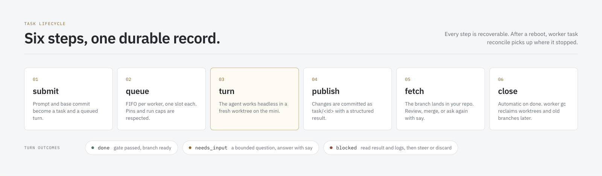
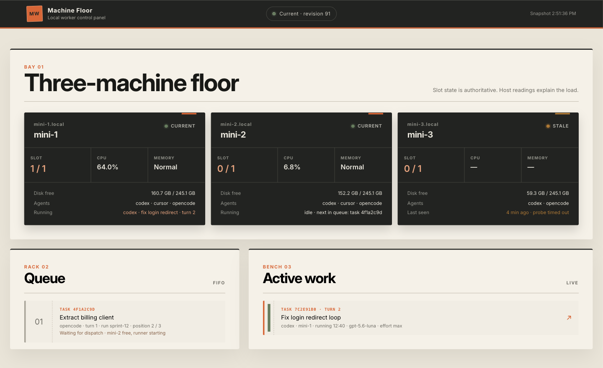

# Using mac-worker

Start with the [quick start](../README.md#quick-start) to install the CLI and connect one Mac. This reference covers agents, task settings, review, batches, capacity, origin delivery, the dashboard, the remote controller, and its events and notifications. Laptop skills live in the repository at [`.claude/skills/`](../.claude/skills/); they are a local-agent install, not a worker install.

## Agents

| Agent | Flag | Login lives | Notes |
|---|---|---|---|
| Codex | `--agent codex` | file-based login on the worker | `--model` / `--effort` are passed through; runs in the Codex workspace sandbox |
| OpenCode | `--agent opencode` | OpenCode auth store on the worker | uses the worker's default model; pick another with `--model opencode-go/<model>`; 1.x and 2.x are both supported, see [OpenCode 1.x and 2.x](#opencode-1x-and-2x) |
| Cursor | `--agent cursor --env-profile agents` | Cursor login on the worker + an env profile | needs the profile described below because Cursor keeps its login in the macOS keychain |
| Claude Code | `--agent claude` | worker login or env profile | check with `worker init <ssh> --agent claude`; add `--env-profile` for profile credentials |

Honor the agent, model, and profile you configured. Do not copy credential profile contents. Every agent gets the same contract: work only in the task worktree, do not switch branches or push, and end with a JSON result. New tasks ask agents to make reasonable decisions unattended; see [Questions policy](#questions-policy). With `--questions ask`, an agent can return `needs_input` with the exact question; you answer with `worker task say <id> --message "…" --wait`, which starts the next turn in the same agent session.

Each completed turn records the executable resolved **after** login-shell startup and the env profile, plus a bounded `--version` observation. `task status`, `task result`, and dashboard detail JSON expose `turns[].agent_identity`; account-home paths are shown relative to `~/` and secrets remain redacted. The private job `agent-identity.json` retains the resolved path. Version observation is best effort: an unsupported command, a timeout after two seconds (or the remaining turn deadline), or output above 4 KiB per stream does not prevent agent execution. OpenCode is the one exception: its launch is checked against the observed version, see [OpenCode 1.x and 2.x](#opencode-1x-and-2x). Timeout and overflow retain the path with `version: null` and the fixed `version_observation` reason `timed_out` or `output_limit`; human output shows `version unavailable(timeout)` or `version unavailable(output_too_large)`. Diagnostic-storage errors also do not block launch. The probe's direct child is reaped on a bound, while descendants remain in the supervised process group for turn cleanup. An unresolved executable or a failed exec still fails launch.

`worker workers` and `worker doctor` emit informational `AGENT_VERSION_SKEW` notes when hosts report different versions of the same agent. They do not affect eligibility or scheduling. For OpenCode the recorded version also selects the command form for that worker. Facts refresh reads only the global OpenCode `~/.config/opencode/opencode.json` / `.jsonc` autoupdate setting. `AGENT_AUTOUPDATE_ENABLED` means automatic updates are not confirmed disabled there; set `"autoupdate": false` to disable them. OpenCode's `"notify"` mode also disables automatic installation. Missing, unreadable, malformed, or conflicting config produces a note; configuration contents are never emitted. Project/environment/managed overrides may differ from this global observation. No config is edited by mac-worker.

Cursor CLI `2026.09.26-dd393fe` advertises `update` but no disable-auto-update option in `--help`; mac-worker does not infer Cursor's effective update setting from undocumented configuration.


An `unknown` result includes `result_parse_reason`: `no_result_json`, `schema_mismatch:<field>`, `truncated`, or `empty_output`. These fixed codes contain no raw agent output. Truncated protocol still fails publication conservatively and records `truncated` for diagnosis.

### OpenCode 1.x and 2.x

mac-worker drives both OpenCode generations and chooses per worker, so workers can move to 2.x one at a time.

OpenCode 2 sends `run` and most other commands to a shared background service. That service outlives the turn, and the turn's process-group cleanup cannot reach it. On a 2.x worker every OpenCode command mac-worker runs, apart from `--version`, therefore carries `--standalone`, which gives that command a private server. OpenCode 1 has no such service and rejects the flag.

| | OpenCode 1.x | OpenCode 2.x and later |
|---|---|---|
| Turn | `opencode run --format json --auto [--model …] [--session …]` | `opencode run --standalone --format json --auto [--model …] [--session …]` |
| Session delete on discard | `opencode session delete <id>` | `opencode session delete <id> --standalone` |
| Login check in facts | `opencode auth list` | `opencode auth list --standalone` |
| Live model list in settings | `opencode models` | none; settings show the remembered catalog |

- **Which form a turn gets.** The runner reads the selected worker's recorded OpenCode version and builds the turn for that generation. A missing or unreadable version keeps the 1.x form. After you install, upgrade or downgrade OpenCode on a worker, run `worker workers --refresh`.
- **Stale facts cannot start the service.** Before it starts OpenCode, the worker compares the turn's form with `opencode --version` of the executable it resolved. A turn that does not fit fails without starting OpenCode:
  - `OPENCODE_DIALECT_MISMATCH`: the worker runs the other generation. Refresh the facts, then submit the task again, or repeat `worker task say` for a follow-up turn.
  - `OPENCODE_VERSION_UNVERIFIED`: the turn has no `--standalone` and the worker could not read the version, so it may be 2.x. Check `opencode --version` in the worker's login shell.

  For this check an OpenCode launch waits up to ten seconds for the version, not two. A turn that carries `--standalone` still starts when the version cannot be read: 2.x uses a private server and 1.x exits on the flag.
- **Commands outside a turn.** The login check, the session delete and the settings catalog take their form from the version the worker observes at that moment. When it cannot read the version, the worker uses `--standalone` and skips `opencode models`.
- **Models.** `--model` is passed through unchanged. 2.x accepts `provider/model#variant`; a plain `provider/model` works on both.

The project's own Mac minis stay on OpenCode 1.x for now.


### Env profiles

Some agents need environment variables or a keychain unlock on the worker. Put them in an owner-only file on each worker, never in the repository:

```sh
umask 077
mkdir -p ~/.config/mac-worker/env && chmod 700 ~/.config/mac-worker/env
$EDITOR ~/.config/mac-worker/env/agents.env      # KEY=value per line
chmod 600 ~/.config/mac-worker/env/agents.env
```

Recognised keys include `CURSOR_API_KEY`, and the host-only `MAC_WORKER_KEYCHAIN_PASSWORD` (plus optional `MAC_WORKER_KEYCHAIN_PATH`), which mac-worker feeds to `security unlock-keychain` on stdin right before an agent that needs the login keychain runs. The two keychain values are consumed by the helper and never exported to the agent, logged, or shown anywhere. A profile that is group- or world-readable is refused.

A finished turn whose output matches an agent's authentication-failure signature has outcome `agent authentication failed`. `worker workers` then renders that agent as `unknown (auth failed in a turn at <UTC minute>)` until a later turn of the same agent and profile succeeds, 24 hours pass, Codex's `~/.codex/auth.json` is newer than the incident, or you run `worker workers --refresh --clear-auth-incidents`; on the worker, `worker host refresh-facts --clear-auth-incidents` does the same. The private incident record stores only the agent, profile name (or none), fixed reason `auth failed in a turn`, and time. It never stores log content.

A facts refresh also stops when its collection budget runs out and still writes what it finished. Agents it did not finish show `unknown (facts refresh budget exhausted)`. The default budget is 25 seconds, under the 30 second refresh deadline; a shorter caller leaves a few seconds of margin. `worker setup` uses the longer installer allowance.

You own SDKs, language tools, agent logins, and secrets on each Mac. mac-worker does not install toolchains or copy those profiles.

## Task lifecycle

<p align="center">
  
</p>

```text
worker task submit   --agent <a> (--prompt TEXT | --prompt-file PATH) [--wait] [--model M] [--effort E] [--close-on done|never]
worker task batch    FILE [--name NAME] [--max-parallel N] [--wait | --preview]
worker task list     [--run ID|NAME] [--state open] [--outcome needs-input]
worker task status   <id> [--full]     worker task logs <id> [-f]     worker task diff <id> --stat
worker task wait     --task-id <id> | --run <ID|NAME> [--timeout 30m]
worker task say      <id> (--message TEXT | --message-file PATH) [--interrupt] [--wait]
worker task result   <id>          worker task fetch <id>
worker task cancel   <id>          worker task close <id> [--discard]
worker task reconcile              # re-own dead runners, re-queue orphaned turns; may launch already-frozen eligible DAG children
worker gc [--apply]                # preview, then reclaim old tasks, branches, mirrors on the workers
```

Confirm the installed grammar with `worker task --help`. There is no `worker task accept` verb.

`worker task say --interrupt` stops a running turn, waits up to 60 seconds for it to be cancelled and retired, then continues the same agent session and workspace with the new message. Files the cancelled turn already wrote in the workspace stay there for the next turn. A turn that is still queued has no agent session yet: `--interrupt` refuses it with `TASK_BUSY` instead of cancelling, which would abandon the task. With no running turn, `--interrupt` is the same as `say`. The follow-up is not sent if the cancel fails (its error), if the turn does not settle in time (`TASK_BUSY`), or if the turn finished on its own before the cancel landed (`TASK_REVISION_CONFLICT`; use a plain `say`). `--wait` waits for the new turn.

`worker task batch FILE --preview` validates the file and prints the plan (`dag.status = "enforced"`). It does not open client state or dispatch. `--preview` conflicts with `--wait`. Submit of a named graph (`depends_on` or `base = "from:<id>"`) freezes that run and launches eligible roots; invalid or cyclic graphs are `TASK_CONFIG_INVALID` and create no run. Independent batches (empty `depends_on` and no `from:`) keep today's create-run-and-submit path.

`--max-parallel` is a **requested run cap**. Omitted, it defaults to `sum(worker.slots)` on the machine that owns the queue (each worker defaults to 1). An explicit positive value is accepted even when it is larger than that sum or than current host occupancy; extra tasks wait for a free execution slot. Zero is `TASK_CONFIG_INVALID`. The CLI does not reject “too many” relative to host capacity. On a controller-only laptop config, omit the flag rather than resolving it from an empty `[[workers]]` list; see [Remote controller](#remote-controller).

`worker task logs` without `--raw` prints recognised agent events one line at a time, hides per-token noise, and folds consecutive unrecognised structured events into `event: <type>[/<subtype>] ×N` summaries (the count is omitted for one event). Terminal controls in decoded events, plain stdout, and stderr (ESC, OSC including clipboard and title sequences, CSI, and other C0/C1 controls) are shown as visible text such as `\x1b`; newlines and tabs stay. It prints failure lines such as `turn 1 failed: …` even when the agent wrote nothing. `--raw` stays byte-exact.

`worker task wait` returns only when all selected tasks are quiescent and their runners have released ownership, so `worker task close`, `worker task say`, and `worker task fetch` can run immediately afterward. `wait --run` is not complete while DAG nodes are still waiting or claimed; an empty materialized task list is not completion. After runner recovery, `worker task reconcile` also advances already-frozen eligible DAG nodes; it does not start a new operator batch. Capacity errors such as `CAPACITY_BUSY` and `CAPABILITY_MISSING` retain their public reason and exit code 75 through the controller.

`worker task reconcile` adopts, restarts, or finalizes a row only on positive proof that the previous runner exited: the pid was reused by a different process, or `Absent` was seen twice at least 750 ms apart. A single missed lookup, an ambiguous process-table read, or a transient error is unverifiable — the row is left alone, the report counts it, and `task list` shows `RUNNER_UNVERIFIABLE` only after that state has lasted 30 s. The operator path uses the same rule; it does not treat unverifiable as exited.

Outcomes are recorded on the task, independent of the process exit code:

- `done`: the agent finished and the branch is published. That is **not** human acceptance. Default `--close-on done` then closes the task. Origin `delivery` may still be `pending` / `retrying`. For a human review loop (ready for review → follow-up → accepted), submit with `--close-on never`, then `worker task say` as needed and `worker task close` when you accept.
- `needs_input`: the agent has a bounded question; the questions policy below determines whether it continues automatically or waits for `say`.
- `blocked`: the agent could not finish. Read `result` and `logs`, then `say` guidance or `close --discard`.
- `unknown`: the agent did not return a structured result; the branch is still published. Attached turn commands and `worker task wait` (including `--run`) exit **70** (`Infrastructure`) for this outcome. A run containing any `unknown` outcome also exits 70. `done` and `needs_input` keep exit 0; waits aggregate other unsuccessful outcomes as exit 1, while attached turns preserve a reported agent exit code.

If a worker job or its logs vanish after acceptance, the task outcome is `failed: LOG_DRAIN_UNAVAILABLE`. `worker task wait --task-id <id>` completes with exit 1, `worker task logs -f <id>` stops, and the dashboard shows the same outcome. A later `worker task say <id> --message "…"` starts a fresh turn. The result may still have been imported before the failure was finalized: inspect `worker task result <id>` and use `worker task fetch <id>` to check or import it.

### Questions policy

New tasks default to `decide`: every turn tells the agent to choose reasonable options, keep working, and summarize its decisions and assumptions. Use `worker task submit --questions ask` for interactive daytime work. The submit flag overrides `.worker.toml` `[task] questions = "ask"` or `"decide"`; without either, the policy is `decide`. Batch and DAG tasks accept `questions` on each `[[tasks]]` entry, overriding batch defaults and then the project setting. The effective policy is saved on the task, so later turns keep it even if configuration changes. Tasks created before this policy existed continue to use `ask`.

If a `decide` turn still returns `needs_input`, the runner starts one detached continuation in the same agent session, including the agent's questions and options and asking it to choose its recommendations. This consumes one `max_followups` slot. A second `needs_input` from that automatic turn waits for a human. `ask`, `blocked`, failures, cancellations, and an exhausted budget never trigger automatic continuation. `--close-on done` still closes only on `done`, and DAG dependents wait for the continuation's final result. `task status` prints the saved policy and labels automatic turns `(auto-continue)`.

Attached `submit --wait` and `say --wait` also wait for any automatic continuation to become quiescent and return its final status and exit code.

Before an automatic continuation has materialized, a human `say` replaces the pending automatic answer, and `task cancel` removes that pending answer while preserving the finished turn. A runner still finalizing the previous turn keeps its ownership fence; retry after it settles. If the automatic turn has already started, ordinary `say` reports that the task is active.

Controller preparation preserves pending automatic answers while recovering completed dead runners, so a human reply can take their place. A controller `close` removes the pending answer before closing. Local `say` and `cancel` also recover this crash window. If an automatic turn wins after a controller mutation was prepared, the frozen `say`, `cancel`, or `close` request is rejected with `TASK_REVISION_CONFLICT` and removed from the pending request index. `TASK_BUSY` remains retryable, including unfinished cancellation or close cleanup. A retried controller reply that already completed is acknowledged even after a later automatic turn starts, without creating another human turn.

The controller submit field is omitted when no override is configured, preserving default submits to older controllers. Explicit questions overrides require an upgraded controller; an older strict controller rejects that opt-in field. When the field is absent, including older frozen DAG specs and queued submit requests, the composing side resolves the project's `task.questions` setting and default. Other frozen settings remain unchanged, and retries keep the policy already stored on the task.

When a replacement runner exits, its journal line distinguishes whether the worker accepted the turn. `exited: <code> …` is the pre-acceptance form: the worker did not accept that turn, so `worker task reconcile` can retry the handoff. `exited after acceptance: <code> …` means the journal already records acceptance; `worker task reconcile` resumes that turn from its committed offsets instead of submitting it again. After the post-acceptance form, inspect the worker with `worker workers --refresh`, especially if the job or its logs may have disappeared. Both lines are passed through `worker task logs` verbatim.

`worker task result` / `status --json` show the outcome, summary, and any **agent-reported** checks (`reported_checks` on protocol 7). Those checks are claims from the worker agent, not independent verification. `worker task diff <id> --stat` lists the published change. While the task is open, that diff is the workspace, including uncommitted files. After `--close-on done` removes the workspace, `diff` uses the base and result commits retained in the worker project mirror. If those commits have been collected, the error is `RESULT_NOT_RETAINED` (`task workspace is closed and its result is no longer retained`). `worker task fetch <id>` prints the remote-tracking ref (`refs/remotes/mac-worker/<worker>/task/<id>`) — the current-turn import proof on the laptop. Your working tree stays unchanged.

### Review and close

Default `--close-on done` auto-closes after agent `done`. For an explicit review loop:

```bash
worker task submit --close-on never --agent <a> --prompt-file brief.md
worker task wait --task-id <id>
worker task result <id>
worker task diff <id> --stat
worker task fetch <id>
worker task close <id>            # human accept
# or: worker task say <id> --message-file followup.md --wait
# or: worker task close <id> --discard
```

`worker task diff <id> --stat` in that loop reads the open workspace. The same command after `worker task close <id>` reads the retained mirror commits described above. `close --discard` removes those commits.

Public CLI `say` / `close` have no revision flags. Wait first. Dashboard reply/accept are the same operations with a current-card check ([Dashboard](#dashboard)).

### Project setup

Optional `[setup]` in `.worker.toml` is opt-in. Absent, behavior is unchanged. Commands are operator-written; mac-worker never infers packages.

```toml
[setup]
timeout = "10m"
commands = ["cargo fetch --locked"]
check = "cargo fetch --locked --offline"
lockfiles = ["Cargo.lock"]
```

`check` proves **this** workspace only. A matching identity in another worktree is not readiness. You own the toolchain. Profile **names** may appear in identity hashes; profile values and secrets do not.

## Capacity and slots

Each `[[workers]]` entry defaults to `slots = 1` **per worker** (`1..=8`). That laptop value is a client **ceiling**. The Mac’s durable authority is `leases/capacity.json` `{ "slot_count": N }` on the host (hidden `worker host set-slots N`). Combined detached runner capacity is `sum(worker.slots)`, not the number of workers.

Same `task_id` is serialized (`WORKSPACE_BUSY`). Distinct task IDs from one checkout may overlap when that host’s `slot_count >= 2`. Layout, migrate, and probe occupancy: [multiple execution slots](superpowers/specs/2026-09-10-slots-design.md). Extra slots do not make Git/object transfers independent: a worker still serializes a job behind its transfer lock. On a controller, slow object verification and pinning can delay unrelated transfer preparation and finalization. The streaming pack child does not hold the global transfer lock for its lifetime.

`worker task submit` waits for capacity by default. Omitting `--wait` lets the CLI return after admission; it does not disable queueing. Add `--no-wait` to reject a submit when eligible workers are at capacity (`CAPACITY_BUSY`, exit 75). In controller mode an admission rejection with `CAPACITY_BUSY` or `CAPABILITY_MISSING` is saved as a final result: it keeps the public reason and cannot become a delayed task when capacity changes. To try again, submit a new request. Transport failures follow the controller's recovery path and are not capacity rejections.

## Origin delivery

With `publish = push`, each turn pins a durable delivery intent **before** the execution slot is released. Agent outcome and origin state are independent: `done` plus origin `pending` is valid. `status` / dashboard **project** remote delivery without rewriting a Closed local record. Discard while delivery is `pending`/`retrying` is `TASK_BUSY` (`DELIVERY_PENDING`).

Host pump (hidden `worker host`, not in top-level `--help`):

| Flag | Semantics |
|---|---|
| `--watch` | Take `outbox.lock` or exit immediately if another pump holds it. Publish watcher identity, recover the due registry once, then loop. Between pump cycles (at most every ~10 s) the watcher stats its own executable; if the file on disk no longer matches, it logs `outbox watcher exiting: binary replaced` and returns so a KeepAlive LaunchAgent restarts the current binary. |
| `--once` | Blocking one-shot pump. If the pump lock is held, `OUTBOX_BUSY`. Does not spawn `--watch`. |
| `--enable` | Write `locks/outbox-enabled.json`. Does not start a watcher. Reboot recovery is `--enable` plus a LaunchAgent that actually starts `--watch`. |
| `--wake` | Hidden. If a live watcher is already this binary, no-op (`woken`). If it is a replaced image, SIGTERM it, wait up to 15 s for the pump lock, and start `--watch` (`restarted`). If `locks/outbox-enabled.json` is absent the setup path prints `not_enabled` and does not treat that as an error. |

KeepAlive recipe (no `launchctl` from the helper itself):

```sh
worker host outbox --enable
worker host outbox --write-agent ~/Library/LaunchAgents
launchctl bootstrap gui/$(id -u) ~/Library/LaunchAgents/com.mac-worker.outbox.plist
```

`--write-agent` writes a KeepAlive plist whose `ProgramArguments` pass `--host-root` and whose stdout/stderr go to `<host_root>/logs/outbox.log`. After `worker setup` the worker helper wakes that watcher; the self-check plus KeepAlive keep it on the binary just installed. Setup prints the per-worker outcome under the installed line (`outbox: woken`, `restarted`, `not_enabled`, or `failed OUTBOX_WAKE_FAILED`); a wake failure is a worker warning, not a failed install.

```text
mini-1: installed (protocol 7)
  outbox: restarted
```

Pick one owner for the watcher on a worker. Without a LaunchAgent, `worker setup` (through `--wake`) starts a detached watcher and replaces it after every reinstall; a reboot needs one `worker setup` or `host outbox --wake` to bring it back. With a LaunchAgent loaded, the self-check plus `KeepAlive` already restart the watcher on the new binary, and a detached watcher started by `--wake` would hold the pump lock while launchd keeps relaunching its own instance every throttle interval; do not combine the two until `--wake` is launchd-aware.

`--once` is a one-shot pump, not a substitute for `--watch`. Do not treat a single `--once` after a crash as proof that due-registry recovery already ran; `--watch` recovers the due index on start. Host layout of intents, pins, and the due registry: [durable origin outbox](superpowers/specs/2026-09-10-origin-outbox.md).

After a delivery reaches terminal `failed` (12 attempts, typically while origin credentials were broken), the watcher ignores it. Repair the worker login, then `worker task publish-retry <task_id>` resets that task's failed or retrying intents to `retrying` with attempt 0, records `retry_requested_at_millis`, and wakes the pump. The host's returned deliveries are merged into the laptop task record, so `worker task status`/`result`/`list` show them even when the task is already Closed and is no longer re-observed from the worker. If a concurrent local write wins the record after the host accepted the retry, the command still succeeds and prints a warning. Delivered or superseded intents are refused (`DELIVERY_ALREADY_DELIVERED`). An older helper that does not know `host outbox-retry` returns `HOST_COMMAND_UNSUPPORTED`. The task itself can already be Closed; this command does not reopen it.

Project defaults:

```toml
[task]
default_agent = "codex"
source = "local"            # or "origin": start from the exact commit on your Git remote
publish = ["fetch"]         # add "push" to also push task/<id> to origin
timeout = "45m"
max_followups = 10
```

Permissions default to `workspace` for Codex and `unattended` for Claude, Cursor, and OpenCode. A partial `[task.permissions]` map keeps those defaults for omitted agents. Codex is the only agent with a workspace sandbox. Requesting `workspace` for Claude, Cursor, or OpenCode is `TASK_CONFIG_INVALID`: those adapters have no sandbox, so the requested mode would otherwise launch full unattended access. Set that agent to `unattended`, or opt in explicitly:

```toml
[task.permissions]
claude = "workspace"

[task.permission_fallback]
claude = true
```

An opt-in keeps the requested permission as `workspace` and records the effective permission as `unattended` on the task and the turn, with a warning on `worker task status` and `worker task result`.

`.worker.toml` `[task]` has no `close_on` field. Set close policy with `--close-on` on submit, or `close_on` at the batch top level or on a `[[tasks]]` entry (`done` or `never`).

To use the exact base commit from your Git remote and push the result branch back to that remote:

```toml
[task]
source = "origin"
publish = ["fetch", "push"]
```

The base commit must already be on the remote. The worker account needs its own Git access to that remote; SSH agent forwarding from the laptop is disabled. `--wip` cannot push (`PUBLISH_REQUIRES_COMMITTED_BASE`).

### Origin URL and worker credentials

The origin URL is the project's `origin` remote. mac-worker does not take a separate origin URL.

Declare the host on each worker that should fetch from or push to that remote:

```toml
[[workers]]
name = "mini-1"
ssh = "yourname@mini.local"
slots = 1
capabilities = ["darwin-arm64", "origin:github.com"]
```

`source = origin` and `publish = push` require `origin:<host>` where `<host>` matches the remote (`github.com`, `gitlab.example.com`). A pinned worker without it fails with `CAPABILITY_MISSING`. See [Prepare a Mac worker](setup-macos-worker.md#origin-remotes-optional) for the worker-side Git login.

Git on the worker stays hermetic during origin operations (the account `~/.gitconfig` is not loaded into the push). For **HTTPS** origins the worker account needs a credential helper: `gh auth login` then `gh auth setup-git` on the worker. For **SSH** origins the worker's own key must be registered with the remote.

`worker workers` prints `origin:github.com: helper configured` or `helper missing`. `worker doctor` warns `ORIGIN_HELPER_MISSING` when a declared origin has no HTTPS helper. A push git rejects as unauthenticated is `ORIGIN_AUTH_FAILED` (not the generic `PUBLISH_FAILED`) and keeps retrying with the existing backoff.

A batch file groups tasks into a run with shared defaults. Independent tasks (no `depends_on`, no `base = "from:<id>"`) still submit together:

```toml
version = 1
agent = "codex"
timeout = "45m"

[[tasks]]
title = "Flaky login spec"
prompt_file = "tasks/fix-flaky-login.md"

[[tasks]]
title = "Extract billing client"
prompt = "Move the billing HTTP client into packages/billing-client …"
agent = "opencode"
```

Named dependencies execute when each parent is **Closed and Done** (including `close_on = never`, which needs human `close` after a Done turn). Open+NeedsInput and Open+Done wait. Failed, Abandoned, Lost, or Closed without Done block descendants (`DAG_PARENT_FAILED`); they are not launched. `from:` copies that parent's current accepted imported OID on the laptop; origin `pending` does not block the bind when the local import proof is complete. Submit freezes each node's prompt, settings, and base OID; restart does not reread the batch file. List rows for not-yet-submitted nodes may show `DAG_WAITING` or `DAG_CLAIMED`.

```toml
version = 1
agent = "codex"
timeout = "45m"

[[tasks]]
id = "api"
prompt_file = "tasks/api-validation.md"
close_on = "never"

[[tasks]]
id = "tests"
depends_on = ["api"]
base = "from:api"
prompt_file = "tasks/api-tests.md"
```

Preview with `worker task batch tasks.toml --preview` before dispatch. Lifecycle: [batch DAG](dag-design.md).

```toml
[task]
default_agent = "codex"
model = "gpt-5.6-luna"
effort = "max"
env_profile = "agents"
source = "local"            # or "origin": start from the exact commit on your Git remote
publish = ["fetch"]         # add "push" to also push task/<id> to origin
timeout = "45m"
max_followups = 10

[setup]
commands = ["cargo fetch --locked"]
check = "cargo fetch --locked --offline"   # current workspace only
lockfiles = ["Cargo.lock"]
```

Optional `[setup]` runs in the task workspace with the same account and env-profile as the agent, before the agent starts. The recipe and its digest are frozen from the original submit commit (or operator WIP snapshot); agent edits to `.worker.toml` cannot change it. Absent `[setup]` runs no setup. Older tasks without a frozen recipe also skip setup; submit a new task if setup is needed.

Declare every file that setup or its check executes or consumes in `lockfiles` or `inputs`, including `package.json` and local lifecycle scripts when using npm. Prefer `npm ci --ignore-scripts` if lifecycle scripts are unnecessary. A frozen command alone does not make undeclared, agent-modified scripts safe. Before any setup command **or check**, declared inputs must still match the approved snapshot. A change, deletion, or unsafe file yields `SETUP_INPUTS_CHANGED`: review the changes and submit a new task with the reviewed commit/WIP to approve them. Setup should not rewrite its declared inputs.

For unchanged inputs the per-task receipt cache behaves as before: `check` proves **this** workspace is ready, and a failed check repairs it using the approved commands. A receipt in another worktree is not skip proof. Toolchains stay user-owned.

`worker task batch FILE --preview` resolves agent/model/worker, declared files, acceptance, and setup without creating tasks, opening client state, or talking to workers. Preview reports `dag.status = "enforced"` (`Dependencies execute when parents are Closed and Done.`). Submit of `depends_on` or `base = "from:<id>"` executes that graph; independent batches stay on today's path. Declared `files` are advisory overlap hints. Declared `acceptance` is copied into the agent prompt as instructions, not proven by mac-worker.

To use the exact base commit from your Git remote and push the result branch back to that remote, change these project settings:

```toml
[task]
source = "origin"
publish = ["fetch", "push"]
```

The base commit must already be on the remote. The worker account needs its own Git access to that remote; SSH agent forwarding from the laptop is disabled.

Writing good briefs is its own skill. Two Claude Code skills ship with the repository and work from any project: [`pool-task-authoring`](../.claude/skills/pool-task-authoring/SKILL.md) turns an objective into one-turn, headless-safe tasks, and [`pool-dispatch`](../.claude/skills/pool-dispatch/SKILL.md) is the mechanical submit / wait / answer / fetch loop. Say "send it to the pool" and Claude Code uses them.

## When a turn fails

A turn can fail instead of returning `done`, `needs_input`, or `blocked`.
The outcome or error code is a fixed public string. Start with the command
listed for that string.

- `agent exited N`: read `worker task logs <id>`.
- `agent authentication failed`: re-login on the worker, then run
  `worker workers --refresh --clear-auth-incidents`.
- `LOG_DRAIN_UNAVAILABLE`: check `worker task result <id>`; the worker's
  job is gone and remaining stdout/stderr cannot be drained.
- `CAPACITY_BUSY` on a pinned submit: wait, or choose another worker.
- `TASK_BUSY` on close: wait for `worker task wait` to return, then retry.
- `ORIGIN_AUTH_FAILED`: the worker could not authenticate to origin. Check
  `worker workers` for `helper missing`, then on the worker run
  `gh auth login` and `gh auth setup-git` (HTTPS) or register the worker's
  SSH key. Delivery keeps retrying until 12 attempts; after `failed`, run
  `worker task publish-retry <task_id>` instead of resubmitting the task.

`worker task wait` is also the gate before `say` and `fetch` after a busy
turn.

A host I/O failure may include `HOST_IO (stage=…, residual=…)` on that job.
`stage` is one of `admission`, `prepare`, `launch`, `drain`, `publish`,
`cleanup`, `lease-release`, `cancel`, `follow`. `residual` lists leftovers of
**this job only** (`lease`, `cleanup-tree`, `job-dir`, `supervisor-lock`,
`transfer-lock`, `session`, `workspace`). Observation errors omit a residual
rather than guessing it is still there. This is diagnostic text on the existing
`HOST_IO` string, not a new CLI verb.

## Dashboard

<p align="center">
  
</p>

```bash
worker dashboard                 # opens http://127.0.0.1:<port>
worker dashboard --port 8765 --no-open
worker dashboard --no-facts-refresh   # skip stale agent-facts refresh only
```

The dashboard listens only on loopback. It does not start or cancel tasks. In the default (controller-disabled) mode it serves the laptop queue. When `[controller] enabled = true`, the same command does not open laptop task state: it starts a managed SSH local-forward to the controller host’s loopback dashboard, waits until that URL answers, prints `http://127.0.0.1:<port>`, and holds the tunnel until you stop the command. `--port`, `--no-open`, and `--no-facts-refresh` still apply. A first start that never becomes ready is `CONTROLLER_UNAVAILABLE` with no laptop-store fallback. After the tunnel has been ready once, the command reconnects; the Dashboard subsection under [Remote controller](#remote-controller) describes that recovery.

It shows workers (including slot occupancy and host load), the FIFO queue, active turns, the task ledger, per-task detail (outcome, summary, agent-reported checks, changed files, fetch ref, delivery), and run history. Deep link `#/tasks/<id>` selects that card. It never shows prompts, credentials, or profile values.

`--no-facts-refresh` disables the optional fifteen-minute agent-facts refresh so Overview does not probe idle workers. It is **not** a read-only switch: Settings can still save native model/effort defaults, and task cards can still reply or accept.

Reply and accept use the same `TaskClient::say` / `close` paths as the CLI. They require the **current card**. A stale card is rejected (`TASK_REVISION_CONFLICT`, HTTP 409) and must not enqueue another turn.

```text
POST /api/v1/tasks/{task_id}/reply
POST /api/v1/tasks/{task_id}/accept
```

Loopback `Host` / matching `Origin`, `Content-Type: application/json`, `X-Mac-Worker-Task: 1`, body ≤ 8192 bytes. JSON:

```json
{
  "message": "optional for reply",
  "expected_task_id": "<canonical>",
  "expected_turn_id": "<last turn>",
  "expected_turn_count": 1,
  "expected_head_oid": "<40 hex or null>",
  "expected_updated_at_millis": 123,
  "expected_state": "open"
}
```

Public CLI `say` / `close` do not take these fields. Snapshot GET JSON remains at `GET /api/v1/snapshot`, `GET /api/v1/tasks/<id>`, and `GET /api/v1/tasks/<id>/turns/<turn>/logs`.

The interface is a React application in `ui/`, built with Tailwind and shadcn/ui and embedded into the binary at build time, so `cargo build` needs no JavaScript toolchain. Rebuild those files only from `ui/`; `ui/README.md` is the one place that describes that build. When this page is the controller viewer and the host has an event journal, it follows [Live dashboard](#live-dashboard) instead of waiting out the poll.

### Herdr

If you run [herdr](https://herdr.dev) on the workers and on your laptop, the pool can show its turns there.

- **Sidebar rows on the worker's herdr.** A worker with `herdr = true` in `config.toml` opens a `mac-worker` workspace in its own herdr and one tab per running turn, labelled `task <id> · turn <n>`. `worker task close` and garbage collection update the task record first, then ask herdr to remove the task tab. A herdr that accepts and does not answer is abandoned after the 5 second close budget, without holding the host installation or session lock; leftover tabs are removed on a later pass. `--close-on done` auto-close releases the pane the same way. When it was the last task tab and no operator tab remains, the reporter removes the workspace too. The row carries the task title, the agent's icon, and the turn's state: `working` while the agent runs, `blocked` when it needs input, `done` when it finished, `unknown` with the reason when it failed, was cancelled, timed out, or was lost. Herdr 0.9's machine link brings those rows to your laptop next to your local agents. A follow-up turn replaces the tab.
- **A readable log in the pane.** The tab's pane runs `worker host follow-turn`, a read-only command that renders the turn's event stream the way `worker task logs -f` does and prints the outcome line when the turn ends. You cannot type to the agent there: the turn stays headless.
- **Notifications on the laptop.** With `[notifications] herdr = true` (the default) the turn runner tells the herdr you started the command in that a turn ended: `task <id>: done` with the `done` sound, `needs_input` and `blocked` with the `request` sound. Without a reachable herdr socket nothing happens. Those notices come from the worker's turn runner. `worker notify` is a separate foreground command on the laptop; see [Laptop notifications](#laptop-notifications).
- **Where to check.** `worker workers` and `worker doctor` print a `herdr:` line per worker (`available (0.9.0)`, `not installed`, `installed, no socket`, `installed, no response`, or `unknown` when facts are missing); a known fact older than the TTL is printed with a `stale` suffix (`available (0.9.0), stale 69m`) rather than `unknown`; `doctor` and `setup` warn with `HERDR_UNAVAILABLE` when a worker has `herdr = true` but its herdr cannot be reached. Turns still run without the reporter, and `worker task status --json` records `herdr: attached`, `unavailable`, or nothing for each turn.
- **Dashboard chip and scheduling.** When the count is known and non-zero, the `herdr:` line from `worker workers` or `worker doctor` ends with `, N interactive agents`. The worker card and capabilities view show the same herdr fact in a chip (`herdr 0.9.0`, `herdr 0.9.0 · 2 agents`, `no herdr`, `herdr: no socket`, …), not counting mac-worker's own reporter tabs. Scheduling uses the count only as a last tie-breaker among otherwise equal workers; it never excludes a worker.

Sidebar tokens `task`, `turn`, `mw_title`, `mw_agent`, and `mw_outcome` are published with every row for custom herdr row layouts. The design and its budgets are in [the herdr reporter design](superpowers/specs/2026-09-08-herdr-reporter-design.md).

## Configuration

`~/.config/mac-worker/config.toml` is written by `worker init` and holds one `[[workers]]` block per Mac in the default laptop-owned mode. A controller-only laptop config may omit `[[workers]]` (see [Remote controller](#remote-controller)). Two optional keys concern herdr, the terminal workspace manager the pool can report into:

```toml
[notifications]
herdr = true      # default true: notify this laptop's herdr when a turn ends; silent without a socket

[[workers]]
name = "mini-1"
ssh = "yourname@mini.local"
slots = 1         # per-worker client ceiling; default 1, max 8; combined cap is the sum
herdr = false     # default false: show this worker's turns in its own herdr sidebar
```

`[notifications] herdr` is also what `worker notify --channel auto` consults. Auto uses the laptop's Herdr socket only when the flag is true and that socket accepts a connection; otherwise the command uses a macOS banner. The turn-runner notices under [Herdr](#herdr) do not fall back to macOS.

The design behind both keys is in [the herdr reporter design](superpowers/specs/2026-09-08-herdr-reporter-design.md).

Optional remote controller (off unless you set it; see [Remote controller](#remote-controller)):

```toml
[controller]
enabled = false
# ssh = "yourname@always-on-host"
# remote_binary = "~/.local/bin/worker"   # only this path is accepted
```

## SSH

mac-worker opens a fresh SSH connection for each remote call unless multiplexing is enabled.

```toml
[ssh]
multiplex = false
```

Set `multiplex = true` on a machine that makes many SSH calls, especially the controller host. mac-worker then passes `ControlMaster=auto`, a `ControlPath` under `~/.cache/mac-worker/ssh/` (mode `0700`, `%C`), `ControlPersist=60`, `ServerAliveInterval=10`, and `ServerAliveCountMax=3`. If that directory or a control socket cannot be used, the command connects directly instead, so one stuck master does not block later commands. The default is off so existing SSH behavior stays the same until you opt in.

## Remote controller

Protocol features are separate from worker scheduling capabilities. Host probes and controller
health advertise an optional `features` list; a missing list means an older peer with unknown
features, while an empty list explicitly advertises none. Additive commands and request fields
are used only when advertised (legacy optional host commands retain their discovery fallback).
Only breaking changes require a protocol-version bump; this remains protocol 7.
`worker workers --json` includes each worker's features, and `worker controller status` prints
`features: a, b` or `features: unknown` (`--json` includes the list when known). Controller features
describe the installed helper serving the RPC, independently of the running leader's build.

Opt-in. Default remains the laptop-owned queue: omit `[controller]`, or keep `enabled = false`. Confirm flags with `worker controller --help` and `worker dashboard --help`. Do not treat a missing table as a second store.

Use this when an always-on Mac should keep the queue after the laptop sleeps or disconnects. The laptop still freezes the prompt and Git objects. Execution workers stay ordinary `host` helpers. There is one task store — on the controller host — not a laptop copy that silently takes over.

### Enable

Run from the laptop with a worker inventory that includes the controller host:

```bash
worker setup
worker controller init mac1 --worker-ssh mini-2=yourname@10.0.0.2
worker controller status
```

`init` requires the controller helper's SHA-256 to match the running laptop CLI. Run `worker setup` for the whole inventory first: every worker needs the new helper operation that authorizes the controller key. Init resolves the inventory with laptop `ssh -G`, removes a first ProxyJump through the controller, and maps the controller's own worker to loopback. Controller matching requires the same account, hostname, port, and resolved ProxyJump chain. Equal endpoints behind different jump chains are ambiguous: init requires a named `--worker-ssh` override, and setup warns without restarting a service. Generated `mac-worker-controller-<sanitized>-<hash8>` SSH aliases preserve each resolved user and port; worker names stay unchanged. The label replaces unsafe bytes with `_`, keeps its first 32 bytes, and adds eight SHA-256 hex digits of the full name. Init refuses any remaining alias collision. Repeat `--worker-ssh NAME=DESTINATION` for explicit controller-reachable overrides. Remaining jump chains require a direct override; they are never copied silently from the laptop.

The controller receives `~/.config/mac-worker/config.toml`, a dedicated `~/.ssh/mac-worker-controller_ed25519` key, managed SSH settings, and laptop-trusted host keys in per-worker `~/.ssh/<alias>.known_hosts` files (with a combined `mac-worker-controller_known_hosts` copy). Only public keys returned by laptop `ssh-keygen -F` are seeded; missing or revoked trust stops setup for that worker. Strict host-key checking stays enabled, including loopback; the verification name is pinned explicitly and each worker has its own trusted-key file. The controller helper records the absolute managed config path in `[ssh] config_file`. Every controller-to-worker SSH connection, including Git, uses `-F` with that file, bypassing the account and system SSH configs. Init does not edit `~/.ssh/config`. The managed file disables multiplexing; opting into `[ssh] multiplex = true` uses a separate private control directory named for a hash of the managed config path. Origin Git connections keep the account's SSH settings and shared control directory. To debug a worker alias on the controller, run `ssh -F ~/.ssh/mac-worker-controller.conf <alias>` (add `-G` to inspect settings without connecting). Authorization appends one recognizable `mac-worker-controller` line, preserves all existing restrictions/keys, and is idempotent. Existing controller private keys are retained.

Before any remote write, init checks the helper digest on the controller and every worker; stale workers are listed with a `worker setup` instruction. Rerun `init` after correcting access or inventory. Identical controller configuration is kept; a different existing config produces a diff and requires `--force`. Init installs and restarts the service, probes every worker from the controller, and verifies through RPC that the LaunchAgent PID is the live supervised leader, started after this restart, running the expected binary digest with the verified config and storage roots, before enabling laptop controller mode. A foreign manual leader produces `CONTROLLER_FOREIGN_LEADER` with its PID; stop that process and rerun init. It prints a per-worker result. Before the first remote write, init atomically records the pending destination and stage under `$XDG_STATE_HOME/mac-worker-controller/pending-init.json` (default `~/.local/state/mac-worker-controller/`). This does not enable laptop mode. Partial initialization is recoverable by rerunning init or by running `worker controller disable`; failures after an attempted remote write print that recovery command. Preflight refusals and confirmed config conflicts leave no new pending record or disable suggestion; an already enabled controller remains enabled. Recovery information from an earlier partial init is retained. Success clears the pending record. The laptop keeps its `[[workers]]`, so `setup`, `doctor`, `workers`, and `gc` remain usable there.

The resulting laptop settings are:

```toml
[controller]
enabled = true
ssh = "mac1"
remote_binary = "~/.local/bin/worker"
```

The controller host's own config has controller mode disabled and contains its dispatch inventory. `remote_binary` must be exactly `~/.local/bin/worker`. Task commands use authenticated `host controller-rpc`; transport failure never silently switches to a laptop task queue. RPC can persist requests even while the leader is stopped.

The service is `~/Library/LaunchAgents/com.mac-worker.controller.plist` in `gui/<uid>`, with RunAtLoad, KeepAlive, and a 30-second restart throttle. It runs `worker --config <verified absolute config path> controller run --supervised` with the helper’s resolved `XDG_CONFIG_HOME`, `XDG_STATE_HOME`, `XDG_CACHE_HOME`, and `XDG_DATA_HOME`. The config home used by agent settings remains independent of an explicit config-file override. Detached runners inherit those roots and receive the same explicit config path. A supervised or explicitly configured controller refuses a missing or invalid config; stdout and stderr share `~/Library/Logs/mac-worker/controller.log`. Each supervised process start truncates that log in place, including lock-contention restarts. Long uninterrupted runs retain their current log until the next start. `worker setup` restarts an enabled configured controller after installing its helper and reports `controller: restarted` only after the same leader/build/path verification succeeds; restart failures retain the installed helper and produce `CONTROLLER_RESTART_FAILED`.

A LaunchAgent **requires a logged-in GUI session after reboot**. No auto-login means it will not start before login. Successful init prints the complete, account-specific `sudo` commands and equivalent LaunchDaemon plist (including the account's `UserName`) for operators who want boot startup. These commands are instructions only and are never executed by init. Review and run them on the controller; they unload the agent before loading the daemon so there is only one leader. For automatic recovery after power loss, also consider running `sudo pmset -a autorestart 1` on that host. Never-sleep settings alone do not enable boot or power-loss recovery. The init/disable/setup service commands manage the LaunchAgent; operators choosing the printed LaunchDaemon alternative manage its system-domain lifecycle themselves.

For manual foreground operation, stop/unload the service first, then run `worker controller run` on the controller. It holds the leader lock, resumes the same durable store, and prints `controller leader acquired`; a second leader gets `CONTROLLER_LOCK_HELD`.

These stay on the laptop in controller mode: `init`, `setup`, `doctor`, `workers`, `gc`, and `worker task batch FILE --preview`. Controller-only hand-written laptop configs may omit workers, but inventory-based commands still require them. Turn runners run on the controller host.

### Persistent controller read channel

With `[ssh] multiplex = true`, repeated reads inside one foreground command can reuse a
controller-owned Unix socket forwarded through the existing SSH ControlMaster. The channel still
starts one isolated `worker host controller-rpc` child for every read. It removes the repeated SSH
execution session, not worker startup or handler cost. It is used only by:

- `worker task wait`, run waits, and the wait phase of commands such as `submit --wait`,
  `say --wait`, and `batch --wait`;
- `worker task logs -f`, including that loop's health discovery;
- `worker events -f`;
- `worker notify` and `worker notify --follow`.

Setup is lazy. The first eligible read in a command always uses ordinary per-request SSH, and the
channel is set up only from the second eligible read in the same command. A short wait that
finishes in one or two polls therefore never pays the channel's cold setup cost (about 110–120 ms
in local measurements), and long loops still move to the channel after their first poll.

The mutation or transfer before a `--wait` remains on ordinary per-request SSH. So do submit, say,
cancel, close, batch, checkpoint, controller retry, drain reads and writes, reconcile,
publish-retry, transfers, one-shot status/list/logs/diff/result, events without follow, doctor,
general health, setup and restart verification, service proof, and the channel identity/repin
commands. This is an explicit read-loop allowlist, not a generic RPC connection. Mutations are not
replayed over the channel.

#### Eligibility and SSH paths

The optimization is attempted only when all of these are true:

1. controller mode is enabled and `[ssh] multiplex = true`;
2. OpenSSH resolution yields one concrete ControlMaster endpoint, and authenticated bootstrap
   leaves a live endpoint that mac-worker can validate; and
3. authenticated controller discovery advertises `controller.socket`.

Identity bootstrap and master creation use the configured SSH destination, trust settings, and
original `-F` file. After the concrete endpoint is captured, `-O check`, forward, and cancel use
that literal `-S` path with `-F /dev/null`; the forward calls carry only mac-worker's one owned
`-L` pair. Configured LocalForward, RemoteForward, and DynamicForward entries are therefore not
copied into channel control operations. Master creation explicitly uses
`StreamLocalBindMask=0177` and `StreamLocalBindUnlink=no`; there is no private-umask hook.

Unix socket paths must be absolute, private, and shorter than macOS's 104-byte `sun_path` limit.
The ordinary default `~/.cache/mac-worker/ssh/%C` layout fits after OpenSSH expansion. A managed
`-F` route uses a longer, config-specific directory and may not fit when a master must be created.
With a seven-character account name,
`/Users/<name>/.cache/mac-worker/ssh-<16hex>/<40hex>` is 94 bytes; OpenSSH needs a 17-byte
temporary creation suffix, making 111 bytes. A cold channel setup declines that route and uses
stdio. A safe, already-running 94-byte master can still qualify. Whether this also affects
ordinary multiplexing on that managed route has not been established. Shortening the control
directory is a follow-up.

#### Identity, pin, and controller replacement

Inspect the authenticated raw-SSH identity and stable local pin input with:

```sh
worker controller channel identity
worker controller channel identity --json
```

The pin contains the route, controller client id, and controller account. It deliberately excludes
the leader pid, service generation, and optional journal id, so an ordinary leader or journal
restart does not require repinning. The journal id is only a handshake hint: events continue to
validate their own journal epoch and cursor. The notifier's cache key and `notify.lock` remain
separate from the channel pin.

After an intentional controller reinstall changes the controller client identity, first inspect
the fresh identity over authenticated SSH. If the account, route, and displayed client id are the
expected replacement, repin deliberately:

```sh
worker controller channel repin --expect-client-id <client-id>
```

The client id must be the canonical value printed by `identity`. Repin performs another fresh raw
read before it safely creates or replaces the pin. There is no force flag and it does not delete
controller state, notification state, or mutation envelopes. An unsafe or corrupt pin needs local
operator inspection. A stable-identity mismatch makes read loops use authenticated stdio without
sending application bytes to the socket; that fail-closed fallback is safe because stdio remains
the configured SSH authority. A complete socket reply with the wrong request identity is instead
treated as unverified evidence and is not replayed automatically.

#### Fallback, cleanup, and limits

An eligible read can make at most one channel application attempt followed by one immediate
byte-identical stdio retry within the original per-call deadline. Existing outer retries of that
same read stay on stdio. Cancellation or an expired deadline closes the stream and sends no
post-cancel fallback. Closing a channel request cancels only its transient RPC child; it is not
`worker task cancel` and does not roll back task state.

Recoverable loss makes later reads eligible to reconnect after 1, 2, 4, then 5 seconds, without
sleeping inside the adapter. Cleanup uncertainty is more conservative. The stream is closed before
OpenSSH forward cancellation. Exit status 0 is not enough: a settled forward is removed only after
an exact binding check and a local connect proves `ECONNREFUSED`. An interrupted or unacknowledged
forward open is always retained because the producer may still bind or listen. A retained or
otherwise unproved cleanup preserves at most one private allocation and retires channel setup for
the rest of that foreground command, even after later reconnect times. mac-worker does not
garbage-collect or automatically delete that uncertain residue.

One leader generation admits at most 16 sessions and eight RPC supervisors, with one request in
flight per session. The eight children account for at most eight supervisor threads, 16 capture
threads, and eight stdin writers, plus one bounded channel-control thread. Frames are capped at
1 MiB with an 8 KiB scratch buffer. Setup, handshake, and cleanup guards are 5 seconds, idle is
60 seconds, and an application request is capped at 30 seconds; cold setup is skipped with
5 seconds or less remaining. These are resource and hang guards, not performance promises.

Mutations retain their existing stdio behavior. Their four ambiguous attempts, with jittered waits
of about 1, 3, and 9 seconds, can all finish inside the LaunchAgent's 30-second
`ThrottleInterval` and still end outcome-unknown. The read channel does not widen that budget or
settle a mutation.

#### Executable generation

At leader startup, mac-worker verifies the inode of the running image and creates a private
generation hard link. Socket RPC children execute that link, so replacing
`~/.local/bin/worker` cannot mix binaries inside the running generation. Detached task runners
started by those children use the captured installed path instead, and later runner handoffs use
whatever verified binary is installed there, as they do on stdio. RPC exit and shutdown retain the
generation link because macOS executable validation may still use its pathname. A later leader
startup cleans up only exact-bound links older than the previous generation, after proven RPC
exits and more than ten minutes since their last use. The current and previous links are kept;
unknown exit proof or uncertain age keeps older residue too. Normally two links remain. Detached
task groups are not cancelled or waited on for this cleanup.

`worker setup` installs by replacing the installed path. For an enabled configured controller it
also restarts and verifies the leader, so the next generation pins the new image. A manually
started leader keeps its old pinned generation until the operator stops and restarts it; replacing
the file alone does not change that running leader.

#### Measurements

The channel removes the SSH execution session per read and adds socket, supervisor and wrapper
overhead, so the expected saving per warm read is the difference between the two. A local fixture
with a fake SSH/mux and real local RPC children measured that structure; its paired cold and warm
timings are in the [validation record](superpowers/validation/2026-10-01-controller-socket.md).
They show local overhead, not live SSH, network, authentication or fleet latency.

Live checks on 2026-10-01 are recorded in the same file. One-shot reads on the deployed build
matched the pre-channel baseline, and a 65-second `task wait` loop started two SSH `controller-rpc`
processes instead of one per poll. Per-read channel latency has no live instrumentation.
Deliberate master-loss, network-loss and cancellation drills, graceful-cleanup verification, and a
repin on a fixture reinstall have not been run live.

Phone or Tailscale access and a daemon on every mini are out of scope.

### Health and shutdown

Use `worker controller status` or `worker controller status --json` on either host.
With laptop controller mode enabled, it reads the remote health, LaunchAgent state, and persisted
`drained` flag. On the controller it reads local state. Service lookup failure is shown as unknown,
separately from the leader's process identity. This is a read-only diagnostic. The JSON includes the leader PID and process start time,
binary version, tick start/end/duration, last success and progress, failure counts by public code,
active request count and oldest pending age, and scheduling truncation/cursor flags. Unknown
pending ages are marked incomplete. Counts cover the current leader invocation; an idle successful
tick updates success without inventing progress.

Status includes the LaunchAgent PID, running observation and last exit status when launchd exposes them; unknown output stays unknown. Health includes supervision, build identity and the loaded config and storage paths.

The leader writes owner-only `health.json` in the controller state directory using atomic replacement.
The record is capped at 16 KiB and 32 failure-code buckets (overflow uses `PROTOCOL`); it contains
no request bodies or raw error messages. Failed ticks also produce a code-only stderr line at most
once per 30 seconds, with cumulative counts so repeated failures stay visible. Ticks run with a
2-second pause between them. A stopped or absent leader, reused PID, or record older than 10 seconds
is **stale**. An unverifiable process identity is **unknown**, never proof that its work exited.
A long-running tick becomes stale until it finishes; inspect its duration and last progress.

On the **laptop**, `worker doctor [--json]` includes controller health over the existing authenticated
controller RPC. An older controller produces an upgrade/restart message. A controller-only laptop
needs no local worker inventory for this check: doctor checks its project/snapshot and controller
health; execution-worker capacity still belongs to the controller host. Local inventory checks remain
available when the laptop config includes workers. Stale/unknown/unavailable health blocks doctor
readiness; reported tick failures are warnings and remain visible in the controller section.

Ctrl-C or SIGTERM stops scheduling ticks, cancels interruptible Git/SSH subprocess I/O, and joins the
active tick before writing the stopped record and releasing the leader lock. Filesystem operations
and code without an interruption hook must finish before that join completes.

Pause new runner handoffs with `worker controller drain`; resume with `worker controller drain --off`.
The flag survives leader restarts. Requests continue to be accepted and persisted while drained;
already-running turns finish. Local attached `task submit --wait` and `task say --wait` keep their
turn queued and wait for drain to lift, then retry admission. A wait timeout leaves the turn queued
for recovery. The shared launch gate covers ordinary, recovery, replacement, and completion-triggered
runners, plus reassignment to parked turns. `status` reports `drained`; unreadable drain state fails closed.

`worker controller disable` unloads the remote LaunchAgent and sets laptop `enabled = false`. It uses the enabled destination, or the pending destination after a failed first init. `worker controller disable --ssh <destination>` selects a destination explicitly, including when local configuration is missing; cleanup of a different destination preserves the configured controller mode. With no recorded or explicit destination, it prints an actionable error. A confirmed uninstall clears the matching pending record; a failed uninstall retains it for retry.
It preserves both inventories, task state, keys, and trusted hosts. Finish controller work before
switching back: local mode does not import the controller's task store. Rerun init to re-enable it.

`worker task publish-retry TASK_ID` is routed to the controller, which retries the worker outbox
and persists refreshed delivery state. `worker task result` includes the same effective-permission
warnings as local task results.

### Submit, disconnect, reconnect

Task commands use the same public grammar as today (`worker task --help`): `submit`, `batch`, `list`, `status`, `logs` (`-f` / `--raw` / `--turn`), `diff`, `say`, `cancel`, `result`, `fetch`, `close`, `wait`, `reconcile`. Confirm the installed form with `worker skills get pool-dispatch --grammar-only` rather than copying flags from a skill file.

On submit the laptop freezes the prompt, project identity, settings, and base (`HEAD`, `--base`, or `--wip` / `--include`) and transfers that snapshot before the controller accepts the request. A retry of the **same original envelope** keeps that freeze; it does not recapture a later HEAD or `.worker.toml`. After accept you can close the laptop CLI. That ACK means the request is persisted on the controller store; it does **not** mean a runner or the agent has started — enabled submit can stay queued until `worker controller run` advances it. Reconnect with `status`, `logs`, `wait`, `list`, and the dashboard.

In controller mode, `worker task logs -f TASK_ID` discovers features at startup. If discovery is
unavailable and supplies no feature list, it retries once after the first successful logs read.
Older controllers and advertised lists are not rediscovered. Once `controller.task-logs-wait`
is confirmed, the client requests a 15-second wait for new log bytes, leaving time for SSH and
helper startup within the unchanged 30-second RPC deadline. The server's wait cap remains
20 seconds. Older controllers use an idle polling backoff from 100 ms to 2 seconds, reset
whenever bytes arrive. Follow pins the selected turn and keeps its byte offset across temporary
SSH failures, local SSH process startup errors, empty exchanges, and SSH deadline expiry. It prints
`controller unreachable; retrying…` once per outage, retries with a 1-to-10-second backoff, and
prints `controller reachable again` on recovery. After 10 minutes of continuous failure it returns
the original error; each retry's SSH deadline is capped by the remaining outage budget.
Invalid successful replies, identity mismatches, and typed controller errors still stop
the command. Without `-f`, reads retain their immediate behavior.
Terminal task status may arrive before log draining finishes. Follow continues bounded waits
until the durable log checkpoint completes, so trailing bytes are retained; a persistently
incomplete checkpoint keeps polling at the same bounded rate.

If the final mutation RPC loses its reply, returns an undecodable frame, reaches its SSH deadline, or reports a published request that the controller may still complete (`resumable: true`), the laptop retries up to three times with the **same request id and frozen payload**, waiting about 1, 3, and 9 seconds (±25% jitter). These retries send only the final RPC; they do not repeat source transfer. A verified ACK or definitive typed controller rejection stops retries. Typed errors without the resumable flag, including errors from older controllers and failures before publication, retain their definitive behavior. An ACK with the wrong identity is not retried automatically and leaves the saved request unsettled.

After four ambiguous or resumable attempts, the envelope stays pending and the original error category and exit code are preserved. If the final reply is resumable, stderr says the request is published and the controller will finish it; check `worker task list`. If the final attempt has a transport ambiguity, stderr prints the request id and a recovery command: check `worker task list`, then use `worker controller retry <request_id> [--json]` to recover that request. Re-running the original submit or batch command creates a new request id and can duplicate work. Recovery loads the original laptop envelope, checks its digest against the current protocol, and uses the same retry policy. A protocol/payload mismatch is refused as `CONTROLLER_ENVELOPE_INCOMPATIBLE`; a missing envelope is `CONTROLLER_ENVELOPE_NOT_FOUND`. Successful text output includes the task/turn/run ids; `--json` prints the saved ACK result. Definitive typed rejections keep the original error category and exit code.

Manual `controller retry` also sends only the final RPC. If submit or batch was interrupted during source transfer, run the submit or batch command again to transfer the sources; `controller retry` cannot resume that transfer.

`worker controller pending [--all] [--json]` lists unsettled laptop envelopes newest first, showing request id, command, age, and task/turn/run ids without prompts or source contents. By default it shows only the last seven days and hides legacy envelopes without settlement fields that predate this version's one-time adoption marker. The first laptop CLI run with controller mode enabled creates that private marker in the controller cache; later runs preserve its timestamp. Host commands, `controller run`, and `dashboard --controller-viewer` skip adoption regardless of configuration. If the marker is unreadable or invalid, pending warns and includes legacy envelopes within the usual seven-day window (`--all` includes older ones). Marker problems never block mutations. `--all` includes older and legacy envelopes. Both recovery commands require enabled controller mode. Verified ACKs and definitive typed rejections atomically settle envelopes; new requests opportunistically inspect up to 256 envelopes and prune settlements older than seven days. Pending envelopes are retained. The controller retains its durable request records after restart and active-receipt retirement, so there is currently no server retention age limit for same-id retry. Keep that controller state intact for replay safety.

Unreadable, corrupt, unsafe, or protocol-incompatible saved requests are skipped with one count on stderr. Pending JSON is an object with `pending` and `unreadable` arrays; unreadable entries include a stable error code and the request id from a valid filename (otherwise `null`). `controller retry <id>` still refuses an unreadable or incompatible envelope. Expired settlements can be pruned across protocol versions; pending envelopes are never pruned.

A local settlement failure cannot change the controller's definitive outcome: an acknowledged request still succeeds with a warning on stderr, and a typed rejection keeps its original error category and exit code.

Without `--wait`, `submit` / `batch` / `say` return after that accept. Autonomous progress on the controller still needs `worker controller run`. With `--wait`, the same command follows until the selected task or run is quiescent. `worker task wait --task-id` waits for one task; `worker task wait --run` waits until that run is quiescent, including DAG children that become eligible after a parent `close`.

`--wip` is still opt-in local snapshot with fetch-only publication. Origin source still needs the exact remote commit. `publish = push` still cannot use a WIP base (`PUBLISH_REQUIRES_COMMITTED_BASE`).

### Import is not fetch

The controller imports the worker’s published result so later DAG work can proceed while the laptop is away. That import is not your working copy. `worker task fetch <id>` is the explicit laptop materialization: it prints the remote-tracking ref for you to inspect. A missing laptop branch is not an agent failure.

### Batches and slots

`worker task batch FILE --preview` stays local: it validates the file and does not open the controller store or dispatch. It works with a controller-only laptop configuration, including worker pins. The preview preserves those names; the controller checks its own inventory when you submit. A successful preview does not prove that a worker exists or is currently available.

Named `depends_on` / `base = "from:<id>"` still wait for each parent to be **Closed and Done** (including `close_on = never`, which needs human `close` before a `from:` child may run). Open+NeedsInput and Open+Done wait. Failed, Abandoned, Lost, or Closed without Done block descendants (`DAG_PARENT_FAILED`). `from:` binds that parent’s accepted **controller** import, not origin `pending` and not a laptop `fetch` you have not run.

`--max-parallel` remains CLI-only (not a batch-file key). Omitted, the default is the **controller host** `sum(worker.slots)`, not an empty laptop `[[workers]]` list. An explicit positive value is accepted even when it is larger than that sum; extra tasks wait. Zero is `TASK_CONFIG_INVALID`. The CLI does not reject “too many” relative to host capacity. Host occupancy is still each Mac’s `slot_count`.

Controller Git object transfer uses one global lock for object verification and pinning. A slow repository can delay unrelated transfer preparation and finalization. Extra slots do not make those steps independent. The streaming pack child does not hold that lock for its lifetime.

### Dashboard

`worker dashboard [--port N] [--no-open] [--no-facts-refresh]` on an enabled laptop is the tunnel described in [Dashboard](#dashboard). The forward is its own SSH connection: it does not join a multiplexed master, and it sends server keepalives. While the tunnel is up the laptop writes a heartbeat on that connection. After the dashboard has been ready once, a dropped connection does not end the command. The laptop prints `dashboard: controller tunnel lost; reconnecting…`, dials the same loopback port again with backoff, and prints `dashboard: controller tunnel restored` when it answers. That recovery does not open the browser again. Connection failures, including ssh exit 255, keep retrying that same port. A new loopback port is chosen only when the port itself stays unusable: the ssh child exits with a status other than 255 (the remote viewer ran and failed, for example because its port is busy) or `127.0.0.1:<port>` is already in use on the laptop. The command then prints the new URL and opens the browser unless `--no-open`. SIGINT, SIGHUP, or SIGTERM stops the reconnect loop and exits 0. A first start that never becomes ready is still `CONTROLLER_UNAVAILABLE`. On the controller, a viewer that has seen a heartbeat exits if the laptop goes silent, which releases the port. Reply and accept still require the current card against the store the dashboard is serving.

Protocol 7 stays the version: a host may add fields to facts and probe JSON; a laptop must not reject them. Probe responses may include optional `build_id` and `binary_sha256`. `worker workers` and `worker doctor` print each host's build. When that SHA-256 differs from the laptop binary they warn `BUILD_MISMATCH` with the host name, the host build, and the laptop build; `--json` repeats that warning as `build_warnings`. A helper that omits the fields is `build unknown (older helper)`, not an error. The host still rejects unknown keys in its own `facts.json` and in requests it validates. After updating the CLI, restart a running dashboard or `worker controller run` — already-running processes keep the old code after a binary replacement. A still-running dashboard that started this build compares the file it launched from with the installed binary and sets additive `laptop.binary_outdated = true` so the UI can show `worker was updated, restart the dashboard`. `worker setup` and `worker doctor` warn when they find those processes. When a process's build id or SHA-256 is known, that comparison is used instead of the binary's modification time. See [Update or remove](getting-started.md#update-or-remove).

### Close request recovery

A saved `task.close` request whose target has changed is rejected before any close action with `TASK_REVISION_CONFLICT` or `TASK_CLOSED`. The controller saves that rejection and removes the request from the active retry index. Replaying the same request returns the saved rejection; it does not close a newer turn. Existing stale requests are settled when the updated controller next processes them, including through its recovery tick. Their journal records remain available for diagnosis.

Errors from an already-started close, including transport failures after retaining the close intent, remain retryable. A repeated close of the same completed target is still idempotent. Wait for `worker task wait --task-id <id>` before closing an active task.

### Controller events

With an enabled controller, the leader keeps a small journal of lifecycle hints: task created, changed, removed, closed, or abandoned; turn started or finished; a corrected turn outcome; a scheduled automatic continuation; queue, run, and DAG-child changes; a committed worker observation; and drain on or off. An event is identifiers, states, and stable codes. Prompts, paths, titles, questions, summaries, failure prose, and secrets never enter the journal.

Treat the journal as hints, not a log of record. Task, queue, run, DAG, admission, and drain records stay authoritative. A consumer reconciles a hint against saved state, so a missed or dropped hint cannot produce a wrong decision. It only delays confirmation until the next repair sweep re-reads that state. Sequence numbers order publication inside one journal. Timestamps are diagnostic. The journal is bounded and retires the oldest data (see [Controller events limits and failure states](#controller-events-limits-and-failure-states)); it is not an audit trail.

Protocol stays 7. An integrated helper advertises `controller.events` beside `controller.task-logs-wait`. `worker controller status` prints `features: controller.events, controller.task-logs-wait`, or `features: unknown` when the peer sends no list. Optional-command probing replaces the former advertised host features for outbox retry and status/logs.

`worker task wait` is unchanged. It still polls `task.wait.poll` about every 100 ms. A wait never sends a `controller_events` selector, and events never make it return earlier or later. Exit codes, including `WAIT_BLOCKED` (70), stay as in [Task lifecycle](#task-lifecycle).

To watch hints for debugging, confirm the installed grammar with `worker events --help`:

```sh
worker events -f            # human-readable tail
worker events -f --json     # one object per line
```

`-f` is required. There is no one-shot and no historical inspection. `--since` is not a flag; passing it is a usage error (exit 64). The command reads the current journal head, prints a ready line, and then tails records that commit after that head. It does not replay past work and it does not poll an older controller to imitate a feed.

The human ready line is `ready journal_id=<uuid> oldest_seq=<n> head_seq=<n>`. Each later line is `<journal-id>:<seq> <kind>` plus the safe payload when the kind is known. With `--json`, the ready line and a rebaseline are objects `{"event":"ready","data":{...}}` and `{"event":"snapshot_required","data":{...}}`. Each event line is the safe envelope: `schema_version`, `journal_id`, `seq` (a decimal string, never a JSON number), `time_millis`, `kind`, and `data` only for a known kind. An unknown kind or a newer schema prints that envelope metadata and omits `data`. It never prints raw bytes.

When the journal is replaced, the cursor falls before the retained window, or the cursor is ahead of the head, the command prints `snapshot_required reason=journal_changed`, `cursor_expired`, or `cursor_ahead`, then a new ready line, and continues from that head. It does not backfill. Ctrl-C stops the tail and exits 0.

Both `worker events` and `worker notify` require `[controller] enabled = true`. Otherwise they exit 64. The public line is `CONFIG: configuration error`, followed by the catalog hint to check configuration syntax; that line does not itself say "controller mode". Against a controller that does not advertise `controller.events` — including an older helper whose feature list is missing — `worker events -f` prints `CONTROLLER_EVENTS_UNSUPPORTED: worker unavailable` and exits 69. It does not emulate the feed. A tail batch that does not follow its cursor exits 70 (`CONTROLLER_EVENTS_INVALID: protocol error`).

### Laptop notifications

```sh
worker notify [--follow] [--quiet] [--no-titles] [--channel auto|macos|herdr|both]
```

Confirm the installed grammar with `worker notify --help`. `worker notify` turns confirmed task outcomes into notifications on your laptop. It complements the worker-side reporter under [Herdr](#herdr); it does not replace it. This command is foreground only. There is no LaunchAgent and no background registration for it. Run it where you can see it, for example in a pane of the herdr you already use on the laptop.

- `worker notify` reconciles the current attention set once and exits. It allows 30 seconds. Exit 0 means that baseline finished. Exit 69 means it did not, with one explicit line: `eligibility unknown: controller events unsupported`, `eligibility unknown: controller discovery unavailable; baseline incomplete`, `notification baseline incomplete: confirmation or repair unavailable`, or `notification baseline incomplete: deadline exhausted`.
- `worker notify --follow` keeps running until Ctrl-C. Ctrl-C stops further reads and new banners and exits 0, including when the baseline is not finished yet. A banner already being handed to a channel can use the rest of its 2 second budget.
- One notifier owns a given controller. A second copy prints `CONTROLLER_EVENTS_NOTIFY_LOCK_HELD: protocol error` and exits 70 instead of posting a second set of banners.
- Diagnostics are text on stderr. Global `--json` is accepted and does not change that text.
- There is no reset and no delete command for the notifier cache.

**Which outcomes notify.** A banner is sent only after the controller confirms that the latest turn is terminally finished and nothing further is attached: no scheduled or running automatic continuation, no close intent, no active runner, and no queued dispatch. A dead runner that has not been retired still counts as a runner, so it does not notify. A dispatching queue row does not notify. All eight terminal outcomes can confirm: `done`, `needs_input`, `blocked`, `unknown`, `failed`, `cancelled`, `timed_out`, and `lost`. An abandoned task with no terminal turn notifies too, from the task state and its stable code, with no sound. A `needs_input` that the questions policy answers by automatic continuation does not notify; the follow-up turn's own outcome does. Historical state is not current attention. Busy or unproved tasks stay candidates and are re-read on later hints and repair sweeps. Queue, turn-start, drain, and worker hints never notify by themselves.

**Titles.** The banner title is the outcome label (`Done`, `Needs input`, `Blocked`, `Unknown`, `Failed`, `Cancelled`, `Timed out`, `Lost`, or `Abandoned`). The body is the task id, then the task title when one is shown. The title is fetched from the controller, control characters are escaped, home paths and tokens are redacted, and the display is capped at 120 bytes, the same limit as other titles the CLI shows. An empty redaction leaves the id alone. Titles are fetched for the cold baseline and for confirmations woken by new events. A periodic repair page does not fetch titles. `--no-titles` fetches none and the body is the task id only. Banners never include summaries, questions, or failure prose.

**Sounds and channels.** Sounds apply on Herdr. A macOS banner is `osascript` display text with the same title and body and no sound.

| Outcome | Herdr sound |
|---|---|
| `done` | `done` |
| `needs_input`, `blocked` | `request` |
| `unknown`, `failed`, `cancelled`, `timed_out`, `lost`, abandonment without a terminal turn | none |

`--channel auto` (the default) probes the Herdr socket on the laptop, not a socket on the controller. It uses Herdr when `[notifications] herdr = true` (the default) and that socket accepts a connection. Otherwise it uses macOS. `--channel macos` is macOS only. `--channel herdr` is Herdr only: if the socket is not reachable it prints `herdr notification channel is unavailable` and still attempts Herdr, so a miss notifies nothing. `--channel both` attempts Herdr and then macOS, once each, for one saved decision. One attempt can fail while the other succeeds. Each attempt is bounded by 2 seconds.

**Coalescing.** The notifier posts one summary instead of one banner per decision in these cases:

- A one-shot, and the first start with no saved baseline, summarizes the tasks waiting for you now: `needs_input` and `blocked` once they are confirmed quiescent. That is one notice, not one banner per task, and it is not silent. Completions that are already history stay silent. Nothing waiting means no notice.
- A cursor repair does the same for the fresh decisions that repair confirms. The cursor may have expired inside the same journal, moved ahead of the head, or belonged to a journal that was replaced. Those decisions are one summary, not one banner each.
- The last complete repair was more than 60 seconds ago, more than 5 fresh decisions arrive in one reconciliation, or the journal epoch changed.

The summary title is `Tasks need attention` with the `request` sound when it includes current attention, `Tasks finished` with the `done` sound when every fresh decision is `done`, and otherwise `Tasks updated` with no sound. The body is `1 task` or `N tasks`. After a restart the summary is current attention, not every completion since the notifier stopped.

**`--quiet`.** The same reconciliation runs and the same dedup state is saved. Nothing is sent to a channel and no sound is played. Use it to seed the notifier before you want banners.

**Delivery is at-most-once.** The notifier writes the decision to its private cache before it sends the banner. The cache holds cursors and decision fingerprints, not titles and not a copy of the task registry. A crash or a channel failure after that write can lose the banner and will not replay it. A failed channel prints `notification channel failed; saved decision will not be retried` and the command continues. Two consequences you can observe:

- A completion whose hint was dropped, or that fell outside the retained window before this notifier baselined it, is recorded as already seen. There is no banner for that history. Later outcomes still notify.
- `--channel both` is two delivery attempts for one saved decision.

A corrupt cache, or one larger than 1 MiB, prints `notification cache corrupt: rebuilding baseline with display suppressed`, replaces the cache with an empty baseline, and suppresses banners until that baseline is saved. An unsafe cache (not an owner-only directory) does not rebuild: `CONTROLLER_EVENTS_NOTIFY_CACHE_UNSAFE: protocol error`, exit 70.

The saved state also remembers an overflow fingerprint, so a summary that was already consumed stays consumed across a restart and a journal epoch change. Pending candidates are capped at 256 and remembered decisions at 4,096. Past those caps the notifier sets repair-needed and summarizes instead of growing without a bound.

**With an older controller.** If discovery does not find `controller.events`, the notifier prints `eligibility unknown: controller events unsupported` and raises no banners. It does not list candidate tasks and it does not guess completions. With `--follow` it retries discovery every 2 seconds and starts notifying on its own after the helper is upgraded. Without `--follow` it exits 69. A discovery failure that is not "unsupported" — the controller could not be asked — prints `eligibility unknown: controller discovery unavailable; baseline incomplete` and, with `--follow`, retries after 1, 2, 4, then 5 seconds, and further waits stay at 5 seconds. That backoff is not the 2 second unsupported poll. A later confirmation or repair failure prints `notification baseline incomplete: confirmation or repair unavailable` and backs off the same way, but never longer than the wait until the next 15 second sweep.

A new controller whose journal is unavailable is a different state. The notifier prints `event journal unavailable: state-only confirmation` once, keeps a null cursor, and still confirms from task state. It does not treat that as an old controller.

### Live dashboard

When the dashboard is the controller viewer ([Dashboard](#dashboard), or the hidden `--controller-viewer` mode) and the controller host has an initialized journal, the browser follows `GET /api/v1/events` (SSE). An ordinary laptop-local dashboard, or a viewer without an initialized journal, answers 404 and the page keeps polling. Laptop-local commands do not create a journal.

Stream events are named. Only `controller.event` carries a replay cursor. Its `id:` is `<journal-uuid>:<sequence>`, and the sequence stays a decimal string so values past 2^53 are not rounded. Control events carry no `id:` and do not advance your position: `ready`, `snapshot_required`, `snapshot.ready`, and `heartbeat`. A heartbeat is an empty object plus a `keepalive` comment, every 10 seconds, including while idle. `snapshot_required` is how the viewer asks the page to rebaseline (reset, expired cursor, cursor ahead, a slow tab, or an unavailable journal). It never invents events. `snapshot.ready` carries the cache revision after a fresh local projection is visible. It is sent only when the refreshed content changed, or when a collection recovered from a failure. A collection that differs only in volatile fields, such as observation ages and disk, memory and CPU measurements, still advances the revision but sends no event; the healthy 15-second refresh picks those up.

The page does not render event payloads as the task view. A hint invalidates the view, and the cards come from a fresh snapshot fetch. On a healthy stream the background refresh stretches to 15 seconds, with a 100 ms debounce before that fetch. The controller still collects snapshots on a 2 second cadence; idle unchanged workers are probed at 10 seconds. Those remain the ceiling. On a stream error, a parse failure, an explicit repair, a 404, or 30 seconds of silence, the page returns to 2 second polling and reconnects with the last validated cursor, waiting 1, then 2, then 4, then 5 seconds, and further attempts stay at 5 seconds. Reconnects and tab visibility changes refetch so a hidden tab does not stay stale. A slow tab is told to rebaseline rather than skip ahead.

**Logs keep their own polling.** The stream is a lifecycle hint, not log bytes. Task detail log panes keep polling about every 1 second. A `turn.finished` hint does not prove that the final log bytes have arrived, and it does not stop `worker task logs -f`.

The viewer admits at most 8 journal replays and 8 live streams. A further replay is an SSE `snapshot_required` with `reason` `unavailable` and code `CONTROLLER_EVENTS_UNAVAILABLE`; the page falls back to polling. A further live stream, once a replay slot was free, is HTTP 503 with that same code and the message `viewer event stream is unavailable`. The route stays loopback-only. A wrong `Host` is HTTP 400 `INVALID_HOST`. A foreign `Origin` or `Sec-Fetch-Site: cross-site` is HTTP 403 `INVALID_ORIGIN`. A conflicting or malformed cursor (`after` versus `Last-Event-ID`) is HTTP 400 `INVALID_EVENT_CURSOR`. A missing `Origin` is accepted, which is what the browser's `EventSource` sends.

The SSH tunnel heartbeat is independent of SSE. The laptop renews it every 5 seconds. The viewer exits after 30 seconds without a tunnel heartbeat, which closes SSE; heartbeats on the event stream do not keep the viewer alive, and the tunnel heartbeat is not an event-stream heartbeat. `worker dashboard` reconnects as described under [Dashboard](#dashboard) in this section. The browser has already fallen back to polling, keeps the last good snapshot and an unsent reply draft, and resumes the stream with its last validated cursor after the tunnel returns.

### Controller events limits and failure states

None of these limits change authoritative task state. A full publisher or an unreadable journal drops or withholds hints. The task write that produced a hint still commits.

**Size and retention.** Retained history is at most 64 segments of 256 KiB, 16 MiB, plus at most one 256 KiB recovery segment. The directory, including residue, stays within 18 MiB and 128 regular files. Each event is at most 1 KiB, counting its newline. A batch is at most 32 events. The per-process publisher holds at most 128 batches. When the cap is reached, the oldest segments are retired and consumers rebaseline from state. A cursor older than `oldest − 1` is `cursor_expired`.

**Drops.** Publication is best effort. A full queue, a publisher that is stopping, a write failure, or an unavailable journal drops the hint and does not fail the task write. When that controller process exits, if any hint was dropped, it prints one stderr line: `CONTROLLER_EVENT_HINTS_DROPPED count=<n> publisher=[CODE=<n>,...]`. The codes are `CONTROLLER_EVENTS_DROPPED_FULL`, `CONTROLLER_EVENTS_DROPPED_STOPPING`, `CONTROLLER_EVENTS_UNAVAILABLE`, `CONTROLLER_EVENTS_WRITE_FAILED`, and `CONTROLLER_EVENTS_PUBLISHER_PANIC`. A supervised restart truncates `controller.log` at the next start, so that line is visible on the exiting process. Repair converges from saved state. The consumer does not advance its cursor to a head it never received.

**Unavailable, not empty.** If the event directory, lock, or journal metadata is unreadable, unsafe, or damaged, readers fail with `CONTROLLER_EVENTS_UNAVAILABLE` rather than showing a healthy empty feed. `worker events -f` prints `CONTROLLER_EVENTS_UNAVAILABLE: worker unavailable` and exits 69. Ordinary task reads never touch the journal and keep working. On leader start, an empty evidence-less stage is removed and initialization continues: a zero-length, owner-only, mode `0600` regular file named `initialization.stage`, `manifest.stage`, `pending.stage`, `segment.stage`, or `retirement.stage`, with no matching `.role` file. That removal does not mint a new journal id and does not rewind the head. Any other residue stays in place. The error names the role (`unproved manifest stage unavailable`, and the same form for `initialization`, `pending`, `segment`, and `retirement`) and includes no path. The public command line is still `CONTROLLER_EVENTS_UNAVAILABLE: worker unavailable`. The leader keeps serving task state without publishing hints. There is no reset, replay, or delete command. Do not delete journal files by hand.

**Repair cap and paging.** The notifier sweeps the controller's task registry about every 15 seconds. Busy hint traffic cannot postpone that sweep: a long poll ends at the next sweep. Each page asks for 64 task records (the selector allows at most 128), after a whole-directory name listing, and then spends at most 50 ms of cooperative work and at most 8 MiB of task input. Kernel I/O can overrun the 50 ms. The page then yields and the next sweep continues. If the 50 ms or 8 MiB budget runs out after at least one row, the page stops and the next sweep continues after the last visited id. Dispatch proof checks at most 32 associations; a row that is still unproved is saved with unknown quiescence and is not restarted from the first association. `complete=true` means every canonical task id strictly after the cursor in the current sorted name list was visited. It is not a point-in-time snapshot of the directory. A task inserted at or below the cursor is picked up on the next sweep, which starts from the beginning of the names again.

**Who captures the repair baseline.** The controller does not choose the journal position a sweep is checked against, and it does not read the journal to invent one. Before the first page, the notifier reads the journal and captures the head at that moment. Every repair page sends that cursor as `baseline_after`. The controller echoes the cursor it was given. A page that comes back with a different cursor is rejected. The head is captured before the names are listed, so replaying events after it cannot miss a change that commits during the sweep. If the journal cannot be read, the sweep still reads task state and sends no baseline. Damage to the journal does not fail those state reads.

The sweep admits at most 100,000 directory entries, counting private residue and `.mac-worker-rooted-fs`. One more entry returns `CONTROLLER_EVENTS_REPAIR_REGISTRY_TOO_LARGE` (`repair unavailable, registry too large`, public line `CONTROLLER_EVENTS_REPAIR_REGISTRY_TOO_LARGE: worker unavailable`, exit 69) before any task record, queue, or fact read, and before name validation and sort. The name listing still allocates the whole directory first; that cost is separate from record work. Addressed reads of specific task ids are a different selector and are not blocked by the cap. The laptop keeps this code. It is not rewritten as a generic `CONTROLLER_EVENTS_UNAVAILABLE`. The notifier keeps its last saved cache when a sweep cannot finish, and a one-shot exits 69. Shrinking the registry (close tasks, then `worker gc`) is what makes a full sweep possible again.

Measured name-listing and record-work times for registries of 1,000 to 100,001 entries are in the [events validation record](superpowers/validation/2026-09-30-controller-events.md#names-and-record-work-observations-not-guarantees). They are observations from one fixture run, not guarantees.

**What does not emit a hint.** A worker observation that only expires its TTL writes nothing; `worker.changed` comes from a committed observation. Leader health ticks and `health.json` are not journal events. Stale health remains the failover signal. A host `worker gc` close is silent until the controller persists that lifecycle. Runner logs, log sidecars, and byte followers are not woken by the journal.

**What an operator should do.**

| Symptom | Meaning | What to do |
|---|---|---|
| `CONTROLLER_EVENTS_UNSUPPORTED: worker unavailable` (events, exit 69) or `eligibility unknown: controller events unsupported` (notify) | the helper does not advertise `controller.events` | upgrade and restart the helper with `worker setup`; notify raises no banners until it does |
| `CONTROLLER_EVENTS_UNAVAILABLE: worker unavailable` | the journal is unsafe or damaged; readers refuse an empty feed | task state is unaffected; check `worker controller status` and disk space; do not delete the journal |
| `event journal unavailable: state-only confirmation` | the notifier is confirming from task state with no cursor | none required; this is not an old controller |
| `notification baseline incomplete: …` and exit 69 | a one-shot did not finish in 30 seconds, or confirmation failed | rerun, or use `--follow` |
| `CONTROLLER_EVENTS_REPAIR_REGISTRY_TOO_LARGE: worker unavailable` | the registry directory is above 100,000 entries; the fixed message is `repair unavailable, registry too large` | the last saved projection remains; shrink the registry. Addressed reads of specific ids are a separate selector and are not capped |
| `CONTROLLER_EVENT_HINTS_DROPPED count=…` as the controller exits | hints were dropped after the task write committed | none required; the next sweep reads state |
| `CONTROLLER_EVENTS_NOTIFY_LOCK_HELD: protocol error` (exit 70) | another notifier owns this controller | stop the other one; do not run two |
| a finished task and no banner | the decision was saved before display, or the hint was already lost at cold baseline | that banner is not repeated; a later `worker notify` stays silent for a decision already saved |

### What events and notify do not do

Events do not change `worker task wait`. There are no run-level banners and no run settlement, and worker TTL expiry is not treated as availability. There is no `worker events --since`, no snapshot of every subsystem, and no emulation of the feed on an old controller. The notifier is not a LaunchAgent. The CLI has no notifier reset and no journal delete.

The [persistent controller read channel](#persistent-controller-read-channel) carries these read loops but does not change the event journal or notifier semantics. Phone access, Tailscale, and a daemon on every mini are out of scope.

## What the pool will and will not do

- A task worktree is isolation for your repository, not a security boundary: agent turns run with the worker account's full access. Only dispatch prompts you trust, on machines you own.
- Your working tree is never modified. Results arrive as remote-tracking refs; merging is your decision.
- You own SDKs, tools, auth, and secrets. Optional `[setup]` does not install arbitrary packages.
- Agent-reported checks are not independent verification. Review summary, diff, and fetch ref before you accept.
- Workers hold a bare mirror per project, a worktree per task, agent sessions, and bounded logs. `worker gc` previews and reclaims them: idle open tasks after 7 days, result branches after 30 days or on `close --discard`. Unreachable objects in a mirror stay for two weeks, so objects another task is still writing remain available. Each host is reported as success, error, or unknown when its control request times out. The report includes every host, and the command exits non-zero after that report when any host is an error or unknown.
- The CLI adds no secrets to its own diagnostics, redacts worker paths from agent summaries, and refuses insecure profiles. Application logs can still contain whatever the agent printed.
- `worker task reconcile` repairs task ownership after a laptop reboot (or on the controller host when enabled). It waits 750 ms to confirm an `Absent` owner in that same invocation; a still-unverifiable owner is not treated as dead. `worker setup` updates helpers; older host layouts may require the steps in [installation recovery](setup-recovery.md).
- The laptop owns the queue unless you opt in to a remote controller (`[controller] enabled = true`). That mode is off by default. Setup: [Remote controller](#remote-controller).

## Legacy batch retirement

The snapshot-backed v1 batch commands (`worker run`, top-level `worker status`, `worker logs`, and `worker cancel`) and their rsync transport are retired. Use the [task lifecycle](#task-lifecycle) for coding tasks, including `worker task batch` and task DAGs. `worker doctor --project .` still validates a project before its first task.

Before upgrading an installation that used batch execution, drain its work with the old tools. Valid legacy queue rows and job records stay on disk and are ignored by task scheduling; existing host leases remain busy; the dashboard no longer serves legacy job routes. The upgrade adds no automatic legacy cleanup. See [retired batch state](legacy-batch-state.md) for the drain-first procedure and the exact boundary for manual cleanup.

## Exit codes and errors

The process exit status is one of the categories below. Codes in the laptop's catalog keep the same status and hint locally, over SSH, and through the controller, whether or not the helper sends a category. A hint is a fixed next step: it never includes a path or text taken from a remote message. For an unknown code, a valid category from a future helper determines the status; without one, the previous mapping applies. Current helpers omit the category field to remain compatible with older laptops.

JSON error events keep a plain public `message`. Human-readable diagnostics on stderr put the hint on a separate line.

| Exit | Meaning |
|---|---|
| 0 | The command finished |
| 1 | The agent's own status, including `AGENT_LIMIT_REACHED` |
| 64 | Usage: the command or configuration needs a change |
| 69 | Unavailable: SSH or the controller could not be reached, or a Git transfer can be retried |
| 70 | Infrastructure: the worker, protocol, or wait failed |
| 74 | I/O: a local read or write failed |
| 75 | Capacity: a slot, resource, or agent login is not available |

<!-- error-catalog:start -->
| Code | Exit | Hint |
|---|---|---|
| `CONFIG_MISSING` | 64 | connect your first Mac with `worker init user@mini.local` (keep --config if you use a custom path) |
| `CONFIG` | 64 | check the configuration syntax, worker names, and SSH destinations |
| `TASK_BUSY` | 64 | wait for `worker task wait` to finish, then retry |
| `TASK_CLOSED` | 64 | start a new task; this one is already closed |
| `TASK_NOT_FOUND` | 64 | check the id with `worker task list` |
| `TASK_CONFIG_INVALID` | 64 | fix the task options and submit again |
| `FOLLOWUP_LIMIT` | 64 | close the task, or submit a new one with a higher follow-up limit |
| `TASK_REVISION_CONFLICT` | 64 | refresh the task status, then retry the command |
| `RESULT_NOT_RETAINED` | 64 | the closed workspace is no longer retained |
| `AGENT_UNSUPPORTED` | 64 | choose codex, cursor, opencode, or claude |
| `NOT_A_WORKTREE` | 64 | run the command inside a Git worktree |
| `SSH_UNAVAILABLE` | 69 | check SSH to the worker and retry |
| `CONTROLLER_DESTINATION_REQUIRED` | 69 | no controller destination is recorded; use `worker controller disable --ssh <destination>` |
| `CONTROLLER_INIT_PENDING` | 69 | run `worker controller disable` to clean up the unfinished init before changing destination |
| `CONTROLLER_FOREIGN_LEADER` | 69 | stop the foreign controller leader process reported by init, then rerun `worker controller init` |
| `CONTROLLER_SERVICE_UNVERIFIED` | 69 | inspect `worker controller status` and retry init after launchd exposes a verifiable supervised process |
| `CONTROLLER_UNAVAILABLE` | 69 | check the controller host with `worker controller status` |
| `BASE_PUSH_FAILED` | 69 | retry; the worker did not receive the base commit |
| `RESULT_FETCH_FAILED` | 69 | retry the fetch; the result is still on the worker |
| `WAIT_TIMEOUT` | 70 | the wait timed out; the task is still running |
| `WAIT_BLOCKED` | 70 | inspect `worker task status` for the blocked turn |
| `HOST_LAYOUT_OUTDATED` | 70 | run `worker setup` to update the helper |
| `PUBLISH_FAILED` | 70 | retry publishing; the result is still on the worker |
| `BASE_UNAVAILABLE` | 70 | choose a base commit that exists in the worktree |
| `RUNNER_HANDOFF_FAILED` | 74 | retry; the local runner handoff failed |
| `IO` | 74 | retry the command |
| `CAPACITY_BUSY` | 75 | wait for a free heavy slot, or choose another worker |
| `CAPABILITY_MISSING` | 75 | install the missing capability or pin a worker that has it |
| `INSUFFICIENT_DISK` | 75 | free disk space on the worker and retry |
| `MEMORY_PRESSURE` | 75 | wait until the worker has free memory and retry |
| `SWAP_LIMIT` | 75 | wait until swap pressure drops and retry |
| `AGENT_NOT_INSTALLED` | 75 | install the agent on the worker account |
| `AGENT_NOT_AUTHENTICATED` | 75 | finish the agent's headless login on the worker |
| `AGENT_LIMIT_REACHED` | 1 | raise the turn or budget limit and submit again |
<!-- error-catalog:end -->
